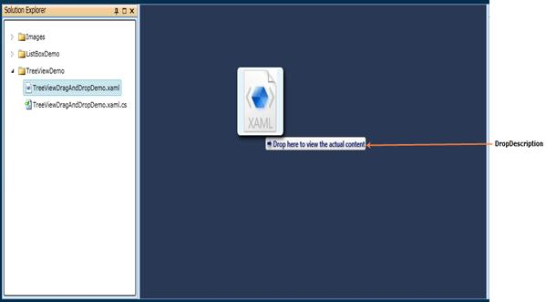

::: {style="DISPLAY: none"}
{#d2h_url_template}{#d2h_package_url style="WIDTH: 0px; DISPLAY: none; HEIGHT: 0px"}
:::

::: {.d2h_secondary_topic style="PADDING-BOTTOM: 10pt; MARGIN: 0pt; PADDING-LEFT: 0pt; PADDING-RIGHT: 0pt; PADDING-TOP: 0pt"}
#### [DropDescription]{#DropDescription}

The DropDescription is a text that describes the status of the drag and drop operation. Usually it includes the DragMode (Move or Copy) and drop target name.

 

Use Case Scenarios

The DropDescription is useful when dragging the object to different types of elements. In that case, the corresponding element will set the DropDescription in its DragEnter event handler in order to show how the object will be handled if it is dropped on the element.

 

Adding DropDescription to an Application

In order to set a DropDescription, use DropDescription property, which is part of the DragDropEventArgs. The most suitable moment to set a DragDescription is in the DragAndDropManager_DropEnter() event handler. The following lines of code show this.

[]{style="COLOR: black"} 

[]{style="COLOR: black"} 

+--------------------------------------------------------------------------------------------------------------------------------------------------------------------------------------------------------------------+
| **[\[C#\]]{style="FONT-FAMILY: 'Courier New'"}**[]{style="FONT-FAMILY: 'Courier New'"}                                                                                                                             |
|                                                                                                                                                                                                                    |
| [void]{style="FONT-FAMILY: 'Courier New'; COLOR: blue"}[ DragAndDropManager_DropEnter([object]{style="COLOR: blue"} sender, [DragDropEventArgs]{style="COLOR: #2b91af"} args)]{style="FONT-FAMILY: 'Courier New'"} |
|                                                                                                                                                                                                                    |
| [ {]{style="FONT-FAMILY: 'Courier New'"}                                                                                                                                                                           |
|                                                                                                                                                                                                                    |
| [ args.DropDescription = [\"Drop here to view the actual content\"]{style="COLOR: #a31515"};]{style="FONT-FAMILY: 'Courier New'"}                                                                                  |
|                                                                                                                                                                                                                    |
| [ }]{style="FONT-FAMILY: 'Courier New'"}[]{style="FONT-FAMILY: 'Courier New'"}                                                                                                                                     |
+--------------------------------------------------------------------------------------------------------------------------------------------------------------------------------------------------------------------+

 

[]{style="COLOR: black"} 

{border="0"}

Figure 1142 : Drop Description[]{style="COLOR: black"}

[]{style="COLOR: black"} 

[]{#SetDropDescriptionVisibility}To hide the DropDescription, use the static method SetDropDescriptionVisibility() that is available in DragAndDropManager. The following lines of code show this:

 

+----------------------------------------------------------------------------------------------------------------------------------------------------------------------------------------------------------------------------+
| **[\[C#\]]{style="FONT-FAMILY: 'Courier New'"}**[]{style="FONT-FAMILY: 'Courier New'"}                                                                                                                                     |
|                                                                                                                                                                                                                            |
| [void]{style="FONT-FAMILY: 'Courier New'; COLOR: blue"}[ DragAndDropManager_DropLeave([object]{style="COLOR: blue"} sender, [DragDropEventArgs]{style="COLOR: #2b91af"} args)]{style="FONT-FAMILY: 'Courier New'"}         |
|                                                                                                                                                                                                                            |
| [ {]{style="FONT-FAMILY: 'Courier New'"}                                                                                                                                                                                   |
|                                                                                                                                                                                                                            |
| [ DragAndDropManager]{style="FONT-FAMILY: 'Courier New'; COLOR: #2b91af"}[.SetDropDescriptionVisibility([this]{style="COLOR: blue"}, [Visibility]{style="COLOR: #2b91af"}.Collapsed);]{style="FONT-FAMILY: 'Courier New'"} |
|                                                                                                                                                                                                                            |
| [ }]{style="FONT-FAMILY: 'Courier New'"}                                                                                                                                                                                   |
+----------------------------------------------------------------------------------------------------------------------------------------------------------------------------------------------------------------------------+

[]{#related-topics}
:::
