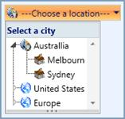

::: {style="DISPLAY: none"}
{#d2h_url_template}{#d2h_package_url style="WIDTH: 0px; DISPLAY: none; HEIGHT: 0px"}
:::

::::: {#nsbanner .d2h_main_nsbanner style="BORDER-BOTTOM: #999999 1px solid; POSITION: relative; PADDING-BOTTOM: 0px; BACKGROUND-COLOR: transparent; PADDING-LEFT: 0px; PADDING-RIGHT: 0px; DISPLAY: none; BORDER-TOP: #999999 1px solid; PADDING-TOP: 0px; LEFT: 0px"}
:::: {#TitleRow .d2h_main_titlerow style="PADDING-BOTTOM: 4px; BACKGROUND-COLOR: transparent; PADDING-LEFT: 22px; WIDTH: 100%; PADDING-RIGHT: 10px; DISPLAY: none; PADDING-TOP: 4px"}
::: {#ienav .d2h_main_ienav style="DISPLAY: none"}
{#D2HPrevious .D2HPreviousEnabled}  {#D2HNext .D2HNextEnabled}
:::
::::
:::::

::: {#nstext .d2h_main_nstext style="PADDING-BOTTOM: 10px; BACKGROUND-COLOR: transparent; PADDING-LEFT: 22px; PADDING-RIGHT: 10px; HEIGHT: 100%; OVERFLOW: auto; PADDING-TOP: 5px" hasuserbackground="true" valign="bottom"}
## DropDownButtonAdv

The DropDownButtonAdv acts as a normal menu control that will display the content in the DropDown Popup when the button is clicked.

[]{style="FONT-FAMILY: 'Calibri','sans-serif'"} 

[]{style="FONT-FAMILY: 'Calibri','sans-serif'"} 

{border="0"}

Figure 1059: A typical DropDownbuttonAdv Control

 

 

More:

[ ]{#related-topics}

[{border="0" align="absMiddle"}Getting Started](ms-xhelp:///?Id=c30477fd-8869-49d5-9e89-e4a8f7f967bf){style="TEXT-DECORATION: none"}

[{border="0" align="absMiddle"}Concepts and Features](ms-xhelp:///?Id=51f68f6d-d2ce-46a1-9968-3888411b3268){style="TEXT-DECORATION: none"}

[{border="0" align="absMiddle"}Events](ms-xhelp:///?Id=e407612d-93ce-415f-b72f-eaa26c0faeed){style="TEXT-DECORATION: none"}

[{border="0" align="absMiddle"}Blendability](ms-xhelp:///?Id=4a4d69c9-88a6-4812-83ec-5e1035ed9cb5){style="TEXT-DECORATION: none"}

[{border="0" align="absMiddle"}How To](ms-xhelp:///?Id=265f39ef-7b17-4c89-9faf-76acd20880c1){style="TEXT-DECORATION: none"}
:::
