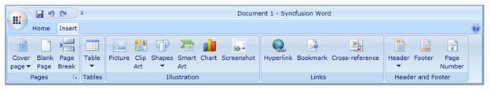
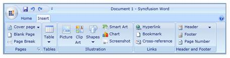
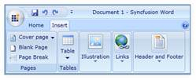

::: {style="DISPLAY: none"}
{#d2h_url_template}{#d2h_package_url style="WIDTH: 0px; DISPLAY: none; HEIGHT: 0px"}
:::

:::: {.d2h_secondary_topic style="PADDING-BOTTOM: 10pt; MARGIN: 0pt; PADDING-LEFT: 0pt; PADDING-RIGHT: 0pt; PADDING-TOP: 0pt"}
#### Dynamic Resizing

Dynamic Resizing support prevents the Ribbon items to be hidden or clipped from the View while resizing the Ribbon. The Ribbon Items will resize themselves, so that it can be fit into the Ribbon. The property IsAutoSizeFormEnabled decides whether the item has to change its size or not.

The following illustrations will explain the concept step by step:

{border="0"}

Figure 641: Normal Condition

{border="0"}

Figure 642: After Resized the items changed their size

{border="0"}

Figure 643: Ribbon Bar collapsed on further resizing

***[]{style="FONT-FAMILY: 'Calibri','sans-serif'; COLOR: #4f81bd"}*** 

::: {style="BORDER-BOTTOM: windowtext 1pt solid; BORDER-LEFT: medium none; PADDING-BOTTOM: 1pt; MARGIN-TOP: 9pt; PADDING-LEFT: 0pt; PADDING-RIGHT: 0pt; MARGIN-BOTTOM: 9pt; BORDER-TOP: windowtext 1pt solid; BORDER-RIGHT: medium none; PADDING-TOP: 1pt"}
{border="0"}Note: The size mode of the Ribbon items can be easily controlled while resizing using the property IsAutoSizeFormEnabled, so that the items can be restricted from changing its size form.
:::

[]{#related-topics}
::::
