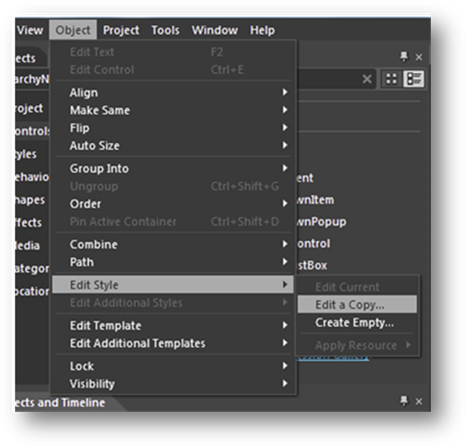
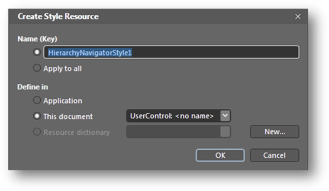

::: {style="DISPLAY: none"}
{#d2h_url_template}{#d2h_package_url style="WIDTH: 0px; DISPLAY: none; HEIGHT: 0px"}
:::

::: {.d2h_secondary_topic style="PADDING-BOTTOM: 10pt; MARGIN: 0pt; PADDING-LEFT: 0pt; PADDING-RIGHT: 0pt; PADDING-TOP: 0pt"}
##### Editing HierarchicalNavigator Template in Blend

9.   Once a HierarchyNavigator control has been added, it can be edited by selecting it and going to the Object menu, selecting Edit Style, and then selecting Edit a Copy.

{border="0"}

Figure 1021: Edit Style in Object menu

10.  Next, the style name can be given and added to the UserControl resources in the Create Style Resource dialog.

 

{border="0"}

Figure 1022: Create Style Resource dialog

This creates a default style for the HierarchyNavigator control so that each part can be customized (refer to []{.UGHyperlink}[[]{.UGHyperlink}[Customizing]{.UGHyperlink}[ templates with MS Blend]{.UGHyperlink}[]{.UGHyperlink}]{.UGHyperlink}[]{.UGHyperlink}[)]{.underline}.

[]{#related-topics}
:::
