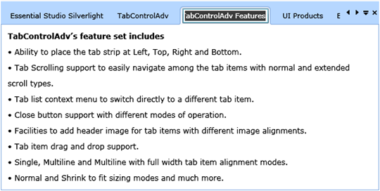

::: {style="DISPLAY: none"}
{#d2h_url_template}{#d2h_package_url style="WIDTH: 0px; DISPLAY: none; HEIGHT: 0px"}
:::

::: {.d2h_secondary_topic style="PADDING-BOTTOM: 10pt; MARGIN: 0pt; PADDING-LEFT: 0pt; PADDING-RIGHT: 0pt; PADDING-TOP: 0pt"}
##### []{#_Editing_support}Editing support

Anyone can edit the Tab Item Header content by using the mouse or keyboard. This is a very user intractable feature in this control. The user should ensure the EnableLabelEdit property value is set to true before implementing this feature.

[                                             ]{style="FONT-FAMILY: 'Calibri','sans-serif'; FONT-SIZE: 12pt"}

[]{style="FONT-FAMILY: 'Calibri','sans-serif'; FONT-SIZE: 12pt"} 

+-------------------------------------------------------------------------------------------------------------------------------------------------------------------------------------------------------------------------------------------------------------------------------------------------------------------------------------------------------------------------------------------------------------------------------------------------+
| **[\[Xaml\]]{style="FONT-FAMILY: 'Courier New'"}**                                                                                                                                                                                                                                                                                                                                                                                              |
|                                                                                                                                                                                                                                                                                                                                                                                                                                                 |
| [\<]{style="FONT-FAMILY: 'Courier New'; COLOR: blue"}[sync]{style="FONT-FAMILY: 'Courier New'; COLOR: #a31515"}[:]{style="FONT-FAMILY: 'Courier New'; COLOR: blue"}[TabControlAdv]{style="FONT-FAMILY: 'Courier New'; COLOR: #a31515"}[  [ Name]{style="COLOR: red"}[=\"MyTabCtrl\"]{style="COLOR: blue"}[ EnableLabelEdit]{style="COLOR: red"}[=\"True\"]{style="COLOR: blue"} [ \>]{style="COLOR: blue"}]{style="FONT-FAMILY: 'Courier New'"} |
|                                                                                                                                                                                                                                                                                                                                                                                                                                                 |
| []{style="FONT-FAMILY: 'Courier New'"}                                                                                                                                                                                                                                                                                                                                                                                                          |
+-------------------------------------------------------------------------------------------------------------------------------------------------------------------------------------------------------------------------------------------------------------------------------------------------------------------------------------------------------------------------------------------------------------------------------------------------+

[]{style="FONT-FAMILY: 'Calibri','sans-serif'; FONT-SIZE: 12pt"} 

+------------------------------------------------------------------------------------------------+
| **[\[C#\]]{style="FONT-FAMILY: 'Courier New'"}**                                               |
|                                                                                                |
| [MyTabCtrl.EnableLabelEdit = [true]{style="COLOR: blue"};]{style="FONT-FAMILY: 'Courier New'"} |
|                                                                                                |
| []{style="FONT-FAMILY: 'Courier New'"}                                                         |
+------------------------------------------------------------------------------------------------+

[]{style="FONT-FAMILY: 'Calibri','sans-serif'; FONT-SIZE: 12pt"} 

BeforeLabelEdit, AfterLabelEdit events are attached with this feature. BeforeLabelEdit event is used to handle prior execution of Label Edit.

            *AfterLabelEdit* event will trigger after *Label Edit* operation is completed. This event can handle post operations after Label Edit.

###### By Mouse

The user can edit the content of the Tab Item header by double clicking the header. After double-clicking the header, the user can edit the header as they like in an accepted string.

###### By Keyboard

The Editing feature has support for the input from keyboard also. For this, perform the following steps.

1.   Select the Tab Item which should be edited.

2.   Click F2  for editing the content of the header.

{border="0"}

Figure 790:Edit Tab Header[]{style="FONT-FAMILY: 'Calibri','sans-serif'; FONT-SIZE: 12pt"}

[            ]{style="FONT-FAMILY: 'Calibri','sans-serif'; FONT-SIZE: 12pt"}

[]{#related-topics}
:::
