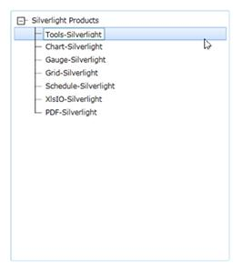
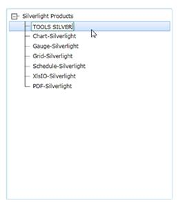
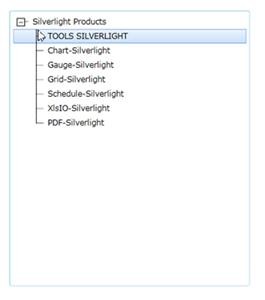

::: {style="DISPLAY: none"}
{#d2h_url_template}{#d2h_package_url style="WIDTH: 0px; DISPLAY: none; HEIGHT: 0px"}
:::

::: {.d2h_secondary_topic style="PADDING-BOTTOM: 10pt; MARGIN: 0pt; PADDING-LEFT: 0pt; PADDING-RIGHT: 0pt; PADDING-TOP: 0pt"}
#### []{#_Editing_TreeViewItemAdv}Editing TreeViewItemAdv

Editing in TreeViewItemAdv could be enabled or disabled by setting the IsInEditMode property. By setting the TreeViewAdv IsInEditMode property to true it allows you to click the F2 key to edit TreeViewItemAdv. After changes are entered, the user can select Esc to cancel editing or entering in order to commit the changes. After clicking F2, the textbox will appear. Now you can edit.

{border="0"}

Figure 751: TreeViewItemAdv in EditMode

{border="0"}

Figure 752: TreeViewAdv -- Editing Text

*[]{style="FONT-FAMILY: 'Calibri','sans-serif'; FONT-SIZE: 11pt"}* 

After editing, click Enter to save or click Esc to discard the changes.

{border="0"}

Figure 753: TreeViewAdv -- Editing completed

See Also

[[·      ]{style="FONT-FAMILY: Symbol; TEXT-DECORATION: none; text-underline: none"}]{.UGHyperlink}[[Context Menu support]{.UGHyperlink}](../../../../../../../../Documents%20and%20Settings/riaj/Desktop/styling%20for%20ui%20silverlight/tools%20silverlight/tools%20part%202.docx#_Context_Menu_Support)[]{.UGHyperlink}

[[·      ]{style="FONT-FAMILY: Symbol; TEXT-DECORATION: none; text-underline: none"}]{.UGHyperlink}[[NodeEditing]{.UGHyperlink}](../../../../../../../../Documents%20and%20Settings/riaj/Desktop/styling%20for%20ui%20silverlight/tools%20silverlight/tools%20part%202.docx#_NodeEditing)[]{.UGHyperlink}

[[·      ]{style="FONT-FAMILY: Symbol; TEXT-DECORATION: none; text-underline: none"}]{.UGHyperlink}[[NodeEdited]{.UGHyperlink}](../../../../../../../../Documents%20and%20Settings/riaj/Desktop/styling%20for%20ui%20silverlight/tools%20silverlight/tools%20part%202.docx#_NodeEdited)[]{.UGHyperlink}

[[·      ]{style="FONT-FAMILY: Symbol; TEXT-DECORATION: none; text-underline: none"}]{.UGHyperlink}[[NodeEditCancelled]{.UGHyperlink}](../../../../../../../../Documents%20and%20Settings/riaj/Desktop/styling%20for%20ui%20silverlight/tools%20silverlight/tools%20part%202.docx#_NodeEditCancelled)[]{.UGHyperlink}

[[·      ]{style="FONT-FAMILY: Symbol; TEXT-DECORATION: none; text-underline: none"}]{.UGHyperlink}[[NodeEditorValidateString]{.UGHyperlink}](../../../../../../../../Documents%20and%20Settings/riaj/Desktop/styling%20for%20ui%20silverlight/tools%20silverlight/tools%20part%202.docx#_NodeEditorValidating)[]{.UGHyperlink}

[[·      ]{style="FONT-FAMILY: Symbol; TEXT-DECORATION: none; text-underline: none"}]{.UGHyperlink}[[NodeEditorValidating]{.UGHyperlink}](../../../../../../../../Documents%20and%20Settings/riaj/Desktop/styling%20for%20ui%20silverlight/tools%20silverlight/tools%20part%202.docx#_NodeEditorValidating)[]{.UGHyperlink}

[[·      ]{style="FONT-FAMILY: Symbol; TEXT-DECORATION: none; text-underline: none"}]{.UGHyperlink}[[NodeEditorValidated]{.UGHyperlink}](../../../../../../../../Documents%20and%20Settings/riaj/Desktop/styling%20for%20ui%20silverlight/tools%20silverlight/tools%20part%202.docx#_NodeEditorValidated)[]{.UGHyperlink}

[]{style="FONT-FAMILY: 'Calibri','sans-serif'; FONT-SIZE: 11pt"} 

[]{style="FONT-FAMILY: 'Calibri','sans-serif'; FONT-SIZE: 11pt"} 

[]{#related-topics}
:::
