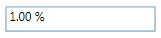

::: {style="DISPLAY: none"}
{#d2h_url_template}{#d2h_package_url style="WIDTH: 0px; DISPLAY: none; HEIGHT: 0px"}
:::

::: {.d2h_secondary_topic style="PADDING-BOTTOM: 10pt; MARGIN: 0pt; PADDING-LEFT: 0pt; PADDING-RIGHT: 0pt; PADDING-TOP: 0pt"}
#### Enable NullValue support

PercentTextBox accepts null values. To enable null option you have to set **UseNullOption** property to True. You can also set the **NullValue** property for PercentTextBox. When you set the null value to **PercentValue** property, by default the value of **NullValue** (Default value is null) property will be assigned to **PercentValue** property.

 

+----------------------------------------------------------------------------------------------------------------------------------------------------------------------------------------------------------------------------------------------------------------------------------------------------------------------------------------------------------------------------------------------------------------------------------------------------------------------------------------------------------------------------------------------------------------------------------------------------------------------------------------------------------------------------------------------------------------------------------------------------------------+
| **[\[XAML\]]{style="FONT-FAMILY: 'Courier New'; COLOR: black"}**                                                                                                                                                                                                                                                                                                                                                                                                                                                                                                                                                                                                                                                                                               |
|                                                                                                                                                                                                                                                                                                                                                                                                                                                                                                                                                                                                                                                                                                                                                                |
| **[]{style="FONT-FAMILY: 'Courier New'"}**                                                                                                                                                                                                                                                                                                                                                                                                                                                                                                                                                                                                                                                                                                                     |
|                                                                                                                                                                                                                                                                                                                                                                                                                                                                                                                                                                                                                                                                                                                                                                |
| [\<]{style="FONT-FAMILY: 'Courier New'; COLOR: blue"}[syncfusion]{style="FONT-FAMILY: 'Courier New'; COLOR: #a31515"}[:]{style="FONT-FAMILY: 'Courier New'; COLOR: blue"}[PercentTextBox]{style="FONT-FAMILY: 'Courier New'; COLOR: #a31515"}[ x]{style="FONT-FAMILY: 'Courier New'; COLOR: red"}[:]{style="FONT-FAMILY: 'Courier New'; COLOR: blue"}[Name]{style="FONT-FAMILY: 'Courier New'; COLOR: red"}[=\"percentTextBox\"]{style="FONT-FAMILY: 'Courier New'; COLOR: blue"}[ Height]{style="FONT-FAMILY: 'Courier New'; COLOR: red"}[=\"25\"]{style="FONT-FAMILY: 'Courier New'; COLOR: blue"}[ Width]{style="FONT-FAMILY: 'Courier New'; COLOR: red"}[=\"150\"]{style="FONT-FAMILY: 'Courier New'; COLOR: blue"}[ ]{style="FONT-FAMILY: 'Courier New'"} |
|                                                                                                                                                                                                                                                                                                                                                                                                                                                                                                                                                                                                                                                                                                                                                                |
| [                          [ UseNullOption]{style="COLOR: red"}[=\"True\"]{style="COLOR: blue"}[ NullValue]{style="COLOR: red"}[=\"1\"/\>]{style="COLOR: blue"}]{style="FONT-FAMILY: 'Courier New'"}                                                                                                                                                                                                                                                                                                                                                                                                                                                                                                                                                           |
+----------------------------------------------------------------------------------------------------------------------------------------------------------------------------------------------------------------------------------------------------------------------------------------------------------------------------------------------------------------------------------------------------------------------------------------------------------------------------------------------------------------------------------------------------------------------------------------------------------------------------------------------------------------------------------------------------------------------------------------------------------------+

[]{style="FONT-FAMILY: 'Courier New'"} 

+----------------------------------------------------------------------------------------------------------------------------------------------------------------------------------------------------+
| **[\[C#\]]{style="FONT-FAMILY: 'Courier New'; COLOR: black"}**                                                                                                                                     |
|                                                                                                                                                                                                    |
| **[]{style="FONT-FAMILY: 'Courier New'"}**                                                                                                                                                         |
|                                                                                                                                                                                                    |
| [PercentTextBox]{style="FONT-FAMILY: 'Courier New'; COLOR: #2b91af"}[ percentTextBox = [new]{style="COLOR: blue"} [PercentTextBox]{style="COLOR: #2b91af"}();]{style="FONT-FAMILY: 'Courier New'"} |
|                                                                                                                                                                                                    |
| [percentTextBox.Width = 150;]{style="FONT-FAMILY: 'Courier New'"}                                                                                                                                  |
|                                                                                                                                                                                                    |
| [percentTextBox.Height = 25;]{style="FONT-FAMILY: 'Courier New'"}                                                                                                                                  |
|                                                                                                                                                                                                    |
| [percentTextBox.UseNullOption = [true]{style="COLOR: blue"};]{style="FONT-FAMILY: 'Courier New'"}                                                                                                  |
|                                                                                                                                                                                                    |
| [percentTextBox.NullValue = 1;]{style="FONT-FAMILY: 'Courier New'"}                                                                                                                                |
|                                                                                                                                                                                                    |
| **[]{style="FONT-FAMILY: 'Courier New'"}**                                                                                                                                                         |
+----------------------------------------------------------------------------------------------------------------------------------------------------------------------------------------------------+

 

In this sample NullValue (NullValue = 1) is set to **Value** property of PercentTextBox because default value of **PercentValue** property is Zero.

{border="0"}

Figure 251: PercentTextBox

+----------------------------------------------------------------------------------------------------------------------------------------------------------------------------------------------------------------------------------------------------------------------------------------------------------------------------------------------------------------------------------------------------------------------------------------------------------------------------------------------------------------------------------------------------------------------------------------------------------------------------------------------------------------------------------------------------------------------------------------------------------------+
| **[\[XAML\]]{style="FONT-FAMILY: 'Courier New'; COLOR: black"}**                                                                                                                                                                                                                                                                                                                                                                                                                                                                                                                                                                                                                                                                                               |
|                                                                                                                                                                                                                                                                                                                                                                                                                                                                                                                                                                                                                                                                                                                                                                |
| **[]{style="FONT-FAMILY: 'Courier New'"}**                                                                                                                                                                                                                                                                                                                                                                                                                                                                                                                                                                                                                                                                                                                     |
|                                                                                                                                                                                                                                                                                                                                                                                                                                                                                                                                                                                                                                                                                                                                                                |
| [\<]{style="FONT-FAMILY: 'Courier New'; COLOR: blue"}[syncfusion]{style="FONT-FAMILY: 'Courier New'; COLOR: #a31515"}[:]{style="FONT-FAMILY: 'Courier New'; COLOR: blue"}[PercentTextBox]{style="FONT-FAMILY: 'Courier New'; COLOR: #a31515"}[ x]{style="FONT-FAMILY: 'Courier New'; COLOR: red"}[:]{style="FONT-FAMILY: 'Courier New'; COLOR: blue"}[Name]{style="FONT-FAMILY: 'Courier New'; COLOR: red"}[=\"percentTextBox\"]{style="FONT-FAMILY: 'Courier New'; COLOR: blue"}[ Height]{style="FONT-FAMILY: 'Courier New'; COLOR: red"}[=\"25\"]{style="FONT-FAMILY: 'Courier New'; COLOR: blue"}[ Width]{style="FONT-FAMILY: 'Courier New'; COLOR: red"}[=\"150\"]{style="FONT-FAMILY: 'Courier New'; COLOR: blue"}[ ]{style="FONT-FAMILY: 'Courier New'"} |
|                                                                                                                                                                                                                                                                                                                                                                                                                                                                                                                                                                                                                                                                                                                                                                |
| [                          [ UseNullOption]{style="COLOR: red"}[=\"True\"]{style="COLOR: blue"}[ NullValue]{style="COLOR: red"}[=\"{]{style="COLOR: blue"}[x]{style="COLOR: #a31515"}[:]{style="COLOR: blue"}[Null]{style="COLOR: #a31515"}[}\"/\>]{style="COLOR: blue"}]{style="FONT-FAMILY: 'Courier New'"}                                                                                                                                                                                                                                                                                                                                                                                                                                                  |
+----------------------------------------------------------------------------------------------------------------------------------------------------------------------------------------------------------------------------------------------------------------------------------------------------------------------------------------------------------------------------------------------------------------------------------------------------------------------------------------------------------------------------------------------------------------------------------------------------------------------------------------------------------------------------------------------------------------------------------------------------------------+

[]{style="FONT-FAMILY: 'Courier New'"} 

+----------------------------------------------------------------------------------------------------------------------------------------------------------------------------------------------------+
| **[\[C#\]]{style="FONT-FAMILY: 'Courier New'; COLOR: black"}**                                                                                                                                     |
|                                                                                                                                                                                                    |
| **[]{style="FONT-FAMILY: 'Courier New'"}**                                                                                                                                                         |
|                                                                                                                                                                                                    |
| [PercentTextBox]{style="FONT-FAMILY: 'Courier New'; COLOR: #2b91af"}[ percentTextBox = [new]{style="COLOR: blue"} [PercentTextBox]{style="COLOR: #2b91af"}();]{style="FONT-FAMILY: 'Courier New'"} |
|                                                                                                                                                                                                    |
| [percentTextBox.Width = 150;]{style="FONT-FAMILY: 'Courier New'"}                                                                                                                                  |
|                                                                                                                                                                                                    |
| [percentTextBox.Height = 25;]{style="FONT-FAMILY: 'Courier New'"}                                                                                                                                  |
|                                                                                                                                                                                                    |
| [percentTextBox.UseNullOption = [true]{style="COLOR: blue"};]{style="FONT-FAMILY: 'Courier New'"}                                                                                                  |
|                                                                                                                                                                                                    |
| [percentTextBox.NullValue = [null]{style="COLOR: blue"};]{style="FONT-FAMILY: 'Courier New'"}                                                                                                      |
|                                                                                                                                                                                                    |
| **[]{style="FONT-FAMILY: 'Courier New'"}**                                                                                                                                                         |
+----------------------------------------------------------------------------------------------------------------------------------------------------------------------------------------------------+

[]{style="FONT-FAMILY: 'Calibri','sans-serif'; FONT-SIZE: 11pt"} 

[]{style="FONT-FAMILY: 'Calibri','sans-serif'; FONT-SIZE: 11pt"} 

[]{style="FONT-FAMILY: 'Calibri','sans-serif'; FONT-SIZE: 11pt"} 

In this one NullValue (NullValue = null) is set to **Value** property of PercentTextBox. (Default value of **PercentValue** property is Zero).

{border="0"}

Figure 252: PercentTextBox -- NullValue

[]{style="FONT-FAMILY: 'Calibri','sans-serif'; FONT-SIZE: 11pt"} 

[]{#related-topics}
:::
