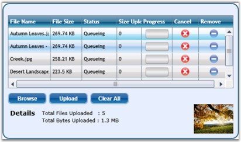
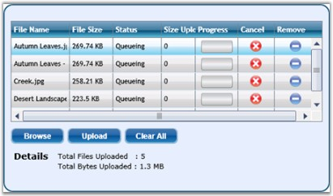
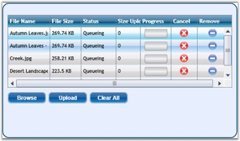

::: {style="DISPLAY: none"}
{#d2h_url_template}{#d2h_package_url style="WIDTH: 0px; DISPLAY: none; HEIGHT: 0px"}
:::

::: {.d2h_secondary_topic style="PADDING-BOTTOM: 10pt; MARGIN: 0pt; PADDING-LEFT: 0pt; PADDING-RIGHT: 0pt; PADDING-TOP: 0pt"}
#### []{#p179}[]{#_EnableThumbnail_and_EnableDetails}EnableThumbnail and EnableDetails

 

The **EnableThumbnail** property allows the user to view the thumbnail of the image to be uploaded. The **EnableDetails** property allows the user to view the details of the files being uploaded.

 

The following code snippet illustrates this.

 

+--------------------------------------------------------------------------------------------------------------------------------------------------------------------------------------------------------------------------------------------------------------------------------------------------------------------------------------------------------------------------------------------------------------------------------------------------------------------------------------------------------------+
| **[\[XAML\]]{style="FONT-FAMILY: 'Courier New'; COLOR: black"}**                                                                                                                                                                                                                                                                                                                                                                                                                                             |
|                                                                                                                                                                                                                                                                                                                                                                                                                                                                                                              |
| []{style="FONT-FAMILY: 'Courier New'; COLOR: black"}                                                                                                                                                                                                                                                                                                                                                                                                                                                         |
|                                                                                                                                                                                                                                                                                                                                                                                                                                                                                                              |
| [\<]{style="FONT-FAMILY: 'Courier New'; COLOR: blue"}[syncfusion]{style="FONT-FAMILY: 'Courier New'; COLOR: #a31515"}[:]{style="FONT-FAMILY: 'Courier New'; COLOR: blue"}[FileUploadControl]{style="FONT-FAMILY: 'Courier New'; COLOR: #a31515"}[ [x]{style="COLOR: #a31515"}[:]{style="COLOR: blue"}[Name]{style="COLOR: red"}[=\"FileUpload1\"]{style="COLOR: blue"} [EnableThumbnail]{style="COLOR: red"}[=\"true\"]{style="COLOR: blue"} [/\>]{style="COLOR: blue"}]{style="FONT-FAMILY: 'Courier New'"} |
|                                                                                                                                                                                                                                                                                                                                                                                                                                                                                                              |
| [\<]{style="FONT-FAMILY: 'Courier New'; COLOR: blue"}[syncfusion]{style="FONT-FAMILY: 'Courier New'; COLOR: #a31515"}[:]{style="FONT-FAMILY: 'Courier New'; COLOR: blue"}[FileUploadControl]{style="FONT-FAMILY: 'Courier New'; COLOR: #a31515"}[ [x]{style="COLOR: #a31515"}[:]{style="COLOR: blue"}[Name]{style="COLOR: red"}[=\"FileUpload1\"]{style="COLOR: blue"} [EnableDetails]{style="COLOR: red"}[=\"true\"]{style="COLOR: blue"} [/\>]{style="COLOR: blue"}]{style="FONT-FAMILY: 'Courier New'"}   |
+--------------------------------------------------------------------------------------------------------------------------------------------------------------------------------------------------------------------------------------------------------------------------------------------------------------------------------------------------------------------------------------------------------------------------------------------------------------------------------------------------------------+

 

+---------------------------------------------------------------------------------------------------------------------------------------------------------------------+
| **[\[C#\]]{style="FONT-FAMILY: 'Courier New'; COLOR: black"}**                                                                                                      |
|                                                                                                                                                                     |
| []{style="FONT-FAMILY: 'Courier New'"}                                                                                                                              |
|                                                                                                                                                                     |
| [FileUploadControl]{style="FONT-FAMILY: 'Courier New'; COLOR: teal"}[ fileupload = [FileUploadControl]{style="COLOR: teal"}();]{style="FONT-FAMILY: 'Courier New'"} |
|                                                                                                                                                                     |
| [fileupload.EnableThumbnail = [true]{style="COLOR: blue"};]{style="FONT-FAMILY: 'Courier New'"}                                                                     |
|                                                                                                                                                                     |
| [fileupload.EnableDetails = [true]{style="COLOR: blue"};]{style="FONT-FAMILY: 'Courier New'"}                                                                       |
+---------------------------------------------------------------------------------------------------------------------------------------------------------------------+

[]{style="COLOR: black"} 

{border="0"}

 

Figure 374 : EnableThumbnail = \"True\"

 

{border="0"}

 

Figure 375 : EnableDetails = \"True\"

 

{border="0"}

 

Figure 376: EnableDetails = \"False\"

[]{#related-topics}
:::
