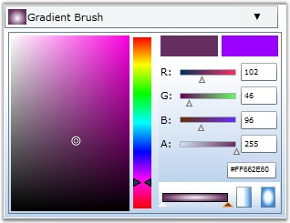
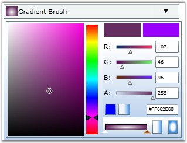

::: {style="DISPLAY: none"}
{#d2h_url_template}{#d2h_package_url style="WIDTH: 0px; DISPLAY: none; HEIGHT: 0px"}
:::

:::: {.d2h_secondary_topic style="PADDING-BOTTOM: 10pt; MARGIN: 0pt; PADDING-LEFT: 0pt; PADDING-RIGHT: 0pt; PADDING-TOP: 0pt"}
#### []{#p167}Events

 

The following events are associated with the BrushSelector and BrushEdit controls:

 

::: {align="center"}
  ------------------------------------ ----------------------------------------------------------------------------------------
  Event                                Description
  VisualizationStyleChanged            This event is raised when any ColorSelectionMode is Changed.
  BrushModeChanged                     This event is raised when BrushMode is changed to Solid To Gradient or vice versa.
  SelectedBrushChanged                 This event is raised when SelectedBrush is changed
  EnableGradientToSolidSwitchChanged   This event is raised when the Switch between Solid To Gradient is enabled or disabled.
  ------------------------------------ ----------------------------------------------------------------------------------------
:::

 

The following code example illustrates how to handle the EnableGradientToSolidSwitch event.

 

EnableGradientToSolidSwitch Event

 

This event is raised when the **EnableGradientToSolidSwitch** property is changed. The EnableGradientToSolidSwitch property is used to enable or disable switching of the brush modes during runtime. If this feature is disabled, then the brush mode set in the code becomes static, and hence you cannot change the mode at run time.

 

+-------------------------------------------------------------------------------------------------------------------------------------------------------------------------------------------------------------------------------------------------------------------------------------------------------------------------------------------------------------------------------------------------------------------------------------------------------------------------------------------------------------------------------------------------------------------------------------------------------------------------------------------+
| **[\[XAML\]]{style="FONT-FAMILY: 'Courier New'; COLOR: black"}**                                                                                                                                                                                                                                                                                                                                                                                                                                                                                                                                                                          |
|                                                                                                                                                                                                                                                                                                                                                                                                                                                                                                                                                                                                                                           |
| []{style="FONT-FAMILY: 'Courier New'; COLOR: black"}                                                                                                                                                                                                                                                                                                                                                                                                                                                                                                                                                                                      |
|                                                                                                                                                                                                                                                                                                                                                                                                                                                                                                                                                                                                                                           |
| [\<!\-- Adding BrushSelector \--\>]{style="FONT-FAMILY: 'Courier New'; COLOR: green"}                                                                                                                                                                                                                                                                                                                                                                                                                                                                                                                                                     |
|                                                                                                                                                                                                                                                                                                                                                                                                                                                                                                                                                                                                                                           |
| [\<]{style="FONT-FAMILY: 'Courier New'; COLOR: blue"}[syncfusion]{style="FONT-FAMILY: 'Courier New'; COLOR: #a31515"}[:]{style="FONT-FAMILY: 'Courier New'; COLOR: blue"}[BrushSelector]{style="FONT-FAMILY: 'Courier New'; COLOR: #a31515"}[ Margin]{style="FONT-FAMILY: 'Courier New'; COLOR: red"}[=\"20\"]{style="FONT-FAMILY: 'Courier New'; COLOR: blue"}[ EnableGradientToSolidSwitch]{style="FONT-FAMILY: 'Courier New'; COLOR: red"}[=\"false\"]{style="FONT-FAMILY: 'Courier New'; COLOR: blue"}[ Name]{style="FONT-FAMILY: 'Courier New'; COLOR: red"}[=\"brushselector\"/\>]{style="FONT-FAMILY: 'Courier New'; COLOR: blue"} |
+-------------------------------------------------------------------------------------------------------------------------------------------------------------------------------------------------------------------------------------------------------------------------------------------------------------------------------------------------------------------------------------------------------------------------------------------------------------------------------------------------------------------------------------------------------------------------------------------------------------------------------------------+

 

+-----------------------------------------------------------------------------------------------------------------+
| **[\[C#\]]{style="FONT-FAMILY: 'Courier New'; COLOR: black"}**                                                  |
|                                                                                                                 |
| []{style="FONT-FAMILY: 'Courier New'; COLOR: black"}                                                            |
|                                                                                                                 |
| [// Creating an instance of the BrushSelector control.]{style="FONT-FAMILY: 'Courier New'; COLOR: green"}       |
|                                                                                                                 |
| [BrushSelector brushselector = [new]{style="COLOR: blue"} BrushSelector();]{style="FONT-FAMILY: 'Courier New'"} |
|                                                                                                                 |
| []{style="FONT-FAMILY: 'Courier New'"}                                                                          |
|                                                                                                                 |
| [// Setting brush mode as Gradient.]{style="FONT-FAMILY: 'Courier New'; COLOR: green"}                          |
|                                                                                                                 |
| [Brushselector.EnableGradientToSolidSwitch = [false]{style="COLOR: blue"};]{style="FONT-FAMILY: 'Courier New'"} |
+-----------------------------------------------------------------------------------------------------------------+

 

{border="0"}

 

Figure 366: BrushSelector with EnableGradientToSolidSwitch property set to \"False\"

 

+-------------------------------------------------------------------------------------------------------------------------------------------------------------------------------------------------------------------------------+
| **[\[XAML\]]{style="FONT-FAMILY: 'Courier New'; COLOR: black"}**                                                                                                                                                              |
|                                                                                                                                                                                                                               |
| []{style="FONT-FAMILY: 'Courier New'; COLOR: black"}                                                                                                                                                                          |
|                                                                                                                                                                                                                               |
| [\<!\-- Adding BrushSelector \--\>]{style="FONT-FAMILY: 'Courier New'"}                                                                                                                                                       |
|                                                                                                                                                                                                                               |
| [\<syncfusion:BrushSelector Margin=[\"20\"]{style="COLOR: #a31515"} EnableGradientToSolidSwitch=[\"true\"]{style="COLOR: #a31515"} Name=[\"brushselector\"]{style="COLOR: #a31515"}/\>  ]{style="FONT-FAMILY: 'Courier New'"} |
+-------------------------------------------------------------------------------------------------------------------------------------------------------------------------------------------------------------------------------+

 

+-----------------------------------------------------------------------------------------------------------------+
| **[\[C#\]]{style="FONT-FAMILY: 'Courier New'; COLOR: black"}**                                                  |
|                                                                                                                 |
| []{style="FONT-FAMILY: 'Courier New'; COLOR: black"}                                                            |
|                                                                                                                 |
| [// Creating an instance of the BrushSelector control.]{style="FONT-FAMILY: 'Courier New'; COLOR: green"}       |
|                                                                                                                 |
| [BrushSelector brushselector = [new]{style="COLOR: blue"} BrushSelector();]{style="FONT-FAMILY: 'Courier New'"} |
|                                                                                                                 |
| []{style="FONT-FAMILY: 'Courier New'"}                                                                          |
|                                                                                                                 |
| [// Setting brush mode as Gradient.]{style="FONT-FAMILY: 'Courier New'; COLOR: green"}                          |
|                                                                                                                 |
| [brushselector.EnableGradientToSolidSwitch = [true]{style="COLOR: blue"};]{style="FONT-FAMILY: 'Courier New'"}  |
+-----------------------------------------------------------------------------------------------------------------+

 

{border="0"}

 

Figure 367: BrushSelector with EnableGradientToSolidSwitch set to \"True\"

 

 

[]{#p168} 

[]{#related-topics}
::::
