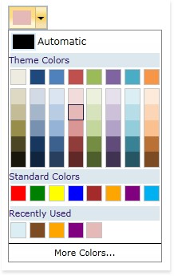
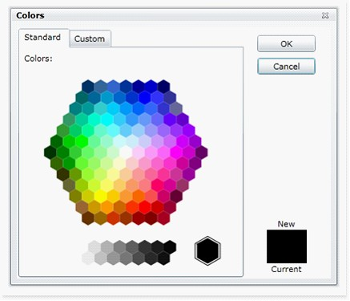
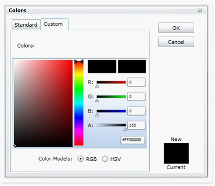
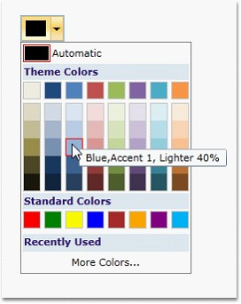

::: {style="DISPLAY: none"}
{#d2h_url_template}{#d2h_package_url style="WIDTH: 0px; DISPLAY: none; HEIGHT: 0px"}
:::

::: {.d2h_secondary_topic style="PADDING-BOTTOM: 10pt; MARGIN: 0pt; PADDING-LEFT: 0pt; PADDING-RIGHT: 0pt; PADDING-TOP: 0pt"}
#### []{#_Features_description}Features description

 

[]{#p434}[1.   **Recently Used Panel**]{style="COLOR: black"}

 

A collection which keeps track of Color Picker's Selected Colors. It maintains last eight instances of color changes.

 

{border="0"}

 

Figure 969: Color Picker with Recently Used Collection

 

2.   **More Colors Options**

   

In addition to colors in palette the user is also provided with a wide range of color options in More Colors Feature. Clicking More Colors button opens Colors window with 2 tabs namely:

 

[·      ]{style="FONT-FAMILY: Symbol"}Standard Colors

[·      ]{style="FONT-FAMILY: Symbol"}Custom Colors

   

Standard Colors

 

There are 140 colors under this tab clustered in the shape of Hexagon. The color chosen from this cluster will be as added to Recently Used panel collection.

 

{border="0"}

**** 

Figure 970: More Color Options Showing Standard Tab

**** 

Custom Colors

 

This tab contains a Brush Selector with 2 modes HSV and RGB. Each colors\' RGB and HSV combinations, HexValues are displayed here.

Colors can be chosen from this tab too and the color chosen from this cluster will be as added to Recently Used panel collection.

 

{border="0"}

**** 

Figure 971: More Color Options Showing Custom Tab

**** 

3.   **Tool Tip Support**

 

The tooltip is a small hover box with information about the item on which mouse is being hovered over. This box displays information like the name of the color in the palette along with details of its application. For example: The color can be applied to Background or Text. All the variant colors percentage difference details from the base colors.

 

{border="0"}

**** 

Figure 972:  ToolTip

[]{#related-topics}
:::
