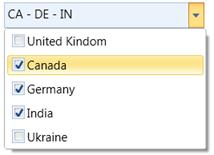
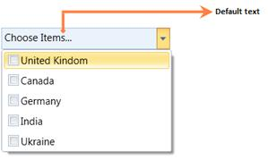
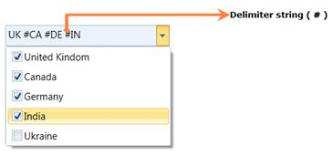

::: {style="DISPLAY: none"}
{#d2h_url_template}{#d2h_package_url style="WIDTH: 0px; DISPLAY: none; HEIGHT: 0px"}
:::

::: {.d2h_secondary_topic style="PADDING-BOTTOM: 10pt; MARGIN: 0pt; PADDING-LEFT: 0pt; PADDING-RIGHT: 0pt; PADDING-TOP: 0pt"}
##### Features of ComboBoxAdv control

###### Multiple selections

If we want to select more than one item in the ComboBoxAdv, **AllowMultiSelect** property will be helpful to do this. It allows the user to select multiple items in the drop down list. Selected items will be displayed in ascending order like in a drop down list. When AllowMultiSelect property is true, SelectedItems property exposes the items which are selected in the drop down list.**[]{style="COLOR: #c00000"}**

1.1.1.1.1.1.83     Properties

Table 88: Property/Properties Table

  ------------------ -------------------------------------- --------------------- -------------------------------- -----------------
  Property           Description                            Type                  Data Type                        Reference links
  AllowMultiSelect   Multiple items can be selected         Dependency Property   Boolean                          NA
  SelectedItems      It contains the selected items value   Dependency Property   ObservableCollection\<object\>   NA
  ------------------ -------------------------------------- --------------------- -------------------------------- -----------------

[1.1.1.1.1.1.84     Adding Multiple selections to an Application ]{style="COLOR: black"}

AllowMultiSelect property can be added directly to an application using the following code snippet:

 

+-------------------------------------------------------------------------------------------------------------------------------------------------------------------------------------------------------------------------------------------------------------------------------------------------------------------------------------------------------------------------------------------------------------------------------------------------------------------------------------------------------------------------------------------------+
| **[\[XAML\]]{style="FONT-FAMILY: 'Calibri','sans-serif'"}**                                                                                                                                                                                                                                                                                                                                                                                                                                                                                     |
|                                                                                                                                                                                                                                                                                                                                                                                                                                                                                                                                                 |
| [                ]{style="FONT-FAMILY: 'Calibri','sans-serif'"}[\<]{style="FONT-FAMILY: 'Calibri','sans-serif'; COLOR: blue"}[syncfusion]{style="FONT-FAMILY: 'Calibri','sans-serif'; COLOR: #a31515"}[:]{style="FONT-FAMILY: 'Calibri','sans-serif'; COLOR: blue"}[ComboBoxAdv]{style="FONT-FAMILY: 'Calibri','sans-serif'; COLOR: #a31515"}[ AllowMultiSelect]{style="FONT-FAMILY: 'Calibri','sans-serif'; COLOR: red"}[=\"True\"\>]{style="FONT-FAMILY: 'Calibri','sans-serif'; COLOR: blue"}[]{style="FONT-FAMILY: 'Calibri','sans-serif'"} |
|                                                                                                                                                                                                                                                                                                                                                                                                                                                                                                                                                 |
| [                            ]{style="FONT-FAMILY: 'Calibri','sans-serif'; COLOR: #a31515"}[]{style="FONT-FAMILY: 'Calibri','sans-serif'"}                                                                                                                                                                                                                                                                                                                                                                                                      |
|                                                                                                                                                                                                                                                                                                                                                                                                                                                                                                                                                 |
| [        ]{style="FONT-FAMILY: 'Calibri','sans-serif'; COLOR: #a31515"}[\</]{style="FONT-FAMILY: 'Calibri','sans-serif'; COLOR: blue"}[syncfusion]{style="FONT-FAMILY: 'Calibri','sans-serif'; COLOR: #a31515"}[:]{style="FONT-FAMILY: 'Calibri','sans-serif'; COLOR: blue"}[ComboBoxAdv]{style="FONT-FAMILY: 'Calibri','sans-serif'; COLOR: #a31515"}[\>]{style="FONT-FAMILY: 'Calibri','sans-serif'; COLOR: blue"}                                                                                                                            |
|                                                                                                                                                                                                                                                                                                                                                                                                                                                                                                                                                 |
| []{style="FONT-FAMILY: 'Calibri','sans-serif'"}                                                                                                                                                                                                                                                                                                                                                                                                                                                                                                 |
+-------------------------------------------------------------------------------------------------------------------------------------------------------------------------------------------------------------------------------------------------------------------------------------------------------------------------------------------------------------------------------------------------------------------------------------------------------------------------------------------------------------------------------------------------+

 

+-------------------------------------------------------------------------------------------------------------------------------------------------------------------------------------------------------------------------------------------------------------------------+
| **[\[C#\]]{style="FONT-FAMILY: 'Calibri','sans-serif'"}**                                                                                                                                                                                                               |
|                                                                                                                                                                                                                                                                         |
| [                ]{style="FONT-FAMILY: 'Calibri','sans-serif'"}[ComboBoxAdv]{style="FONT-FAMILY: 'Calibri','sans-serif'; COLOR: #2b91af"}[ comboBox = [new]{style="COLOR: blue"} [ComboBoxAdv]{style="COLOR: #2b91af"}();]{style="FONT-FAMILY: 'Calibri','sans-serif'"} |
|                                                                                                                                                                                                                                                                         |
| [       comboBox.AllowMultiSelect = [true]{style="COLOR: blue"};]{style="FONT-FAMILY: 'Calibri','sans-serif'"}                                                                                                                                                          |
|                                                                                                                                                                                                                                                                         |
| []{style="FONT-FAMILY: 'Calibri','sans-serif'"}                                                                                                                                                                                                                         |
+-------------------------------------------------------------------------------------------------------------------------------------------------------------------------------------------------------------------------------------------------------------------------+

{border="0"}

Figure 1191: ComboBoxAdv Control in Multiple selections

###### Default text

It displays the default text in the ComboBoxAdv when none of the items selected in the drop down list.[]{style="COLOR: #c00000"}

1.1.1.1.1.1.85     Properties

Table 89: Property/Properties Table

  ------------- --------------------------------------------- --------------------- ----------- -----------------
  Property      Description                                   Type                  Data Type   Reference links
  DefaultText   It is possible to display the default text.   Dependency Property   String      NA
  ------------- --------------------------------------------- --------------------- ----------- -----------------

1.1.1.1.1.1.86     Adding DefaultText property to an Application

**DefaultText** property can be added directly to an application using the following code snippet:

 

+------------------------------------------------------------------------------------------------------------------------------------------------------------------------------------------------------------------------------------------------------------------------------------------------------------------------------------------------------------------------------------------------------------------------------+
| **[\[XAML\]]{style="FONT-FAMILY: 'Courier New'"}**                                                                                                                                                                                                                                                                                                                                                                           |
|                                                                                                                                                                                                                                                                                                                                                                                                                              |
|           [\<]{style="FONT-FAMILY: Consolas; COLOR: blue"}[syncfusion]{style="FONT-FAMILY: Consolas; COLOR: #a31515"}[:]{style="FONT-FAMILY: Consolas; COLOR: blue"}[ComboBoxAdv]{style="FONT-FAMILY: Consolas; COLOR: #a31515"}[ DefaultText]{style="FONT-FAMILY: Consolas; COLOR: red"}[=\"..Choose Items..\"\>]{style="FONT-FAMILY: Consolas; COLOR: blue"}[]{style="FONT-FAMILY: Consolas; COLOR: blue; FONT-SIZE: 9pt"} |
|                                                                                                                                                                                                                                                                                                                                                                                                                              |
| [                            ]{style="FONT-FAMILY: Consolas; COLOR: #a31515"}[]{style="FONT-FAMILY: Consolas"}                                                                                                                                                                                                                                                                                                               |
|                                                                                                                                                                                                                                                                                                                                                                                                                              |
| [        ]{style="FONT-FAMILY: Consolas; COLOR: #a31515"}[\</]{style="FONT-FAMILY: Consolas; COLOR: blue"}[syncfusion]{style="FONT-FAMILY: Consolas; COLOR: #a31515"}[:]{style="FONT-FAMILY: Consolas; COLOR: blue"}[ComboBoxAdv]{style="FONT-FAMILY: Consolas; COLOR: #a31515"}[\>]{style="FONT-FAMILY: Consolas; COLOR: blue"}                                                                                             |
|                                                                                                                                                                                                                                                                                                                                                                                                                              |
|                                                                                                                                                                                                                                                                                                                                                                                                                              |
+------------------------------------------------------------------------------------------------------------------------------------------------------------------------------------------------------------------------------------------------------------------------------------------------------------------------------------------------------------------------------------------------------------------------------+

 

+----------------------------------------------------------------------------------------------------------------------------------------------------------------------------------------+
| **[\[C#\]]{style="FONT-FAMILY: 'Courier New'"}**                                                                                                                                       |
|                                                                                                                                                                                        |
|           [ComboBoxAdv]{style="FONT-FAMILY: Consolas; COLOR: #2b91af"}[ comboBox = [new]{style="COLOR: blue"} [ComboBoxAdv]{style="COLOR: #2b91af"}();]{style="FONT-FAMILY: Consolas"} |
|                                                                                                                                                                                        |
| [       comboBox.DefaultText = [\"..Choose Items..\"]{style="COLOR: #a31515"};]{style="FONT-FAMILY: Consolas"}                                                                         |
|                                                                                                                                                                                        |
|                                                                                                                                                                                        |
+----------------------------------------------------------------------------------------------------------------------------------------------------------------------------------------+

{border="0"}

Figure 1192: Default Text in ComboBoxAdv control

###### Delimiter string customization

Actually a delimiter string in a ComboBoxAdv is "A string that can be displayed between the selected items in the ComboBoxAdv". We can customize this string by using the property called "SelectedValueDelimiter" in the ComboBoxAdv.[]{style="COLOR: #c00000"}

1.1.1.1.1.1.87     Properties

Table 90: Property/Properties Table

  Property                 Description                                            Type                  Data Type   Reference links
  ------------------------ ------------------------------------------------------ --------------------- ----------- -----------------
  SelectedValueDelimiter   Selected items can be separated by the given string.   Dependency Property   String      NA

1.1.1.1.1.1.88     Adding Delimiter string customization to an Application

**Delimiter string customization** can be added directly to an application using the following code snippet:

 

+--------------------------------------------------------------------------------------------------------------------------------------------------------------------------------------------------------------------------------------------------------------------------------------------------------------------------------------------------------------------------------------------------------------------------+
| **[\[XAML\]]{style="FONT-FAMILY: 'Courier New'"}**                                                                                                                                                                                                                                                                                                                                                                       |
|                                                                                                                                                                                                                                                                                                                                                                                                                          |
|           [\<]{style="FONT-FAMILY: Consolas; COLOR: blue"}[syncfusion]{style="FONT-FAMILY: Consolas; COLOR: #a31515"}[:]{style="FONT-FAMILY: Consolas; COLOR: blue"}[ComboBoxAdv]{style="FONT-FAMILY: Consolas; COLOR: #a31515"}[ SelectedValueDelimiter]{style="FONT-FAMILY: Consolas; COLOR: red"}[=\"#\"\>]{style="FONT-FAMILY: Consolas; COLOR: blue"}[]{style="FONT-FAMILY: Consolas; COLOR: blue; FONT-SIZE: 9pt"} |
|                                                                                                                                                                                                                                                                                                                                                                                                                          |
| [                            ]{style="FONT-FAMILY: Consolas; COLOR: #a31515"}[]{style="FONT-FAMILY: Consolas"}                                                                                                                                                                                                                                                                                                           |
|                                                                                                                                                                                                                                                                                                                                                                                                                          |
| [        ]{style="FONT-FAMILY: Consolas; COLOR: #a31515"}[\</]{style="FONT-FAMILY: Consolas; COLOR: blue"}[syncfusion]{style="FONT-FAMILY: Consolas; COLOR: #a31515"}[:]{style="FONT-FAMILY: Consolas; COLOR: blue"}[ComboBoxAdv]{style="FONT-FAMILY: Consolas; COLOR: #a31515"}[\>]{style="FONT-FAMILY: Consolas; COLOR: blue"}                                                                                         |
|                                                                                                                                                                                                                                                                                                                                                                                                                          |
|                                                                                                                                                                                                                                                                                                                                                                                                                          |
+--------------------------------------------------------------------------------------------------------------------------------------------------------------------------------------------------------------------------------------------------------------------------------------------------------------------------------------------------------------------------------------------------------------------------+

 

+----------------------------------------------------------------------------------------------------------------------------------------------------------------------------------------+
| **[\[C#\]]{style="FONT-FAMILY: 'Courier New'"}**                                                                                                                                       |
|                                                                                                                                                                                        |
|           [ComboBoxAdv]{style="FONT-FAMILY: Consolas; COLOR: #2b91af"}[ comboBox = [new]{style="COLOR: blue"} [ComboBoxAdv]{style="COLOR: #2b91af"}();]{style="FONT-FAMILY: Consolas"} |
|                                                                                                                                                                                        |
| [       comboBox.SelectedValueDelimiter = [\"#\"]{style="COLOR: #a31515"};]{style="FONT-FAMILY: Consolas"}                                                                             |
|                                                                                                                                                                                        |
|                                                                                                                                                                                        |
+----------------------------------------------------------------------------------------------------------------------------------------------------------------------------------------+

{border="0"}

Figure 1193: Customized Delimiter string

 

 

[]{style="COLOR: #c00000"} 

[]{style="COLOR: #c00000"} 

[]{style="COLOR: #c00000"} 

[]{style="COLOR: #c00000"} 

[]{style="COLOR: #c00000"} 

[]{style="COLOR: #c00000"} 

[]{style="COLOR: #c00000"} 

[]{style="COLOR: #c00000"} 

[]{style="COLOR: #c00000"} 

[]{style="COLOR: #c00000"} 

[]{style="COLOR: #c00000"} 

[]{style="COLOR: #c00000"} 

[]{style="COLOR: #c00000"} 

[]{style="COLOR: #c00000"} 

[]{style="COLOR: #c00000"} 

[]{style="COLOR: #c00000"} 

 

 

 

 

[]{style="COLOR: #c00000"} 

[]{style="COLOR: #c00000"} 

**[]{style="FONT-FAMILY: 'Myriad Pro','sans-serif'"}** 

 

 

[]{#p122}[]{#_DomainUpDown} 

 

 

[]{style="FONT-FAMILY: 'Calibri','sans-serif'"} 

[]{#related-topics}
:::
