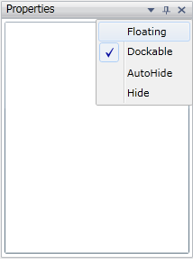

::: {style="DISPLAY: none"}
{#d2h_url_template}{#d2h_package_url style="WIDTH: 0px; DISPLAY: none; HEIGHT: 0px"}
:::

::: {.d2h_secondary_topic style="PADDING-BOTTOM: 10pt; MARGIN: 0pt; PADDING-LEFT: 0pt; PADDING-RIGHT: 0pt; PADDING-TOP: 0pt"}
#### Floating Window

[]{style="FONT-FAMILY: 'Calibri','sans-serif'"} 

We can float any number of controls individually or in nested floating or in tabbed floating. A control can be floated by setting DockState to **Float**. It can also be floated by selecting **Floating** option from the menu button options as shown in the below figure,

{border="0"}

Figure 85: Docking Menu Containing Floating Option

More:

[ ]{#related-topics}

[{border="0" align="absMiddle"}Nested Floating](ms-xhelp:///?Id=909b62c1-f227-4e44-a0b3-91ec55b7e9c9){style="TEXT-DECORATION: none"}

[{border="0" align="absMiddle"}Tabbed Floating](ms-xhelp:///?Id=c7648993-53be-40b1-8bf7-d833feafb697){style="TEXT-DECORATION: none"}
:::
