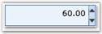
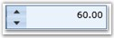

::: {style="DISPLAY: none"}
{#d2h_url_template}{#d2h_package_url style="WIDTH: 0px; DISPLAY: none; HEIGHT: 0px"}
:::

::: {.d2h_secondary_topic style="PADDING-BOTTOM: 10pt; MARGIN: 0pt; PADDING-LEFT: 0pt; PADDING-RIGHT: 0pt; PADDING-TOP: 0pt"}
##### []{#_FlowDirection_1}FlowDirection

[]{#p141} 

The FlowDirection property specifies the flow direction for the control. It can be set to one of the following values.

         

[·      ]{style="FONT-FAMILY: Symbol"}LeftToRight

[·      ]{style="FONT-FAMILY: Symbol"}RightToLeft

 

The below given code illustrates this.

 

+-------------------------------------------------------------------------------------------------------------------------------------------------------------------------------------------------------------------------------------------------------------------------------------------------------------------------------------------------------------------------------------------------------------------------------------------------------------------------------------------------------------------------------------------------------------------------------------------------------------------------+
| **[\[XAML\]]{style="FONT-FAMILY: 'Courier New'; COLOR: black"}**                                                                                                                                                                                                                                                                                                                                                                                                                                                                                                                                                        |
|                                                                                                                                                                                                                                                                                                                                                                                                                                                                                                                                                                                                                         |
| []{style="FONT-FAMILY: 'Courier New'; COLOR: black"}                                                                                                                                                                                                                                                                                                                                                                                                                                                                                                                                                                    |
|                                                                                                                                                                                                                                                                                                                                                                                                                                                                                                                                                                                                                         |
| [\<]{style="FONT-FAMILY: 'Courier New'; COLOR: blue"}[syncfusion]{style="FONT-FAMILY: 'Courier New'; COLOR: #a31515"}[:]{style="FONT-FAMILY: 'Courier New'; COLOR: blue"}[NumericUpDown]{style="FONT-FAMILY: 'Courier New'; COLOR: #a31515"}[ x]{style="FONT-FAMILY: 'Courier New'; COLOR: red"}[:]{style="FONT-FAMILY: 'Courier New'; COLOR: blue"}[Name]{style="FONT-FAMILY: 'Courier New'; COLOR: red"}[=\"NumericUIpDown\"]{style="FONT-FAMILY: 'Courier New'; COLOR: blue"}[ FlowDirection]{style="FONT-FAMILY: 'Courier New'; COLOR: red"}[=\"LeftToRight\" /\>]{style="FONT-FAMILY: 'Courier New'; COLOR: blue"} |
+-------------------------------------------------------------------------------------------------------------------------------------------------------------------------------------------------------------------------------------------------------------------------------------------------------------------------------------------------------------------------------------------------------------------------------------------------------------------------------------------------------------------------------------------------------------------------------------------------------------------------+

 

+-----------------------------------------------------------------------------------------------------------------+
| **[\[C#\]]{style="FONT-FAMILY: 'Courier New'; COLOR: black"}**                                                  |
|                                                                                                                 |
| []{style="FONT-FAMILY: 'Courier New'"}                                                                          |
|                                                                                                                 |
| [NumericUpDown numericUpDown = [new]{style="COLOR: blue"} NumericUpDown();]{style="FONT-FAMILY: 'Courier New'"} |
|                                                                                                                 |
| [numericUpDown.FlowDirection = EnumFlowDirection.LeftToRight;   ]{style="FONT-FAMILY: 'Courier New'"}           |
+-----------------------------------------------------------------------------------------------------------------+

 

{border="0"}

Figure 325 : FlowDirection = \"LeftToRight\"

 

{border="0"}

 

Figure 326 : FlowDirection = \"RightToLeft\"

 

[]{#related-topics}
:::
