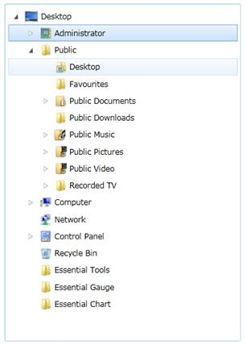
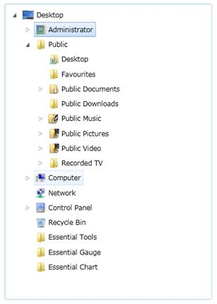

::: {style="DISPLAY: none"}
{#d2h_url_template}{#d2h_package_url style="WIDTH: 0px; DISPLAY: none; HEIGHT: 0px"}
:::

::: {.d2h_secondary_topic style="PADDING-BOTTOM: 10pt; MARGIN: 0pt; PADDING-LEFT: 0pt; PADDING-RIGHT: 0pt; PADDING-TOP: 0pt"}
#### []{#_FullRowSelect}FullRowSelect

FullRowSelect in TreeViewAdv could be enabled or disabled by setting the FullRowSelect property.  When you set theFullRowSelect property to true, the MouseOver and Focus borders will appear to the width of the TreeViewAdv. Otherwise, the MouseOver and Focus Borders will appear to the width of the content of the TreeViewItemAdv.

{border="0"}

Figure 754: FullRowSelect = "True"

{border="0"}

Figure 755: FullRowSelect = "False"[]{style="FONT-FAMILY: 'Calibri','sans-serif'; FONT-SIZE: 11pt"}

See Also

[[MultiSelection]{.UGHyperlink}](../../../../../../../../Documents%20and%20Settings/riaj/Desktop/styling%20for%20ui%20silverlight/tools%20silverlight/tools%20part%202.docx#_MultiSelection)[]{.UGHyperlink}

[[Keyboard Support]{.UGHyperlink}](../../../../../../../../Documents%20and%20Settings/riaj/Desktop/styling%20for%20ui%20silverlight/tools%20silverlight/tools%20part%202.docx#_Keyboard_Support)[]{#_MultiSelection}[]{.UGHyperlink}

[]{#related-topics}
:::
