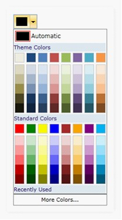

::: {style="DISPLAY: none"}
{#d2h_url_template}{#d2h_package_url style="WIDTH: 0px; DISPLAY: none; HEIGHT: 0px"}
:::

::: {.d2h_secondary_topic style="PADDING-BOTTOM: 10pt; MARGIN: 0pt; PADDING-LEFT: 0pt; PADDING-RIGHT: 0pt; PADDING-TOP: 0pt"}
#### []{#_Generating_Standard_Variants}Generating Standard Variants

[]{#p430} 

The user can generate variants for standard colors available in the Standard Colors Panel, providing the user with a wide range of colors for selection. This can be achieved by setting GenerateStandardVariants to true. By default, the GenerateStandardVariants is set to false.

 

The following code snippet illustrates the same.

 

+-----------------------------------------------------------------------------------------------------------------------------------------------------------------------------------------------------------------------------------------------------------------------------------------------------------------------------------------------------------------------------------------------------------------------------------------------------------------------------------------+
| **[\[XAML\]]{style="FONT-FAMILY: 'Courier New'; COLOR: black"}**                                                                                                                                                                                                                                                                                                                                                                                                                        |
|                                                                                                                                                                                                                                                                                                                                                                                                                                                                                         |
| []{style="FONT-FAMILY: 'Courier New'; COLOR: #a31515"}                                                                                                                                                                                                                                                                                                                                                                                                                                  |
|                                                                                                                                                                                                                                                                                                                                                                                                                                                                                         |
| [\<]{style="FONT-FAMILY: 'Courier New'; COLOR: blue"}[Syncfusion]{style="FONT-FAMILY: 'Courier New'; COLOR: #a31515"}[:]{style="FONT-FAMILY: 'Courier New'; COLOR: blue"}[ColorPickerPalette]{style="FONT-FAMILY: 'Courier New'; COLOR: #a31515"}[ [ GenerateStandardVariants]{style="COLOR: red"}[=\"True\"]{style="COLOR: blue"}]{style="FONT-FAMILY: 'Courier New'"}                                                                                                                 |
|                                                                                                                                                                                                                                                                                                                                                                                                                                                                                         |
| [x]{style="FONT-FAMILY: 'Courier New'; COLOR: red"}[:]{style="FONT-FAMILY: 'Courier New'; COLOR: blue"}[Name]{style="FONT-FAMILY: 'Courier New'; COLOR: red"}[=\"ColorPicker\"\> \</]{style="FONT-FAMILY: 'Courier New'; COLOR: blue"}[Syncfusion]{style="FONT-FAMILY: 'Courier New'; COLOR: #a31515"}[:]{style="FONT-FAMILY: 'Courier New'; COLOR: blue"}[ColorPickerPalette]{style="FONT-FAMILY: 'Courier New'; COLOR: #a31515"}[\>]{style="FONT-FAMILY: 'Courier New'; COLOR: blue"} |
|                                                                                                                                                                                                                                                                                                                                                                                                                                                                                         |
| [x]{style="FONT-FAMILY: 'Courier New'; COLOR: red"}[:]{style="FONT-FAMILY: 'Courier New'; COLOR: blue"}[Name]{style="FONT-FAMILY: 'Courier New'; COLOR: red"}[=\"ColorPicker"\> \</]{style="FONT-FAMILY: 'Courier New'; COLOR: blue"}[Syncfusion]{style="FONT-FAMILY: 'Courier New'; COLOR: #a31515"}[:]{style="FONT-FAMILY: 'Courier New'; COLOR: blue"}[ColorPickerPalette]{style="FONT-FAMILY: 'Courier New'; COLOR: #a31515"}[\>]{style="FONT-FAMILY: 'Courier New'; COLOR: blue"}  |
+-----------------------------------------------------------------------------------------------------------------------------------------------------------------------------------------------------------------------------------------------------------------------------------------------------------------------------------------------------------------------------------------------------------------------------------------------------------------------------------------+

 

+---------------------------------------------------------------------------------------------------------------------------------------------------------------------------------------------------------+
| **[\[C#\]]{style="FONT-FAMILY: 'Courier New'; COLOR: black"}**                                                                                                                                          |
|                                                                                                                                                                                                         |
| **[]{style="FONT-FAMILY: 'Courier New'; COLOR: black"}**                                                                                                                                                |
|                                                                                                                                                                                                         |
| [ColorPickerPalette]{style="FONT-FAMILY: 'Courier New'; COLOR: #2b91af"}[ colorPicker = [new]{style="COLOR: blue"} [ColorPickerPalette]{style="COLOR: #2b91af"}();]{style="FONT-FAMILY: 'Courier New'"} |
|                                                                                                                                                                                                         |
| [colorPicker.GenerateStandardVariants = [true]{style="COLOR: blue"};]{style="FONT-FAMILY: 'Courier New'"}                                                                                               |
+---------------------------------------------------------------------------------------------------------------------------------------------------------------------------------------------------------+

 

{border="0"}

 

Figure 964: Color Picker with GenerateStandardVariants Set to true

[]{#related-topics}
:::
