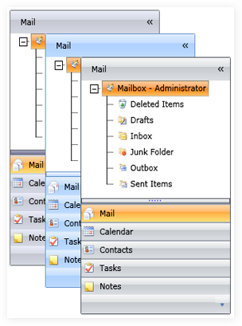

::: {style="DISPLAY: none"}
{#d2h_url_template}{#d2h_package_url style="WIDTH: 0px; DISPLAY: none; HEIGHT: 0px"}
:::

::::: {#nsbanner .d2h_main_nsbanner style="BORDER-BOTTOM: #999999 1px solid; POSITION: relative; PADDING-BOTTOM: 0px; BACKGROUND-COLOR: transparent; PADDING-LEFT: 0px; PADDING-RIGHT: 0px; DISPLAY: none; BORDER-TOP: #999999 1px solid; PADDING-TOP: 0px; LEFT: 0px"}
:::: {#TitleRow .d2h_main_titlerow style="PADDING-BOTTOM: 4px; BACKGROUND-COLOR: transparent; PADDING-LEFT: 22px; WIDTH: 100%; PADDING-RIGHT: 10px; DISPLAY: none; PADDING-TOP: 4px"}
::: {#ienav .d2h_main_ienav style="DISPLAY: none"}
{#D2HPrevious .D2HPreviousEnabled}  {#D2HNext .D2HNextEnabled}
:::
::::
:::::

::: {#nstext .d2h_main_nstext style="PADDING-BOTTOM: 10px; BACKGROUND-COLOR: transparent; PADDING-LEFT: 22px; PADDING-RIGHT: 10px; HEIGHT: 100%; OVERFLOW: auto; PADDING-TOP: 5px" hasuserbackground="true" valign="bottom"}
## []{#_GroupBar}[ ]{style="FONT-SIZE: 10pt"}[]{#p298}GroupBar

 

GroupBar is an experimental enhancement of the traditional Microsoft Windows taskbar. It provides a vertical bar to add buttons (tiles) to programs. The tiles can be dragged around and grouped together into groups. Use it to host a categorized collection of command items and custom controls wired to execute custom commands. It includes several customizable features which can be easily implemented in Silverlight applications.

 

 

{border="0"}

Figure 703: GroupBar Control

 

Feature Summary

 

[·      ]{style="FONT-FAMILY: Symbol"}**Orientation**: place the contents of the groupbar either vertically or horizontally

[·      ]{style="FONT-FAMILY: Symbol"}**Header Alignment**: set the horizontal alignment for the header text of the GroupBar control

[·      ]{style="FONT-FAMILY: Symbol"}**Expansion Mode**: specify the expansion mode of the control

[·      ]{style="FONT-FAMILY: Symbol"}**Drag Item**: drag the GroupBar Items within the GroupBar control

[·      ]{style="FONT-FAMILY: Symbol"}**State Persistence**: set the state persistence for the GroupBar control

[·      ]{style="FONT-FAMILY: Symbol"}**Visual Style**: specify the visual style for the control

More:

[ ]{#related-topics}

[{border="0" align="absMiddle"}Getting Started](ms-xhelp:///?Id=1f8074b8-d376-4b52-b848-671f1c4b74e3){style="TEXT-DECORATION: none"}

[{border="0" align="absMiddle"}Concepts and Features](ms-xhelp:///?Id=fe84b6a3-fe1a-449e-9a42-7ec0ad40cec7){style="TEXT-DECORATION: none"}
:::
