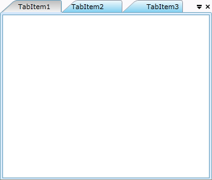

::: {style="DISPLAY: none"}
{#d2h_url_template}{#d2h_package_url style="WIDTH: 0px; DISPLAY: none; HEIGHT: 0px"}
:::

::: {.d2h_secondary_topic style="PADDING-BOTTOM: 10pt; MARGIN: 0pt; PADDING-LEFT: 0pt; PADDING-RIGHT: 0pt; PADDING-TOP: 0pt"}
#### Header Aligning

            After adding the header, the Tab Item may align the header by Left, Right and Center. We can set this property in xaml and code behind also.

+----------------------------------------------------------------------------------------------------------------------------------------------------------------------------------------------------------------------------------------------------------------------------------------------------------------------------------------------------------------------------------------------------------------------------------------------------------------------------------------------------------------------------------------------------------------------------------------------------------------------------------------------------------------------------------------------------------------------------------------+
| **[\[Xaml\]]{style="FONT-FAMILY: 'Courier New'"}**                                                                                                                                                                                                                                                                                                                                                                                                                                                                                                                                                                                                                                                                                     |
|                                                                                                                                                                                                                                                                                                                                                                                                                                                                                                                                                                                                                                                                                                                                        |
| [  ]{style="FONT-FAMILY: 'Courier New'; COLOR: #a31515"}[\<]{style="FONT-FAMILY: 'Courier New'; COLOR: blue"}[syncfusion]{style="FONT-FAMILY: 'Courier New'; COLOR: #a31515"}[:]{style="FONT-FAMILY: 'Courier New'; COLOR: blue"}[TabControlAdv]{style="FONT-FAMILY: 'Courier New'; COLOR: #a31515"}[ Name]{style="FONT-FAMILY: 'Courier New'; COLOR: red"}[=\"MyTabCtrl\"]{style="FONT-FAMILY: 'Courier New'; COLOR: blue"}[ Height]{style="FONT-FAMILY: 'Courier New'; COLOR: red"}[=\"300\"]{style="FONT-FAMILY: 'Courier New'; COLOR: blue"}[ Width]{style="FONT-FAMILY: 'Courier New'; COLOR: red"}[=\"350\"]{style="FONT-FAMILY: 'Courier New'; COLOR: blue"}[                 ]{style="FONT-FAMILY: 'Courier New'; COLOR: red"} |
|                                                                                                                                                                                                                                                                                                                                                                                                                                                                                                                                                                                                                                                                                                                                        |
| [                                               TabScrollStyle]{style="FONT-FAMILY: 'Courier New'; COLOR: red"}[=\"Extended\"\>]{style="FONT-FAMILY: 'Courier New'; COLOR: blue"}[]{style="FONT-FAMILY: 'Courier New'"}                                                                                                                                                                                                                                                                                                                                                                                                                                                                                                                |
|                                                                                                                                                                                                                                                                                                                                                                                                                                                                                                                                                                                                                                                                                                                                        |
| [            ]{style="FONT-FAMILY: 'Courier New'; COLOR: #a31515"}[\<]{style="FONT-FAMILY: 'Courier New'; COLOR: blue"}[syncfusion]{style="FONT-FAMILY: 'Courier New'; COLOR: #a31515"}[:]{style="FONT-FAMILY: 'Courier New'; COLOR: blue"}[TabItemAdv]{style="FONT-FAMILY: 'Courier New'; COLOR: #a31515"}[ Header]{style="FONT-FAMILY: 'Courier New'; COLOR: red"}[=\"TabItem1\"]{style="FONT-FAMILY: 'Courier New'; COLOR: blue"}[ HeaderAlignment]{style="FONT-FAMILY: 'Courier New'; COLOR: red"}[=\"Center\" ]{style="FONT-FAMILY: 'Courier New'; COLOR: blue"}[ Width]{style="FONT-FAMILY: 'Courier New'; COLOR: red"}[=\"100\" /\>]{style="FONT-FAMILY: 'Courier New'; COLOR: blue"}[]{style="FONT-FAMILY: 'Courier New'"}     |
|                                                                                                                                                                                                                                                                                                                                                                                                                                                                                                                                                                                                                                                                                                                                        |
| [            ]{style="FONT-FAMILY: 'Courier New'; COLOR: #a31515"}[\<]{style="FONT-FAMILY: 'Courier New'; COLOR: blue"}[syncfusion]{style="FONT-FAMILY: 'Courier New'; COLOR: #a31515"}[:]{style="FONT-FAMILY: 'Courier New'; COLOR: blue"}[TabItemAdv]{style="FONT-FAMILY: 'Courier New'; COLOR: #a31515"}[ Header]{style="FONT-FAMILY: 'Courier New'; COLOR: red"}[=\"TabItem2\"]{style="FONT-FAMILY: 'Courier New'; COLOR: blue"}[ HeaderAlignment]{style="FONT-FAMILY: 'Courier New'; COLOR: red"}[=\"Left\" ]{style="FONT-FAMILY: 'Courier New'; COLOR: blue"}[Width]{style="FONT-FAMILY: 'Courier New'; COLOR: red"}[=\"100\" /\>]{style="FONT-FAMILY: 'Courier New'; COLOR: blue"}                                              |
|                                                                                                                                                                                                                                                                                                                                                                                                                                                                                                                                                                                                                                                                                                                                        |
| [            ]{style="FONT-FAMILY: 'Courier New'; COLOR: #a31515"}[\<]{style="FONT-FAMILY: 'Courier New'; COLOR: blue"}[syncfusion]{style="FONT-FAMILY: 'Courier New'; COLOR: #a31515"}[:]{style="FONT-FAMILY: 'Courier New'; COLOR: blue"}[TabItemAdv]{style="FONT-FAMILY: 'Courier New'; COLOR: #a31515"}[ Header]{style="FONT-FAMILY: 'Courier New'; COLOR: red"}[=\"TabItem3\"]{style="FONT-FAMILY: 'Courier New'; COLOR: blue"}[ HeaderAlignment]{style="FONT-FAMILY: 'Courier New'; COLOR: red"}[=\"Right\"]{style="FONT-FAMILY: 'Courier New'; COLOR: blue"}[ Width]{style="FONT-FAMILY: 'Courier New'; COLOR: red"}[=\"100\" /\>]{style="FONT-FAMILY: 'Courier New'; COLOR: blue"}[]{style="FONT-FAMILY: 'Courier New'"}       |
|                                                                                                                                                                                                                                                                                                                                                                                                                                                                                                                                                                                                                                                                                                                                        |
| [  ]{style="FONT-FAMILY: 'Courier New'; COLOR: #a31515"}[\</]{style="FONT-FAMILY: 'Courier New'; COLOR: blue"}[syncfusion]{style="FONT-FAMILY: 'Courier New'; COLOR: #a31515"}[:]{style="FONT-FAMILY: 'Courier New'; COLOR: blue"}[TabControlAdv]{style="FONT-FAMILY: 'Courier New'; COLOR: #a31515"}[\>]{style="FONT-FAMILY: 'Courier New'; COLOR: blue"}                                                                                                                                                                                                                                                                                                                                                                             |
|                                                                                                                                                                                                                                                                                                                                                                                                                                                                                                                                                                                                                                                                                                                                        |
| **[]{style="FONT-FAMILY: 'Courier New'"}**                                                                                                                                                                                                                                                                                                                                                                                                                                                                                                                                                                                                                                                                                             |
+----------------------------------------------------------------------------------------------------------------------------------------------------------------------------------------------------------------------------------------------------------------------------------------------------------------------------------------------------------------------------------------------------------------------------------------------------------------------------------------------------------------------------------------------------------------------------------------------------------------------------------------------------------------------------------------------------------------------------------------+

[]{style="FONT-FAMILY: 'Calibri','sans-serif'; FONT-SIZE: 12pt"} 

+-----------------------------------------------------------------------------------------------------------------------------------------------------------------------------------------------------------------------------------------------------------------------------------------------------+
| **[\[C#\]]{style="FONT-FAMILY: 'Courier New'"}**                                                                                                                                                                                                                                                    |
|                                                                                                                                                                                                                                                                                                     |
| [TabControlAdv]{style="FONT-FAMILY: 'Courier New'; COLOR: #2b91af"}[ myTabCtrl = [new]{style="COLOR: blue"} [TabControlAdv]{style="COLOR: #2b91af"}();]{style="FONT-FAMILY: 'Courier New'"}                                                                                                         |
|                                                                                                                                                                                                                                                                                                     |
| [          [TabItemAdv]{style="COLOR: #2b91af"} item1 = [new]{style="COLOR: blue"} [TabItemAdv]{style="COLOR: #2b91af"} { Header = [\"TabItem1\"]{style="COLOR: #a31515"}, HeaderAlignment = [HeaderAlignment]{style="COLOR: #2b91af"}.Center , Width =100 };]{style="FONT-FAMILY: 'Courier New'"}  |
|                                                                                                                                                                                                                                                                                                     |
| [            [TabItemAdv]{style="COLOR: #2b91af"} item2 = [new]{style="COLOR: blue"} [TabItemAdv]{style="COLOR: #2b91af"} { Header = [\"TabItem2\"]{style="COLOR: #a31515"}, HeaderAlignment = [HeaderAlignment]{style="COLOR: #2b91af"}.Left, Width =100 };]{style="FONT-FAMILY: 'Courier New'"}   |
|                                                                                                                                                                                                                                                                                                     |
| [            [TabItemAdv]{style="COLOR: #2b91af"} item3 = [new]{style="COLOR: blue"} [TabItemAdv]{style="COLOR: #2b91af"} { Header = [\"TabItem3\"]{style="COLOR: #a31515"}, HeaderAlignment = [HeaderAlignment]{style="COLOR: #2b91af"}.Right , Width =100 };]{style="FONT-FAMILY: 'Courier New'"} |
|                                                                                                                                                                                                                                                                                                     |
| [            myTabCtrl.Items.Add(item1); myTabCtrl.Items.Add(item2); myTabCtrl.Items.Add(item3);]{style="FONT-FAMILY: 'Courier New'"}                                                                                                                                                               |
|                                                                                                                                                                                                                                                                                                     |
| [            [this]{style="COLOR: blue"}.LayoutRoot.Children.Add(myTabCtrl);]{style="FONT-FAMILY: 'Courier New'"}                                                                                                                                                                                   |
|                                                                                                                                                                                                                                                                                                     |
| **[]{style="FONT-FAMILY: 'Courier New'"}**                                                                                                                                                                                                                                                          |
+-----------------------------------------------------------------------------------------------------------------------------------------------------------------------------------------------------------------------------------------------------------------------------------------------------+

[]{style="FONT-FAMILY: 'Calibri','sans-serif'; FONT-SIZE: 12pt"} 

{border="0"}

Figure 825: TabHeader Alignment

[                                    ** **]{style="FONT-FAMILY: 'Calibri','sans-serif'; FONT-SIZE: 12pt"}

[]{#related-topics}
:::
