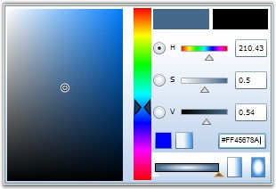
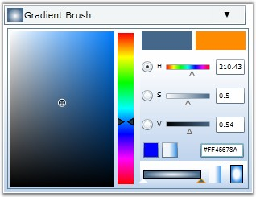

::: {style="DISPLAY: none"}
{#d2h_url_template}{#d2h_package_url style="WIDTH: 0px; DISPLAY: none; HEIGHT: 0px"}
:::

::: {.d2h_secondary_topic style="PADDING-BOTTOM: 10pt; MARGIN: 0pt; PADDING-LEFT: 0pt; PADDING-RIGHT: 0pt; PADDING-TOP: 0pt"}
#### []{#p166}[]{#_Hexadecimal_Value}Hexadecimal Value

 

BrushSelector provides support for Hexadecimal color generator. Color reference can be expressed in hexadecimal with \'#\' as prefix. When a null value is given to the Hexadecimal textbox, it returns a white color. This property can be changed only during runtime. This feature is mainly useful to retrieve the hexadecimal code for the selected color.

 

{border="0"}

 

Figure 364: BrushEdit with Hexadecimal code being Edited

 

{border="0"}

 

Figure 365: BrushSelector with Hexadecimal code being Edited

[]{#related-topics}
:::
