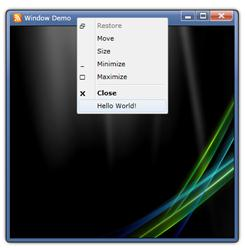

::: {style="DISPLAY: none"}
{#d2h_url_template}{#d2h_package_url style="WIDTH: 0px; DISPLAY: none; HEIGHT: 0px"}
:::

::: {.d2h_secondary_topic style="PADDING-BOTTOM: 10pt; MARGIN: 0pt; PADDING-LEFT: 0pt; PADDING-RIGHT: 0pt; PADDING-TOP: 0pt"}
#### How to add my own items in Context Menu?

Custom items can be added in the Window title bar Context Menu using the event *ContextMenuOpened*.

+-------------------------------------------------------------------------------------------------------------------------------------------------------------------------------------------------------------------------------------+
| C#                                                                                                                                                                                                                                  |
+-------------------------------------------------------------------------------------------------------------------------------------------------------------------------------------------------------------------------------------+
| [void]{style="FONT-FAMILY: Consolas; COLOR: blue; FONT-SIZE: 9.5pt"}[ MainPage_Loaded([object]{style="COLOR: blue"} sender, [RoutedEventArgs]{style="COLOR: #2b91af"} e)]{style="FONT-FAMILY: Consolas; FONT-SIZE: 9.5pt"}          |
|                                                                                                                                                                                                                                     |
| [{]{style="FONT-FAMILY: Consolas; FONT-SIZE: 9.5pt"}                                                                                                                                                                                |
|                                                                                                                                                                                                                                     |
| [      [WindowDemo]{style="COLOR: #2b91af"} window = [new]{style="COLOR: blue"} [WindowDemo]{style="COLOR: #2b91af"}();]{style="FONT-FAMILY: Consolas; FONT-SIZE: 9.5pt"}                                                           |
|                                                                                                                                                                                                                                     |
| [      window.ContextMenuOpened += [new]{style="COLOR: blue"} [RoutedEventHandler]{style="COLOR: #2b91af"}(window_ContextMenuOpened);]{style="FONT-FAMILY: Consolas; FONT-SIZE: 9.5pt"}                                             |
|                                                                                                                                                                                                                                     |
| [      window.Show();]{style="FONT-FAMILY: Consolas; FONT-SIZE: 9.5pt"}                                                                                                                                                             |
|                                                                                                                                                                                                                                     |
| [}]{style="FONT-FAMILY: Consolas; FONT-SIZE: 9.5pt"}                                                                                                                                                                                |
|                                                                                                                                                                                                                                     |
| []{style="FONT-FAMILY: Consolas; FONT-SIZE: 9.5pt"}                                                                                                                                                                                 |
|                                                                                                                                                                                                                                     |
| [ContextMenuItemAdv]{style="FONT-FAMILY: Consolas; COLOR: #2b91af; FONT-SIZE: 9.5pt"}[ item;]{style="FONT-FAMILY: Consolas; FONT-SIZE: 9.5pt"}                                                                                      |
|                                                                                                                                                                                                                                     |
| []{style="FONT-FAMILY: Consolas; FONT-SIZE: 9.5pt"}                                                                                                                                                                                 |
|                                                                                                                                                                                                                                     |
| [void]{style="FONT-FAMILY: Consolas; COLOR: blue; FONT-SIZE: 9.5pt"}[ window_ContextMenuOpened([object]{style="COLOR: blue"} sender, [RoutedEventArgs]{style="COLOR: #2b91af"} e)]{style="FONT-FAMILY: Consolas; FONT-SIZE: 9.5pt"} |
|                                                                                                                                                                                                                                     |
| [{]{style="FONT-FAMILY: Consolas; FONT-SIZE: 9.5pt"}                                                                                                                                                                                |
|                                                                                                                                                                                                                                     |
| [      [ContextMenuAdv]{style="COLOR: #2b91af"} contextMenu = sender [as]{style="COLOR: blue"} [ContextMenuAdv]{style="COLOR: #2b91af"};]{style="FONT-FAMILY: Consolas; FONT-SIZE: 9.5pt"}                                          |
|                                                                                                                                                                                                                                     |
| [      [if]{style="COLOR: blue"} (contextMenu != [null]{style="COLOR: blue"} && !contextMenu.Items.Contains(item))]{style="FONT-FAMILY: Consolas; FONT-SIZE: 9.5pt"}                                                                |
|                                                                                                                                                                                                                                     |
| [      {]{style="FONT-FAMILY: Consolas; FONT-SIZE: 9.5pt"}                                                                                                                                                                          |
|                                                                                                                                                                                                                                     |
| [            item = [new]{style="COLOR: blue"} [ContextMenuItemAdv]{style="COLOR: #2b91af"}();]{style="FONT-FAMILY: Consolas; FONT-SIZE: 9.5pt"}                                                                                    |
|                                                                                                                                                                                                                                     |
| [            item.Header = [\"Hello World!\"]{style="COLOR: #a31515"};]{style="FONT-FAMILY: Consolas; FONT-SIZE: 9.5pt"}                                                                                                            |
|                                                                                                                                                                                                                                     |
| [            contextMenu.Items.Add(item);]{style="FONT-FAMILY: Consolas; FONT-SIZE: 9.5pt"}                                                                                                                                         |
|                                                                                                                                                                                                                                     |
| [      }]{style="FONT-FAMILY: Consolas; FONT-SIZE: 9.5pt"}                                                                                                                                                                          |
|                                                                                                                                                                                                                                     |
| [}]{style="FONT-FAMILY: Consolas; FONT-SIZE: 9.5pt"}                                                                                                                                                                                |
+-------------------------------------------------------------------------------------------------------------------------------------------------------------------------------------------------------------------------------------+

 

{border="0"}

Figure 1126: Custom item added to Title Bar context menu.

[]{#related-topics}
:::
