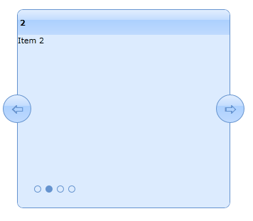

::: {style="DISPLAY: none"}
{#d2h_url_template}{#d2h_package_url style="WIDTH: 0px; DISPLAY: none; HEIGHT: 0px"}
:::

::: {.d2h_secondary_topic style="PADDING-BOTTOM: 10pt; MARGIN: 0pt; PADDING-LEFT: 0pt; PADDING-RIGHT: 0pt; PADDING-TOP: 0pt"}
#### How to change the position of the tab strip ellipses?

You can change the position of the tab strip ellipses for customization purposes. Refer to section "Complete UI customization through Expression Blend", to customize the position of the tab strip ellipses using Expression Blend.

{border="0"}

Figure 847: Position of Tab Strip Ellipses Changed

[]{#related-topics}
:::
