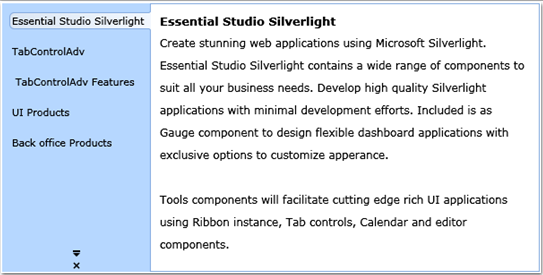

::: {style="DISPLAY: none"}
{#d2h_url_template}{#d2h_package_url style="WIDTH: 0px; DISPLAY: none; HEIGHT: 0px"}
:::

::: {.d2h_secondary_topic style="PADDING-BOTTOM: 10pt; MARGIN: 0pt; PADDING-LEFT: 0pt; PADDING-RIGHT: 0pt; PADDING-TOP: 0pt"}
#### []{#_How_to_Rotate}How to rotate text during Vertical placement?

            We can rotate the Text by 90 degrees when the TabStrip is placed in vertical. The user can do this by setting the RotateTextWhenVertical property value to true. We may set this property in xaml or code behind. This rotation will reflect on the Left and Right *TabStripPlacement* modes.

[]{style="FONT-FAMILY: 'Calibri','sans-serif'; FONT-SIZE: 12pt"} 

+--------------------------------------------------------------------------------------------------------------------------------------------------------------------------------------------------------------------------------------------------------------------------------------------------------------------------------------------------------------------------------------------------------------------------------------------------------------------------------------------+
| **[\[Xaml\]]{style="FONT-FAMILY: 'Courier New'"}**                                                                                                                                                                                                                                                                                                                                                                                                                                         |
|                                                                                                                                                                                                                                                                                                                                                                                                                                                                                            |
| []{style="FONT-FAMILY: 'Courier New'; COLOR: blue"}                                                                                                                                                                                                                                                                                                                                                                                                                                        |
|                                                                                                                                                                                                                                                                                                                                                                                                                                                                                            |
| [\<]{style="FONT-FAMILY: 'Courier New'; COLOR: blue"}[syncfusion]{style="FONT-FAMILY: 'Courier New'; COLOR: #a31515"}[:]{style="FONT-FAMILY: 'Courier New'; COLOR: blue"}[TabControlAdv]{style="FONT-FAMILY: 'Courier New'; COLOR: #a31515"}[ Name]{style="FONT-FAMILY: 'Courier New'; COLOR: red"}[=\"MyTabCtrl\"]{style="FONT-FAMILY: 'Courier New'; COLOR: blue"}[ [ RotateTextWhenVertical]{style="COLOR: red"}[=\"True\"\>]{style="COLOR: blue"}]{style="FONT-FAMILY: 'Courier New'"} |
+--------------------------------------------------------------------------------------------------------------------------------------------------------------------------------------------------------------------------------------------------------------------------------------------------------------------------------------------------------------------------------------------------------------------------------------------------------------------------------------------+

[]{style="FONT-FAMILY: 'Calibri','sans-serif'; FONT-SIZE: 12pt"} 

+--------------------------------------------------------------------------------------------------------------------------------------------------------------------------------+
| [  **\[C#\]**]{style="FONT-FAMILY: 'Courier New'"}                                                                                                                             |
|                                                                                                                                                                                |
| **[]{style="FONT-FAMILY: 'Courier New'"}**                                                                                                                                     |
|                                                                                                                                                                                |
| [               [TabControlAdv]{style="COLOR: #2b91af"} myTabCtrl = [new]{style="COLOR: blue"} [TabControlAdv]{style="COLOR: #2b91af"}();]{style="FONT-FAMILY: 'Courier New'"} |
|                                                                                                                                                                                |
| [         myTabCtrl.RotateTextWhenVertical = [true]{style="COLOR: blue"};]{style="FONT-FAMILY: 'Courier New'"}                                                                 |
+--------------------------------------------------------------------------------------------------------------------------------------------------------------------------------+

[   ]{style="FONT-FAMILY: 'Calibri','sans-serif'; FONT-SIZE: 12pt"}

{border="0"}

Figure 826: Rotated Text on Vertical Placement

 

[]{#related-topics}
:::
