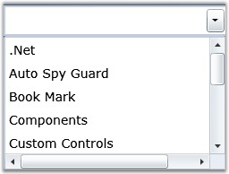
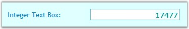
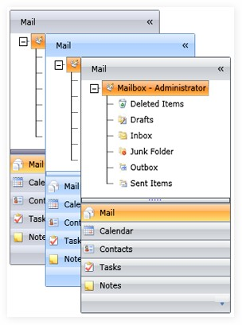

::: {style="DISPLAY: none"}
{#d2h_url_template}{#d2h_package_url style="WIDTH: 0px; DISPLAY: none; HEIGHT: 0px"}
:::

::::: {#nsbanner .d2h_main_nsbanner style="BORDER-BOTTOM: #999999 1px solid; POSITION: relative; PADDING-BOTTOM: 0px; BACKGROUND-COLOR: transparent; PADDING-LEFT: 0px; PADDING-RIGHT: 0px; DISPLAY: none; BORDER-TOP: #999999 1px solid; PADDING-TOP: 0px; LEFT: 0px"}
:::: {#TitleRow .d2h_main_titlerow style="PADDING-BOTTOM: 4px; BACKGROUND-COLOR: transparent; PADDING-LEFT: 22px; WIDTH: 100%; PADDING-RIGHT: 10px; DISPLAY: none; PADDING-TOP: 4px"}
::: {#ienav .d2h_main_ienav style="DISPLAY: none"}
{#D2HPrevious .D2HPreviousEnabled}  {#D2HNext .D2HNextEnabled}
:::
::::
:::::

:::: {#nstext .d2h_main_nstext style="PADDING-BOTTOM: 10px; BACKGROUND-COLOR: transparent; PADDING-LEFT: 22px; PADDING-RIGHT: 10px; HEIGHT: 100%; OVERFLOW: auto; PADDING-TOP: 5px" hasuserbackground="true" valign="bottom"}
## Introduction to Essential Tools Silverlight

 

Essential Tools for Silverlight is a set of new user interface components for the Microsoft\'s Windows Presentation Foundation framework. In some cases, they extend the functionality provided by the standard framework controls. It is intended for those users who look for additional functionalities such as auto-completion and new components such as group bar in addition to the existing Silverlight framework. The package consists of a comprehensive set of components that are required for building modern windows applications including Docking, Ribbon, Tabs, TreeView, Editors and much more.

 

The following are some examples of the Silverlight tools:

{hspace="12" align="left"}

 

\

Figure 1: AutoComplete Control

**** 

**** 

Figure 2: IntegerTextBox Control

**** 

**** 

Figure 3: GroupBar Control

**** 

Real World Scenarios

 

Some real time applications of Silverlight tools are as follows:

 

[·      ]{style="FONT-FAMILY: Symbol"}File upload control can be used in the HR applications for uploading employees\' images and resumes

[·      ]{style="FONT-FAMILY: Symbol"}Integer TextBox can used in online ticket booking applications to restrict the users from entering double values

 

Key Features

 

The following are some of the key features of Silverlight tools:

 

[·      ]{style="FONT-FAMILY: Symbol"}**AutoComplete** control provides live drop-down hints to users as they type in the keywords. It guides the user to select an entry from the list instead of entering the whole text. The following are some of the feature of this control:

[·    ]{style="FONT-FAMILY: Symbol"}Allows enabling or disabling the appending of text from history, depending on the entered  text   

[·    ]{style="FONT-FAMILY: Symbol"}Allows to specify the visibility of the drop-down button

[·    ]{style="FONT-FAMILY: Symbol"}Allows to get or set the maximum height for the drop down

 

[·      ]{style="FONT-FAMILY: Symbol"}**IntegerTextBox** is a text box control which allows to enter only integer type values. The following are some of the feature of this control:

[·    ]{style="FONT-FAMILY: Symbol"}Allows to specify the minimum and maximum values to give as input

[·    ]{style="FONT-FAMILY: Symbol"}Uses different foreground colors to differentiate positive and negative numbers

[·    ]{style="FONT-FAMILY: Symbol"}Allows to specify the visual style for the control

 

[·      ]{style="FONT-FAMILY: Symbol"}**GroupBar** is an experimental enhancement of the traditional Microsoft Windows taskbar. It provides a vertical bar to add buttons (tiles) to programs. The following are some of the feature of this control:

[·    ]{style="FONT-FAMILY: Symbol"}Allows to specify the orientation of the group bar.

[·    ]{style="FONT-FAMILY: Symbol"}Allows to set the horizontal alignment for the header text of the GroupBar control

[·    ]{style="FONT-FAMILY: Symbol"}Allows to specify the expansion mode of the control

 

User Guide Organization

 

The product comes with numerous samples as well as an extensive documentation to guide you. This User Guide provides detailed information on the features and functionalities of the Essential Tools for Silverlight. It is organized into the following sections:

[·      ]{style="FONT-FAMILY: Symbol"}**Overview**-This section gives a brief introduction to the product and its key features.

[·      ]{style="FONT-FAMILY: Symbol"}**Installation and Deployment**-This section elaborates on the install location of the samples, license etc.

[·      ]{style="FONT-FAMILY: Symbol"}**What\'s New**-This section lists the new features implemented for every release.

[·      ]{style="FONT-FAMILY: Symbol"}**Getting Started**-This section guides you on getting started with Silverlight application, controls etc.

[·      ]{style="FONT-FAMILY: Symbol"}**Concepts and Features**-The features of individual controls are illustrated with use case scenarios, code examples and screen shots under this section.

 

Document Conventions

 

The conventions below will help you to quickly identify the important sections of information, while using the content:

 

::: {align="center"}
  ------------------------ --------------------------------------------- ---------------------------------------------------------------------------------
  Convention               Icon                                          Description
  Note                     ***Note:***   Represents important information.
  Example                  **Example:**                                  Represents an example.
  Tip                                    Represents useful hints, that will help you in using the controls and features.
  Additional information                 Represents additional information on the corresponding topic.
  ------------------------ --------------------------------------------- ---------------------------------------------------------------------------------
:::

[]{style="COLOR: red"} 

[]{#related-topics}
::::
