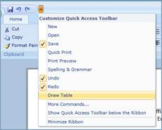

::: {style="DISPLAY: none"}
{#d2h_url_template}{#d2h_package_url style="WIDTH: 0px; DISPLAY: none; HEIGHT: 0px"}
:::

::: {.d2h_secondary_topic style="PADDING-BOTTOM: 10pt; MARGIN: 0pt; PADDING-LEFT: 0pt; PADDING-RIGHT: 0pt; PADDING-TOP: 0pt"}
#### Keyboard Interaction

The Ribbon Control allows the user to interact with Ribbon items using Keyboard. The user can easily navigate through the ribbon items without a mouse[. ]{style="FONT-FAMILY: 'Calibri','sans-serif'"}

{border="0"}

Figure 640: Keyboard Interaction

[]{#related-topics}
:::
