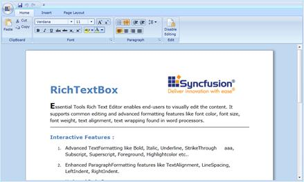
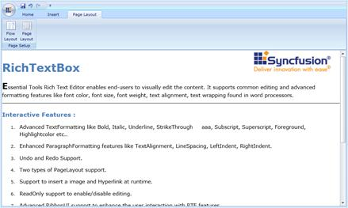

::: {style="DISPLAY: none"}
{#d2h_url_template}{#d2h_package_url style="WIDTH: 0px; DISPLAY: none; HEIGHT: 0px"}
:::

::: {.d2h_secondary_topic style="PADDING-BOTTOM: 10pt; MARGIN: 0pt; PADDING-LEFT: 0pt; PADDING-RIGHT: 0pt; PADDING-TOP: 0pt"}
#### Layout Modes

 

Layout mode feature allows choosing several layouts in the document. They are:

 

[·      ]{style="FONT-FAMILY: Symbol"}**PageLayout -** Single document in the edited content can be separated into 'n' number of pages depending upon the capacity of the content. We can customize the page margin and size using the properties, which are available in SectionAdv.

 

{border="0"}

Figure 1178: RichTextBoxAdv Control in PageLayout

 

[·      ]{style="FONT-FAMILY: Symbol"}**ContinuousLayout** - This layout mode looks like Web Layout mode in MS Word. Instead of having pages of content, it will have a single page, which displays the whole content.

 

{border="0"}

[   ]{style="COLOR: #c00000"}Figure 1179: RichTextBoxAdv Control in FlowLayout

 

Limitations

Continuous layout with no wrapping support has not been provided.

 

 

[]{#related-topics}
:::
