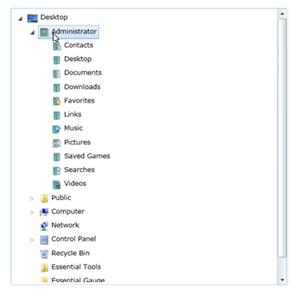
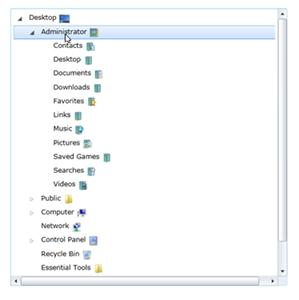

::: {style="DISPLAY: none"}
{#d2h_url_template}{#d2h_package_url style="WIDTH: 0px; DISPLAY: none; HEIGHT: 0px"}
:::

::: {.d2h_secondary_topic style="PADDING-BOTTOM: 10pt; MARGIN: 0pt; PADDING-LEFT: 0pt; PADDING-RIGHT: 0pt; PADDING-TOP: 0pt"}
##### []{#_Left_and_Right}Left and Right Image support

The LeftImageSource property sets the source for the image on the left side of a particular node. The LeftImageHeight and LeftImageWidth properties are used to set the height and width of the image on the left side of a particular node. The following code example illustrates the setting of these properties.

[]{style="FONT-FAMILY: 'Calibri','sans-serif'; FONT-SIZE: 11pt"} 

+-------------------------------------------------------------------------------------------------------------------------------------------------------------------------------------------------------------------------------------------------------------------------------------------------------------------------------------------------------------------------------------------------------------------------------------------------------------------------------------------------------------------------------------------------------------------------------------------------------------------------------------------------------------------------------------------------------------------------------------------------------------------------------------------------------------------------------------------------------------------------------------------------------------------------------------------------------------------------------------------------------------------------------------------------------------------------------------------------------------------------------------------------------------------------------------------------------------------------+
| **[\[XAML\]]{style="FONT-FAMILY: 'Courier New'"}**                                                                                                                                                                                                                                                                                                                                                                                                                                                                                                                                                                                                                                                                                                                                                                                                                                                                                                                                                                                                                                                                                                                                                                      |
|                                                                                                                                                                                                                                                                                                                                                                                                                                                                                                                                                                                                                                                                                                                                                                                                                                                                                                                                                                                                                                                                                                                                                                                                                         |
| **[\<]{style="FONT-FAMILY: 'Courier New'; COLOR: blue"}[syncfusion]{style="FONT-FAMILY: 'Courier New'; COLOR: #a31515"}[:]{style="FONT-FAMILY: 'Courier New'; COLOR: blue"}[TreeViewItemAdv]{style="FONT-FAMILY: 'Courier New'; COLOR: #a31515"}[ Header]{style="FONT-FAMILY: 'Courier New'; COLOR: red"}[=\"Administrator\"]{style="FONT-FAMILY: 'Courier New'; COLOR: blue"}[ TextVerticalAlignment]{style="FONT-FAMILY: 'Courier New'; COLOR: red"}[ =\"Center\"]{style="FONT-FAMILY: 'Courier New'; COLOR: blue"}[ TextHorizontalAlignment]{style="FONT-FAMILY: 'Courier New'; COLOR: red"}[=\"Center\"]{style="FONT-FAMILY: 'Courier New'; COLOR: blue"}[ [ ]{style="COLOR: red"}]{style="FONT-FAMILY: 'Courier New'"}**[LeftImageSource]{style="FONT-FAMILY: 'Courier New'; COLOR: red"}[=\"/TreeViewImages;component/Images/Tools/administrator.png\"]{style="FONT-FAMILY: 'Courier New'; COLOR: blue"}[ LeftImageHeight]{style="FONT-FAMILY: 'Courier New'; COLOR: red"}[=\"20\"]{style="FONT-FAMILY: 'Courier New'; COLOR: blue"}[ LeftImageWidth]{style="FONT-FAMILY: 'Courier New'; COLOR: red"}[=\"20\" **/\>**]{style="FONT-FAMILY: 'Courier New'; COLOR: blue"}**[]{style="FONT-FAMILY: 'Courier New'"}** |
+-------------------------------------------------------------------------------------------------------------------------------------------------------------------------------------------------------------------------------------------------------------------------------------------------------------------------------------------------------------------------------------------------------------------------------------------------------------------------------------------------------------------------------------------------------------------------------------------------------------------------------------------------------------------------------------------------------------------------------------------------------------------------------------------------------------------------------------------------------------------------------------------------------------------------------------------------------------------------------------------------------------------------------------------------------------------------------------------------------------------------------------------------------------------------------------------------------------------------+

[{border="0"}]{style="FONT-FAMILY: 'Calibri','sans-serif'; FONT-SIZE: 11pt"}[]{style="FONT-FAMILY: 'Calibri','sans-serif'; FONT-SIZE: 11pt"}

The RightImageSource property sets the source for the image on the right side of a particular node. The RightImageHeight and RightImageWidth properties are used to set the height and width of the image on the right side of a particular node. The following code example illustrates the setting of these properties.

+----------------------------------------------------------------------------------------------------------------------------------------------------------------------------------------------------------------------------------------------------------------------------------------------------------------------------------------------------------------------------------------------------------------------------------------------------------------------------------------------------------------------------------------------------------------------------------------------------------------------------------------------------------------------------------------------------------------------------------------------------------------------------------------------------------------------------------------------------------------------------------------------------------------------------------------------------------------------------+
| **[\[XAML\]]{style="FONT-FAMILY: 'Courier New'"}**                                                                                                                                                                                                                                                                                                                                                                                                                                                                                                                                                                                                                                                                                                                                                                                                                                                                                                                         |
|                                                                                                                                                                                                                                                                                                                                                                                                                                                                                                                                                                                                                                                                                                                                                                                                                                                                                                                                                                            |
| [\<]{style="FONT-FAMILY: 'Courier New'; COLOR: blue"}[syncfusion]{style="FONT-FAMILY: 'Courier New'; COLOR: #a31515"}[:]{style="FONT-FAMILY: 'Courier New'; COLOR: blue"}[TreeViewItemAdv]{style="FONT-FAMILY: 'Courier New'; COLOR: #a31515"}[ Header]{style="FONT-FAMILY: 'Courier New'; COLOR: red"}[=\"Administrator\"]{style="FONT-FAMILY: 'Courier New'; COLOR: blue"}[ TextVerticalAlignment]{style="FONT-FAMILY: 'Courier New'; COLOR: red"}[ =\"Center\"]{style="FONT-FAMILY: 'Courier New'; COLOR: blue"}[ TextHorizontalAlignment]{style="FONT-FAMILY: 'Courier New'; COLOR: red"}[=\"Center\"]{style="FONT-FAMILY: 'Courier New'; COLOR: blue"}[ [ RightImageSource]{style="COLOR: red"}[=\"/TreeViewImages;component/Images/Tools/administrator.png\"]{style="COLOR: blue"}[ RightImageHeight]{style="COLOR: red"}[=\"20\"]{style="COLOR: blue"}[ RightImageWidth]{style="COLOR: red"}[=\"20\" /\>]{style="COLOR: blue"}]{style="FONT-FAMILY: 'Courier New'"} |
+----------------------------------------------------------------------------------------------------------------------------------------------------------------------------------------------------------------------------------------------------------------------------------------------------------------------------------------------------------------------------------------------------------------------------------------------------------------------------------------------------------------------------------------------------------------------------------------------------------------------------------------------------------------------------------------------------------------------------------------------------------------------------------------------------------------------------------------------------------------------------------------------------------------------------------------------------------------------------+

[]{style="FONT-FAMILY: 'Calibri','sans-serif'; FONT-SIZE: 11pt"} 

[]{style="FONT-FAMILY: 'Calibri','sans-serif'; FONT-SIZE: 11pt"} 

[]{style="FONT-FAMILY: 'Calibri','sans-serif'; FONT-SIZE: 11pt"} 

[{border="0"}]{style="FONT-FAMILY: 'Calibri','sans-serif'; FONT-SIZE: 11pt"}[]{style="FONT-FAMILY: 'Calibri','sans-serif'; FONT-SIZE: 11pt"}

[]{#related-topics}
:::
