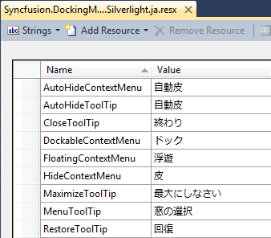
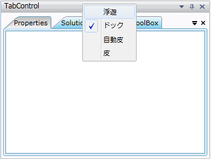

::: {style="DISPLAY: none"}
{#d2h_url_template}{#d2h_package_url style="WIDTH: 0px; DISPLAY: none; HEIGHT: 0px"}
:::

::::: {#nsbanner .d2h_main_nsbanner style="BORDER-BOTTOM: #999999 1px solid; POSITION: relative; PADDING-BOTTOM: 0px; BACKGROUND-COLOR: transparent; PADDING-LEFT: 0px; PADDING-RIGHT: 0px; DISPLAY: none; BORDER-TOP: #999999 1px solid; PADDING-TOP: 0px; LEFT: 0px"}
:::: {#TitleRow .d2h_main_titlerow style="PADDING-BOTTOM: 4px; BACKGROUND-COLOR: transparent; PADDING-LEFT: 22px; WIDTH: 100%; PADDING-RIGHT: 10px; DISPLAY: none; PADDING-TOP: 4px"}
::: {#ienav .d2h_main_ienav style="DISPLAY: none"}
{#D2HPrevious .D2HPreviousEnabled}  {#D2HNext .D2HNextEnabled}
:::
::::
:::::

::: {#nstext .d2h_main_nstext style="PADDING-BOTTOM: 10px; BACKGROUND-COLOR: transparent; PADDING-LEFT: 22px; PADDING-RIGHT: 10px; HEIGHT: 100%; OVERFLOW: auto; PADDING-TOP: 5px" hasuserbackground="true" valign="bottom"}
### Localization

[]{style="FONT-FAMILY: 'Calibri','sans-serif'"} 

DockingManager supports the localization of the displayed strings. Steps to be followed to localize the strings:

1.   Create a folder named Resources in your application and add a new resx file and name it as below.

 

For example, if your culture is Japan, the name for this resx file should be,

Syncfusion.DockingManager.Silverlight.ja.resx

 

{border="0"}

Figure 117: Resource file

2.   Following strings are need to be added in the resx file:

 

  --------------------- ---------------- ---------------------------------------------------------------------
  String                Value            Description
  AutoHideContextMenu   AutoHide         Text appears in the context menu. This item will autohide a window.
  AutoHideToolTip       AutoHide         Text appears when we mouse hover the Autohide Button.
  CloseToolTip          Close            Text appears when we mouse hover the Close Button.
  DockableContextMenu   Dockable         Text appears in the context menu.
  FloatingContextMenu   Floating         Text appears in the context menu. This item will Float a window.
  HideContextMenu       Hide             Text appears in the context menu. This item will hide a window.
  MaximizeToolTip       Maximize         Text appears when we mouse hover the maximize Button.
  MenuToolTip           Window Options   Text appears when we mouse hover the menu Button.
  RestoreToolTip        Restore          Text appears when we mouse hover the maximize Button.
  --------------------- ---------------- ---------------------------------------------------------------------

 

3.   Edit the values of the string in your culture and save it.

 

{border="0"}

Figure 118: Localized Strings

[]{style="FONT-SIZE: 14pt"} 

4.   Set the current culture for the application in the App.xaml.cs or in the MainPage.xaml.cs file.

[]{style="FONT-SIZE: 14pt"} 

+---------------------------------------------------------------------------------------------------------------------------------------------------------------------------------------------------------------------------------------------------+
| [\[C#\]]{style="FONT-FAMILY: 'Courier New'"}                                                                                                                                                                                                      |
|                                                                                                                                                                                                                                                   |
| []{style="FONT-FAMILY: 'Courier New'"}                                                                                                                                                                                                            |
|                                                                                                                                                                                                                                                   |
| [System.Threading.[Thread]{style="COLOR: #2b91af"}.CurrentThread.CurrentUICulture = [new]{style="COLOR: blue"} System.Globalization.[CultureInfo]{style="COLOR: #2b91af"}([\"ja\"]{style="COLOR: #a31515"});]{style="FONT-FAMILY: 'Courier New'"} |
+---------------------------------------------------------------------------------------------------------------------------------------------------------------------------------------------------------------------------------------------------+

[]{style="FONT-SIZE: 14pt"} 

5.   Unload your project and right click over the project and select edit option. You have to include the culture name in the SupportedCultures tag. For example,

[]{style="FONT-SIZE: 14pt"} 

  -------------------------------------------------------------------------------------------------------------------------------------------------------------------------------------------------------------------------------------------------------------------------------------------------------------------------
  [\<]{style="FONT-FAMILY: 'Courier New'; COLOR: blue"}[SupportedCultures]{style="FONT-FAMILY: 'Courier New'; COLOR: #a31515"}[\>]{style="FONT-FAMILY: 'Courier New'; COLOR: blue"}[ja[\</]{style="COLOR: blue"}[SupportedCultures]{style="COLOR: #a31515"}[\>]{style="COLOR: blue"}]{style="FONT-FAMILY: 'Courier New'"}
  -------------------------------------------------------------------------------------------------------------------------------------------------------------------------------------------------------------------------------------------------------------------------------------------------------------------------

[]{style="FONT-SIZE: 14pt"} 

6.   Reload and Run the application. Strings edited in the Syncfusion.DockingManager.Silverlight.ja.resx file will be displayed for ContextMenu and ToolTips.

[]{style="FONT-SIZE: 14pt"} 

[]{style="FONT-SIZE: 14pt"} 

{border="0"}

Figure 119: Localized strings are displayed

[]{#related-topics}
:::
