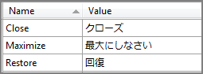
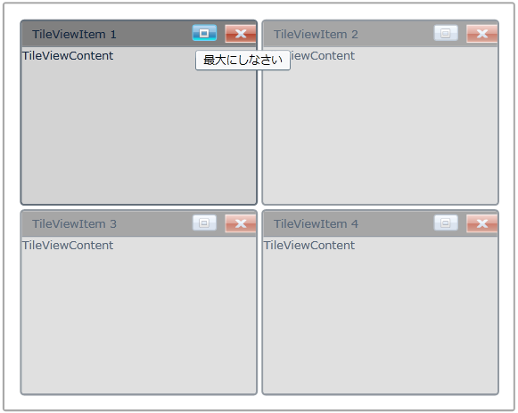

::: {style="DISPLAY: none"}
{#d2h_url_template}{#d2h_package_url style="WIDTH: 0px; DISPLAY: none; HEIGHT: 0px"}
:::

::: {.d2h_secondary_topic style="PADDING-BOTTOM: 10pt; MARGIN: 0pt; PADDING-LEFT: 0pt; PADDING-RIGHT: 0pt; PADDING-TOP: 0pt"}
#### Localization Support

Localization is the process of providing controls in different cultures, so that it will be easier for you to set their own culture. The easiest way to accomplish is to use Resource (.resx) file. For each local or culture that you wish to target, will need separate set of resources that match that specific local or culture.

Use Case Scenarios

This feature enables you to set your own culture for tooltip.

 

Adding Localization support to an Application

 

The following are the primary things to do for Localizing the Syncfusion TileViewControl.

 

[·      ]{style="FONT-FAMILY: Symbol"}Add Resources for different cultures

[·      ]{style="FONT-FAMILY: Symbol"}Add Supported Cultures

[·      ]{style="FONT-FAMILY: Symbol"}Assign Current UI Culture to the application

Add Resources

 

To localize Syncfusion Silverlight controls, you need to create resource files for each culture. The following things are to be done when localizing strings for any culture.

 

1.   Add Resource (resx) files in the Resources folder for different cultures. (Here, resx files in different cultures or invariant cultures should be placed in the *Resources* Folder of the project).

2.   Resource files should be named *AssemblyName.CultureName.resx*** **and AssemblyName.resx for invariant culture.

Where,

 

[·      ]{style="FONT-FAMILY: Symbol"}**AssemblyName** -- Syncfusion Silverlight Control Assembly Name.

[·      ]{style="FONT-FAMILY: Symbol"}**CultureName** -- Culture code of the resource that you want to show in UI. If the conversion is only for invariant culture, the .resx file does not need to contain a culture suffix.

For Example,

[·      ]{style="FONT-FAMILY: Symbol"}Syncfusion.Shared.Silverlight.Ja.resx -- Japanese resource for Syncfusion.Shared.Silverlight assembly.

[·      ]{style="FONT-FAMILY: Symbol"}Syncfusion.Shared.Silverlight.resx -- Invariant Culture resource for Syncfusion.Shared.Silverlight assembly.

 

Add Resources

 

Add supported cultures for a project is very important to be done in the sample application project before running the application.

 

1.   In the Solution Explorer, right-click sample application project and choose *Unload Project* from the Context menu. Then the project will be unavailable.

2.   Right-click the project again, and select the *Edit SampleProjectName.csproj* option.

3.   In the *.csproj* file, find the *\<SupportedCultures\>\</SupportedCultures\>* tags. By default, the tags will be empty. So, add the cultures that you want to be supported, separating each with a semicolon if many.

**For Example**: \<SupportedCultures\>Ja \</SupportedCultures\>

1.   Save the project and right-click the SampleProjectName.csproj to reload it.

2.   Choose *Reload SampleProjectName.csproj*.

In the .resx file, change the following values:

 

{border="0"}

 

Figure 867: SampleProjectName.csproj after setting value in Japanese culture

 

 

Assign Current UI Culture to the Application

 

By Default, Current Culture will be "en-US", you have to set the Current Culture before** **IntializeComponent in the StartUp page or you can do it in App.xaml.cs in the Application_Startup event.

 

 

+----------------------------------------------------------------------------------------------------------------------------------------------------------------------------------------------------------------------------+
| **[\[C#\]]{style="FONT-FAMILY: 'Courier New'"}**                                                                                                                                                                           |
|                                                                                                                                                                                                                            |
| [        public]{style="FONT-FAMILY: 'Courier New'; COLOR: blue"}[ MainPage()]{style="FONT-FAMILY: 'Courier New'"}                                                                                                         |
|                                                                                                                                                                                                                            |
| [        {]{style="FONT-FAMILY: 'Courier New'"}                                                                                                                                                                            |
|                                                                                                                                                                                                                            |
| [            System.Threading.[Thread]{style="COLOR: #2b91af"}.CurrentThread.CurrentUICulture = [new]{style="COLOR: blue"}]{style="FONT-FAMILY: 'Courier New'"}                                                            |
|                                                                                                                                                                                                                            |
| [                                  ]{style="FONT-FAMILY: 'Courier New'; COLOR: blue"}[ System.Globalization.[CultureInfo]{style="COLOR: #2b91af"}([\"Ja\"]{style="COLOR: #a31515"}); ]{style="FONT-FAMILY: 'Courier New'"} |
|                                                                                                                                                                                                                            |
| [            InitializeComponent();]{style="FONT-FAMILY: 'Courier New'"}                                                                                                                                                   |
|                                                                                                                                                                                                                            |
| [        }]{style="FONT-FAMILY: 'Courier New'"}                                                                                                                                                                            |
|                                                                                                                                                                                                                            |
|                                                                                                                                                                                                                            |
+----------------------------------------------------------------------------------------------------------------------------------------------------------------------------------------------------------------------------+

 

{border="0"}

Figure 868: ToolTip with Japanese culture

 

Sample Link

To view samples:

 

1.   Select Start -\> Programs -\> Syncfusion -\> Essential Studio x.x.xx -\> Dashboard.

2.   Select   Run Locally Installed Samples in Silverlight Button.

3.   Now expand the DragAndDropManagerDemo tree-view item in the Sample Browser.

4.   Choose any one of the samples listed under it to launch.

 

[]{#related-topics}
:::
