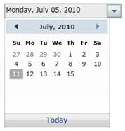

::: {style="DISPLAY: none"}
{#d2h_url_template}{#d2h_package_url style="WIDTH: 0px; DISPLAY: none; HEIGHT: 0px"}
:::

::: {.d2h_secondary_topic style="PADDING-BOTTOM: 10pt; MARGIN: 0pt; PADDING-LEFT: 0pt; PADDING-RIGHT: 0pt; PADDING-TOP: 0pt"}
#### []{#_Maximum_and_Minimum_1}Maximum and Minimum Value

 

Calendar control allows you to set start and end dates by using **MinDateTime** and **MaxDateTime** properties. The Calendar also displays only the dates between MinDateTime and MaxDateTime.

When MinDateTime is set and if the new MinDateTime property value is greater than the MaxDateTime property value, then MaxDateTime is set equal to MinDateTime. If **DateTime(**DateTime property) is less than new MinDateTime, then the  **DateTime** property is also set equal to the MinDateTime.

When MaxDateTime is set and if the **MinDateTime** property is greater than new MaxDateTime property, then the **MinDateTime** property value is set equal to the MaxDateTime. If the current **DateTime**(DateTime property) is greater than the new MaxDateTime, then the  DateTime property is set equal to the MaxDateTime.

+------------------------------------------------------------------------------------------------------------------------------------------------------------------------------------------------------------------------------------------------------------------------------------------------------------------------------------------------------------------------------------------------------------------------------------------------------------------------------------------------------------------------------------------------------------------------------------------------------------------------------------------------------------------------------------------------------------------------------------------------------------------------+
| [XAML]{style="FONT-FAMILY: 'Courier New'"}                                                                                                                                                                                                                                                                                                                                                                                                                                                                                                                                                                                                                                                                                                                             |
+------------------------------------------------------------------------------------------------------------------------------------------------------------------------------------------------------------------------------------------------------------------------------------------------------------------------------------------------------------------------------------------------------------------------------------------------------------------------------------------------------------------------------------------------------------------------------------------------------------------------------------------------------------------------------------------------------------------------------------------------------------------------+
| [\<]{style="FONT-FAMILY: 'Courier New'; COLOR: blue"}[syncfusion]{style="FONT-FAMILY: 'Courier New'; COLOR: #a31515"}[:]{style="FONT-FAMILY: 'Courier New'; COLOR: blue"}[DateTimeEdit]{style="FONT-FAMILY: 'Courier New'; COLOR: #a31515"}[ x]{style="FONT-FAMILY: 'Courier New'; COLOR: red"}[:]{style="FONT-FAMILY: 'Courier New'; COLOR: blue"}[Name]{style="FONT-FAMILY: 'Courier New'; COLOR: red"}[=\"dateTimeEdit\"]{style="FONT-FAMILY: 'Courier New'; COLOR: blue"}[ Height]{style="FONT-FAMILY: 'Courier New'; COLOR: red"}[=\"25\"]{style="FONT-FAMILY: 'Courier New'; COLOR: blue"}[ Width]{style="FONT-FAMILY: 'Courier New'; COLOR: red"}[=\"200\"]{style="FONT-FAMILY: 'Courier New'; COLOR: blue"}[ ]{style="FONT-FAMILY: 'Courier New'; COLOR: red"} |
|                                                                                                                                                                                                                                                                                                                                                                                                                                                                                                                                                                                                                                                                                                                                                                        |
| [                         DateTime]{style="FONT-FAMILY: 'Courier New'; COLOR: red"}[=\"07/05/2010\"]{style="FONT-FAMILY: 'Courier New'; COLOR: blue"}[ Pattern]{style="FONT-FAMILY: 'Courier New'; COLOR: red"}[=\"LongDate\"]{style="FONT-FAMILY: 'Courier New'; COLOR: blue"}[ ]{style="FONT-FAMILY: 'Courier New'"}                                                                                                                                                                                                                                                                                                                                                                                                                                                 |
|                                                                                                                                                                                                                                                                                                                                                                                                                                                                                                                                                                                                                                                                                                                                                                        |
| [                         [MinDateTime]{style="COLOR: red"}[=\"01/01/2010\"]{style="COLOR: blue"}[ MaxDateTime]{style="COLOR: red"}[=\"07/15/2010\"/\>]{style="COLOR: blue"}]{style="FONT-FAMILY: 'Courier New'"}                                                                                                                                                                                                                                                                                                                                                                                                                                                                                                                                                      |
+------------------------------------------------------------------------------------------------------------------------------------------------------------------------------------------------------------------------------------------------------------------------------------------------------------------------------------------------------------------------------------------------------------------------------------------------------------------------------------------------------------------------------------------------------------------------------------------------------------------------------------------------------------------------------------------------------------------------------------------------------------------------+

[]{style="FONT-FAMILY: 'Courier New'"} 

+----------------------------------------------------------------------------------------------------------------------------------------------------------------------------------------------+
| [C#]{style="FONT-FAMILY: 'Courier New'"}                                                                                                                                                     |
+----------------------------------------------------------------------------------------------------------------------------------------------------------------------------------------------+
| [DateTimeEdit]{style="FONT-FAMILY: 'Courier New'; COLOR: #2b91af"}[ dateTimeEdit = [new]{style="COLOR: blue"} [DateTimeEdit]{style="COLOR: #2b91af"}();]{style="FONT-FAMILY: 'Courier New'"} |
|                                                                                                                                                                                              |
| [dateTimeEdit.Width = 200;]{style="FONT-FAMILY: 'Courier New'"}                                                                                                                              |
|                                                                                                                                                                                              |
| [dateTimeEdit.Height = 25;]{style="FONT-FAMILY: 'Courier New'"}                                                                                                                              |
|                                                                                                                                                                                              |
| [dateTimeEdit.DateTime = [new]{style="COLOR: blue"} [DateTime]{style="COLOR: #2b91af"}(2010, 07, 05);]{style="FONT-FAMILY: 'Courier New'"}                                                   |
|                                                                                                                                                                                              |
| [dateTimeEdit.MinDateTime = [new]{style="COLOR: blue"} [DateTime]{style="COLOR: #2b91af"}(2010, 01, 01);]{style="FONT-FAMILY: 'Courier New'"}                                                |
|                                                                                                                                                                                              |
| [dateTimeEdit.MaxDateTime = [new]{style="COLOR: blue"} [DateTime]{style="COLOR: #2b91af"}(2010, 07, 15);]{style="FONT-FAMILY: 'Courier New'"}                                                |
|                                                                                                                                                                                              |
| [dateTimeEdit.Pattern = [DateTimePattern]{style="COLOR: #2b91af"}.LongDate;]{style="FONT-FAMILY: 'Courier New'"}                                                                             |
|                                                                                                                                                                                              |
| [this]{style="FONT-FAMILY: 'Courier New'; COLOR: blue"}[.LayoutRoot.Children.Add(dateTimeEdit);]{style="FONT-FAMILY: 'Courier New'"}                                                         |
+----------------------------------------------------------------------------------------------------------------------------------------------------------------------------------------------+

 

{border="0"}

Figure 433: MinDateTime and MaxDateTime

In this, Calendar also displays only the range of dates between MinDateTime and MaxDateTime.

[]{#related-topics}
:::
