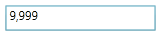

::: {style="DISPLAY: none"}
{#d2h_url_template}{#d2h_package_url style="WIDTH: 0px; DISPLAY: none; HEIGHT: 0px"}
:::

:::: {.d2h_secondary_topic style="PADDING-BOTTOM: 10pt; MARGIN: 0pt; PADDING-LEFT: 0pt; PADDING-RIGHT: 0pt; PADDING-TOP: 0pt"}
##### []{#_MaxValueOnExceedMaxDigit}MaxValueOnExceedMaxDigit

If this property is set to true, then when the user enters a value greater than the MaxValue then it will automatically assign the MaxValue to the Value property. Otherwise it will restrict the user.

::: {style="BORDER-BOTTOM: windowtext 1pt solid; BORDER-LEFT: medium none; PADDING-BOTTOM: 1pt; MARGIN-TOP: 9pt; PADDING-LEFT: 0pt; PADDING-RIGHT: 0pt; MARGIN-BOTTOM: 9pt; BORDER-TOP: windowtext 1pt solid; BORDER-RIGHT: medium none; PADDING-TOP: 1pt"}
{border="0"}Note: This will be enabled only when MaxValidation set to OnKeyPress.
:::

+----------------------------------------------------------------------------------------------------------------------------------------------------------------------------------------------------------------------------------------------------------------------------------------------------------------------------------------------------------------------------------------------------------------------------------------------------------------------------------------------------------------------------------------------------------------------------------------------------------------------------------------------------------------------------------------------------------------------------------------------------------------+
| **[\[XAML\]]{style="FONT-FAMILY: 'Courier New'"}**                                                                                                                                                                                                                                                                                                                                                                                                                                                                                                                                                                                                                                                                                                             |
|                                                                                                                                                                                                                                                                                                                                                                                                                                                                                                                                                                                                                                                                                                                                                                |
| **[]{style="FONT-FAMILY: 'Courier New'"}**                                                                                                                                                                                                                                                                                                                                                                                                                                                                                                                                                                                                                                                                                                                     |
|                                                                                                                                                                                                                                                                                                                                                                                                                                                                                                                                                                                                                                                                                                                                                                |
| [\<]{style="FONT-FAMILY: 'Courier New'; COLOR: blue"}[syncfusion]{style="FONT-FAMILY: 'Courier New'; COLOR: #a31515"}[:]{style="FONT-FAMILY: 'Courier New'; COLOR: blue"}[IntegerTextBox]{style="FONT-FAMILY: 'Courier New'; COLOR: #a31515"}[ x]{style="FONT-FAMILY: 'Courier New'; COLOR: red"}[:]{style="FONT-FAMILY: 'Courier New'; COLOR: blue"}[Name]{style="FONT-FAMILY: 'Courier New'; COLOR: red"}[=\"integerTextBox\"]{style="FONT-FAMILY: 'Courier New'; COLOR: blue"}[ Height]{style="FONT-FAMILY: 'Courier New'; COLOR: red"}[=\"25\"]{style="FONT-FAMILY: 'Courier New'; COLOR: blue"}[ Width]{style="FONT-FAMILY: 'Courier New'; COLOR: red"}[=\"150\"]{style="FONT-FAMILY: 'Courier New'; COLOR: blue"}[ ]{style="FONT-FAMILY: 'Courier New'"} |
|                                                                                                                                                                                                                                                                                                                                                                                                                                                                                                                                                                                                                                                                                                                                                                |
| [                           [ MinValue]{style="COLOR: red"}[=\"-999\"]{style="COLOR: blue"}[ MaxValue]{style="COLOR: red"}[=\"999\"]{style="COLOR: blue"} ]{style="FONT-FAMILY: 'Courier New'"}                                                                                                                                                                                                                                                                                                                                                                                                                                                                                                                                                                |
|                                                                                                                                                                                                                                                                                                                                                                                                                                                                                                                                                                                                                                                                                                                                                                |
| [                           [ MinValidation]{style="COLOR: red"}[=\"OnKeyPress\"]{style="COLOR: blue"}[ MaxValidation]{style="COLOR: red"}[=\"OnLostFocus\"]{style="COLOR: blue"}]{style="FONT-FAMILY: 'Courier New'"}                                                                                                                                                                                                                                                                                                                                                                                                                                                                                                                                         |
|                                                                                                                                                                                                                                                                                                                                                                                                                                                                                                                                                                                                                                                                                                                                                                |
| [                           [ MinValueOnExceedMinDigit]{style="COLOR: red"}[=\"True\"]{style="COLOR: blue"}[ ]{style="COLOR: red"}]{style="FONT-FAMILY: 'Courier New'"}                                                                                                                                                                                                                                                                                                                                                                                                                                                                                                                                                                                        |
|                                                                                                                                                                                                                                                                                                                                                                                                                                                                                                                                                                                                                                                                                                                                                                |
| [                            MaxValueOnExceedMaxDigit]{style="FONT-FAMILY: 'Courier New'; COLOR: red"}[=\"True\"/\>]{style="FONT-FAMILY: 'Courier New'; COLOR: blue"}**[]{style="FONT-FAMILY: 'Courier New'"}**                                                                                                                                                                                                                                                                                                                                                                                                                                                                                                                                                |
+----------------------------------------------------------------------------------------------------------------------------------------------------------------------------------------------------------------------------------------------------------------------------------------------------------------------------------------------------------------------------------------------------------------------------------------------------------------------------------------------------------------------------------------------------------------------------------------------------------------------------------------------------------------------------------------------------------------------------------------------------------------+

[]{style="FONT-FAMILY: 'Courier New'"} 

+----------------------------------------------------------------------------------------------------------------------------------------------------------------------------------------------------------------------------+
| **[\[C#\]]{style="FONT-FAMILY: 'Courier New'"}**                                                                                                                                                                           |
|                                                                                                                                                                                                                            |
| []{style="FONT-FAMILY: 'Courier New'"}                                                                                                                                                                                     |
|                                                                                                                                                                                                                            |
| [Syncfusion.Windows.Shared.[IntegerTextBox]{style="COLOR: #2b91af"} integerTextBox = [new]{style="COLOR: blue"} Syncfusion.Windows.Shared.[IntegerTextBox]{style="COLOR: #2b91af"}();]{style="FONT-FAMILY: 'Courier New'"} |
|                                                                                                                                                                                                                            |
| [integerTextBox.Width = 150;]{style="FONT-FAMILY: 'Courier New'"}                                                                                                                                                          |
|                                                                                                                                                                                                                            |
| [integerTextBox.Height = 25;]{style="FONT-FAMILY: 'Courier New'"}                                                                                                                                                          |
|                                                                                                                                                                                                                            |
| [integerTextBox.MinValue = -999;]{style="FONT-FAMILY: 'Courier New'"}                                                                                                                                                      |
|                                                                                                                                                                                                                            |
| [integerTextBox.MaxValue = 999;]{style="FONT-FAMILY: 'Courier New'"}                                                                                                                                                       |
|                                                                                                                                                                                                                            |
| [integerTextBox.MinValidation = Syncfusion.Windows.Shared.[MinValidation]{style="COLOR: #2b91af"}.OnKeyPress;]{style="FONT-FAMILY: 'Courier New'"}                                                                         |
|                                                                                                                                                                                                                            |
| [integerTextBox.MaxValidation = Syncfusion.Windows.Shared.[MaxValidation]{style="COLOR: #2b91af"}.OnLostFocus;]{style="FONT-FAMILY: 'Courier New'"}                                                                        |
|                                                                                                                                                                                                                            |
| [integerTextBox.MinValueOnExceedMinDigit = [true]{style="COLOR: blue"};]{style="FONT-FAMILY: 'Courier New'"}                                                                                                               |
|                                                                                                                                                                                                                            |
| [integerTextBox.MaxValueOnExceedMaxDigit = [true]{style="COLOR: blue"};]{style="FONT-FAMILY: 'Courier New'"}                                                                                                               |
+----------------------------------------------------------------------------------------------------------------------------------------------------------------------------------------------------------------------------+

[]{style="FONT-FAMILY: 'Calibri','sans-serif'; FONT-SIZE: 11pt"} 

Initially, there no value is assigned to the integer textbox. So it displays the default value as Zero.

{border="0"}

Figure 150: The default value as Zero

MaxValidation is set to OnLostFocus, so the MaxValidation will performed only in the lost focus.

{border="0"}

Figure 151: MaxValidation

MinValidation is set to OnKeyPress, so the user cannot enter a value less than the MinValue. If users try to enter a value less than the MinValue, then the MinValue will be set to Value property as MinValueOnExceedMinDigit set to true.

{border="0"}

Figure 152: MinValidation

 

See Also

[Nullvalue support]{.UGHyperlink}[]{.UGHyperlink}

[Culture and NumberFormats]{.UGHyperlink}[]{.UGHyperlink}

[]{style="FONT-FAMILY: 'Calibri','sans-serif'; FONT-SIZE: 11pt"} 

[]{#related-topics}
::::
