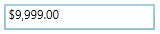

::: {style="DISPLAY: none"}
{#d2h_url_template}{#d2h_package_url style="WIDTH: 0px; DISPLAY: none; HEIGHT: 0px"}
:::

:::: {.d2h_secondary_topic style="PADDING-BOTTOM: 10pt; MARGIN: 0pt; PADDING-LEFT: 0pt; PADDING-RIGHT: 0pt; PADDING-TOP: 0pt"}
##### []{#_MaxValueOnExceedMaxDigit_1}MaxValueOnExceedMaxDigit

If this property set to true, then when user enters the value greater than the MaxValue then it will automatically assign MaxValue to Value property. Otherwise it will restrict the user.

 

::: {style="BORDER-BOTTOM: windowtext 1pt solid; BORDER-LEFT: medium none; PADDING-BOTTOM: 1pt; MARGIN-TOP: 9pt; PADDING-LEFT: 0pt; PADDING-RIGHT: 0pt; MARGIN-BOTTOM: 9pt; BORDER-TOP: windowtext 1pt solid; BORDER-RIGHT: medium none; PADDING-TOP: 1pt"}
{border="0"}Note: This will be enabled only when MaxValidation set to OnKeyPress.
:::

+------------------------------------------------------------------------------------------------------------------------------------------------------------------------------------------------------------------------------------------------------------------------------------------------------------------------------------------------------------------------------------------------------------------------------------------------------------------------------------------------------------------------------------------------------------------------------------------------------------------------------------------------------------------------------------------------------------------------------------------------------------------+
| [XAML]{style="FONT-FAMILY: 'Courier New'"}                                                                                                                                                                                                                                                                                                                                                                                                                                                                                                                                                                                                                                                                                                                       |
+------------------------------------------------------------------------------------------------------------------------------------------------------------------------------------------------------------------------------------------------------------------------------------------------------------------------------------------------------------------------------------------------------------------------------------------------------------------------------------------------------------------------------------------------------------------------------------------------------------------------------------------------------------------------------------------------------------------------------------------------------------------+
| [\<]{style="FONT-FAMILY: 'Courier New'; COLOR: blue"}[syncfusion]{style="FONT-FAMILY: 'Courier New'; COLOR: #a31515"}[:]{style="FONT-FAMILY: 'Courier New'; COLOR: blue"}[CurrencyTextBox]{style="FONT-FAMILY: 'Courier New'; COLOR: #a31515"}[ x]{style="FONT-FAMILY: 'Courier New'; COLOR: red"}[:]{style="FONT-FAMILY: 'Courier New'; COLOR: blue"}[Name]{style="FONT-FAMILY: 'Courier New'; COLOR: red"}[=\"currencyTextBox\"]{style="FONT-FAMILY: 'Courier New'; COLOR: blue"}[ Height]{style="FONT-FAMILY: 'Courier New'; COLOR: red"}[=\"25\"]{style="FONT-FAMILY: 'Courier New'; COLOR: blue"}[ Width]{style="FONT-FAMILY: 'Courier New'; COLOR: red"}[=\"150\"]{style="FONT-FAMILY: 'Courier New'; COLOR: blue"}[ ]{style="FONT-FAMILY: 'Courier New'"} |
|                                                                                                                                                                                                                                                                                                                                                                                                                                                                                                                                                                                                                                                                                                                                                                  |
| [                           [ MinValue]{style="COLOR: red"}[=\"-999\"]{style="COLOR: blue"}[ MaxValue]{style="COLOR: red"}[=\"999\"]{style="COLOR: blue"} ]{style="FONT-FAMILY: 'Courier New'"}                                                                                                                                                                                                                                                                                                                                                                                                                                                                                                                                                                  |
|                                                                                                                                                                                                                                                                                                                                                                                                                                                                                                                                                                                                                                                                                                                                                                  |
| [                           [ MinValidation]{style="COLOR: red"}[=\"OnKeyPress\"]{style="COLOR: blue"}[ MaxValidation]{style="COLOR: red"}[=\"OnLostFocus\"]{style="COLOR: blue"}]{style="FONT-FAMILY: 'Courier New'"}                                                                                                                                                                                                                                                                                                                                                                                                                                                                                                                                           |
|                                                                                                                                                                                                                                                                                                                                                                                                                                                                                                                                                                                                                                                                                                                                                                  |
| [                           [ MinValueOnExceedMinDigit]{style="COLOR: red"}[=\"True\"]{style="COLOR: blue"} ]{style="FONT-FAMILY: 'Courier New'"}                                                                                                                                                                                                                                                                                                                                                                                                                                                                                                                                                                                                                |
|                                                                                                                                                                                                                                                                                                                                                                                                                                                                                                                                                                                                                                                                                                                                                                  |
| [                           [ MaxValueOnExceedMaxDigit]{style="COLOR: red"}[=\"True\"/\>]{style="COLOR: blue"}]{style="FONT-FAMILY: 'Courier New'"}                                                                                                                                                                                                                                                                                                                                                                                                                                                                                                                                                                                                              |
+------------------------------------------------------------------------------------------------------------------------------------------------------------------------------------------------------------------------------------------------------------------------------------------------------------------------------------------------------------------------------------------------------------------------------------------------------------------------------------------------------------------------------------------------------------------------------------------------------------------------------------------------------------------------------------------------------------------------------------------------------------------+

[]{style="FONT-FAMILY: 'Courier New'"} 

+---------------------------------------------------------------------------------------------------------------------------------------------------------+
| [C#]{style="FONT-FAMILY: 'Courier New'"}                                                                                                                |
+---------------------------------------------------------------------------------------------------------------------------------------------------------+
| [Syncfusion.Windows.Shared.[CurrencyTextBox]{style="COLOR: #2b91af"} currencyTextBox = [new]{style="COLOR: blue"} ]{style="FONT-FAMILY: 'Courier New'"} |
|                                                                                                                                                         |
| [                          Syncfusion.Windows.Shared.[CurrencyTextBox]{style="COLOR: #2b91af"}();]{style="FONT-FAMILY: 'Courier New'"}                  |
|                                                                                                                                                         |
| [currencyTextBox.Width = 100;]{style="FONT-FAMILY: 'Courier New'"}                                                                                      |
|                                                                                                                                                         |
| [currencyTextBox.Height = 25;]{style="FONT-FAMILY: 'Courier New'"}                                                                                      |
|                                                                                                                                                         |
| [currencyTextBox.MinValue = -999;]{style="FONT-FAMILY: 'Courier New'"}                                                                                  |
|                                                                                                                                                         |
| [currencyTextBox.MaxValue = 999;]{style="FONT-FAMILY: 'Courier New'"}                                                                                   |
|                                                                                                                                                         |
| [currencyTextBox.MinValidation = Syncfusion.Windows.Shared.[MinValidation]{style="COLOR: #2b91af"}.OnKeyPress;]{style="FONT-FAMILY: 'Courier New'"}     |
|                                                                                                                                                         |
| [currencyTextBox.MaxValidation = Syncfusion.Windows.Shared.[MaxValidation]{style="COLOR: #2b91af"}.OnLostFocus;]{style="FONT-FAMILY: 'Courier New'"}    |
|                                                                                                                                                         |
| [currencyTextBox.MinValueOnExceedMinDigit = [true]{style="COLOR: blue"};]{style="FONT-FAMILY: 'Courier New'"}                                           |
|                                                                                                                                                         |
| [currencyTextBox.MaxValueOnExceedMaxDigit = [true]{style="COLOR: blue"};]{style="FONT-FAMILY: 'Courier New'"}                                           |
+---------------------------------------------------------------------------------------------------------------------------------------------------------+

 

Initially there no value is assigned to CurrencyTextBox. So it displays default value as Zero.

{border="0"}

Figure 277: default value = Zero

 

MaxValidation set to OnLostFocus, So MaxValidation will performed only in the lost focus.

{border="0"}

Figure 278: MaxValidation

 

When MinValidation set to OnKeyPress, so you should not enter less than MinValue. If you try to enter value less than MinValue, then MinValue will be set to **Value** property if MinValueOnExceedMinDigit is set to True, else it does not allow the key press.

{border="0"}

Figure 279: MinValidation

[]{#related-topics}
::::
