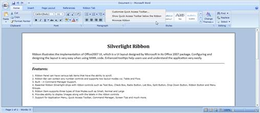
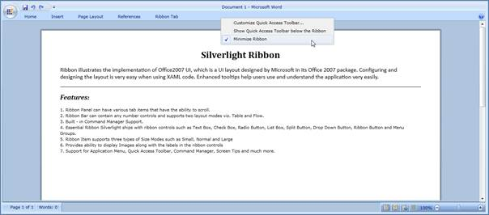
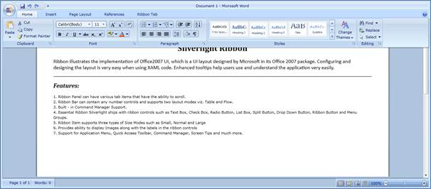

::: {style="DISPLAY: none"}
{#d2h_url_template}{#d2h_package_url style="WIDTH: 0px; DISPLAY: none; HEIGHT: 0px"}
:::

::: {.d2h_secondary_topic style="PADDING-BOTTOM: 10pt; MARGIN: 0pt; PADDING-LEFT: 0pt; PADDING-RIGHT: 0pt; PADDING-TOP: 0pt"}
#### Minimize Ribbon

The Ribbon Control can be minimized if necessary. So that the Ribbon tab headers are only visible in the UI.

The Context menu will be displayed by right-clicking on the Ribbon control. There you can find the Minimize Ribbon, which is used to hide the Ribbon control.

{border="0"}

Figure 644: Context Menu with Minimize Ribbon

The Ribbon can be minimized in code as like below in xaml and C#,

+--------------------------------------------------------------------------------------------------------------------------------------------------------------------------------------------------------------------------------------------------------------------------------------------------------------------------------------------------------------------------------------------------------------------------------------------------------------------------------------------------------------------------------------------------------------------------------------------------------------------------------------------------------------------------------+
| **[XAML[]{style="COLOR: blue"}]{style="FONT-FAMILY: 'Courier New'"}**                                                                                                                                                                                                                                                                                                                                                                                                                                                                                                                                                                                                          |
|                                                                                                                                                                                                                                                                                                                                                                                                                                                                                                                                                                                                                                                                                |
| []{style="FONT-FAMILY: 'Courier New'; COLOR: blue"}                                                                                                                                                                                                                                                                                                                                                                                                                                                                                                                                                                                                                            |
|                                                                                                                                                                                                                                                                                                                                                                                                                                                                                                                                                                                                                                                                                |
| [\<]{style="FONT-FAMILY: 'Courier New'; COLOR: blue"}[syncfusion]{style="FONT-FAMILY: 'Courier New'; COLOR: #a31515"}[:]{style="FONT-FAMILY: 'Courier New'; COLOR: blue"}[Ribbon]{style="FONT-FAMILY: 'Courier New'; COLOR: #a31515"}[ Title]{style="FONT-FAMILY: 'Courier New'; COLOR: red"}[=\"Document 1 -- Microsoft Word\"]{style="FONT-FAMILY: 'Courier New'; COLOR: blue"}[ Name]{style="FONT-FAMILY: 'Courier New'; COLOR: red"}[=\"myRibbon\"]{style="FONT-FAMILY: 'Courier New'; COLOR: blue"}[ RIbbonState]{style="FONT-FAMILY: 'Courier New'; COLOR: red"}[=\"Hide\" \>...]{style="FONT-FAMILY: 'Courier New'; COLOR: blue"}[]{style="FONT-FAMILY: 'Courier New'"} |
+--------------------------------------------------------------------------------------------------------------------------------------------------------------------------------------------------------------------------------------------------------------------------------------------------------------------------------------------------------------------------------------------------------------------------------------------------------------------------------------------------------------------------------------------------------------------------------------------------------------------------------------------------------------------------------+

[]{style="FONT-FAMILY: 'Calibri','sans-serif'"} 

+------------------------------------------------------------------------------------------------------------------------------------------+
| [C#[]{style="COLOR: #2b91af"}]{style="FONT-FAMILY: 'Courier New'"}                                                                       |
|                                                                                                                                          |
| []{style="FONT-FAMILY: 'Courier New'; COLOR: #2b91af"}                                                                                   |
|                                                                                                                                          |
| [Ribbon]{style="FONT-FAMILY: 'Courier New'; COLOR: #2b91af"}[ myRibbon = [new]{style="COLOR: blue"} [Ribbon]{style="COLOR: #2b91af"}();\ |
| myRibbon.RibbonState = [RibbonState]{style="COLOR: #2b91af"}.Hide;]{style="FONT-FAMILY: 'Courier New'"}                                  |
+------------------------------------------------------------------------------------------------------------------------------------------+

[]{style="FONT-FAMILY: 'Calibri','sans-serif'"} 

The Ribbon can be shown either by double clicking any Ribbon tab or clicking the  Minimize Ribbon from the Context menu.

{border="0"}

Figure 645: Ribbon Minimized

By clicking on any Ribbon tab while the Ribbon is in Hide state, the ribbon can be shown in the popup, which is called as Adorner state. The following figure displays how the adorner state will be shown for a Ribbon control.

{border="0"}

Figure 646: Adorner state - Ribbon

[]{#related-topics}
:::
