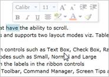
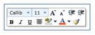
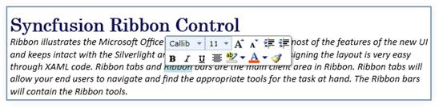

::: {style="DISPLAY: none"}
{#d2h_url_template}{#d2h_package_url style="WIDTH: 0px; DISPLAY: none; HEIGHT: 0px"}
:::

:::: {.d2h_secondary_topic style="PADDING-BOTTOM: 10pt; MARGIN: 0pt; PADDING-LEFT: 0pt; PADDING-RIGHT: 0pt; PADDING-TOP: 0pt"}
##### Mini Toolbar

The Ribbon instance ships with built-in MiniToolbar. The MiniToolbar facilitates the users to perform most of the formatting operations easily.

###### Members

The MiniToolbar class exposes the following members[:]{style="FONT-FAMILY: 'Calibri','sans-serif'"}

1.1.1.1.1.1.48     Properties

 

  ------------------ ----------- ------------------ ---------------------------------------------------------------------------------------------------------------------------------------- --------------- -----------------------------------------------------------------------------------------------------------------------------
  Name               Type        Value it accepts   Description                                                                                                                              Default Value   Reference Link
  Range              Double      double             Used to hide the Mini toolbar when crossing the distance of the Range value and it shows again if the cursor comes in the range value.   40.00           [Orientation]{style="FONT-FAMILY: 'Calibri','sans-serif'; COLOR: blue"}[]{style="FONT-FAMILY: 'Calibri','sans-serif'"}
  HorizontalOffset   Double      double             The horizontal distance between the target origin and the mini toolbar\'s popup alignment point.                                         0.00            [HorizontalOffset]{style="FONT-FAMILY: 'Calibri','sans-serif'; COLOR: blue"}[]{style="FONT-FAMILY: 'Calibri','sans-serif'"}
  VerticalOffset     Double      double             The vertical distance between the target origin and the mini toolbar\'s popup alignment point.                                           0.00            [VerticalOffset]{style="FONT-FAMILY: 'Calibri','sans-serif'; COLOR: blue"}[]{style="FONT-FAMILY: 'Calibri','sans-serif'"}
  Target             UIElement   UIElement          Used to set the target for the Mini toolbar                                                                                              null            [Target]{style="FONT-FAMILY: 'Calibri','sans-serif'; COLOR: blue"}[]{style="FONT-FAMILY: 'Calibri','sans-serif'"}
  IsOpen             Boolean     True or False      Used to Show / Hide Mini Toolbar                                                                                                         false           [IsOpen]{style="FONT-FAMILY: 'Calibri','sans-serif'; COLOR: blue"}[]{style="FONT-FAMILY: 'Calibri','sans-serif'"}
  ------------------ ----------- ------------------ ---------------------------------------------------------------------------------------------------------------------------------------- --------------- -----------------------------------------------------------------------------------------------------------------------------

1.1.1.1.1.1.49     Events

  ------------------------- ------------------------- ------------------------------------ -------------------------------------- --------------------------------------------------------------------------------------------------------------------------------------
  Name                      Event Type                Event Args Parameter                 Description                            Reference Link
  RangeChanged              PropertyChangedCallback   DependencyPropertyChangedEventArgs   Occurs when Range changes              [Range Changed]{style="FONT-FAMILY: 'Calibri','sans-serif'; COLOR: blue"}[]{style="FONT-FAMILY: 'Calibri','sans-serif'"}
  HorizontalOffsetChanged   PropertyChangedCallback   DependencyPropertyChangedEventArgs   Occurs when Horizontal Offset changs   [Horizontal Offset Changed]{style="FONT-FAMILY: 'Calibri','sans-serif'; COLOR: blue"}[]{style="FONT-FAMILY: 'Calibri','sans-serif'"}
  VerticalOffsetChanged     PropertyChangedCallback   DependencyPropertyChangedEventArgs   Occurs when Vertical Offset changes    [Vertical Offset Changed]{style="FONT-FAMILY: 'Calibri','sans-serif'; COLOR: blue"}[]{style="FONT-FAMILY: 'Calibri','sans-serif'"}
  TargetChanged             PropertyChangedCallback   DependencyPropertyChangedEventArgs   Occurs when Target UIElement changes   [Target Changed]{style="FONT-FAMILY: 'Calibri','sans-serif'; COLOR: blue"}[]{style="FONT-FAMILY: 'Calibri','sans-serif'"}
  IsOpenedChanged           PropertyChangedCallback   DependencyPropertyChangedEventArgs   Occurs when IsOpen property changes    [IsOpenedChanged]{style="FONT-FAMILY: 'Calibri','sans-serif'; COLOR: blue"}[]{style="FONT-FAMILY: 'Calibri','sans-serif'"}
  ------------------------- ------------------------- ------------------------------------ -------------------------------------- --------------------------------------------------------------------------------------------------------------------------------------

[]{style="FONT-FAMILY: 'Calibri','sans-serif'"} 

1.1.1.1.1.1.49.1  RangeChanged

The Event raises when the range valuechanges.

+--------------------------------------------------------------------------------------------------------------------------------------------------------------------------------------------------------------------------------------------------------------------------------------------------------------------------------------------------------------------------------------------------------------------------------------------------------------------------------------------------------------------------------------------------------------------------------------------------+
| **[XAML]{style="FONT-FAMILY: 'Courier New'"}**[]{style="FONT-FAMILY: 'Courier New'; COLOR: blue"}                                                                                                                                                                                                                                                                                                                                                                                                                                                                                                |
|                                                                                                                                                                                                                                                                                                                                                                                                                                                                                                                                                                                                  |
| []{style="FONT-FAMILY: 'Courier New'; COLOR: blue"}                                                                                                                                                                                                                                                                                                                                                                                                                                                                                                                                              |
|                                                                                                                                                                                                                                                                                                                                                                                                                                                                                                                                                                                                  |
| [\<]{style="FONT-FAMILY: 'Courier New'; COLOR: blue"}[syncfusion]{style="FONT-FAMILY: 'Courier New'; COLOR: #a31515"}[:]{style="FONT-FAMILY: 'Courier New'; COLOR: blue"}[MiniToolbar]{style="FONT-FAMILY: 'Courier New'; COLOR: #a31515"}[ x]{style="FONT-FAMILY: 'Courier New'; COLOR: red"}[:]{style="FONT-FAMILY: 'Courier New'; COLOR: blue"}[Name]{style="FONT-FAMILY: 'Courier New'; COLOR: red"}[=\"mtbar\"]{style="FONT-FAMILY: 'Courier New'; COLOR: blue"}[ [RangeChanged]{style="COLOR: red"}[=\"mtbar_RangeChanged\" /\>]{style="COLOR: blue"}]{style="FONT-FAMILY: 'Courier New'"} |
+--------------------------------------------------------------------------------------------------------------------------------------------------------------------------------------------------------------------------------------------------------------------------------------------------------------------------------------------------------------------------------------------------------------------------------------------------------------------------------------------------------------------------------------------------------------------------------------------------+

 

+---------------------------------------------------------------------------------------------------------------------------------------------------------------------------------------------------------------------------+
| **[C#]{style="FONT-FAMILY: 'Courier New'"}**[]{style="FONT-FAMILY: 'Courier New'; COLOR: #2b91af"}                                                                                                                        |
|                                                                                                                                                                                                                           |
| []{style="FONT-FAMILY: 'Courier New'; COLOR: #2b91af"}                                                                                                                                                                    |
|                                                                                                                                                                                                                           |
| [MiniToolbar]{style="FONT-FAMILY: 'Courier New'; COLOR: #2b91af"}[ mtbar = [new]{style="COLOR: blue"} [MiniToolbar]{style="COLOR: #2b91af"}();\                                                                           |
| mtbar.RangeChanged +=[new]{style="COLOR: blue"} [PropertyChangedCallback]{style="COLOR: #2b91af"}(mtbar_RangeChanged);]{style="FONT-FAMILY: 'Courier New'"}                                                               |
|                                                                                                                                                                                                                           |
| []{style="FONT-FAMILY: 'Courier New'"}                                                                                                                                                                                    |
|                                                                                                                                                                                                                           |
| [private]{style="FONT-FAMILY: 'Courier New'; COLOR: blue"}[ [void]{style="COLOR: blue"} mtbar_RangeChanged([DependencyObject]{style="COLOR: #2b91af"} d, [DependencyPropertyChangedEventArgs]{style="COLOR: #2b91af"} e)\ |
| {\                                                                                                                                                                                                                        |
|    [//Occurs when Range value is changed]{style="COLOR: green"}\                                                                                                                                                          |
| }]{style="FONT-FAMILY: 'Courier New'"}                                                                                                                                                                                    |
+---------------------------------------------------------------------------------------------------------------------------------------------------------------------------------------------------------------------------+

 

[]{style="FONT-FAMILY: 'Calibri','sans-serif'"} 

[]{#_HorizontalOffsetChanged}1.1.1.1.1.1.49.2  HorizontalOffsetChanged

The Event rises when the HorizontalOffsetChanged valuechanges.

+-------------------------------------------------------------------------------------------------------------------------------------------------------------------------------------------------------------------------------------------------------------------------------------------------------------------------------------------------------------------------------------------------------------------------------------------------------------------------------------------------------------------------------------------------------------------------------------------------------------------------+
| **[XAML]{style="FONT-FAMILY: 'Courier New'"}**[]{style="FONT-FAMILY: 'Courier New'; COLOR: blue"}                                                                                                                                                                                                                                                                                                                                                                                                                                                                                                                       |
|                                                                                                                                                                                                                                                                                                                                                                                                                                                                                                                                                                                                                         |
| []{style="FONT-FAMILY: 'Courier New'; COLOR: blue"}                                                                                                                                                                                                                                                                                                                                                                                                                                                                                                                                                                     |
|                                                                                                                                                                                                                                                                                                                                                                                                                                                                                                                                                                                                                         |
| [\<]{style="FONT-FAMILY: 'Courier New'; COLOR: blue"}[syncfusion]{style="FONT-FAMILY: 'Courier New'; COLOR: #a31515"}[:]{style="FONT-FAMILY: 'Courier New'; COLOR: blue"}[MiniToolbar]{style="FONT-FAMILY: 'Courier New'; COLOR: #a31515"}[ x]{style="FONT-FAMILY: 'Courier New'; COLOR: red"}[:]{style="FONT-FAMILY: 'Courier New'; COLOR: blue"}[Name]{style="FONT-FAMILY: 'Courier New'; COLOR: red"}[=\"mtbar\"]{style="FONT-FAMILY: 'Courier New'; COLOR: blue"}[ [HorizontalOffsetChanged]{style="COLOR: red"}[=\"mtlbar_HorizontalOffsetChanged\" /\>]{style="COLOR: blue"}]{style="FONT-FAMILY: 'Courier New'"} |
+-------------------------------------------------------------------------------------------------------------------------------------------------------------------------------------------------------------------------------------------------------------------------------------------------------------------------------------------------------------------------------------------------------------------------------------------------------------------------------------------------------------------------------------------------------------------------------------------------------------------------+

[]{style="FONT-FAMILY: 'Calibri','sans-serif'"} 

+---------------------------------------------------------------------------------------------------------------------------------------------------------------------------------------------------------------------------------------+
| **[C#[]{style="COLOR: #2b91af"}]{style="FONT-FAMILY: 'Courier New'"}**                                                                                                                                                                |
|                                                                                                                                                                                                                                       |
| []{style="FONT-FAMILY: 'Courier New'; COLOR: #2b91af"}                                                                                                                                                                                |
|                                                                                                                                                                                                                                       |
| [MiniToolbar]{style="FONT-FAMILY: 'Courier New'; COLOR: #2b91af"}[ mtbar = [new]{style="COLOR: blue"} [MiniToolbar]{style="COLOR: #2b91af"}();\                                                                                       |
| mtbar.HorizontalOffsetChanged +=[new]{style="COLOR: blue"} [PropertyChangedCallback]{style="COLOR: #2b91af"}(mtlbar_HorizontalOffsetChanged]{style="FONT-FAMILY: 'Courier New'"}                                                      |
|                                                                                                                                                                                                                                       |
| [);]{style="FONT-FAMILY: 'Courier New'"}                                                                                                                                                                                              |
|                                                                                                                                                                                                                                       |
| []{style="FONT-FAMILY: 'Courier New'"}                                                                                                                                                                                                |
|                                                                                                                                                                                                                                       |
| [private]{style="FONT-FAMILY: 'Courier New'; COLOR: blue"}[ [void]{style="COLOR: blue"} mtlbar_HorizontalOffsetChanged([DependencyObject]{style="COLOR: #2b91af"} d, [DependencyPropertyChangedEventArgs]{style="COLOR: #2b91af"} e)\ |
| {\                                                                                                                                                                                                                                    |
|    [//Occurs when Horizontal Offset value is changed]{style="COLOR: green"}\                                                                                                                                                          |
| }]{style="FONT-FAMILY: 'Courier New'"}                                                                                                                                                                                                |
+---------------------------------------------------------------------------------------------------------------------------------------------------------------------------------------------------------------------------------------+

[]{style="FONT-FAMILY: 'Calibri','sans-serif'"} 

[]{#_VerticalOffsetChanged}1.1.1.1.1.1.49.3  VerticalOffsetChanged

The Event rises when the VerticalOffsetChanged value changes[.]{style="FONT-FAMILY: 'Calibri','sans-serif'"}

+---------------------------------------------------------------------------------------------------------------------------------------------------------------------------------------------------------------------------------------------------------------------------------------------------------------------------------------------------------------------------------------------------------------------------------------------------------------------------------------------------------------------------------------------------------------------------------------------------------------------+
| **[XAML]{style="FONT-FAMILY: 'Courier New'"}**[]{style="FONT-FAMILY: 'Courier New'; COLOR: blue"}                                                                                                                                                                                                                                                                                                                                                                                                                                                                                                                   |
|                                                                                                                                                                                                                                                                                                                                                                                                                                                                                                                                                                                                                     |
| []{style="FONT-FAMILY: 'Courier New'; COLOR: blue"}                                                                                                                                                                                                                                                                                                                                                                                                                                                                                                                                                                 |
|                                                                                                                                                                                                                                                                                                                                                                                                                                                                                                                                                                                                                     |
| [\<]{style="FONT-FAMILY: 'Courier New'; COLOR: blue"}[syncfusion]{style="FONT-FAMILY: 'Courier New'; COLOR: #a31515"}[:]{style="FONT-FAMILY: 'Courier New'; COLOR: blue"}[MiniToolbar]{style="FONT-FAMILY: 'Courier New'; COLOR: #a31515"}[ x]{style="FONT-FAMILY: 'Courier New'; COLOR: red"}[:]{style="FONT-FAMILY: 'Courier New'; COLOR: blue"}[Name]{style="FONT-FAMILY: 'Courier New'; COLOR: red"}[=\"mtbar\"]{style="FONT-FAMILY: 'Courier New'; COLOR: blue"}[ [VerticalOffsetChanged]{style="COLOR: red"}[=\"mtlbar_VerticalOffsetChanged\" /\>]{style="COLOR: blue"}]{style="FONT-FAMILY: 'Courier New'"} |
+---------------------------------------------------------------------------------------------------------------------------------------------------------------------------------------------------------------------------------------------------------------------------------------------------------------------------------------------------------------------------------------------------------------------------------------------------------------------------------------------------------------------------------------------------------------------------------------------------------------------+

[]{style="FONT-FAMILY: 'Calibri','sans-serif'"} 

+-------------------------------------------------------------------------------------------------------------------------------------------------------------------------------------------------------------------------------------+
| **[C#]{style="FONT-FAMILY: 'Courier New'"}**[]{style="FONT-FAMILY: 'Courier New'; COLOR: #2b91af"}                                                                                                                                  |
|                                                                                                                                                                                                                                     |
| []{style="FONT-FAMILY: 'Courier New'; COLOR: #2b91af"}                                                                                                                                                                              |
|                                                                                                                                                                                                                                     |
| [MiniToolbar]{style="FONT-FAMILY: 'Courier New'; COLOR: #2b91af"}[ mtbar = [new]{style="COLOR: blue"} [MiniToolbar]{style="COLOR: #2b91af"}();\                                                                                     |
| mtbar.VerticalOffsetChanged +=[new]{style="COLOR: blue"} [PropertyChangedCallback]{style="COLOR: #2b91af"}(mtlbar_VerticalOffsetChanged]{style="FONT-FAMILY: 'Courier New'"}                                                        |
|                                                                                                                                                                                                                                     |
| [);]{style="FONT-FAMILY: 'Courier New'"}                                                                                                                                                                                            |
|                                                                                                                                                                                                                                     |
| []{style="FONT-FAMILY: 'Courier New'"}                                                                                                                                                                                              |
|                                                                                                                                                                                                                                     |
| [private]{style="FONT-FAMILY: 'Courier New'; COLOR: blue"}[ [void]{style="COLOR: blue"} mtlbar_VerticalOffsetChanged([DependencyObject]{style="COLOR: #2b91af"} d, [DependencyPropertyChangedEventArgs]{style="COLOR: #2b91af"} e)\ |
| {\                                                                                                                                                                                                                                  |
|    [//Occurs when Vertical Offset value is changed]{style="COLOR: green"}\                                                                                                                                                          |
| }]{style="FONT-FAMILY: 'Courier New'"}                                                                                                                                                                                              |
+-------------------------------------------------------------------------------------------------------------------------------------------------------------------------------------------------------------------------------------+

[]{style="FONT-FAMILY: 'Calibri','sans-serif'"} 

[]{style="FONT-FAMILY: 'Calibri','sans-serif'"} 

[]{#_TargetChanged}1.1.1.1.1.1.49.4  TargetChanged

The event raises when TargetChangedchanges.[]{style="FONT-FAMILY: 'Calibri','sans-serif'"}

+-----------------------------------------------------------------------------------------------------------------------------------------------------------------------------------------------------------------------------------------------------------------------------------------------------------------------------------------------------------------------------------------------------------------------------------------------------------------------------------------------------------------------------------------------------------------------------------------------------+
| [XAML[]{style="COLOR: blue"}]{style="FONT-FAMILY: 'Courier New'"}                                                                                                                                                                                                                                                                                                                                                                                                                                                                                                                                   |
|                                                                                                                                                                                                                                                                                                                                                                                                                                                                                                                                                                                                     |
| []{style="FONT-FAMILY: 'Courier New'; COLOR: blue"}                                                                                                                                                                                                                                                                                                                                                                                                                                                                                                                                                 |
|                                                                                                                                                                                                                                                                                                                                                                                                                                                                                                                                                                                                     |
| [\<]{style="FONT-FAMILY: 'Courier New'; COLOR: blue"}[syncfusion]{style="FONT-FAMILY: 'Courier New'; COLOR: #a31515"}[:]{style="FONT-FAMILY: 'Courier New'; COLOR: blue"}[MiniToolbar]{style="FONT-FAMILY: 'Courier New'; COLOR: #a31515"}[ x]{style="FONT-FAMILY: 'Courier New'; COLOR: red"}[:]{style="FONT-FAMILY: 'Courier New'; COLOR: blue"}[Name]{style="FONT-FAMILY: 'Courier New'; COLOR: red"}[=\"mtbar\"]{style="FONT-FAMILY: 'Courier New'; COLOR: blue"}[ [TargetChanged]{style="COLOR: red"}[=\"mtlbar_TargetChanged\" /\>]{style="COLOR: blue"}]{style="FONT-FAMILY: 'Courier New'"} |
+-----------------------------------------------------------------------------------------------------------------------------------------------------------------------------------------------------------------------------------------------------------------------------------------------------------------------------------------------------------------------------------------------------------------------------------------------------------------------------------------------------------------------------------------------------------------------------------------------------+

[]{style="FONT-FAMILY: 'Calibri','sans-serif'"} 

+-----------------------------------------------------------------------------------------------------------------------------------------------------------------------------------------------------------------------------+
| **[C#[]{style="COLOR: #2b91af"}]{style="FONT-FAMILY: 'Courier New'"}**                                                                                                                                                      |
|                                                                                                                                                                                                                             |
| []{style="FONT-FAMILY: 'Courier New'; COLOR: #2b91af"}                                                                                                                                                                      |
|                                                                                                                                                                                                                             |
| [MiniToolbar]{style="FONT-FAMILY: 'Courier New'; COLOR: #2b91af"}[ mtbar = [new]{style="COLOR: blue"} [MiniToolbar]{style="COLOR: #2b91af"}();\                                                                             |
| mtbar.[TargetChanged]{style="COLOR: black"} +=[new]{style="COLOR: blue"} [PropertyChangedCallback]{style="COLOR: #2b91af"}([mtlbar_TargetChanged]{style="COLOR: black"});]{style="FONT-FAMILY: 'Courier New'"}              |
|                                                                                                                                                                                                                             |
| []{style="FONT-FAMILY: 'Courier New'"}                                                                                                                                                                                      |
|                                                                                                                                                                                                                             |
| [private]{style="FONT-FAMILY: 'Courier New'; COLOR: blue"}[ [void]{style="COLOR: blue"} mtlbar_TargetChanged([DependencyObject]{style="COLOR: #2b91af"} d, [DependencyPropertyChangedEventArgs]{style="COLOR: #2b91af"} e)\ |
| {\                                                                                                                                                                                                                          |
|    [//Occurs when Target property is changed]{style="COLOR: green"}\                                                                                                                                                        |
| }]{style="FONT-FAMILY: 'Courier New'"}                                                                                                                                                                                      |
+-----------------------------------------------------------------------------------------------------------------------------------------------------------------------------------------------------------------------------+

[]{style="FONT-FAMILY: 'Calibri','sans-serif'"} 

[]{#_RangeChanged}[]{#_IsOpenedChanged}1.1.1.1.1.1.49.5  IsOpenedChanged

The event raises when IsOpenedChangedchanges.

+---------------------------------------------------------------------------------------------------------------------------------------------------------------------------------------------------------------------------------------------------------------------------------------------------------------------------------------------------------------------------------------------------------------------------------------------------------------------------------------------------------------------------------------------------+
| **[XAML[]{style="COLOR: blue"}]{style="FONT-FAMILY: 'Courier New'"}**                                                                                                                                                                                                                                                                                                                                                                                                                                                                             |
|                                                                                                                                                                                                                                                                                                                                                                                                                                                                                                                                                   |
| []{style="FONT-FAMILY: 'Courier New'; COLOR: blue"}                                                                                                                                                                                                                                                                                                                                                                                                                                                                                               |
|                                                                                                                                                                                                                                                                                                                                                                                                                                                                                                                                                   |
| [\<]{style="FONT-FAMILY: 'Courier New'; COLOR: blue"}[syncfusion]{style="FONT-FAMILY: 'Courier New'; COLOR: #a31515"}[:]{style="FONT-FAMILY: 'Courier New'; COLOR: blue"}[MiniToolbar]{style="FONT-FAMILY: 'Courier New'; COLOR: #a31515"}[ x]{style="FONT-FAMILY: 'Courier New'; COLOR: red"}[:]{style="FONT-FAMILY: 'Courier New'; COLOR: blue"}[Name]{style="FONT-FAMILY: 'Courier New'; COLOR: red"}[=\"mtbar\"]{style="FONT-FAMILY: 'Courier New'; COLOR: blue"}[ [IsOpenedChanged]{style="COLOR: red"}]{style="FONT-FAMILY: 'Courier New'"} |
|                                                                                                                                                                                                                                                                                                                                                                                                                                                                                                                                                   |
| [=\"mtlbar_IsOpenedChanged\" /\>]{style="FONT-FAMILY: 'Courier New'; COLOR: blue"}[]{style="FONT-FAMILY: 'Courier New'"}                                                                                                                                                                                                                                                                                                                                                                                                                          |
+---------------------------------------------------------------------------------------------------------------------------------------------------------------------------------------------------------------------------------------------------------------------------------------------------------------------------------------------------------------------------------------------------------------------------------------------------------------------------------------------------------------------------------------------------+

[]{style="FONT-FAMILY: 'Calibri','sans-serif'"} 

+-------------------------------------------------------------------------------------------------------------------------------------------------------------------------------------------------------------------------------+
| **[C#[]{style="COLOR: #2b91af"}]{style="FONT-FAMILY: 'Courier New'"}**                                                                                                                                                        |
|                                                                                                                                                                                                                               |
| []{style="FONT-FAMILY: 'Courier New'; COLOR: #2b91af"}                                                                                                                                                                        |
|                                                                                                                                                                                                                               |
| [MiniToolbar]{style="FONT-FAMILY: 'Courier New'; COLOR: #2b91af"}[ mtbar = [new]{style="COLOR: blue"} [MiniToolbar]{style="COLOR: #2b91af"}();\                                                                               |
| mtbar.IsOpenedChanged +=[new]{style="COLOR: blue"} [PropertyChangedCallback]{style="COLOR: #2b91af"}(mtlbar_IsOpenedChanged]{style="FONT-FAMILY: 'Courier New'"}                                                              |
|                                                                                                                                                                                                                               |
| [);]{style="FONT-FAMILY: 'Courier New'"}                                                                                                                                                                                      |
|                                                                                                                                                                                                                               |
| []{style="FONT-FAMILY: 'Courier New'"}                                                                                                                                                                                        |
|                                                                                                                                                                                                                               |
| [private]{style="FONT-FAMILY: 'Courier New'; COLOR: blue"}[ [void]{style="COLOR: blue"} mtlbar_IsOpenedChanged([DependencyObject]{style="COLOR: #2b91af"} d, [DependencyPropertyChangedEventArgs]{style="COLOR: #2b91af"} e)\ |
| {\                                                                                                                                                                                                                            |
|    [//Occurs when IsOpen property is changed]{style="COLOR: green"}\                                                                                                                                                          |
| }]{style="FONT-FAMILY: 'Courier New'"}                                                                                                                                                                                        |
+-------------------------------------------------------------------------------------------------------------------------------------------------------------------------------------------------------------------------------+

[]{style="FONT-FAMILY: 'Calibri','sans-serif'"} 

[]{style="FONT-FAMILY: 'Calibri','sans-serif'"} 

###### Declaring Mini Toolbar

**Namespace**: Syncfusion.Windows.Tools.Controls

**Assembly**: Syncfusion.Ribbon.Silverlight[]{style="FONT-FAMILY: 'Calibri','sans-serif'"}

1.1.1.1.1.1.50     Set Range

+-------------------------------------------------------------------------------------------------------------------------------------------------------------------------------------------------------------------------------------------------------------------------------------------------------------------------------------------------------------------------------------------------------------------------------------------------------------------------------------------------------------------------------------------------------------------------------------------------------------------------------+
| [XAML[   ]{style="COLOR: #a31515"}]{style="FONT-FAMILY: 'Courier New'"}                                                                                                                                                                                                                                                                                                                                                                                                                                                                                                                                                       |
|                                                                                                                                                                                                                                                                                                                                                                                                                                                                                                                                                                                                                               |
| []{style="FONT-FAMILY: 'Courier New'; COLOR: #a31515"}                                                                                                                                                                                                                                                                                                                                                                                                                                                                                                                                                                        |
|                                                                                                                                                                                                                                                                                                                                                                                                                                                                                                                                                                                                                               |
| [\<]{style="FONT-FAMILY: 'Courier New'; COLOR: blue"}[syncfusion]{style="FONT-FAMILY: 'Courier New'; COLOR: #a31515"}[:]{style="FONT-FAMILY: 'Courier New'; COLOR: blue"}[MiniToolbar]{style="FONT-FAMILY: 'Courier New'; COLOR: #a31515"}[ x]{style="FONT-FAMILY: 'Courier New'; COLOR: red"}[:]{style="FONT-FAMILY: 'Courier New'; COLOR: blue"}[Name]{style="FONT-FAMILY: 'Courier New'; COLOR: red"}[=\"minitoolbar\"]{style="FONT-FAMILY: 'Courier New'; COLOR: blue"}[ [ Range]{style="COLOR: red"}[=\"90\"]{style="COLOR: blue"}[ /]{style="COLOR: red"}[\>]{style="COLOR: blue"}]{style="FONT-FAMILY: 'Courier New'"} |
+-------------------------------------------------------------------------------------------------------------------------------------------------------------------------------------------------------------------------------------------------------------------------------------------------------------------------------------------------------------------------------------------------------------------------------------------------------------------------------------------------------------------------------------------------------------------------------------------------------------------------------+

[]{style="FONT-FAMILY: 'Calibri','sans-serif'"} 

[]{style="FONT-FAMILY: 'Calibri','sans-serif'"} 

{border="0"}

Figure 607: Range value set for mini toolbar

[]{#_Show_Mini_Toobar}1.1.1.1.1.1.51     Show Mini Toobar

The following code describes the implementation:

[]{style="FONT-FAMILY: 'Calibri','sans-serif'"} 

+---------------------------------------------------------------------------------------------------------------------------------------------------------------------------------------------------------------------------------------------------------------------------------------------------------------------------------------------------------------------------------------------------------------------------------------------------------------------------------------------------------------------------------------------------------------------------------------------------------------------------------------------------------------------------------------------------------------------------------------------------------------------------------------+
| **[XAML]{style="FONT-FAMILY: 'Courier New'"}**[]{style="FONT-FAMILY: 'Courier New'; COLOR: blue"}                                                                                                                                                                                                                                                                                                                                                                                                                                                                                                                                                                                                                                                                                     |
|                                                                                                                                                                                                                                                                                                                                                                                                                                                                                                                                                                                                                                                                                                                                                                                       |
| []{style="FONT-FAMILY: 'Courier New'; COLOR: blue"}                                                                                                                                                                                                                                                                                                                                                                                                                                                                                                                                                                                                                                                                                                                                   |
|                                                                                                                                                                                                                                                                                                                                                                                                                                                                                                                                                                                                                                                                                                                                                                                       |
| [\<]{style="FONT-FAMILY: 'Courier New'; COLOR: blue"}[syncfusion]{style="FONT-FAMILY: 'Courier New'; COLOR: #a31515"}[:]{style="FONT-FAMILY: 'Courier New'; COLOR: blue"}[MiniToolbar]{style="FONT-FAMILY: 'Courier New'; COLOR: #a31515"}[ x]{style="FONT-FAMILY: 'Courier New'; COLOR: red"}[:]{style="FONT-FAMILY: 'Courier New'; COLOR: blue"}[Name]{style="FONT-FAMILY: 'Courier New'; COLOR: red"}[=\"minitoolbar\"]{style="FONT-FAMILY: 'Courier New'; COLOR: blue"}[ [ Range]{style="COLOR: red"}[=\"90\"]{style="COLOR: blue"}[ Background]{style="COLOR: red"}[=\"White\"]{style="COLOR: blue"}[ BorderBrush]{style="COLOR: red"}[=\"Gray\"]{style="COLOR: blue"}[ BorderThickness]{style="COLOR: red"}[=\"1\"\>]{style="COLOR: blue"}]{style="FONT-FAMILY: 'Courier New'"} |
|                                                                                                                                                                                                                                                                                                                                                                                                                                                                                                                                                                                                                                                                                                                                                                                       |
| [      ]{style="FONT-FAMILY: 'Courier New'; COLOR: #a31515"}[\<]{style="FONT-FAMILY: 'Courier New'; COLOR: blue"}[StackPanel]{style="FONT-FAMILY: 'Courier New'; COLOR: #a31515"}[\>]{style="FONT-FAMILY: 'Courier New'; COLOR: blue"}[]{style="FONT-FAMILY: 'Courier New'"}                                                                                                                                                                                                                                                                                                                                                                                                                                                                                                          |
|                                                                                                                                                                                                                                                                                                                                                                                                                                                                                                                                                                                                                                                                                                                                                                                       |
| [         ]{style="FONT-FAMILY: 'Courier New'; COLOR: #a31515"}[\<]{style="FONT-FAMILY: 'Courier New'; COLOR: blue"}[StackPanel]{style="FONT-FAMILY: 'Courier New'; COLOR: #a31515"}[ Orientation]{style="FONT-FAMILY: 'Courier New'; COLOR: red"}[=\"Horizontal\"\>]{style="FONT-FAMILY: 'Courier New'; COLOR: blue"}[]{style="FONT-FAMILY: 'Courier New'"}                                                                                                                                                                                                                                                                                                                                                                                                                          |
|                                                                                                                                                                                                                                                                                                                                                                                                                                                                                                                                                                                                                                                                                                                                                                                       |
| [            ]{style="FONT-FAMILY: 'Courier New'; COLOR: #a31515"}[\<]{style="FONT-FAMILY: 'Courier New'; COLOR: blue"}[syncfusion]{style="FONT-FAMILY: 'Courier New'; COLOR: #a31515"}[:]{style="FONT-FAMILY: 'Courier New'; COLOR: blue"}[RibbonComboBox]{style="FONT-FAMILY: 'Courier New'; COLOR: #a31515"}[ Width]{style="FONT-FAMILY: 'Courier New'; COLOR: red"}[=\"59\"]{style="FONT-FAMILY: 'Courier New'; COLOR: blue"}[ Name]{style="FONT-FAMILY: 'Courier New'; COLOR: red"}[=\"r_Combo\"]{style="FONT-FAMILY: 'Courier New'; COLOR: blue"}[ SelectedIndex]{style="FONT-FAMILY: 'Courier New'; COLOR: red"}[=\"0\"\>]{style="FONT-FAMILY: 'Courier New'; COLOR: blue"}[]{style="FONT-FAMILY: 'Courier New'"}                                                              |
|                                                                                                                                                                                                                                                                                                                                                                                                                                                                                                                                                                                                                                                                                                                                                                                       |
| [                ]{style="FONT-FAMILY: 'Courier New'; COLOR: #a31515"}[\<]{style="FONT-FAMILY: 'Courier New'; COLOR: blue"}[ComboBoxItem]{style="FONT-FAMILY: 'Courier New'; COLOR: #a31515"}[ Content]{style="FONT-FAMILY: 'Courier New'; COLOR: red"}[=\"Calibri(Body)\"]{style="FONT-FAMILY: 'Courier New'; COLOR: blue"}[ Padding]{style="FONT-FAMILY: 'Courier New'; COLOR: red"}[=\"0\"]{style="FONT-FAMILY: 'Courier New'; COLOR: blue"}[ HorizontalAlignment]{style="FONT-FAMILY: 'Courier New'; COLOR: red"}[=\"Left\"/\>]{style="FONT-FAMILY: 'Courier New'; COLOR: blue"}[]{style="FONT-FAMILY: 'Courier New'"}                                                                                                                                                            |
|                                                                                                                                                                                                                                                                                                                                                                                                                                                                                                                                                                                                                                                                                                                                                                                       |
| [                ]{style="FONT-FAMILY: 'Courier New'; COLOR: #a31515"}[\<]{style="FONT-FAMILY: 'Courier New'; COLOR: blue"}[ComboBoxItem]{style="FONT-FAMILY: 'Courier New'; COLOR: #a31515"}[ Content]{style="FONT-FAMILY: 'Courier New'; COLOR: red"}[=\"Tahoma\"]{style="FONT-FAMILY: 'Courier New'; COLOR: blue"}[ Padding]{style="FONT-FAMILY: 'Courier New'; COLOR: red"}[=\"0\"]{style="FONT-FAMILY: 'Courier New'; COLOR: blue"}[ HorizontalAlignment]{style="FONT-FAMILY: 'Courier New'; COLOR: red"}[=\"Left\"/\>]{style="FONT-FAMILY: 'Courier New'; COLOR: blue"}[]{style="FONT-FAMILY: 'Courier New'"}                                                                                                                                                                   |
|                                                                                                                                                                                                                                                                                                                                                                                                                                                                                                                                                                                                                                                                                                                                                                                       |
| [                ]{style="FONT-FAMILY: 'Courier New'; COLOR: #a31515"}[\<]{style="FONT-FAMILY: 'Courier New'; COLOR: blue"}[ComboBoxItem]{style="FONT-FAMILY: 'Courier New'; COLOR: #a31515"}[ Content]{style="FONT-FAMILY: 'Courier New'; COLOR: red"}[=\"Arial\"]{style="FONT-FAMILY: 'Courier New'; COLOR: blue"}[ Padding]{style="FONT-FAMILY: 'Courier New'; COLOR: red"}[=\"0\"]{style="FONT-FAMILY: 'Courier New'; COLOR: blue"}[ HorizontalAlignment]{style="FONT-FAMILY: 'Courier New'; COLOR: red"}[=\"Left\"/\>]{style="FONT-FAMILY: 'Courier New'; COLOR: blue"}[]{style="FONT-FAMILY: 'Courier New'"}                                                                                                                                                                    |
|                                                                                                                                                                                                                                                                                                                                                                                                                                                                                                                                                                                                                                                                                                                                                                                       |
| [                ]{style="FONT-FAMILY: 'Courier New'; COLOR: #a31515"}[\<]{style="FONT-FAMILY: 'Courier New'; COLOR: blue"}[ComboBoxItem]{style="FONT-FAMILY: 'Courier New'; COLOR: #a31515"}[ Content]{style="FONT-FAMILY: 'Courier New'; COLOR: red"}[=\"Arial Narrow\"]{style="FONT-FAMILY: 'Courier New'; COLOR: blue"}[ Padding]{style="FONT-FAMILY: 'Courier New'; COLOR: red"}[=\"0\"]{style="FONT-FAMILY: 'Courier New'; COLOR: blue"}[ HorizontalAlignment]{style="FONT-FAMILY: 'Courier New'; COLOR: red"}[=\"Left\"/\>]{style="FONT-FAMILY: 'Courier New'; COLOR: blue"}[]{style="FONT-FAMILY: 'Courier New'"}                                                                                                                                                             |
|                                                                                                                                                                                                                                                                                                                                                                                                                                                                                                                                                                                                                                                                                                                                                                                       |
| [                ]{style="FONT-FAMILY: 'Courier New'; COLOR: #a31515"}[\<]{style="FONT-FAMILY: 'Courier New'; COLOR: blue"}[ComboBoxItem]{style="FONT-FAMILY: 'Courier New'; COLOR: #a31515"}[ Content]{style="FONT-FAMILY: 'Courier New'; COLOR: red"}[=\"Arial Black\"]{style="FONT-FAMILY: 'Courier New'; COLOR: blue"}[ Padding]{style="FONT-FAMILY: 'Courier New'; COLOR: red"}[=\"0\"]{style="FONT-FAMILY: 'Courier New'; COLOR: blue"}[ HorizontalAlignment]{style="FONT-FAMILY: 'Courier New'; COLOR: red"}[=\"Left\"/\>]{style="FONT-FAMILY: 'Courier New'; COLOR: blue"}[]{style="FONT-FAMILY: 'Courier New'"}                                                                                                                                                              |
|                                                                                                                                                                                                                                                                                                                                                                                                                                                                                                                                                                                                                                                                                                                                                                                       |
| [           ]{style="FONT-FAMILY: 'Courier New'; COLOR: #a31515"}[\</]{style="FONT-FAMILY: 'Courier New'; COLOR: blue"}[syncfusion]{style="FONT-FAMILY: 'Courier New'; COLOR: #a31515"}[:]{style="FONT-FAMILY: 'Courier New'; COLOR: blue"}[RibbonComboBox]{style="FONT-FAMILY: 'Courier New'; COLOR: #a31515"}[\>]{style="FONT-FAMILY: 'Courier New'; COLOR: blue"}[]{style="FONT-FAMILY: 'Courier New'"}                                                                                                                                                                                                                                                                                                                                                                            |
|                                                                                                                                                                                                                                                                                                                                                                                                                                                                                                                                                                                                                                                                                                                                                                                       |
| [           ]{style="FONT-FAMILY: 'Courier New'; COLOR: #a31515"}[\<]{style="FONT-FAMILY: 'Courier New'; COLOR: blue"}[syncfusion]{style="FONT-FAMILY: 'Courier New'; COLOR: #a31515"}[:]{style="FONT-FAMILY: 'Courier New'; COLOR: blue"}[RibbonComboBox]{style="FONT-FAMILY: 'Courier New'; COLOR: #a31515"}[ Width]{style="FONT-FAMILY: 'Courier New'; COLOR: red"}[=\"40\"]{style="FONT-FAMILY: 'Courier New'; COLOR: blue"}[ Name]{style="FONT-FAMILY: 'Courier New'; COLOR: red"}[=\"r_combo\"/\>]{style="FONT-FAMILY: 'Courier New'; COLOR: blue"}[]{style="FONT-FAMILY: 'Courier New'"}                                                                                                                                                                                       |
|                                                                                                                                                                                                                                                                                                                                                                                                                                                                                                                                                                                                                                                                                                                                                                                       |
| [           ]{style="FONT-FAMILY: 'Courier New'; COLOR: #a31515"}[\<]{style="FONT-FAMILY: 'Courier New'; COLOR: blue"}[syncfusion]{style="FONT-FAMILY: 'Courier New'; COLOR: #a31515"}[:]{style="FONT-FAMILY: 'Courier New'; COLOR: blue"}[RibbonButton]{style="FONT-FAMILY: 'Courier New'; COLOR: #a31515"}[ SizeMode]{style="FONT-FAMILY: 'Courier New'; COLOR: red"}[ =\"Small\"]{style="FONT-FAMILY: 'Courier New'; COLOR: blue"}[ SmallIcon]{style="FONT-FAMILY: 'Courier New'; COLOR: red"}[=\"/RibbonSample_2010;component/Images/FontSizeInc.png\"/\>]{style="FONT-FAMILY: 'Courier New'; COLOR: blue"}[]{style="FONT-FAMILY: 'Courier New'"}                                                                                                                                 |
|                                                                                                                                                                                                                                                                                                                                                                                                                                                                                                                                                                                                                                                                                                                                                                                       |
| [          ]{style="FONT-FAMILY: 'Courier New'; COLOR: #a31515"}[\<]{style="FONT-FAMILY: 'Courier New'; COLOR: blue"}[syncfusion]{style="FONT-FAMILY: 'Courier New'; COLOR: #a31515"}[:]{style="FONT-FAMILY: 'Courier New'; COLOR: blue"}[RibbonButton]{style="FONT-FAMILY: 'Courier New'; COLOR: #a31515"}[ SizeMode]{style="FONT-FAMILY: 'Courier New'; COLOR: red"}[ =\"Small\"]{style="FONT-FAMILY: 'Courier New'; COLOR: blue"}[ SmallIcon]{style="FONT-FAMILY: 'Courier New'; COLOR: red"}[=\"/RibbonSample_2010;component/Images/FontSizeDec.png\"/\>]{style="FONT-FAMILY: 'Courier New'; COLOR: blue"}[]{style="FONT-FAMILY: 'Courier New'"}                                                                                                                                  |
|                                                                                                                                                                                                                                                                                                                                                                                                                                                                                                                                                                                                                                                                                                                                                                                       |
| [          ]{style="FONT-FAMILY: 'Courier New'; COLOR: #a31515"}[\<]{style="FONT-FAMILY: 'Courier New'; COLOR: blue"}[syncfusion]{style="FONT-FAMILY: 'Courier New'; COLOR: #a31515"}[:]{style="FONT-FAMILY: 'Courier New'; COLOR: blue"}[RibbonButton]{style="FONT-FAMILY: 'Courier New'; COLOR: #a31515"}[ SizeMode]{style="FONT-FAMILY: 'Courier New'; COLOR: red"}[ =\"Small\"]{style="FONT-FAMILY: 'Courier New'; COLOR: blue"}[ SmallIcon]{style="FONT-FAMILY: 'Courier New'; COLOR: red"}[=\"/RibbonSample_2010;component/Images/IncreaseIndent16.png\"/\>]{style="FONT-FAMILY: 'Courier New'; COLOR: blue"}[]{style="FONT-FAMILY: 'Courier New'"}                                                                                                                             |
|                                                                                                                                                                                                                                                                                                                                                                                                                                                                                                                                                                                                                                                                                                                                                                                       |
| [         ]{style="FONT-FAMILY: 'Courier New'; COLOR: #a31515"}[\<]{style="FONT-FAMILY: 'Courier New'; COLOR: blue"}[syncfusion]{style="FONT-FAMILY: 'Courier New'; COLOR: #a31515"}[:]{style="FONT-FAMILY: 'Courier New'; COLOR: blue"}[RibbonButton]{style="FONT-FAMILY: 'Courier New'; COLOR: #a31515"}[ SizeMode]{style="FONT-FAMILY: 'Courier New'; COLOR: red"}[ =\"Small\"]{style="FONT-FAMILY: 'Courier New'; COLOR: blue"}[ SmallIcon]{style="FONT-FAMILY: 'Courier New'; COLOR: red"}[=\"/RibbonSample_2010;component/Images/DecreaseIndent16.png\"/\>]{style="FONT-FAMILY: 'Courier New'; COLOR: blue"}[]{style="FONT-FAMILY: 'Courier New'"}                                                                                                                              |
|                                                                                                                                                                                                                                                                                                                                                                                                                                                                                                                                                                                                                                                                                                                                                                                       |
| [      ]{style="FONT-FAMILY: 'Courier New'; COLOR: #a31515"}[\</]{style="FONT-FAMILY: 'Courier New'; COLOR: blue"}[StackPanel]{style="FONT-FAMILY: 'Courier New'; COLOR: #a31515"}[\>]{style="FONT-FAMILY: 'Courier New'; COLOR: blue"}[]{style="FONT-FAMILY: 'Courier New'"}                                                                                                                                                                                                                                                                                                                                                                                                                                                                                                         |
|                                                                                                                                                                                                                                                                                                                                                                                                                                                                                                                                                                                                                                                                                                                                                                                       |
| [      ]{style="FONT-FAMILY: 'Courier New'; COLOR: #a31515"}[\<]{style="FONT-FAMILY: 'Courier New'; COLOR: blue"}[StackPanel]{style="FONT-FAMILY: 'Courier New'; COLOR: #a31515"}[ Orientation]{style="FONT-FAMILY: 'Courier New'; COLOR: red"}[=\"Horizontal\"\>]{style="FONT-FAMILY: 'Courier New'; COLOR: blue"}[]{style="FONT-FAMILY: 'Courier New'"}                                                                                                                                                                                                                                                                                                                                                                                                                             |
|                                                                                                                                                                                                                                                                                                                                                                                                                                                                                                                                                                                                                                                                                                                                                                                       |
| [        ]{style="FONT-FAMILY: 'Courier New'; COLOR: #a31515"}[\<]{style="FONT-FAMILY: 'Courier New'; COLOR: blue"}[syncfusion]{style="FONT-FAMILY: 'Courier New'; COLOR: #a31515"}[:]{style="FONT-FAMILY: 'Courier New'; COLOR: blue"}[RibbonButton]{style="FONT-FAMILY: 'Courier New'; COLOR: #a31515"}[ SizeMode]{style="FONT-FAMILY: 'Courier New'; COLOR: red"}[ =\"Small\"]{style="FONT-FAMILY: 'Courier New'; COLOR: blue"}[ IsCheckable]{style="FONT-FAMILY: 'Courier New'; COLOR: red"}[=\"True\"]{style="FONT-FAMILY: 'Courier New'; COLOR: blue"}[ SmallIcon]{style="FONT-FAMILY: 'Courier New'; COLOR: red"}[=\"/RibbonSample_2010;component/Images/Bold16.png\"/\>]{style="FONT-FAMILY: 'Courier New'; COLOR: blue"}[]{style="FONT-FAMILY: 'Courier New'"}               |
|                                                                                                                                                                                                                                                                                                                                                                                                                                                                                                                                                                                                                                                                                                                                                                                       |
| [        ]{style="FONT-FAMILY: 'Courier New'; COLOR: #a31515"}[\<]{style="FONT-FAMILY: 'Courier New'; COLOR: blue"}[syncfusion]{style="FONT-FAMILY: 'Courier New'; COLOR: #a31515"}[:]{style="FONT-FAMILY: 'Courier New'; COLOR: blue"}[RibbonButton]{style="FONT-FAMILY: 'Courier New'; COLOR: #a31515"}[ SizeMode]{style="FONT-FAMILY: 'Courier New'; COLOR: red"}[ =\"Small\"]{style="FONT-FAMILY: 'Courier New'; COLOR: blue"}[ IsCheckable]{style="FONT-FAMILY: 'Courier New'; COLOR: red"}[=\"True\"]{style="FONT-FAMILY: 'Courier New'; COLOR: blue"}[ SmallIcon]{style="FONT-FAMILY: 'Courier New'; COLOR: red"}[=\"/RibbonSample_2010;component/Images/Italic16.png\"/\>]{style="FONT-FAMILY: 'Courier New'; COLOR: blue"}[]{style="FONT-FAMILY: 'Courier New'"}             |
|                                                                                                                                                                                                                                                                                                                                                                                                                                                                                                                                                                                                                                                                                                                                                                                       |
| [        ]{style="FONT-FAMILY: 'Courier New'; COLOR: #a31515"}[\<]{style="FONT-FAMILY: 'Courier New'; COLOR: blue"}[syncfusion]{style="FONT-FAMILY: 'Courier New'; COLOR: #a31515"}[:]{style="FONT-FAMILY: 'Courier New'; COLOR: blue"}[RibbonButton]{style="FONT-FAMILY: 'Courier New'; COLOR: #a31515"}[ SizeMode]{style="FONT-FAMILY: 'Courier New'; COLOR: red"}[ =\"Small\"]{style="FONT-FAMILY: 'Courier New'; COLOR: blue"}[ IsCheckable]{style="FONT-FAMILY: 'Courier New'; COLOR: red"}[=\"True\"]{style="FONT-FAMILY: 'Courier New'; COLOR: blue"}[ SmallIcon]{style="FONT-FAMILY: 'Courier New'; COLOR: red"}[=\"/RibbonSample_2010;component/Images/Underline16.png\"/\>]{style="FONT-FAMILY: 'Courier New'; COLOR: blue"}[]{style="FONT-FAMILY: 'Courier New'"}          |
|                                                                                                                                                                                                                                                                                                                                                                                                                                                                                                                                                                                                                                                                                                                                                                                       |
| [        ]{style="FONT-FAMILY: 'Courier New'; COLOR: #a31515"}[\<]{style="FONT-FAMILY: 'Courier New'; COLOR: blue"}[syncfusion]{style="FONT-FAMILY: 'Courier New'; COLOR: #a31515"}[:]{style="FONT-FAMILY: 'Courier New'; COLOR: blue"}[RibbonButton]{style="FONT-FAMILY: 'Courier New'; COLOR: #a31515"}[ SizeMode]{style="FONT-FAMILY: 'Courier New'; COLOR: red"}[ =\"Small\"]{style="FONT-FAMILY: 'Courier New'; COLOR: blue"}[ SmallIcon]{style="FONT-FAMILY: 'Courier New'; COLOR: red"}[=\"/RibbonSample_2010;component/Images/AlignTextCenter16.png\"/\>]{style="FONT-FAMILY: 'Courier New'; COLOR: blue"}[]{style="FONT-FAMILY: 'Courier New'"}                                                                                                                              |
|                                                                                                                                                                                                                                                                                                                                                                                                                                                                                                                                                                                                                                                                                                                                                                                       |
| [        ]{style="FONT-FAMILY: 'Courier New'; COLOR: #a31515"}[\<]{style="FONT-FAMILY: 'Courier New'; COLOR: blue"}[syncfusion]{style="FONT-FAMILY: 'Courier New'; COLOR: #a31515"}[:]{style="FONT-FAMILY: 'Courier New'; COLOR: blue"}[RibbonSplitButton]{style="FONT-FAMILY: 'Courier New'; COLOR: #a31515"}[ SizeMode]{style="FONT-FAMILY: 'Courier New'; COLOR: red"}[ =\"Small\"]{style="FONT-FAMILY: 'Courier New'; COLOR: blue"}[ SmallIcon]{style="FONT-FAMILY: 'Courier New'; COLOR: red"}[=\"/RibbonSample_2010;component/Images/TextHighlightColor16.png\"/\>]{style="FONT-FAMILY: 'Courier New'; COLOR: blue"}[]{style="FONT-FAMILY: 'Courier New'"}                                                                                                                      |
|                                                                                                                                                                                                                                                                                                                                                                                                                                                                                                                                                                                                                                                                                                                                                                                       |
| [       ]{style="FONT-FAMILY: 'Courier New'; COLOR: #a31515"}[\<]{style="FONT-FAMILY: 'Courier New'; COLOR: blue"}[syncfusion]{style="FONT-FAMILY: 'Courier New'; COLOR: #a31515"}[:]{style="FONT-FAMILY: 'Courier New'; COLOR: blue"}[RibbonSplitButton]{style="FONT-FAMILY: 'Courier New'; COLOR: #a31515"}[ SizeMode]{style="FONT-FAMILY: 'Courier New'; COLOR: red"}[ =\"Small\"]{style="FONT-FAMILY: 'Courier New'; COLOR: blue"}[ SmallIcon]{style="FONT-FAMILY: 'Courier New'; COLOR: red"}[=\"/RibbonSample_2010;component/Images/FontColor16.png\"/\>]{style="FONT-FAMILY: 'Courier New'; COLOR: blue"}[]{style="FONT-FAMILY: 'Courier New'"}                                                                                                                                |
|                                                                                                                                                                                                                                                                                                                                                                                                                                                                                                                                                                                                                                                                                                                                                                                       |
| [       ]{style="FONT-FAMILY: 'Courier New'; COLOR: #a31515"}[\<]{style="FONT-FAMILY: 'Courier New'; COLOR: blue"}[syncfusion]{style="FONT-FAMILY: 'Courier New'; COLOR: #a31515"}[:]{style="FONT-FAMILY: 'Courier New'; COLOR: blue"}[RibbonButton]{style="FONT-FAMILY: 'Courier New'; COLOR: #a31515"}[ SizeMode]{style="FONT-FAMILY: 'Courier New'; COLOR: red"}[ =\"Small\"]{style="FONT-FAMILY: 'Courier New'; COLOR: blue"}[ SmallIcon]{style="FONT-FAMILY: 'Courier New'; COLOR: red"}[=\"/RibbonSample_2010;component/Images/FormatPainter16.png\"/\>]{style="FONT-FAMILY: 'Courier New'; COLOR: blue"}[]{style="FONT-FAMILY: 'Courier New'"}                                                                                                                                 |
|                                                                                                                                                                                                                                                                                                                                                                                                                                                                                                                                                                                                                                                                                                                                                                                       |
| [      ]{style="FONT-FAMILY: 'Courier New'; COLOR: #a31515"}[\</]{style="FONT-FAMILY: 'Courier New'; COLOR: blue"}[StackPanel]{style="FONT-FAMILY: 'Courier New'; COLOR: #a31515"}[\>]{style="FONT-FAMILY: 'Courier New'; COLOR: blue"}[]{style="FONT-FAMILY: 'Courier New'"}                                                                                                                                                                                                                                                                                                                                                                                                                                                                                                         |
|                                                                                                                                                                                                                                                                                                                                                                                                                                                                                                                                                                                                                                                                                                                                                                                       |
| [  ]{style="FONT-FAMILY: 'Courier New'; COLOR: #a31515"}[\</]{style="FONT-FAMILY: 'Courier New'; COLOR: blue"}[StackPanel]{style="FONT-FAMILY: 'Courier New'; COLOR: #a31515"}[\>]{style="FONT-FAMILY: 'Courier New'; COLOR: blue"}[]{style="FONT-FAMILY: 'Courier New'"}                                                                                                                                                                                                                                                                                                                                                                                                                                                                                                             |
|                                                                                                                                                                                                                                                                                                                                                                                                                                                                                                                                                                                                                                                                                                                                                                                       |
| [\</]{style="FONT-FAMILY: 'Courier New'; COLOR: blue"}[syncfusion]{style="FONT-FAMILY: 'Courier New'; COLOR: #a31515"}[:]{style="FONT-FAMILY: 'Courier New'; COLOR: blue"}[MiniToolbar]{style="FONT-FAMILY: 'Courier New'; COLOR: #a31515"}[\>]{style="FONT-FAMILY: 'Courier New'; COLOR: blue"}[]{style="FONT-FAMILY: 'Courier New'"}                                                                                                                                                                                                                                                                                                                                                                                                                                                |
+---------------------------------------------------------------------------------------------------------------------------------------------------------------------------------------------------------------------------------------------------------------------------------------------------------------------------------------------------------------------------------------------------------------------------------------------------------------------------------------------------------------------------------------------------------------------------------------------------------------------------------------------------------------------------------------------------------------------------------------------------------------------------------------+

[]{style="FONT-FAMILY: 'Calibri','sans-serif'"} 

[]{style="FONT-FAMILY: 'Calibri','sans-serif'"} 

[]{style="FONT-FAMILY: 'Calibri','sans-serif'"} 

{border="0"}

Figure 608: Mini Toolbar

***[]{style="FONT-FAMILY: 'Calibri','sans-serif'; COLOR: #4f81bd"}*** 

::: {style="BORDER-BOTTOM: windowtext 1pt solid; BORDER-LEFT: medium none; PADDING-BOTTOM: 1pt; MARGIN-TOP: 9pt; PADDING-LEFT: 0pt; PADDING-RIGHT: 0pt; MARGIN-BOTTOM: 9pt; BORDER-TOP: windowtext 1pt solid; BORDER-RIGHT: medium none; PADDING-TOP: 1pt"}
{border="0"}Note: The horizontal offset and vertical offset property decides where the mini toolbar to display. Usually in Office Applications the mini toolbar showed when the text in the Editor selected. The scenario can be implemented as follows[.]{style="FONT-FAMILY: 'Calibri','sans-serif'"}[]{style="FONT-FAMILY: 'Calibri','sans-serif'; COLOR: #4f81bd"}
:::

[]{style="FONT-FAMILY: 'Calibri','sans-serif'"} 

+------------------------------------------------------------------------------------------------------------------------------------------------------------------------------------------------------------------+
| **[C#]{style="FONT-FAMILY: 'Courier New'"}**[]{style="FONT-FAMILY: 'Courier New'; COLOR: blue"}                                                                                                                  |
|                                                                                                                                                                                                                  |
| []{style="FONT-FAMILY: 'Courier New'; COLOR: blue"}                                                                                                                                                              |
|                                                                                                                                                                                                                  |
| [Private void]{style="FONT-FAMILY: 'Courier New'; COLOR: blue"}[ Editor_MouseMove([object]{style="COLOR: blue"} sender, [MouseEventArgs]{style="COLOR: #2b91af"} e)]{style="FONT-FAMILY: 'Courier New'"}         |
|                                                                                                                                                                                                                  |
| [{]{style="FONT-FAMILY: 'Courier New'"}                                                                                                                                                                          |
|                                                                                                                                                                                                                  |
| [     \_mousepos = e.GetPosition(Editor);]{style="FONT-FAMILY: 'Courier New'"}                                                                                                                                   |
|                                                                                                                                                                                                                  |
| [     [if]{style="COLOR: blue"} (Editor.Selection.Text.Length == 0)]{style="FONT-FAMILY: 'Courier New'"}                                                                                                         |
|                                                                                                                                                                                                                  |
| [     {]{style="FONT-FAMILY: 'Courier New'"}                                                                                                                                                                     |
|                                                                                                                                                                                                                  |
| [          minitoolbar.IsOpen = [false]{style="COLOR: blue"};]{style="FONT-FAMILY: 'Courier New'"}                                                                                                               |
|                                                                                                                                                                                                                  |
| [     }]{style="FONT-FAMILY: 'Courier New'"}                                                                                                                                                                     |
|                                                                                                                                                                                                                  |
| [}]{style="FONT-FAMILY: 'Courier New'"}                                                                                                                                                                          |
|                                                                                                                                                                                                                  |
| []{style="FONT-FAMILY: 'Courier New'"}                                                                                                                                                                           |
|                                                                                                                                                                                                                  |
| [Private void]{style="FONT-FAMILY: 'Courier New'; COLOR: blue"}[ Editor_SelectionChanged([object]{style="COLOR: blue"} sender, [RoutedEventArgs]{style="COLOR: #2b91af"} e)]{style="FONT-FAMILY: 'Courier New'"} |
|                                                                                                                                                                                                                  |
| [{]{style="FONT-FAMILY: 'Courier New'"}                                                                                                                                                                          |
|                                                                                                                                                                                                                  |
| [     [if]{style="COLOR: blue"} (minitoolbar != [null]{style="COLOR: blue"})]{style="FONT-FAMILY: 'Courier New'"}                                                                                                |
|                                                                                                                                                                                                                  |
| [     {]{style="FONT-FAMILY: 'Courier New'"}                                                                                                                                                                     |
|                                                                                                                                                                                                                  |
| [         minitoolbar.Target = Editor;]{style="FONT-FAMILY: 'Courier New'"}                                                                                                                                      |
|                                                                                                                                                                                                                  |
| [         minitoolbar.HorizontalOffset = \_mousepos.X;]{style="FONT-FAMILY: 'Courier New'"}                                                                                                                      |
|                                                                                                                                                                                                                  |
| [         minitoolbar.VerticalOffset = \_mousepos.Y;]{style="FONT-FAMILY: 'Courier New'"}                                                                                                                        |
|                                                                                                                                                                                                                  |
| [         minitoolbar.IsOpen = [true]{style="COLOR: blue"};]{style="FONT-FAMILY: 'Courier New'"}                                                                                                                 |
|                                                                                                                                                                                                                  |
| [     } ]{style="FONT-FAMILY: 'Courier New'"}                                                                                                                                                                    |
|                                                                                                                                                                                                                  |
| [}]{style="FONT-FAMILY: 'Courier New'"}                                                                                                                                                                          |
+------------------------------------------------------------------------------------------------------------------------------------------------------------------------------------------------------------------+

[]{style="FONT-FAMILY: 'Calibri','sans-serif'"} 

The output will be as follows:

{border="0"}

Figure 609: Mini Toolbar

[]{#related-topics}
::::
