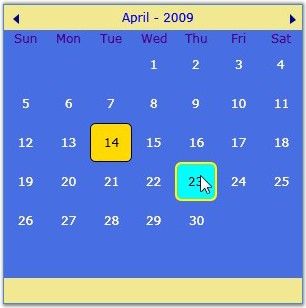
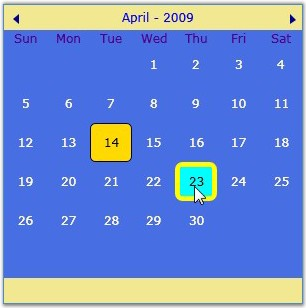
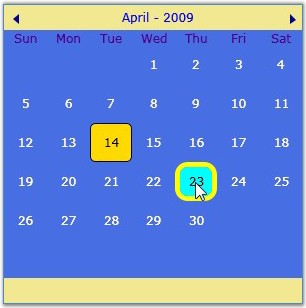
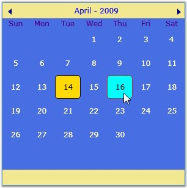

::: {style="DISPLAY: none"}
{#d2h_url_template}{#d2h_package_url style="WIDTH: 0px; DISPLAY: none; HEIGHT: 0px"}
:::

::: {.d2h_secondary_topic style="PADDING-BOTTOM: 10pt; MARGIN: 0pt; PADDING-LEFT: 0pt; PADDING-RIGHT: 0pt; PADDING-TOP: 0pt"}
##### []{#_Mouse_Hover_Cell}[]{#p256}Mouse Hover Cell

 

[]{#p257}This section provides information on the following topics:

 

###### Border Color

 

The **MouseHoverCellBorderBrush** dependency property is used to change the border color of a cell, when the mouse pointer moves over the cell. The following code example illustrates how to set this property.

 

+-----------------------------------------------------------------------------------------------------------------------------------------------------------------------------------------------------------------------------------------------------------------------------------------------------------------------------------------------------------------------------------------------------------------------------------------------------------------------------------------------------------------------+
| **[\[XAML\]]{style="FONT-FAMILY: 'Courier New'; COLOR: black"}**                                                                                                                                                                                                                                                                                                                                                                                                                                                      |
|                                                                                                                                                                                                                                                                                                                                                                                                                                                                                                                       |
| []{style="FONT-FAMILY: 'Courier New'; COLOR: black"}                                                                                                                                                                                                                                                                                                                                                                                                                                                                  |
|                                                                                                                                                                                                                                                                                                                                                                                                                                                                                                                       |
| [\<]{style="FONT-FAMILY: 'Courier New'; COLOR: blue"}[Syncfusion]{style="FONT-FAMILY: 'Courier New'; COLOR: maroon"}[:]{style="FONT-FAMILY: 'Courier New'; COLOR: blue"}[CalendarControl]{style="FONT-FAMILY: 'Courier New'; COLOR: maroon"}[ [x]{style="COLOR: maroon"}[:]{style="COLOR: blue"}[Name]{style="COLOR: red"}[="calendarcontrol"]{style="COLOR: blue"} [MouseHoverCellBorderBrush]{style="COLOR: red"}[=\"Black\"]{style="COLOR: blue"} [/\>]{style="COLOR: blue"} ]{style="FONT-FAMILY: 'Courier New'"} |
+-----------------------------------------------------------------------------------------------------------------------------------------------------------------------------------------------------------------------------------------------------------------------------------------------------------------------------------------------------------------------------------------------------------------------------------------------------------------------------------------------------------------------+

 

+---------------------------------------------------------------------------------------------------------------------------------------------+
| **[\[C#\]]{style="FONT-FAMILY: 'Courier New'; COLOR: black"}**                                                                              |
|                                                                                                                                             |
| []{style="FONT-FAMILY: 'Courier New'"}                                                                                                      |
|                                                                                                                                             |
| [CalendarControl calendarcontrol = [new]{style="COLOR: blue"} CalendarControl();]{style="FONT-FAMILY: 'Courier New'"}                       |
|                                                                                                                                             |
| [calendarcontrol.MouseHoverCellBorderBrush = [new]{style="COLOR: blue"} SolidColorBrush(Colors.Brown);]{style="FONT-FAMILY: 'Courier New'"} |
+---------------------------------------------------------------------------------------------------------------------------------------------+

 

{border="0"}

 

Figure 482: MouseHoverCellBorderBrush = \"Yellow\"

###### []{#_Border_Thickness}Border Thickness

[]{#p258} 

The **MouseHoverCellBorderThickness** dependency property is used to change the border thickness of a date cell, when the mouse pointer moves over the cell. The following code example illustrates how to set this property.

 

+------------------------------------------------------------------------------------------------------------------------------------------------------------------------------------------------------------------------------------------------------------------------------------------------------------------------------------------------------------------------------------------------------------------------------------------------------------------------------------------------------------------------+
| **[\[XAML\]]{style="FONT-FAMILY: 'Courier New'; COLOR: black"}**                                                                                                                                                                                                                                                                                                                                                                                                                                                       |
|                                                                                                                                                                                                                                                                                                                                                                                                                                                                                                                        |
| []{style="FONT-FAMILY: 'Courier New'; COLOR: black"}                                                                                                                                                                                                                                                                                                                                                                                                                                                                   |
|                                                                                                                                                                                                                                                                                                                                                                                                                                                                                                                        |
| [\<]{style="FONT-FAMILY: 'Courier New'; COLOR: blue"}[Syncfusion]{style="FONT-FAMILY: 'Courier New'; COLOR: maroon"}[:]{style="FONT-FAMILY: 'Courier New'; COLOR: blue"}[CalendarControl]{style="FONT-FAMILY: 'Courier New'; COLOR: maroon"}[ [x]{style="COLOR: maroon"}[:]{style="COLOR: blue"}[Name]{style="COLOR: red"}[="calendarcontrol"]{style="COLOR: blue"} [MouseHoverCellBorderThickness]{style="COLOR: red"}[=\"1.0\"]{style="COLOR: blue"} [/\>]{style="COLOR: blue"}]{style="FONT-FAMILY: 'Courier New'"} |
+------------------------------------------------------------------------------------------------------------------------------------------------------------------------------------------------------------------------------------------------------------------------------------------------------------------------------------------------------------------------------------------------------------------------------------------------------------------------------------------------------------------------+

 

+----------------------------------------------------------------------------------------------------------------------------------+
| **[\[C#\]]{style="FONT-FAMILY: 'Courier New'; COLOR: black"}**                                                                   |
|                                                                                                                                  |
| []{style="FONT-FAMILY: 'Courier New'"}                                                                                           |
|                                                                                                                                  |
| [CalendarControl calendarcontrol = [new]{style="COLOR: blue"} CalendarControl();]{style="FONT-FAMILY: 'Courier New'"}            |
|                                                                                                                                  |
| [calendarcontrol.MouseHoverCellBorderThickness = [new]{style="COLOR: blue"} Thickness(1.0);]{style="FONT-FAMILY: 'Courier New'"} |
+----------------------------------------------------------------------------------------------------------------------------------+

 

{border="0"}

 

Figure 483: MouseHoverCellBorderThickness = \"5.0\"

###### []{#_Corner_Radius_1}Corner Radius

 

[]{#p259}The MouseHoverCellCornerRadius dependency property is used to change the corner radius of a cell, when the mouse pointer moves over the cell. The following code example illustrates how to set this property.

 

+---------------------------------------------------------------------------------------------------------------------------------------------------------------------------------------------------------------------------------------------------------------------------------------------------------------------------------------------------------------------------------------------------------------------------------------------------------------------------------------------------------------------+
| **[\[XAML\]]{style="FONT-FAMILY: 'Courier New'; COLOR: black"}**                                                                                                                                                                                                                                                                                                                                                                                                                                                    |
|                                                                                                                                                                                                                                                                                                                                                                                                                                                                                                                     |
| []{style="FONT-FAMILY: 'Courier New'; COLOR: black"}                                                                                                                                                                                                                                                                                                                                                                                                                                                                |
|                                                                                                                                                                                                                                                                                                                                                                                                                                                                                                                     |
| [\<]{style="FONT-FAMILY: 'Courier New'; COLOR: blue"}[Syncfusion]{style="FONT-FAMILY: 'Courier New'; COLOR: maroon"}[:]{style="FONT-FAMILY: 'Courier New'; COLOR: blue"}[CalendarControl]{style="FONT-FAMILY: 'Courier New'; COLOR: maroon"}[ [x]{style="COLOR: maroon"}[:]{style="COLOR: blue"}[Name]{style="COLOR: red"}[="calendarcontrol"]{style="COLOR: blue"} [MouseHoverCellCornerRadius]{style="COLOR: red"}[=\"5.0\"]{style="COLOR: blue"} [/\>]{style="COLOR: blue"}]{style="FONT-FAMILY: 'Courier New'"} |
+---------------------------------------------------------------------------------------------------------------------------------------------------------------------------------------------------------------------------------------------------------------------------------------------------------------------------------------------------------------------------------------------------------------------------------------------------------------------------------------------------------------------+

 

+-------------------------------------------------------------------------------------------------------------------------------+
| **[\[C#\]]{style="FONT-FAMILY: 'Courier New'; COLOR: black"}**                                                                |
|                                                                                                                               |
| []{style="FONT-FAMILY: 'Courier New'"}                                                                                        |
|                                                                                                                               |
| [CalendarControl calendarcontrol = [new]{style="COLOR: blue"} CalendarControl();]{style="FONT-FAMILY: 'Courier New'"}         |
|                                                                                                                               |
| [calendarcontrol.MouseHoverCellCornerRadius = [new]{style="COLOR: blue"} Thickness(5.0);]{style="FONT-FAMILY: 'Courier New'"} |
+-------------------------------------------------------------------------------------------------------------------------------+

 

{border="0"}

 

Figure 484: MouseHoverCellCornerRadius = \"10.0\"

###### []{#_Background_Color_3}Background Color

[]{#p260} 

The **MouseHoverCellBackground** property enables you to change the background color of a cell, when the mouse pointer moves over the cell. The following code example illustrates how to set this property.

 

+---------------------------------------------------------------------------------------------------------------------------------------------------------------------------------------------------------------------------------------------------------------------------------------------------------------------------------------------------------------------------------------------------------------------------------------------------------------------------------------------------------------------+
| **[\[XAML\]]{style="FONT-FAMILY: 'Courier New'; COLOR: black"}**                                                                                                                                                                                                                                                                                                                                                                                                                                                    |
|                                                                                                                                                                                                                                                                                                                                                                                                                                                                                                                     |
| []{style="FONT-FAMILY: 'Courier New'; COLOR: black"}                                                                                                                                                                                                                                                                                                                                                                                                                                                                |
|                                                                                                                                                                                                                                                                                                                                                                                                                                                                                                                     |
| [\<]{style="FONT-FAMILY: 'Courier New'; COLOR: blue"}[Syncfusion]{style="FONT-FAMILY: 'Courier New'; COLOR: maroon"}[:]{style="FONT-FAMILY: 'Courier New'; COLOR: blue"}[CalendarControl]{style="FONT-FAMILY: 'Courier New'; COLOR: maroon"}[ [x]{style="COLOR: maroon"}[:]{style="COLOR: blue"}[Name]{style="COLOR: red"}[="calendarcontrol"]{style="COLOR: blue"} [MouseHoverCellBackground]{style="COLOR: red"}[=\"Khaki\"]{style="COLOR: blue"} [/\>]{style="COLOR: blue"}]{style="FONT-FAMILY: 'Courier New'"} |
+---------------------------------------------------------------------------------------------------------------------------------------------------------------------------------------------------------------------------------------------------------------------------------------------------------------------------------------------------------------------------------------------------------------------------------------------------------------------------------------------------------------------+

 

+--------------------------------------------------------------------------------------------------------------------------------------------+
| **[\[C#\]]{style="FONT-FAMILY: 'Courier New'; COLOR: black"}**                                                                             |
|                                                                                                                                            |
| []{style="FONT-FAMILY: 'Courier New'"}                                                                                                     |
|                                                                                                                                            |
| [CalendarControl calendarcontrol = [new]{style="COLOR: blue"} CalendarControl();]{style="FONT-FAMILY: 'Courier New'"}                      |
|                                                                                                                                            |
| [calendarcontrol.MouseHoverCellBackground = [new]{style="COLOR: blue"} SolidColorBrush(Colors.Khaki);]{style="FONT-FAMILY: 'Courier New'"} |
+--------------------------------------------------------------------------------------------------------------------------------------------+

 

{border="0"}

 

Figure 485: MouseHoverCellBackground = \"Aqua\"

###### []{#p261}Foreground Color

 

The **MouseHoverCellForeground** property enables you to change the foreground color of a cell, when the mouse pointer moves over the cell. The following code example illustrates how to set this property.

 

+---------------------------------------------------------------------------------------------------------------------------------------------------------------------------------------------------------------------------------------------------------------------------------------------------------------------------------------------------------------------------------------------------------------------------------------------------------------------------------------------------------------------+
| **[\[XAML\]]{style="FONT-FAMILY: 'Courier New'; COLOR: black"}**                                                                                                                                                                                                                                                                                                                                                                                                                                                    |
|                                                                                                                                                                                                                                                                                                                                                                                                                                                                                                                     |
| []{style="FONT-FAMILY: 'Courier New'; COLOR: black"}                                                                                                                                                                                                                                                                                                                                                                                                                                                                |
|                                                                                                                                                                                                                                                                                                                                                                                                                                                                                                                     |
| [\<]{style="FONT-FAMILY: 'Courier New'; COLOR: blue"}[Syncfusion]{style="FONT-FAMILY: 'Courier New'; COLOR: maroon"}[:]{style="FONT-FAMILY: 'Courier New'; COLOR: blue"}[CalendarControl]{style="FONT-FAMILY: 'Courier New'; COLOR: maroon"}[ [x]{style="COLOR: maroon"}[:]{style="COLOR: blue"}[Name]{style="COLOR: red"}[="calendarcontrol"]{style="COLOR: blue"} [MouseHoverCellForeground]{style="COLOR: red"}[=\"Black\"]{style="COLOR: blue"} [/\>]{style="COLOR: blue"}]{style="FONT-FAMILY: 'Courier New'"} |
+---------------------------------------------------------------------------------------------------------------------------------------------------------------------------------------------------------------------------------------------------------------------------------------------------------------------------------------------------------------------------------------------------------------------------------------------------------------------------------------------------------------------+

 

+--------------------------------------------------------------------------------------------------------------------------------------------+
| **[\[C#\]]{style="FONT-FAMILY: 'Courier New'; COLOR: black"}**                                                                             |
|                                                                                                                                            |
| []{style="FONT-FAMILY: 'Courier New'"}                                                                                                     |
|                                                                                                                                            |
| [CalendarControl calendarcontrol = [new]{style="COLOR: blue"} CalendarControl();]{style="FONT-FAMILY: 'Courier New'"}                      |
|                                                                                                                                            |
| [calendarcontrol.MouseHoverCellForeground = [new]{style="COLOR: blue"} SolidColorBrush(Colors.Black);]{style="FONT-FAMILY: 'Courier New'"} |
+--------------------------------------------------------------------------------------------------------------------------------------------+

 

{border="0"}

 

Figure 486: MouseHoverCellForeground = \"Olive\"

[]{#related-topics}
:::
