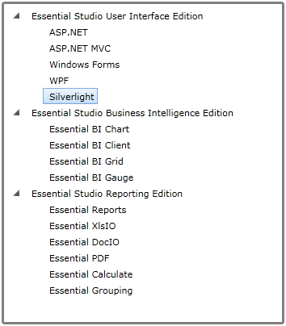
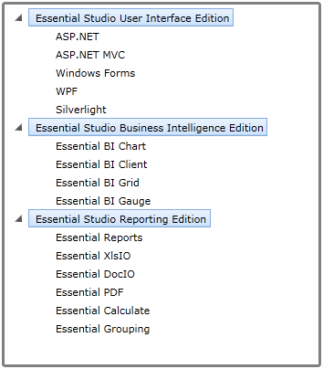
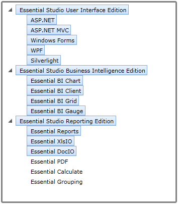

::: {style="DISPLAY: none"}
{#d2h_url_template}{#d2h_package_url style="WIDTH: 0px; DISPLAY: none; HEIGHT: 0px"}
:::

::: {.d2h_secondary_topic style="PADDING-BOTTOM: 10pt; MARGIN: 0pt; PADDING-LEFT: 0pt; PADDING-RIGHT: 0pt; PADDING-TOP: 0pt"}
#### MultiSelection support

            TreeViewAdv supports different selection modes as follows:

[·      ]{style="FONT-FAMILY: Symbol"}Single Selection -- You can select only one node at a time

[·      ]{style="FONT-FAMILY: Symbol"}MultiSelectSameLevel -- You can select only nodes of same level

[·      ]{style="FONT-FAMILY: Symbol"}MultiSelectAll -- You can select multiple nodes

To change the selection behavior of a TreeViewAdv, use the **SelectionMode** property.

Use Case Scenarios

With MultiSelection support, you can select multiple node at a time.Changing MultiSelection behavior in an Application

Changing MultiSelection behavior in an Application

You can change the selection behavior of TreeViewAdv using SelectionMode property. To change the selection behavior of TreeViewAdv, use **SelectionMode** property.

The following code illustrates how to select MultiSelectAll mode using **SelectionMode** property.

+-----------------------------------------------------------------------------------------------------------------------------------------------------------------------------------------------------------------------------------------------------------------------------------------------------------------------------------------------------------------------------------------------------------------------------------------------------------------------------------------------------------------------------------------------------------------------------------------------------------------------------------------------------------------------------------------------------------------------------------------------------------------------------------------------------------------------------------------------------------------+
| **[\[XAML\]]{style="FONT-FAMILY: 'Courier New'"}**                                                                                                                                                                                                                                                                                                                                                                                                                                                                                                                                                                                                                                                                                                                                                                                                              |
|                                                                                                                                                                                                                                                                                                                                                                                                                                                                                                                                                                                                                                                                                                                                                                                                                                                                 |
| []{style="FONT-FAMILY: 'Courier New'"}                                                                                                                                                                                                                                                                                                                                                                                                                                                                                                                                                                                                                                                                                                                                                                                                                          |
|                                                                                                                                                                                                                                                                                                                                                                                                                                                                                                                                                                                                                                                                                                                                                                                                                                                                 |
| [\<]{style="FONT-FAMILY: 'Courier New'; COLOR: blue"}[syncfusion]{style="FONT-FAMILY: 'Courier New'; COLOR: #a31515"}[:]{style="FONT-FAMILY: 'Courier New'; COLOR: blue"}[TreeViewAdv]{style="FONT-FAMILY: 'Courier New'; COLOR: #a31515"}[ x]{style="FONT-FAMILY: 'Courier New'; COLOR: red"}[:]{style="FONT-FAMILY: 'Courier New'; COLOR: blue"}[Name]{style="FONT-FAMILY: 'Courier New'; COLOR: red"}[=\"treeview1\"]{style="FONT-FAMILY: 'Courier New'; COLOR: blue"}[ Width]{style="FONT-FAMILY: 'Courier New'; COLOR: red"}[=\"350\"]{style="FONT-FAMILY: 'Courier New'; COLOR: blue"}[ VerticalAlignment]{style="FONT-FAMILY: 'Courier New'; COLOR: red"}[=\"Stretch\"]{style="FONT-FAMILY: 'Courier New'; COLOR: blue"}[ FullRowSelect]{style="FONT-FAMILY: 'Courier New'; COLOR: red"}[=\"False\"]{style="FONT-FAMILY: 'Courier New'; COLOR: blue"}[ \ |
| [SelectionMode]{style="COLOR: red"}[=\"MultiSelectAll\"]{style="COLOR: blue"}\                                                                                                                                                                                                                                                                                                                                                                                                                                                                                                                                                                                                                                                                                                                                                                                  |
| [Height]{style="COLOR: red"}[=\"400\"]{style="COLOR: blue"}[ BorderBrush]{style="COLOR: red"}[=\"Gray\"]{style="COLOR: blue"}[ BorderThickness]{style="COLOR: red"}[=\"3\"]{style="COLOR: blue"}\                                                                                                                                                                                                                                                                                                                                                                                                                                                                                                                                                                                                                                                               |
| [ItemTemplate]{style="COLOR: red"}[=\"{]{style="COLOR: blue"}[StaticResource]{style="COLOR: #a31515"}[ TreeViewItemTemplate]{style="COLOR: red"}[}\"/\>]{style="COLOR: blue"}]{style="FONT-FAMILY: 'Courier New'"}                                                                                                                                                                                                                                                                                                                                                                                                                                                                                                                                                                                                                                              |
+-----------------------------------------------------------------------------------------------------------------------------------------------------------------------------------------------------------------------------------------------------------------------------------------------------------------------------------------------------------------------------------------------------------------------------------------------------------------------------------------------------------------------------------------------------------------------------------------------------------------------------------------------------------------------------------------------------------------------------------------------------------------------------------------------------------------------------------------------------------------+

 

{border="0"}

Figure 756: Single SelectionMode

 

{border="0"}

Figure 757: MultiSelectSameLevel

{border="0"}

Figure 758: MultiSelectAll

Properties

[]{style="FONT-FAMILY: 'Myriad Pro','sans-serif'"} 

Table 26: SelectionMode Property Table

+---------------+----------------------------------------------------------------+--------------------+----------------------+-----------------+
| Property      | Description                                                    | Type               | Data Type            | Reference links |
+---------------+----------------------------------------------------------------+--------------------+----------------------+-----------------+
| SelectionMode | Specifies the selection behavior of TreeViewAdv.               | DependencyProperty | SelectionMode.Single |                 |
|               |                                                                |                    |                      |                 |
|               | **Single:** One node at a time can be selected.                |                    |                      |                 |
|               |                                                                |                    |                      |                 |
|               | **MultiSelectSameLevel:** Nodes of same level can be selected. |                    |                      |                 |
|               |                                                                |                    |                      |                 |
|               | **MultiSelectAll:** Multiple nodes can be selected at a time.  |                    |                      |                 |
+---------------+----------------------------------------------------------------+--------------------+----------------------+-----------------+

 

 

Sample link

A sample application that illustrates MultiSelection support is distributed along with the Essential Tools Silverlight installation and can be found at:****

**\<sample installation location\>\\Syncfusion\\EssentialStudio\\Version Number\\Silverlight\\Syncfusion.Tools.Silverlight.Samples\\Samples\\TreeView\\TreeView Demo\\TreeViewDemo.xaml**

[]{#related-topics}
:::
