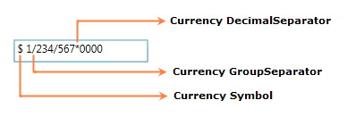

::: {style="DISPLAY: none"}
{#d2h_url_template}{#d2h_package_url style="WIDTH: 0px; DISPLAY: none; HEIGHT: 0px"}
:::

:::: {.d2h_secondary_topic style="PADDING-BOTTOM: 10pt; MARGIN: 0pt; PADDING-LEFT: 0pt; PADDING-RIGHT: 0pt; PADDING-TOP: 0pt"}
##### []{#_Number_Format_1}Number Format

You can customize the Number Format either using NumberFormat property or CurrencyGroupSeparator, CurrencyGroupSizes, CurrencyDecimalDigits and CurrencyDecimalSeparator, CurrencySymbol, CurrencyNegativePattern and CurrencyPositivePattern properties.

 

+------------------------------------------------------------------------------------------------------------------------------------------------------------------------------------------------------------------------------------------------------------------------------------------------------------------------------------------------------------------------------------------------------------------------------------------------------------------------------------------------------------------------------------------------------------------------------------------------------------------------------------------------------------------------------------------------------------------------------------------------------------------------------+
| [XAML]{style="FONT-FAMILY: 'Courier New'"}                                                                                                                                                                                                                                                                                                                                                                                                                                                                                                                                                                                                                                                                                                                                   |
+------------------------------------------------------------------------------------------------------------------------------------------------------------------------------------------------------------------------------------------------------------------------------------------------------------------------------------------------------------------------------------------------------------------------------------------------------------------------------------------------------------------------------------------------------------------------------------------------------------------------------------------------------------------------------------------------------------------------------------------------------------------------------+
| [\<]{style="FONT-FAMILY: 'Courier New'; COLOR: blue"}[syncfusion]{style="FONT-FAMILY: 'Courier New'; COLOR: #a31515"}[:]{style="FONT-FAMILY: 'Courier New'; COLOR: blue"}[CurrencyTextBox]{style="FONT-FAMILY: 'Courier New'; COLOR: #a31515"}[ x]{style="FONT-FAMILY: 'Courier New'; COLOR: red"}[:]{style="FONT-FAMILY: 'Courier New'; COLOR: blue"}[Name]{style="FONT-FAMILY: 'Courier New'; COLOR: red"}[=\"currencyTextBox\"]{style="FONT-FAMILY: 'Courier New'; COLOR: blue"}[ Height]{style="FONT-FAMILY: 'Courier New'; COLOR: red"}[=\"25\"]{style="FONT-FAMILY: 'Courier New'; COLOR: blue"}[ Width]{style="FONT-FAMILY: 'Courier New'; COLOR: red"}[=\"150\"]{style="FONT-FAMILY: 'Courier New'; COLOR: blue"}[ ]{style="FONT-FAMILY: 'Courier New'; COLOR: red"} |
|                                                                                                                                                                                                                                                                                                                                                                                                                                                                                                                                                                                                                                                                                                                                                                              |
| [                            Value]{style="FONT-FAMILY: 'Courier New'; COLOR: red"}[=\"1234567\"\>]{style="FONT-FAMILY: 'Courier New'; COLOR: blue"}[]{style="FONT-FAMILY: 'Courier New'"}                                                                                                                                                                                                                                                                                                                                                                                                                                                                                                                                                                                   |
|                                                                                                                                                                                                                                                                                                                                                                                                                                                                                                                                                                                                                                                                                                                                                                              |
| [    ]{style="FONT-FAMILY: 'Courier New'; COLOR: #a31515"}[\<]{style="FONT-FAMILY: 'Courier New'; COLOR: blue"}[syncfusion]{style="FONT-FAMILY: 'Courier New'; COLOR: #a31515"}[:]{style="FONT-FAMILY: 'Courier New'; COLOR: blue"}[CurrencyTextBox.NumberFormat]{style="FONT-FAMILY: 'Courier New'; COLOR: #a31515"}[\>]{style="FONT-FAMILY: 'Courier New'; COLOR: blue"}[]{style="FONT-FAMILY: 'Courier New'"}                                                                                                                                                                                                                                                                                                                                                             |
|                                                                                                                                                                                                                                                                                                                                                                                                                                                                                                                                                                                                                                                                                                                                                                              |
| [        ]{style="FONT-FAMILY: 'Courier New'; COLOR: #a31515"}[\<]{style="FONT-FAMILY: 'Courier New'; COLOR: blue"}[numberformat]{style="FONT-FAMILY: 'Courier New'; COLOR: #a31515"}[:]{style="FONT-FAMILY: 'Courier New'; COLOR: blue"}[NumberFormatInfo]{style="FONT-FAMILY: 'Courier New'; COLOR: #a31515"}[ CurrencyGroupSeparator]{style="FONT-FAMILY: 'Courier New'; COLOR: red"}[=\"/\"]{style="FONT-FAMILY: 'Courier New'; COLOR: blue"}[ ]{style="FONT-FAMILY: 'Courier New'; COLOR: red"}                                                                                                                                                                                                                                                                         |
|                                                                                                                                                                                                                                                                                                                                                                                                                                                                                                                                                                                                                                                                                                                                                                              |
| [                      CurrencyDecimalDigits]{style="FONT-FAMILY: 'Courier New'; COLOR: red"}[=\"4\"]{style="FONT-FAMILY: 'Courier New'; COLOR: blue"}[ [CurrencyDecimalSeparator]{style="COLOR: red"}[=\"\*\"]{style="COLOR: blue"}[ ]{style="COLOR: red"}]{style="FONT-FAMILY: 'Courier New'"}                                                                                                                                                                                                                                                                                                                                                                                                                                                                             |
|                                                                                                                                                                                                                                                                                                                                                                                                                                                                                                                                                                                                                                                                                                                                                                              |
| [                      CurrencySymbol]{style="FONT-FAMILY: 'Courier New'; COLOR: red"}[=\"\$\"/\>]{style="FONT-FAMILY: 'Courier New'; COLOR: blue"}[]{style="FONT-FAMILY: 'Courier New'"}                                                                                                                                                                                                                                                                                                                                                                                                                                                                                                                                                                                    |
|                                                                                                                                                                                                                                                                                                                                                                                                                                                                                                                                                                                                                                                                                                                                                                              |
| [    ]{style="FONT-FAMILY: 'Courier New'; COLOR: #a31515"}[\</]{style="FONT-FAMILY: 'Courier New'; COLOR: blue"}[syncfusion]{style="FONT-FAMILY: 'Courier New'; COLOR: #a31515"}[:]{style="FONT-FAMILY: 'Courier New'; COLOR: blue"}[CurrencyTextBox.NumberFormat]{style="FONT-FAMILY: 'Courier New'; COLOR: #a31515"}[\>]{style="FONT-FAMILY: 'Courier New'; COLOR: blue"}[]{style="FONT-FAMILY: 'Courier New'"}                                                                                                                                                                                                                                                                                                                                                            |
|                                                                                                                                                                                                                                                                                                                                                                                                                                                                                                                                                                                                                                                                                                                                                                              |
| [\</]{style="FONT-FAMILY: 'Courier New'; COLOR: blue"}[syncfusion]{style="FONT-FAMILY: 'Courier New'; COLOR: #a31515"}[:]{style="FONT-FAMILY: 'Courier New'; COLOR: blue"}[CurrencyTextBox]{style="FONT-FAMILY: 'Courier New'; COLOR: #a31515"}[\>]{style="FONT-FAMILY: 'Courier New'; COLOR: blue"}                                                                                                                                                                                                                                                                                                                                                                                                                                                                         |
+------------------------------------------------------------------------------------------------------------------------------------------------------------------------------------------------------------------------------------------------------------------------------------------------------------------------------------------------------------------------------------------------------------------------------------------------------------------------------------------------------------------------------------------------------------------------------------------------------------------------------------------------------------------------------------------------------------------------------------------------------------------------------+

 

+-----------------------------------------------------------------------------------------------------------------------------------------------------------------------------------------------------------+
| [C#]{style="FONT-FAMILY: 'Courier New'"}                                                                                                                                                                  |
+-----------------------------------------------------------------------------------------------------------------------------------------------------------------------------------------------------------+
| [Syncfusion.Windows.Shared.[CurrencyTextBox]{style="COLOR: #2b91af"} currencyTextBox = [new]{style="COLOR: blue"} ]{style="FONT-FAMILY: 'Courier New'"}                                                   |
|                                                                                                                                                                                                           |
| [                          Syncfusion.Windows.Shared.[CurrencyTextBox]{style="COLOR: #2b91af"}();]{style="FONT-FAMILY: 'Courier New'"}                                                                    |
|                                                                                                                                                                                                           |
| [currencyTextBox.Width = 100;]{style="FONT-FAMILY: 'Courier New'"}                                                                                                                                        |
|                                                                                                                                                                                                           |
| [currencyTextBox.Height = 25;]{style="FONT-FAMILY: 'Courier New'"}                                                                                                                                        |
|                                                                                                                                                                                                           |
| [currencyTextBox.Value = 1234567;]{style="FONT-FAMILY: 'Courier New'"}                                                                                                                                    |
|                                                                                                                                                                                                           |
| [currencyTextBox.NumberFormat = [new]{style="COLOR: blue"} [NumberFormatInfo]{style="COLOR: #2b91af"}() { CurrencyGroupSeparator = [\"/\"]{style="COLOR: #a31515"}, ]{style="FONT-FAMILY: 'Courier New'"} |
|                                                                                                                                                                                                           |
| [                               CurrencyDecimalDigits = 4, CurrencyDecimalSeparator = [\"\*\"]{style="COLOR: #a31515"}, ]{style="FONT-FAMILY: 'Courier New'"}                                             |
|                                                                                                                                                                                                           |
| [                               CurrencySymbol = [\"\$\"]{style="COLOR: #a31515"} };]{style="FONT-FAMILY: 'Courier New'"}                                                                                 |
+-----------------------------------------------------------------------------------------------------------------------------------------------------------------------------------------------------------+

 

{border="0"}

Figure 273: CurrencyTextBox

 

+------------------------------------------------------------------------------------------------------------------------------------------------------------------------------------------------------------------------------------------------------------------------------------------------------------------------------------------------------------------------------------------------------------------------------------------------------------------------------------------------------------------------------------------------------------------------------------------------------------------------------------------------------------------------------------------------------------------------------------------------------------------------------+
| [XAML]{style="FONT-FAMILY: 'Courier New'"}                                                                                                                                                                                                                                                                                                                                                                                                                                                                                                                                                                                                                                                                                                                                   |
+------------------------------------------------------------------------------------------------------------------------------------------------------------------------------------------------------------------------------------------------------------------------------------------------------------------------------------------------------------------------------------------------------------------------------------------------------------------------------------------------------------------------------------------------------------------------------------------------------------------------------------------------------------------------------------------------------------------------------------------------------------------------------+
| [\<]{style="FONT-FAMILY: 'Courier New'; COLOR: blue"}[syncfusion]{style="FONT-FAMILY: 'Courier New'; COLOR: #a31515"}[:]{style="FONT-FAMILY: 'Courier New'; COLOR: blue"}[CurrencyTextBox]{style="FONT-FAMILY: 'Courier New'; COLOR: #a31515"}[ x]{style="FONT-FAMILY: 'Courier New'; COLOR: red"}[:]{style="FONT-FAMILY: 'Courier New'; COLOR: blue"}[Name]{style="FONT-FAMILY: 'Courier New'; COLOR: red"}[=\"currencyTextBox\"]{style="FONT-FAMILY: 'Courier New'; COLOR: blue"}[ Height]{style="FONT-FAMILY: 'Courier New'; COLOR: red"}[=\"25\"]{style="FONT-FAMILY: 'Courier New'; COLOR: blue"}[ Width]{style="FONT-FAMILY: 'Courier New'; COLOR: red"}[=\"150\"]{style="FONT-FAMILY: 'Courier New'; COLOR: blue"}[ ]{style="FONT-FAMILY: 'Courier New'; COLOR: red"} |
|                                                                                                                                                                                                                                                                                                                                                                                                                                                                                                                                                                                                                                                                                                                                                                              |
| [                            Value]{style="FONT-FAMILY: 'Courier New'; COLOR: red"}[=\"1234567\"]{style="FONT-FAMILY: 'Courier New'; COLOR: blue"}[]{style="FONT-FAMILY: 'Courier New'"}                                                                                                                                                                                                                                                                                                                                                                                                                                                                                                                                                                                     |
|                                                                                                                                                                                                                                                                                                                                                                                                                                                                                                                                                                                                                                                                                                                                                                              |
| [                           [ CurrencyGroupSeparator]{style="COLOR: red"}[=\"/\"]{style="COLOR: blue"}[ CurrencyDecimalDigits]{style="COLOR: red"}[=\"4\"]{style="COLOR: blue"} ]{style="FONT-FAMILY: 'Courier New'"}                                                                                                                                                                                                                                                                                                                                                                                                                                                                                                                                                        |
|                                                                                                                                                                                                                                                                                                                                                                                                                                                                                                                                                                                                                                                                                                                                                                              |
| [                           [ CurrencyDecimalSeparator]{style="COLOR: red"}[=\"\*\"]{style="COLOR: blue"}[ CurrencySymbol]{style="COLOR: red"}[=\"\$\"\>]{style="COLOR: blue"}]{style="FONT-FAMILY: 'Courier New'"}                                                                                                                                                                                                                                                                                                                                                                                                                                                                                                                                                          |
|                                                                                                                                                                                                                                                                                                                                                                                                                                                                                                                                                                                                                                                                                                                                                                              |
| [\</]{style="FONT-FAMILY: 'Courier New'; COLOR: blue"}[syncfusion]{style="FONT-FAMILY: 'Courier New'; COLOR: #a31515"}[:]{style="FONT-FAMILY: 'Courier New'; COLOR: blue"}[CurrencyTextBox]{style="FONT-FAMILY: 'Courier New'; COLOR: #a31515"}[\>]{style="FONT-FAMILY: 'Courier New'; COLOR: blue"}                                                                                                                                                                                                                                                                                                                                                                                                                                                                         |
+------------------------------------------------------------------------------------------------------------------------------------------------------------------------------------------------------------------------------------------------------------------------------------------------------------------------------------------------------------------------------------------------------------------------------------------------------------------------------------------------------------------------------------------------------------------------------------------------------------------------------------------------------------------------------------------------------------------------------------------------------------------------------+

 

+---------------------------------------------------------------------------------------------------------------------------------------------------------+
| [C#]{style="FONT-FAMILY: 'Courier New'"}                                                                                                                |
+---------------------------------------------------------------------------------------------------------------------------------------------------------+
| [Syncfusion.Windows.Shared.[CurrencyTextBox]{style="COLOR: #2b91af"} currencyTextBox = [new]{style="COLOR: blue"} ]{style="FONT-FAMILY: 'Courier New'"} |
|                                                                                                                                                         |
| [                          Syncfusion.Windows.Shared.[CurrencyTextBox]{style="COLOR: #2b91af"}();]{style="FONT-FAMILY: 'Courier New'"}                  |
|                                                                                                                                                         |
| [currencyTextBox.Width = 100;]{style="FONT-FAMILY: 'Courier New'"}                                                                                      |
|                                                                                                                                                         |
| [currencyTextBox.Height = 25;]{style="FONT-FAMILY: 'Courier New'"}                                                                                      |
|                                                                                                                                                         |
| [currencyTextBox.Value = 1234567;]{style="FONT-FAMILY: 'Courier New'"}                                                                                  |
|                                                                                                                                                         |
| [currencyTextBox.CurrencyGroupSeparator = [\"/\"]{style="COLOR: #a31515"};]{style="FONT-FAMILY: 'Courier New'"}                                         |
|                                                                                                                                                         |
| [currencyTextBox.CurrencyDecimalDigits = 4;]{style="FONT-FAMILY: 'Courier New'"}                                                                        |
|                                                                                                                                                         |
| [currencyTextBox.CurrencyDecimalSeparator = [\"\*\"]{style="COLOR: #a31515"};]{style="FONT-FAMILY: 'Courier New'"}                                      |
|                                                                                                                                                         |
| [currencyTextBox.CurrencySymbol = [\"\$\"]{style="COLOR: #a31515"};]{style="FONT-FAMILY: 'Courier New'"}                                                |
+---------------------------------------------------------------------------------------------------------------------------------------------------------+

 

{border="0"}

Figure 274: CurrencyTextBox

 

 

###### []{#_CurrencyPositivePattern}CurrencyPositivePattern

Gets or sets the format pattern for positive currency values. In the below table "\$" denotes Currency symbol and "n" denotes number.

  ------- --------------------
  Value   Associated Pattern
  0       \$n
  1       n\$
  2       \$ n
  3       n \$
  ------- --------------------

 

+--------------------------------------------------------------------------------------------------------------------------------------------------------------------------------------------------------------------------------------------------------------------------------------------------------------------------------------------------------------------------------------------------------------------------------------------------------------------------------------------------------------------------------------------------------------------------------------------------------------------------------------------------------------------------------------------------------------------------------------------------------------------------------------------------------------------------------------------------------------------------------------------------+
| [XAML]{style="FONT-FAMILY: 'Courier New'"}                                                                                                                                                                                                                                                                                                                                                                                                                                                                                                                                                                                                                                                                                                                                                                                                                                                       |
+--------------------------------------------------------------------------------------------------------------------------------------------------------------------------------------------------------------------------------------------------------------------------------------------------------------------------------------------------------------------------------------------------------------------------------------------------------------------------------------------------------------------------------------------------------------------------------------------------------------------------------------------------------------------------------------------------------------------------------------------------------------------------------------------------------------------------------------------------------------------------------------------------+
| [\<]{style="FONT-FAMILY: 'Courier New'; COLOR: blue"}[syncfusion]{style="FONT-FAMILY: 'Courier New'; COLOR: #a31515"}[:]{style="FONT-FAMILY: 'Courier New'; COLOR: blue"}[CurrencyTextBox]{style="FONT-FAMILY: 'Courier New'; COLOR: #a31515"}[ x]{style="FONT-FAMILY: 'Courier New'; COLOR: red"}[:]{style="FONT-FAMILY: 'Courier New'; COLOR: blue"}[Name]{style="FONT-FAMILY: 'Courier New'; COLOR: red"}[=\"currencyTextBox\"]{style="FONT-FAMILY: 'Courier New'; COLOR: blue"}[ Height]{style="FONT-FAMILY: 'Courier New'; COLOR: red"}[=\"25\"]{style="FONT-FAMILY: 'Courier New'; COLOR: blue"}[ Width]{style="FONT-FAMILY: 'Courier New'; COLOR: red"}[=\"150\"]{style="FONT-FAMILY: 'Courier New'; COLOR: blue"}[ Value]{style="FONT-FAMILY: 'Courier New'; COLOR: red"}[=\"1234\"]{style="FONT-FAMILY: 'Courier New'; COLOR: blue"}[ ]{style="FONT-FAMILY: 'Courier New'; COLOR: red"} |
|                                                                                                                                                                                                                                                                                                                                                                                                                                                                                                                                                                                                                                                                                                                                                                                                                                                                                                  |
| [                            CurrencyPositivePattern]{style="FONT-FAMILY: 'Courier New'; COLOR: red"}[=\"3\"/\>]{style="FONT-FAMILY: 'Courier New'; COLOR: blue"}                                                                                                                                                                                                                                                                                                                                                                                                                                                                                                                                                                                                                                                                                                                                |
+--------------------------------------------------------------------------------------------------------------------------------------------------------------------------------------------------------------------------------------------------------------------------------------------------------------------------------------------------------------------------------------------------------------------------------------------------------------------------------------------------------------------------------------------------------------------------------------------------------------------------------------------------------------------------------------------------------------------------------------------------------------------------------------------------------------------------------------------------------------------------------------------------+

 

{border="0"}

Figure 275: CurrencyTextBox

###### []{#_CurrencyNegativePattern}CurrencyNegativePattern

Gets or sets the format pattern for negative currency values. In the below table "\$" denotes Currency symbol and "n" denotes number.

::: {align="center"}
  ------- --------------------
  Value   Associated Pattern
  0       (\$n)
  1       -\$n
  2       \$-n
  3       \$n-
  4       (n\$)
  5       -n\$
  6       n-\$
  7       n\$-
  8       -n \$
  9       -\$ n
  10      n \$-
  11      \$ n-
  12      \$ -n
  13      n- \$
  14      (\$ n)
  15      (n \$)
  ------- --------------------
:::

 

+------------------------------------------------------------------------------------------------------------------------------------------------------------------------------------------------------------------------------------------------------------------------------------------------------------------------------------------------------------------------------------------------------------------------------------------------------------------------------------------------------------------------------------------------------------------------------------------------------------------------------------------------------------------------------------------------------------------------------------------------------------------------------+
| [XAML]{style="FONT-FAMILY: 'Courier New'"}                                                                                                                                                                                                                                                                                                                                                                                                                                                                                                                                                                                                                                                                                                                                   |
+------------------------------------------------------------------------------------------------------------------------------------------------------------------------------------------------------------------------------------------------------------------------------------------------------------------------------------------------------------------------------------------------------------------------------------------------------------------------------------------------------------------------------------------------------------------------------------------------------------------------------------------------------------------------------------------------------------------------------------------------------------------------------+
| [\<]{style="FONT-FAMILY: 'Courier New'; COLOR: blue"}[syncfusion]{style="FONT-FAMILY: 'Courier New'; COLOR: #a31515"}[:]{style="FONT-FAMILY: 'Courier New'; COLOR: blue"}[CurrencyTextBox]{style="FONT-FAMILY: 'Courier New'; COLOR: #a31515"}[ x]{style="FONT-FAMILY: 'Courier New'; COLOR: red"}[:]{style="FONT-FAMILY: 'Courier New'; COLOR: blue"}[Name]{style="FONT-FAMILY: 'Courier New'; COLOR: red"}[=\"currencyTextBox\"]{style="FONT-FAMILY: 'Courier New'; COLOR: blue"}[ Height]{style="FONT-FAMILY: 'Courier New'; COLOR: red"}[=\"25\"]{style="FONT-FAMILY: 'Courier New'; COLOR: blue"}[ Width]{style="FONT-FAMILY: 'Courier New'; COLOR: red"}[=\"150\"]{style="FONT-FAMILY: 'Courier New'; COLOR: blue"}[ ]{style="FONT-FAMILY: 'Courier New'; COLOR: red"} |
|                                                                                                                                                                                                                                                                                                                                                                                                                                                                                                                                                                                                                                                                                                                                                                              |
| [                            Value]{style="FONT-FAMILY: 'Courier New'; COLOR: red"}[=\"-1234\"]{style="FONT-FAMILY: 'Courier New'; COLOR: blue"}[ CurrencyNegativePattern]{style="FONT-FAMILY: 'Courier New'; COLOR: red"}[=\"0\"/\>]{style="FONT-FAMILY: 'Courier New'; COLOR: blue"}                                                                                                                                                                                                                                                                                                                                                                                                                                                                                       |
+------------------------------------------------------------------------------------------------------------------------------------------------------------------------------------------------------------------------------------------------------------------------------------------------------------------------------------------------------------------------------------------------------------------------------------------------------------------------------------------------------------------------------------------------------------------------------------------------------------------------------------------------------------------------------------------------------------------------------------------------------------------------------+

 

{border="0"}

Figure 276: CurrencyTextBox

[]{#related-topics}
::::
