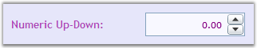

::: {style="DISPLAY: none"}
{#d2h_url_template}{#d2h_package_url style="WIDTH: 0px; DISPLAY: none; HEIGHT: 0px"}
:::

::::: {#nsbanner .d2h_main_nsbanner style="BORDER-BOTTOM: #999999 1px solid; POSITION: relative; PADDING-BOTTOM: 0px; BACKGROUND-COLOR: transparent; PADDING-LEFT: 0px; PADDING-RIGHT: 0px; DISPLAY: none; BORDER-TOP: #999999 1px solid; PADDING-TOP: 0px; LEFT: 0px"}
:::: {#TitleRow .d2h_main_titlerow style="PADDING-BOTTOM: 4px; BACKGROUND-COLOR: transparent; PADDING-LEFT: 22px; WIDTH: 100%; PADDING-RIGHT: 10px; DISPLAY: none; PADDING-TOP: 4px"}
::: {#ienav .d2h_main_ienav style="DISPLAY: none"}
{#D2HPrevious .D2HPreviousEnabled}  {#D2HNext .D2HNextEnabled}
:::
::::
:::::

::: {#nstext .d2h_main_nstext style="PADDING-BOTTOM: 10px; BACKGROUND-COLOR: transparent; PADDING-LEFT: 22px; PADDING-RIGHT: 10px; HEIGHT: 100%; OVERFLOW: auto; PADDING-TOP: 5px" hasuserbackground="true" valign="bottom"}
## []{#_NumericUpDown}[]{#p131}NumericUpDown

 

 The NumericUpDown control is a text box with a pair of arrow buttons that increase / decrease the value given in a text box. It supports double values. The range of values can be specified.

 

 

{border="0"}

Figure 319: NumericUpDown Control

 

Feature Summary

 

[·      ]{style="FONT-FAMILY: Symbol"}**AllowEdit**: specifies whether the control is editable or not

[·      ]{style="FONT-FAMILY: Symbol"}**Interval**: specifies the step value for the control when the up button or down button is clicked

[·      ]{style="FONT-FAMILY: Symbol"}**MaxValue and MinValue**: specifies the range of values for the control

[·      ]{style="FONT-FAMILY: Symbol"}**TextAlignment**: specifies the alignment of the content

[·      ]{style="FONT-FAMILY: Symbol"}**FlowDirection**: specifies the flow direction for the control

[·      ]{style="FONT-FAMILY: Symbol"}**NegativeForeground**: specifies the foreground color for the input value when the value is less than zero

[·      ]{style="FONT-FAMILY: Symbol"}**SkinManager**: specifies the visual style for the control

More:

[ ]{#related-topics}

[{border="0" align="absMiddle"}Getting Started](ms-xhelp:///?Id=5aeeea6d-72ae-4f5a-94e0-3c433e2b1820){style="TEXT-DECORATION: none"}

[{border="0" align="absMiddle"}Concepts and Features](ms-xhelp:///?Id=554320fb-71b9-48b2-9cec-784e7547edf0){style="TEXT-DECORATION: none"}
:::
