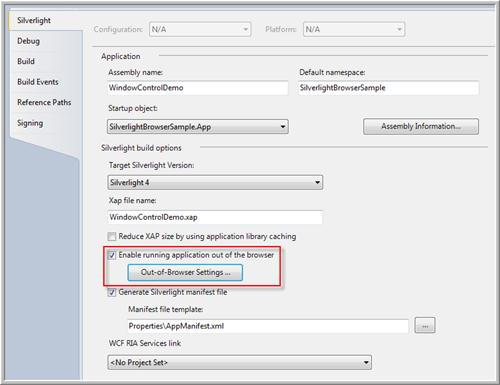
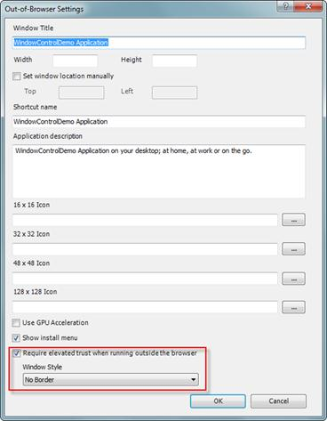
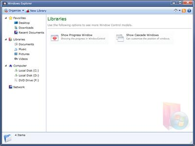

::: {style="DISPLAY: none"}
{#d2h_url_template}{#d2h_package_url style="WIDTH: 0px; DISPLAY: none; HEIGHT: 0px"}
:::

::: {.d2h_secondary_topic style="PADDING-BOTTOM: 10pt; MARGIN: 0pt; PADDING-LEFT: 0pt; PADDING-RIGHT: 0pt; PADDING-TOP: 0pt"}
#### Out-of-Browser Window Support

[]{style="COLOR: black"} 

Silverlight 4.0 allows customization for Out-of-Browser Window support. This can be easily done by using Syncfusion WindowControl, since it has a complete customization support.

 

Use Case Scenarios

 

Using Out-of-Browser Window Support in a WindowControl, any Out-of-Browser Window can be easily customized as WindowControl has a complete[ ]{style="COLOR: black"}[[customization]{.UGHyperlink}](../../../../../../../../Documents%20and%20Settings/riaj/Desktop/styling%20for%20ui%20silverlight/tools%20silverlight/tools%20part%202.docx#_Blendability_1)[.]{style="COLOR: black"}

 

Enabling Out-of-Browser Support in a Window Control Application

[]{style="COLOR: black"} 

The following steps explain how to enable an Out-of-Browser support in a Silverlight 4.0 application.      

1.   Select the Properties pane from the Project and enable the Out--of-Browser option.

[]{style="COLOR: black"} 

{border="0"}

Figure 1105: [Project properties]{style="COLOR: black"}

*[]{style="COLOR: #c00000"}* 

2.   Open the Out--of- Browser settings and set the **Window Style** as No Border.

 

{border="0"}

Figure 1106: [Out of Browser settings window]{style="COLOR: black"}

*[]{style="COLOR: black"}* 

3.   Place the Silverlight WindowControl as the root element of the application as shown below.

 

**** 

+-------------------------------------------------------------------------------------------------------------------------------------------------------------------------------------------------------------------------------------------------------------------------------------------------------------------------------------------------------------------------------------------------------------------------------------------------------------------------------------------------------------------+
| **[\[XAML\]]{style="FONT-FAMILY: 'Courier New'"}**                                                                                                                                                                                                                                                                                                                                                                                                                                                                |
|                                                                                                                                                                                                                                                                                                                                                                                                                                                                                                                   |
| **[]{style="FONT-FAMILY: 'Courier New'"}**                                                                                                                                                                                                                                                                                                                                                                                                                                                                        |
|                                                                                                                                                                                                                                                                                                                                                                                                                                                                                                                   |
| [\<]{style="FONT-FAMILY: 'Courier New'; COLOR: blue"}[syncfusion]{style="FONT-FAMILY: 'Courier New'; COLOR: #a31515"}[:]{style="FONT-FAMILY: 'Courier New'; COLOR: blue"}[WindowControl]{style="FONT-FAMILY: 'Courier New'; COLOR: #a31515"}[ x]{style="FONT-FAMILY: 'Courier New'; COLOR: red"}[:]{style="FONT-FAMILY: 'Courier New'; COLOR: blue"}[Class]{style="FONT-FAMILY: 'Courier New'; COLOR: red"}[=\"SilverlightBrowserSample.SilverlightControl1\"]{style="FONT-FAMILY: 'Courier New'; COLOR: blue"}[\ |
|    [ xmlns]{style="COLOR: red"}[=\"http://schemas.microsoft.com/winfx/2006/xaml/presentation\"]{style="COLOR: blue"}\                                                                                                                                                                                                                                                                                                                                                                                             |
|    [ xmlns]{style="COLOR: red"}[:]{style="COLOR: blue"}[x]{style="COLOR: red"}[=\"http://schemas.microsoft.com/winfx/2006/xaml\"]{style="COLOR: blue"}\                                                                                                                                                                                                                                                                                                                                                           |
|    [ xmlns]{style="COLOR: red"}[:]{style="COLOR: blue"}[d]{style="COLOR: red"}[=\"http://schemas.microsoft.com/expression/blend/2008\"]{style="COLOR: blue"}\                                                                                                                                                                                                                                                                                                                                                     |
|    [ ResizeMode]{style="COLOR: red"}[=\"CanResizeWithGrip\"]{style="COLOR: blue"}\                                                                                                                                                                                                                                                                                                                                                                                                                                |
|    [ xmlns]{style="COLOR: red"}[:]{style="COLOR: blue"}[syncfusion]{style="COLOR: red"}[=\"clr-namespace:Syncfusion.Windows.Tools.Controls;assembly=Syncfusion.Shared.Silverlight\" \>]{style="COLOR: blue"}\                                                                                                                                                                                                                                                                                                     |
| [\</]{style="COLOR: blue"}[syncfusion]{style="COLOR: #a31515"}[:]{style="COLOR: blue"}[WindowControl]{style="COLOR: #a31515"}[\>]{style="COLOR: blue"}]{style="FONT-FAMILY: 'Courier New'"}                                                                                                                                                                                                                                                                                                                       |
|                                                                                                                                                                                                                                                                                                                                                                                                                                                                                                                   |
|                                                                                                                                                                                                                                                                                                                                                                                                                                                                                                                   |
+-------------------------------------------------------------------------------------------------------------------------------------------------------------------------------------------------------------------------------------------------------------------------------------------------------------------------------------------------------------------------------------------------------------------------------------------------------------------------------------------------------------------+

[]{style="COLOR: black"} 

4.   The **WindowStateChanging** event should be handled, so that you can cancel the default state changes of WindowControl. ****

**** 

+-----------------------------------------------------------------------------------------------------------------------------------------------------------------------------------------------------------------------------------------------+
| **[\[C#\]]{style="FONT-FAMILY: 'Courier New'"}**                                                                                                                                                                                              |
|                                                                                                                                                                                                                                               |
| **[]{style="FONT-FAMILY: 'Courier New'"}**                                                                                                                                                                                                    |
|                                                                                                                                                                                                                                               |
| [private]{style="FONT-FAMILY: 'Courier New'; COLOR: blue"}[ [void]{style="COLOR: blue"} window_OnWindowStateChanging([object]{style="COLOR: blue"} sender, [WindowStateChangingEventArgs]{style="COLOR: #2b91af"} e)\                         |
|         {\                                                                                                                                                                                                                                    |
|             e.Handled = [true]{style="COLOR: blue"};\                                                                                                                                                                                         |
|             [if]{style="COLOR: blue"} ((Syncfusion.Windows.Tools.Controls.[WindowState]{style="COLOR: #2b91af"})e.NewValue == Syncfusion.Windows.Tools.Controls.[WindowState]{style="COLOR: #2b91af"}.Maximized)\                             |
|             {\                                                                                                                                                                                                                                |
|                 [App]{style="COLOR: #2b91af"}.Current.MainWindow.WindowState = System.Windows.[WindowState]{style="COLOR: #2b91af"}.Maximized;\                                                                                               |
|  \                                                                                                                                                                                                                                            |
|             }\                                                                                                                                                                                                                                |
|             [else]{style="COLOR: blue"} [if]{style="COLOR: blue"} ((Syncfusion.Windows.Tools.Controls.[WindowState]{style="COLOR: #2b91af"})e.NewValue == Syncfusion.Windows.Tools.Controls.[WindowState]{style="COLOR: #2b91af"}.Minimized)\ |
|             {\                                                                                                                                                                                                                                |
|                 [App]{style="COLOR: #2b91af"}.Current.MainWindow.WindowState = System.Windows.[WindowState]{style="COLOR: #2b91af"}.Minimized;\                                                                                               |
|             }\                                                                                                                                                                                                                                |
|             [else]{style="COLOR: blue"}\                                                                                                                                                                                                      |
|             {\                                                                                                                                                                                                                                |
|                 [App]{style="COLOR: #2b91af"}.Current.MainWindow.WindowState = System.Windows.[WindowState]{style="COLOR: #2b91af"}.Normal;\                                                                                                  |
|             }\                                                                                                                                                                                                                                |
|         }]{style="FONT-FAMILY: 'Courier New'"}                                                                                                                                                                                                |
|                                                                                                                                                                                                                                               |
|                                                                                                                                                                                                                                               |
+-----------------------------------------------------------------------------------------------------------------------------------------------------------------------------------------------------------------------------------------------+

**** 

5.   Also, disable the default Title bar thumb and resize grip thumb, so that you can resize or drag the Out-of-Browser Window.

 

**** 

+------------------------------------------------------------------------------------------------------------------------------------------------------------------------------------------------------------------+
| **[\[XAML\]]{style="FONT-FAMILY: 'Courier New'"}**                                                                                                                                                               |
|                                                                                                                                                                                                                  |
| **[]{style="FONT-FAMILY: 'Courier New'"}**                                                                                                                                                                       |
|                                                                                                                                                                                                                  |
| [public]{style="FONT-FAMILY: 'Courier New'; COLOR: blue"}[ [override]{style="COLOR: blue"} [void]{style="COLOR: blue"} OnApplyTemplate()\                                                                        |
|         {\                                                                                                                                                                                                       |
|             [FrameworkElement]{style="COLOR: #2b91af"} title = GetTemplateChild([\"PART_TitleThumb\"]{style="COLOR: #a31515"}) [as]{style="COLOR: blue"} [FrameworkElement]{style="COLOR: #2b91af"};\            |
|             title.Visibility = System.Windows.[Visibility]{style="COLOR: #2b91af"}.Collapsed;\                                                                                                                   |
|  \                                                                                                                                                                                                               |
|             [FrameworkElement]{style="COLOR: #2b91af"} titlebar = GetTemplateChild([\"PART_Title\"]{style="COLOR: #a31515"}) [as]{style="COLOR: blue"} [FrameworkElement]{style="COLOR: #2b91af"};\              |
|             titlebar.MouseLeftButtonDown += [new]{style="COLOR: blue"} [MouseButtonEventHandler]{style="COLOR: #2b91af"}(title_MouseLeftButtonDown);\                                                            |
|  \                                                                                                                                                                                                               |
|             [FrameworkElement]{style="COLOR: #2b91af"} resizegrip = GetTemplateChild([\"PART_Resizegrip\"]{style="COLOR: #a31515"}) [as]{style="COLOR: blue"} [FrameworkElement]{style="COLOR: #2b91af"};\       |
|             resizegrip.MouseLeftButtonDown += [new]{style="COLOR: blue"} [MouseButtonEventHandler]{style="COLOR: #2b91af"}(resizegrip_MouseLeftButtonDown);\                                                     |
|  \                                                                                                                                                                                                               |
|             [FrameworkElement]{style="COLOR: #2b91af"} defaultgrip = GetTemplateChild([\"PART_ResizeGripThumb\"]{style="COLOR: #a31515"}) [as]{style="COLOR: blue"} [FrameworkElement]{style="COLOR: #2b91af"};\ |
|             defaultgrip.Visibility = System.Windows.[Visibility]{style="COLOR: #2b91af"}.Collapsed;\                                                                                                             |
|  \                                                                                                                                                                                                               |
|             [base]{style="COLOR: blue"}.OnApplyTemplate();\                                                                                                                                                      |
|         }]{style="FONT-FAMILY: 'Courier New'"}                                                                                                                                                                   |
|                                                                                                                                                                                                                  |
|                                                                                                                                                                                                                  |
+------------------------------------------------------------------------------------------------------------------------------------------------------------------------------------------------------------------+

[]{style="COLOR: black"} 

6.   Handle the DragMove and DragResize as follows.

**** 

+------------------------------------------------------------------------------------------------------------------------------------------------------------------------------------------------------------+
| **[\[C#\]]{style="FONT-FAMILY: 'Courier New'"}**                                                                                                                                                           |
|                                                                                                                                                                                                            |
| **[]{style="FONT-FAMILY: 'Courier New'"}**                                                                                                                                                                 |
|                                                                                                                                                                                                            |
| [private]{style="FONT-FAMILY: 'Courier New'; COLOR: blue"}[ [void]{style="COLOR: blue"} title_MouseLeftButtonDown([object]{style="COLOR: blue"} sender, [MouseButtonEventArgs]{style="COLOR: #2b91af"} e)\ |
| {\                                                                                                                                                                                                         |
|     [App]{style="COLOR: #2b91af"}.Current.MainWindow.DragMove();\                                                                                                                                          |
| }\                                                                                                                                                                                                         |
|  \                                                                                                                                                                                                         |
| [private]{style="COLOR: blue"} [void]{style="COLOR: blue"} resizegrip_MouseLeftButtonDown([object]{style="COLOR: blue"} sender, [MouseButtonEventArgs]{style="COLOR: #2b91af"} e)\                         |
| {\                                                                                                                                                                                                         |
|     [App]{style="COLOR: #2b91af"}.Current.MainWindow.DragResize([WindowResizeEdge]{style="COLOR: #2b91af"}.BottomRight);\                                                                                  |
| }]{style="FONT-FAMILY: 'Courier New'"}                                                                                                                                                                     |
|                                                                                                                                                                                                            |
|                                                                                                                                                                                                            |
+------------------------------------------------------------------------------------------------------------------------------------------------------------------------------------------------------------+

[]{style="COLOR: #c00000"} 

{border="0"}[]{style="COLOR: #c00000"}

Figure 1107: [Out of Browser Window]{style="COLOR: black"}

Appearance

The Out-of-Browser Window using Syncfusion Silverlight WindowControl can be easily customized and it is explained under the section[ ]{style="COLOR: black"}[[Blendability]{style="COLOR: blue"}](http://help.syncfusion.com/ug_83/User%20Interface/Silverlight/Tools/index.htm)[.]{style="COLOR: black"}

 

Sample Link

A sample application that illustrates System Menu Support in WindowControl is distributed along with the Essential Tools installation and can be found at:

 

\<Samples installed location\>\\Syncfusion\\EssentialStudio\\Version Number\\Silverlight\\Syncfusion.Tools.Silverlight.Samples

[]{#related-topics}
:::
