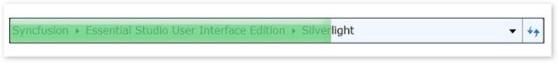

::: {style="DISPLAY: none"}
{#d2h_url_template}{#d2h_package_url style="WIDTH: 0px; DISPLAY: none; HEIGHT: 0px"}
:::

::: {.d2h_secondary_topic style="PADDING-BOTTOM: 10pt; MARGIN: 0pt; PADDING-LEFT: 0pt; PADDING-RIGHT: 0pt; PADDING-TOP: 0pt"}
##### Progress Bar

The progress bar for the HierarchyNavigator control can be displayed or removed.

{border="0"}

Figure 1027: Progress bar

Displaying the progress bar can be enabled in two ways:

[·      ]{style="FONT-FAMILY: Symbol"}By calling the **ShowProgressBar** method in **HierarchyNavigator**, which displays the progress bar for a time span of 500 ms.

 

 

+------------------------------------------------------------------------------------------------------------------------------------------------------------------------------------------------------------------------------------------+
| **[C#]{style="FONT-FAMILY: 'Courier New'"}**[]{style="FONT-FAMILY: Consolas; COLOR: #2b91af; FONT-SIZE: 9.5pt"}                                                                                                                          |
|                                                                                                                                                                                                                                          |
| []{style="FONT-FAMILY: Consolas; COLOR: #2b91af; FONT-SIZE: 9.5pt"}                                                                                                                                                                      |
|                                                                                                                                                                                                                                          |
| [HierarchyNavigator]{style="FONT-FAMILY: Consolas; COLOR: #2b91af; FONT-SIZE: 9.5pt"}[ hierarchyNavigator = [new]{style="COLOR: blue"} [HierarchyNavigator]{style="COLOR: #2b91af"}();]{style="FONT-FAMILY: Consolas; FONT-SIZE: 9.5pt"} |
|                                                                                                                                                                                                                                          |
| [hierarchyNavigator.ShowProgressBar();]{style="FONT-FAMILY: Consolas; FONT-SIZE: 9.5pt"}                                                                                                                                                 |
+------------------------------------------------------------------------------------------------------------------------------------------------------------------------------------------------------------------------------------------+

[]{style="FONT-FAMILY: 'Calibri','sans-serif'"} 

[·      ]{style="FONT-FAMILY: Symbol"}Or by passing an argument in the method to show a specified time span (below, a time span of 1000 ms has been passed).

 

 

+------------------------------------------------------------------------------------------------------------------------------------------------------------------------------------------------------------------------------------------+
| **[C#]{style="FONT-FAMILY: 'Courier New'"}**[]{style="FONT-FAMILY: Consolas; COLOR: #2b91af; FONT-SIZE: 9.5pt"}                                                                                                                          |
|                                                                                                                                                                                                                                          |
| []{style="FONT-FAMILY: Consolas; COLOR: #2b91af; FONT-SIZE: 9.5pt"}                                                                                                                                                                      |
|                                                                                                                                                                                                                                          |
| [HierarchyNavigator]{style="FONT-FAMILY: Consolas; COLOR: #2b91af; FONT-SIZE: 9.5pt"}[ hierarchyNavigator = [new]{style="COLOR: blue"} [HierarchyNavigator]{style="COLOR: #2b91af"}();]{style="FONT-FAMILY: Consolas; FONT-SIZE: 9.5pt"} |
|                                                                                                                                                                                                                                          |
| [hierarchyNavigator.ShowProgressBar([new]{style="COLOR: blue"} [TimeSpan]{style="COLOR: #2b91af"}(0, 0, 0, 0, 1000));]{style="FONT-FAMILY: Consolas; FONT-SIZE: 9.5pt"}                                                                  |
+------------------------------------------------------------------------------------------------------------------------------------------------------------------------------------------------------------------------------------------+

[]{style="FONT-FAMILY: 'Calibri','sans-serif'"} 

The progress bar can be canceled in two ways:

5.   By calling the CancelProgressBar method in HierarchyNavigator.

 

 

+------------------------------------------------------------------------------------------------------------------------------------------------------------------------------------------------------------------------------------------+
| **[C#]{style="FONT-FAMILY: 'Courier New'"}**[]{style="FONT-FAMILY: Consolas; COLOR: #2b91af; FONT-SIZE: 9.5pt"}                                                                                                                          |
|                                                                                                                                                                                                                                          |
| []{style="FONT-FAMILY: Consolas; COLOR: #2b91af; FONT-SIZE: 9.5pt"}                                                                                                                                                                      |
|                                                                                                                                                                                                                                          |
| [HierarchyNavigator]{style="FONT-FAMILY: Consolas; COLOR: #2b91af; FONT-SIZE: 9.5pt"}[ hierarchyNavigator = [new]{style="COLOR: blue"} [HierarchyNavigator]{style="COLOR: #2b91af"}();]{style="FONT-FAMILY: Consolas; FONT-SIZE: 9.5pt"} |
|                                                                                                                                                                                                                                          |
| [hierarchyNavigator.CancelProgressBar();]{style="FONT-FAMILY: Consolas; FONT-SIZE: 9.5pt"}                                                                                                                                               |
+------------------------------------------------------------------------------------------------------------------------------------------------------------------------------------------------------------------------------------------+

[]{style="FONT-FAMILY: 'Calibri','sans-serif'"} 

6.   Or by passing an argument in the method to cancel the progress bar within a particular span of time; this way users can cancel the progress bar when they prefer (below, a time span of 1000 ms has been passed).

 

+------------------------------------------------------------------------------------------------------------------------------------------------------------------------------------------------------------------------------------------+
| **[C#]{style="FONT-FAMILY: 'Courier New'"}**[]{style="FONT-FAMILY: Consolas; COLOR: #2b91af; FONT-SIZE: 9.5pt"}                                                                                                                          |
|                                                                                                                                                                                                                                          |
| []{style="FONT-FAMILY: Consolas; COLOR: #2b91af; FONT-SIZE: 9.5pt"}                                                                                                                                                                      |
|                                                                                                                                                                                                                                          |
| [HierarchyNavigator]{style="FONT-FAMILY: Consolas; COLOR: #2b91af; FONT-SIZE: 9.5pt"}[ hierarchyNavigator = [new]{style="COLOR: blue"} [HierarchyNavigator]{style="COLOR: #2b91af"}();]{style="FONT-FAMILY: Consolas; FONT-SIZE: 9.5pt"} |
|                                                                                                                                                                                                                                          |
| [hierarchyNavigator.CancelProgressBar([new]{style="COLOR: blue"} [TimeSpan]{style="COLOR: #2b91af"}(0, 0, 0, 0, 1000));]{style="FONT-FAMILY: Consolas; FONT-SIZE: 9.5pt"}                                                                |
+------------------------------------------------------------------------------------------------------------------------------------------------------------------------------------------------------------------------------------------+

**[]{style="FONT-FAMILY: 'Cambria','serif'; COLOR: #4f81bd"}** 

[]{#related-topics}
:::
