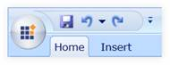
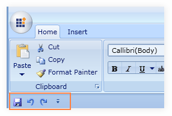
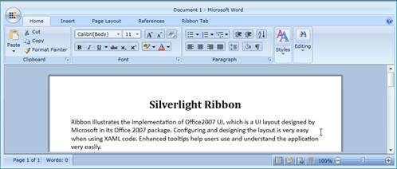
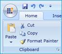
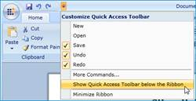
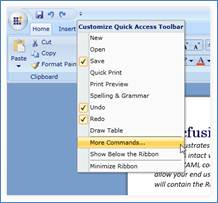
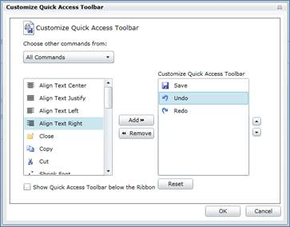

::: {style="DISPLAY: none"}
{#d2h_url_template}{#d2h_package_url style="WIDTH: 0px; DISPLAY: none; HEIGHT: 0px"}
:::

:::: {.d2h_secondary_topic style="PADDING-BOTTOM: 10pt; MARGIN: 0pt; PADDING-LEFT: 0pt; PADDING-RIGHT: 0pt; PADDING-TOP: 0pt"}
##### Quick Access Toolbar

###### Members

 

The Quick Access Toolbar class type exposes the following members:

1.1.1.1.1.1.8      Properties

 

::: {align="center"}
  -------------- -------------------------------------- ------------------ ------------------------------------------------ --------------- ------------------------------------------------------------------------------------------
  Name           Type                                   Value it accepts   Description                                      Default Value   Reference Link
  HasGeometry    Boolean                                True or False      Used to Show or Hide Geometry                    true            [Has Geometry]{style="COLOR: windowtext; TEXT-DECORATION: none; text-underline: none"}
  QATMenuItems   ObservableCollection\<RibbonButton\>   Ribbon Button      Used to Show Menu items in the drop down popup   \-              [Add Menu Items]{style="COLOR: windowtext; TEXT-DECORATION: none; text-underline: none"}
  -------------- -------------------------------------- ------------------ ------------------------------------------------ --------------- ------------------------------------------------------------------------------------------
:::

[]{style="FONT-FAMILY: 'Calibri','sans-serif'"} 

###### Declaring Quick Access Toolbar

 

**Namespace**: Syncfusion.Windows.Tools.Controls

**Assembly**: Syncfusion.Ribbon.Silverlight

*Quick Access* toolbar in the Ribbon instance is used to group the most commonly used commands and accesses the commands easily by just clicking the item in the *Quick Access Toolbar* (QAT). QAT can be placed above or below the ribbon.

[]{style="FONT-FAMILY: 'Calibri','sans-serif'"} 

1.1.1.1.1.1.9      Adding Items to QAT

 

+---------------------------------------------------------------------------------------------------------------------------------------------------------------------------------------------------------------------------------------------------------------------------------------------------------------------------------------------------------------------------------------------------------------------------------------------------------------------------------------------------------------------------------------------------------------------------------------------------------------+
| [XAML]{style="FONT-FAMILY: 'Courier New'"}                                                                                                                                                                                                                                                                                                                                                                                                                                                                                                                                                                    |
|                                                                                                                                                                                                                                                                                                                                                                                                                                                                                                                                                                                                               |
| []{style="FONT-FAMILY: 'Courier New'; COLOR: blue"}                                                                                                                                                                                                                                                                                                                                                                                                                                                                                                                                                           |
|                                                                                                                                                                                                                                                                                                                                                                                                                                                                                                                                                                                                               |
| [\<]{style="FONT-FAMILY: 'Courier New'; COLOR: blue"}[syncfusion]{style="FONT-FAMILY: 'Courier New'; COLOR: #a31515"}[:]{style="FONT-FAMILY: 'Courier New'; COLOR: blue"}[Ribbon.QuickAccessToolBar]{style="FONT-FAMILY: 'Courier New'; COLOR: #a31515"}[\>]{style="FONT-FAMILY: 'Courier New'; COLOR: blue"}[]{style="FONT-FAMILY: 'Courier New'"}                                                                                                                                                                                                                                                           |
|                                                                                                                                                                                                                                                                                                                                                                                                                                                                                                                                                                                                               |
| [   ]{style="FONT-FAMILY: 'Courier New'; COLOR: #a31515"}[\<]{style="FONT-FAMILY: 'Courier New'; COLOR: blue"}[syncfusion]{style="FONT-FAMILY: 'Courier New'; COLOR: #a31515"}[:]{style="FONT-FAMILY: 'Courier New'; COLOR: blue"}[QuickAccessToolBar]{style="FONT-FAMILY: 'Courier New'; COLOR: #a31515"}[\>]{style="FONT-FAMILY: 'Courier New'; COLOR: blue"}[]{style="FONT-FAMILY: 'Courier New'"}                                                                                                                                                                                                         |
|                                                                                                                                                                                                                                                                                                                                                                                                                                                                                                                                                                                                               |
| [        ]{style="FONT-FAMILY: 'Courier New'; COLOR: #a31515"}[\<]{style="FONT-FAMILY: 'Courier New'; COLOR: blue"}[syncfusion]{style="FONT-FAMILY: 'Courier New'; COLOR: #a31515"}[:]{style="FONT-FAMILY: 'Courier New'; COLOR: blue"}[RibbonButton]{style="FONT-FAMILY: 'Courier New'; COLOR: #a31515"}[ SmallIcon]{style="FONT-FAMILY: 'Courier New'; COLOR: red"}[=\"Save.png\"]{style="FONT-FAMILY: 'Courier New'; COLOR: blue"}[ SizeMode]{style="FONT-FAMILY: 'Courier New'; COLOR: red"}[=\"Small\"/\>]{style="FONT-FAMILY: 'Courier New'; COLOR: blue"}[]{style="FONT-FAMILY: 'Courier New'"}        |
|                                                                                                                                                                                                                                                                                                                                                                                                                                                                                                                                                                                                               |
| [        ]{style="FONT-FAMILY: 'Courier New'; COLOR: #a31515"}[\<]{style="FONT-FAMILY: 'Courier New'; COLOR: blue"}[syncfusion]{style="FONT-FAMILY: 'Courier New'; COLOR: #a31515"}[:]{style="FONT-FAMILY: 'Courier New'; COLOR: blue"}[RibbonSplitButton]{style="FONT-FAMILY: 'Courier New'; COLOR: #a31515"}[ SmallIcon]{style="FONT-FAMILY: 'Courier New'; COLOR: red"}[=\"Undo16.png\"]{style="FONT-FAMILY: 'Courier New'; COLOR: blue"}[ SizeMode]{style="FONT-FAMILY: 'Courier New'; COLOR: red"}[=\"Small\"/\>]{style="FONT-FAMILY: 'Courier New'; COLOR: blue"}[]{style="FONT-FAMILY: 'Courier New'"} |
|                                                                                                                                                                                                                                                                                                                                                                                                                                                                                                                                                                                                               |
| [        ]{style="FONT-FAMILY: 'Courier New'; COLOR: #a31515"}[\<]{style="FONT-FAMILY: 'Courier New'; COLOR: blue"}[syncfusion]{style="FONT-FAMILY: 'Courier New'; COLOR: #a31515"}[:]{style="FONT-FAMILY: 'Courier New'; COLOR: blue"}[RibbonButton]{style="FONT-FAMILY: 'Courier New'; COLOR: #a31515"}[ SmallIcon]{style="FONT-FAMILY: 'Courier New'; COLOR: red"}[=\"Redo16.png\"]{style="FONT-FAMILY: 'Courier New'; COLOR: blue"}[ SizeMode]{style="FONT-FAMILY: 'Courier New'; COLOR: red"}[=\"Small\"/\>]{style="FONT-FAMILY: 'Courier New'; COLOR: blue"}[]{style="FONT-FAMILY: 'Courier New'"}      |
|                                                                                                                                                                                                                                                                                                                                                                                                                                                                                                                                                                                                               |
| [   ]{style="FONT-FAMILY: 'Courier New'; COLOR: #a31515"}[\</]{style="FONT-FAMILY: 'Courier New'; COLOR: blue"}[syncfusion]{style="FONT-FAMILY: 'Courier New'; COLOR: #a31515"}[:]{style="FONT-FAMILY: 'Courier New'; COLOR: blue"}[QuickAccessToolBar]{style="FONT-FAMILY: 'Courier New'; COLOR: #a31515"}[\>]{style="FONT-FAMILY: 'Courier New'; COLOR: blue"}[]{style="FONT-FAMILY: 'Courier New'"}                                                                                                                                                                                                        |
|                                                                                                                                                                                                                                                                                                                                                                                                                                                                                                                                                                                                               |
| [\</]{style="FONT-FAMILY: 'Courier New'; COLOR: blue"}[syncfusion]{style="FONT-FAMILY: 'Courier New'; COLOR: #a31515"}[:]{style="FONT-FAMILY: 'Courier New'; COLOR: blue"}[Ribbon.QuickAccessToolBar]{style="FONT-FAMILY: 'Courier New'; COLOR: #a31515"}[\>]{style="FONT-FAMILY: 'Courier New'; COLOR: blue"}                                                                                                                                                                                                                                                                                                |
+---------------------------------------------------------------------------------------------------------------------------------------------------------------------------------------------------------------------------------------------------------------------------------------------------------------------------------------------------------------------------------------------------------------------------------------------------------------------------------------------------------------------------------------------------------------------------------------------------------------+

[]{style="FONT-FAMILY: 'Calibri','sans-serif'"} 

{border="0"}

**[]{style="FONT-FAMILY: 'Calibri','sans-serif'; COLOR: #4f81bd"}** 

Figure 523: Quick Access Toolbar

1.1.1.1.1.1.10     Positioning the Quick Access Toolbar

 

Quick Access Toolbar can be placed above or below the Ribbon using the Tool Bar State property.

The following code snippet explains the implementation.

+-------------------------------------------------------------------------------------------------------------------------------------------------------------------------------------------------------------------------------------------------------------------------------------------------------------------------------------------------------------------------------------------------------------------------------------------------------------------------------------------------------------------------------------------------------------------------------------------------------------------------+
| [XAML]{style="FONT-FAMILY: 'Courier New'"}                                                                                                                                                                                                                                                                                                                                                                                                                                                                                                                                                                              |
|                                                                                                                                                                                                                                                                                                                                                                                                                                                                                                                                                                                                                         |
| []{style="FONT-FAMILY: 'Courier New'; COLOR: blue"}                                                                                                                                                                                                                                                                                                                                                                                                                                                                                                                                                                     |
|                                                                                                                                                                                                                                                                                                                                                                                                                                                                                                                                                                                                                         |
| [\<]{style="FONT-FAMILY: 'Courier New'; COLOR: blue"}[syncfusion]{style="FONT-FAMILY: 'Courier New'; COLOR: #a31515"}[:]{style="FONT-FAMILY: 'Courier New'; COLOR: blue"}[Ribbon]{style="FONT-FAMILY: 'Courier New'; COLOR: #a31515"}[ Title]{style="FONT-FAMILY: 'Courier New'; COLOR: red"}[=\"My Ribbon\"]{style="FONT-FAMILY: 'Courier New'; COLOR: blue"}[ Name]{style="FONT-FAMILY: 'Courier New'; COLOR: red"}[=\"myRibbon\"]{style="FONT-FAMILY: 'Courier New'; COLOR: blue"}[ QATState]{style="FONT-FAMILY: 'Courier New'; COLOR: red"}[=\"BelowRibbon\" /\>]{style="FONT-FAMILY: 'Courier New'; COLOR: blue"} |
+-------------------------------------------------------------------------------------------------------------------------------------------------------------------------------------------------------------------------------------------------------------------------------------------------------------------------------------------------------------------------------------------------------------------------------------------------------------------------------------------------------------------------------------------------------------------------------------------------------------------------+

[]{style="FONT-FAMILY: 'Calibri','sans-serif'; FONT-SIZE: 12pt"} 

{border="0"}

Figure 524: QAT Shown below the Ribbon

1.1.1.1.1.1.11     Hiding Quick Access Toolbar

*[]{style="FONT-FAMILY: 'Calibri','sans-serif'"}* 

Quick Access Toolbar can be hidden by setting the Tool Bar State property to Hidden.

+------------------------------------------------------------------------------------------------------------------------------------------------------------------------------------------------------------------------------------------------------------------------------------------------------------------------------------------------------------------------------------------------------------------------------------------------------------------------------------------------------------------------------------------------------------------------------------------------------------------+
| [XAML]{style="FONT-FAMILY: 'Courier New'"}                                                                                                                                                                                                                                                                                                                                                                                                                                                                                                                                                                       |
|                                                                                                                                                                                                                                                                                                                                                                                                                                                                                                                                                                                                                  |
| []{style="FONT-FAMILY: 'Courier New'; COLOR: blue"}                                                                                                                                                                                                                                                                                                                                                                                                                                                                                                                                                              |
|                                                                                                                                                                                                                                                                                                                                                                                                                                                                                                                                                                                                                  |
| [\<]{style="FONT-FAMILY: 'Courier New'; COLOR: blue"}[syncfusion]{style="FONT-FAMILY: 'Courier New'; COLOR: #a31515"}[:]{style="FONT-FAMILY: 'Courier New'; COLOR: blue"}[Ribbon]{style="FONT-FAMILY: 'Courier New'; COLOR: #a31515"}[ Title]{style="FONT-FAMILY: 'Courier New'; COLOR: red"}[=\"My Ribbon\"]{style="FONT-FAMILY: 'Courier New'; COLOR: blue"}[ Name]{style="FONT-FAMILY: 'Courier New'; COLOR: red"}[=\"myRibbon\"]{style="FONT-FAMILY: 'Courier New'; COLOR: blue"}[ QATState]{style="FONT-FAMILY: 'Courier New'; COLOR: red"}[=\"Hidden\"\>]{style="FONT-FAMILY: 'Courier New'; COLOR: blue"} |
|                                                                                                                                                                                                                                                                                                                                                                                                                                                                                                                                                                                                                  |
| [   \<]{style="FONT-FAMILY: 'Courier New'; COLOR: blue"}[syncfusion]{style="FONT-FAMILY: 'Courier New'; COLOR: #a31515"}[:]{style="FONT-FAMILY: 'Courier New'; COLOR: blue"}[Ribbon.QuickAccessToolBar]{style="FONT-FAMILY: 'Courier New'; COLOR: #a31515"}[\>]{style="FONT-FAMILY: 'Courier New'; COLOR: blue"}[\                                                                                                                                                                                                                                                                                               |
| [      ]{style="COLOR: #a31515"}[\<]{style="COLOR: blue"}[syncfusion]{style="COLOR: #a31515"}[:]{style="COLOR: blue"}[QuickAccessToolBar]{style="COLOR: #a31515"}[ x]{style="COLOR: red"}[:]{style="COLOR: blue"}[Name]{style="COLOR: red"}[=\"PART_QuickAccessToolBar\"\>]{style="COLOR: blue"}\                                                                                                                                                                                                                                                                                                                |
| [         ]{style="COLOR: #a31515"}[\<]{style="COLOR: blue"}[syncfusion]{style="COLOR: #a31515"}[:]{style="COLOR: blue"}[RibbonButton]{style="COLOR: #a31515"}[ SizeMode]{style="COLOR: red"}[=\"Small\" /\>]{style="COLOR: blue"}\                                                                                                                                                                                                                                                                                                                                                                              |
| [         ]{style="COLOR: #a31515"}[\<]{style="COLOR: blue"}[syncfusion]{style="COLOR: #a31515"}[:]{style="COLOR: blue"}[RibbonDropDownButton]{style="COLOR: #a31515"}[ SizeMode]{style="COLOR: red"}[=\"Small\" /\>]{style="COLOR: blue"}\                                                                                                                                                                                                                                                                                                                                                                      |
| [         ]{style="COLOR: #a31515"}[\<]{style="COLOR: blue"}[syncfusion]{style="COLOR: #a31515"}[:]{style="COLOR: blue"}[RibbonButton]{style="COLOR: #a31515"}[ SizeMode]{style="COLOR: red"}[=\"Small\" /\>]{style="COLOR: blue"}\                                                                                                                                                                                                                                                                                                                                                                              |
| [      ]{style="COLOR: #a31515"}[\</]{style="COLOR: blue"}[syncfusion]{style="COLOR: #a31515"}[:]{style="COLOR: blue"}[QuickAccessToolBar]{style="COLOR: #a31515"}[\>]{style="COLOR: blue"}\                                                                                                                                                                                                                                                                                                                                                                                                                     |
| [    ]{style="COLOR: #a31515"}[\</]{style="COLOR: blue"}[syncfusion]{style="COLOR: #a31515"}[:]{style="COLOR: blue"}[Ribbon.QuickAccessToolBar]{style="COLOR: #a31515"}[\>]{style="COLOR: blue"}]{style="FONT-FAMILY: 'Courier New'"}                                                                                                                                                                                                                                                                                                                                                                            |
|                                                                                                                                                                                                                                                                                                                                                                                                                                                                                                                                                                                                                  |
| [\</]{style="FONT-FAMILY: 'Courier New'; COLOR: blue"}[syncfusion]{style="FONT-FAMILY: 'Courier New'; COLOR: #a31515"}[:]{style="FONT-FAMILY: 'Courier New'; COLOR: blue"}[Ribbon\>]{style="FONT-FAMILY: 'Courier New'; COLOR: #a31515"}[]{style="FONT-FAMILY: 'Courier New'; COLOR: blue"}                                                                                                                                                                                                                                                                                                                      |
+------------------------------------------------------------------------------------------------------------------------------------------------------------------------------------------------------------------------------------------------------------------------------------------------------------------------------------------------------------------------------------------------------------------------------------------------------------------------------------------------------------------------------------------------------------------------------------------------------------------+

[]{style="FONT-FAMILY: 'Calibri','sans-serif'"} 

{border="0"}

Figure 525: QAT Hidden

[]{#_Set_HasGeometry}1.1.1.1.1.1.12     Set HasGeometry

 

+------------------------------------------------------------------------------------------------------------------------------------------------------------------------------------------------------------------------------------------------------------------------------------------------------------------------------------------------------------------------------------------------------------------------------------------------------------------------------------------------------------------------------------------------------------------------------------------------------------------+
| [XAML]{style="FONT-FAMILY: 'Courier New'"}                                                                                                                                                                                                                                                                                                                                                                                                                                                                                                                                                                       |
|                                                                                                                                                                                                                                                                                                                                                                                                                                                                                                                                                                                                                  |
| []{style="FONT-FAMILY: 'Courier New'; COLOR: blue"}                                                                                                                                                                                                                                                                                                                                                                                                                                                                                                                                                              |
|                                                                                                                                                                                                                                                                                                                                                                                                                                                                                                                                                                                                                  |
| [\<]{style="FONT-FAMILY: 'Courier New'; COLOR: blue"}[syncfusion]{style="FONT-FAMILY: 'Courier New'; COLOR: #a31515"}[:]{style="FONT-FAMILY: 'Courier New'; COLOR: blue"}[Ribbon]{style="FONT-FAMILY: 'Courier New'; COLOR: #a31515"}[ Title]{style="FONT-FAMILY: 'Courier New'; COLOR: red"}[=\"My Ribbon\"]{style="FONT-FAMILY: 'Courier New'; COLOR: blue"}[ Name]{style="FONT-FAMILY: 'Courier New'; COLOR: red"}[=\"myRibbon\"]{style="FONT-FAMILY: 'Courier New'; COLOR: blue"}[ QATState]{style="FONT-FAMILY: 'Courier New'; COLOR: red"}[=\"Hidden\"\>]{style="FONT-FAMILY: 'Courier New'; COLOR: blue"} |
|                                                                                                                                                                                                                                                                                                                                                                                                                                                                                                                                                                                                                  |
| [   \<]{style="FONT-FAMILY: 'Courier New'; COLOR: blue"}[syncfusion]{style="FONT-FAMILY: 'Courier New'; COLOR: #a31515"}[:]{style="FONT-FAMILY: 'Courier New'; COLOR: blue"}[Ribbon.QuickAccessToolBar]{style="FONT-FAMILY: 'Courier New'; COLOR: #a31515"}[\>]{style="FONT-FAMILY: 'Courier New'; COLOR: blue"}[\                                                                                                                                                                                                                                                                                               |
| [      ]{style="COLOR: #a31515"}[\<]{style="COLOR: blue"}[syncfusion]{style="COLOR: #a31515"}[:]{style="COLOR: blue"}[QuickAccessToolBar ]{style="COLOR: #a31515"}[HasGeometry]{style="COLOR: red"}[=\"False\"\>]{style="COLOR: blue"} .........[]{style="COLOR: blue"}]{style="FONT-FAMILY: 'Courier New'"}                                                                                                                                                                                                                                                                                                     |
+------------------------------------------------------------------------------------------------------------------------------------------------------------------------------------------------------------------------------------------------------------------------------------------------------------------------------------------------------------------------------------------------------------------------------------------------------------------------------------------------------------------------------------------------------------------------------------------------------------------+

[]{style="FONT-FAMILY: 'Calibri','sans-serif'"} 

{border="0"}

Figure 526: QAT Path disabled

[]{#_Add_QAT_Menu}1.1.1.1.1.1.13     Add QAT Menu Items

 

+------------------------------------------------------------------------------------------------------------------------------------------------------------------------------------------------------------------------------------------------------------------------------------------------------------------------------------------------------------------------------------------------------------------------------------------------------------------------------------------------------------------------------------------------------------------------------------------------------------------------------------------------------------------------------------------------------------------------------------------------------------------------------------------------+
| [XAML[]{style="COLOR: blue"}]{style="FONT-FAMILY: 'Courier New'"}                                                                                                                                                                                                                                                                                                                                                                                                                                                                                                                                                                                                                                                                                                                              |
|                                                                                                                                                                                                                                                                                                                                                                                                                                                                                                                                                                                                                                                                                                                                                                                                |
| []{style="FONT-FAMILY: 'Courier New'; COLOR: blue"}                                                                                                                                                                                                                                                                                                                                                                                                                                                                                                                                                                                                                                                                                                                                            |
|                                                                                                                                                                                                                                                                                                                                                                                                                                                                                                                                                                                                                                                                                                                                                                                                |
| [\<]{style="FONT-FAMILY: 'Courier New'; COLOR: blue"}[syncfusion]{style="FONT-FAMILY: 'Courier New'; COLOR: #a31515"}[:]{style="FONT-FAMILY: 'Courier New'; COLOR: blue"}[Ribbon.QuickAccessToolBar]{style="FONT-FAMILY: 'Courier New'; COLOR: #a31515"}[\>]{style="FONT-FAMILY: 'Courier New'; COLOR: blue"}[\                                                                                                                                                                                                                                                                                                                                                                                                                                                                                |
| [   ]{style="COLOR: #a31515"}[\<]{style="COLOR: blue"}[syncfusion]{style="COLOR: #a31515"}[:]{style="COLOR: blue"}[QuickAccessToolBar]{style="COLOR: #a31515"}[\>]{style="COLOR: blue"}\                                                                                                                                                                                                                                                                                                                                                                                                                                                                                                                                                                                                       |
| [     \<]{style="COLOR: blue"}[syncfusion]{style="COLOR: #a31515"}[:]{style="COLOR: blue"}[QuickAccessToolBar.QATMenuItems]{style="COLOR: #a31515"}[\>]{style="COLOR: blue"}]{style="FONT-FAMILY: 'Courier New'"}                                                                                                                                                                                                                                                                                                                                                                                                                                                                                                                                                                              |
|                                                                                                                                                                                                                                                                                                                                                                                                                                                                                                                                                                                                                                                                                                                                                                                                |
| [      \<]{style="FONT-FAMILY: 'Courier New'; COLOR: blue"}[syncfusion]{style="FONT-FAMILY: 'Courier New'; COLOR: #a31515"}[:]{style="FONT-FAMILY: 'Courier New'; COLOR: blue"}[RibbonButton]{style="FONT-FAMILY: 'Courier New'; COLOR: #a31515"}[ Label]{style="FONT-FAMILY: 'Courier New'; COLOR: red"}[=\"New\"]{style="FONT-FAMILY: 'Courier New'; COLOR: blue"}[ Command]{style="FONT-FAMILY: 'Courier New'; COLOR: red"}[=\"{]{style="FONT-FAMILY: 'Courier New'; COLOR: blue"}[Binding]{style="FONT-FAMILY: 'Courier New'; COLOR: #a31515"}[ New]{style="FONT-FAMILY: 'Courier New'; COLOR: red"}[}\"]{style="FONT-FAMILY: 'Courier New'; COLOR: blue"}[ SmallIcon]{style="FONT-FAMILY: 'Courier New'; COLOR: red"}[=\"New.png\"/\>]{style="FONT-FAMILY: 'Courier New'; COLOR: blue"}[\ |
| [      \<]{style="COLOR: blue"}[syncfusion]{style="COLOR: #a31515"}[:]{style="COLOR: blue"}[RibbonButton]{style="COLOR: #a31515"}[ Label]{style="COLOR: red"}[=\"Open\"]{style="COLOR: blue"}[ Command]{style="COLOR: red"}[=\"{]{style="COLOR: blue"}[Binding]{style="COLOR: #a31515"}[ Open]{style="COLOR: red"}[}\"]{style="COLOR: blue"}[ SmallIcon]{style="COLOR: red"}[=\"Open.png\"/\>]{style="COLOR: blue"}\                                                                                                                                                                                                                                                                                                                                                                           |
| [      \<]{style="COLOR: blue"}[syncfusion]{style="COLOR: #a31515"}[:]{style="COLOR: blue"}[RibbonButton]{style="COLOR: #a31515"}[ Label]{style="COLOR: red"}[=\"Save\"]{style="COLOR: blue"}[ Command]{style="COLOR: red"}[=\"{]{style="COLOR: blue"}[Binding]{style="COLOR: #a31515"}[ Save]{style="COLOR: red"}[}\"]{style="COLOR: blue"}[ SmallIcon]{style="COLOR: red"}[=\"Save.png\"/\>]{style="COLOR: blue"}\                                                                                                                                                                                                                                                                                                                                                                           |
| [      \<]{style="COLOR: blue"}[syncfusion]{style="COLOR: #a31515"}[:]{style="COLOR: blue"}[RibbonButton]{style="COLOR: #a31515"}[ Label]{style="COLOR: red"}[=\"Undo\"]{style="COLOR: blue"}[ Command]{style="COLOR: red"}[=\"{]{style="COLOR: blue"}[Binding]{style="COLOR: #a31515"}[ Undo]{style="COLOR: red"}[}\"]{style="COLOR: blue"}[ SmallIcon]{style="COLOR: red"}[=\"Undo.png\"/\>]{style="COLOR: blue"}\                                                                                                                                                                                                                                                                                                                                                                           |
| [      \<]{style="COLOR: blue"}[syncfusion]{style="COLOR: #a31515"}[:]{style="COLOR: blue"}[RibbonButton]{style="COLOR: #a31515"}[ Label]{style="COLOR: red"}[=\"Redo\"]{style="COLOR: blue"}[ Command]{style="COLOR: red"}[=\"{]{style="COLOR: blue"}[Binding]{style="COLOR: #a31515"}[ Redo]{style="COLOR: red"}[}\"]{style="COLOR: blue"}[ SmallIcon]{style="COLOR: red"}[=\"Redo.png\"/\>]{style="COLOR: blue"}]{style="FONT-FAMILY: 'Courier New'"}                                                                                                                                                                                                                                                                                                                                       |
|                                                                                                                                                                                                                                                                                                                                                                                                                                                                                                                                                                                                                                                                                                                                                                                                |
| [      ]{style="FONT-FAMILY: 'Courier New'; COLOR: #a31515"}[\</]{style="FONT-FAMILY: 'Courier New'; COLOR: blue"}[syncfusion]{style="FONT-FAMILY: 'Courier New'; COLOR: #a31515"}[:]{style="FONT-FAMILY: 'Courier New'; COLOR: blue"}[QuickAccessToolBar.QATMenuItems]{style="FONT-FAMILY: 'Courier New'; COLOR: #a31515"}[\>]{style="FONT-FAMILY: 'Courier New'; COLOR: blue"}[\                                                                                                                                                                                                                                                                                                                                                                                                             |
| [    ]{style="COLOR: #a31515"}[\</]{style="COLOR: blue"}[syncfusion]{style="COLOR: #a31515"}[:]{style="COLOR: blue"}[QuickAccessToolBar]{style="COLOR: #a31515"}[\>]{style="COLOR: blue"}\                                                                                                                                                                                                                                                                                                                                                                                                                                                                                                                                                                                                     |
| [\</]{style="COLOR: blue"}[syncfusion]{style="COLOR: #a31515"}[:]{style="COLOR: blue"}[Ribbon.QuickAccessToolBar]{style="COLOR: #a31515"}[\>]{style="COLOR: blue"}]{style="FONT-FAMILY: 'Courier New'"}                                                                                                                                                                                                                                                                                                                                                                                                                                                                                                                                                                                        |
+------------------------------------------------------------------------------------------------------------------------------------------------------------------------------------------------------------------------------------------------------------------------------------------------------------------------------------------------------------------------------------------------------------------------------------------------------------------------------------------------------------------------------------------------------------------------------------------------------------------------------------------------------------------------------------------------------------------------------------------------------------------------------------------------+

[]{style="FONT-FAMILY: 'Calibri','sans-serif'"} 

+-----------------------------------------------------------------------------------------------------------------------------------------------------------------------------------------------------------------------------------------------+
| **[\[C#\]]{style="FONT-FAMILY: 'Courier New'"}**                                                                                                                                                                                              |
|                                                                                                                                                                                                                                               |
| **[]{style="FONT-FAMILY: 'Courier New'"}**                                                                                                                                                                                                    |
|                                                                                                                                                                                                                                               |
| [QuickAccessToolBar]{style="FONT-FAMILY: 'Courier New'; COLOR: #2b91af"}[ qat = [new]{style="COLOR: blue"} [QuickAccessToolBar]{style="COLOR: #2b91af"}();\                                                                                   |
|  \                                                                                                                                                                                                                                            |
| [var]{style="COLOR: blue"} rbnbtn = [new]{style="COLOR: blue"} [RibbonButton]{style="COLOR: #2b91af"}();\                                                                                                                                     |
| rbnbtn.Label = [\"New\"]{style="COLOR: #a31515"};]{style="FONT-FAMILY: 'Courier New'"}                                                                                                                                                        |
|                                                                                                                                                                                                                                               |
| [rbnbtn.Command = New;]{style="FONT-FAMILY: 'Courier New'"}                                                                                                                                                                                   |
|                                                                                                                                                                                                                                               |
| [rbnbtn.SmallIcon = [new]{style="COLOR: blue"} [BitmapImage]{style="COLOR: #2b91af"}([new]{style="COLOR: blue"} [Uri]{style="COLOR: #2b91af"}([\"New.png\"]{style="COLOR: #a31515"}, [UriKind]{style="COLOR: #2b91af"}.RelativeOrAbsolute));\ |
| qat.QATMenuItems.Add(rbnbtn);\                                                                                                                                                                                                                |
|  \                                                                                                                                                                                                                                            |
| rbnbtn = [new]{style="COLOR: blue"} [RibbonButton]{style="COLOR: #2b91af"}();\                                                                                                                                                                |
| rbnbtn.Label = [\"Open\"]{style="COLOR: #a31515"};]{style="FONT-FAMILY: 'Courier New'"}                                                                                                                                                       |
|                                                                                                                                                                                                                                               |
| [rbnbtn.Command = Open;\                                                                                                                                                                                                                      |
| rbnbtn.SmallIcon = [new]{style="COLOR: blue"} [BitmapImage]{style="COLOR: #2b91af"}([new]{style="COLOR: blue"} [Uri]{style="COLOR: #2b91af"}([\"Open.png\"]{style="COLOR: #a31515"}, [UriKind]{style="COLOR: #2b91af"}.RelativeOrAbsolute));\ |
| qat.QATMenuItems.Add(rbnbtn);\                                                                                                                                                                                                                |
|  \                                                                                                                                                                                                                                            |
| rbnbtn = [new]{style="COLOR: blue"} [RibbonButton]{style="COLOR: #2b91af"}();\                                                                                                                                                                |
| rbnbtn.Label = [\"Save\"]{style="COLOR: #a31515"};]{style="FONT-FAMILY: 'Courier New'"}                                                                                                                                                       |
|                                                                                                                                                                                                                                               |
| [rbnbtn.Command = Save;\                                                                                                                                                                                                                      |
| rbnbtn.SmallIcon = [new]{style="COLOR: blue"} [BitmapImage]{style="COLOR: #2b91af"}([new]{style="COLOR: blue"} [Uri]{style="COLOR: #2b91af"}([\"Save.png\"]{style="COLOR: #a31515"}, [UriKind]{style="COLOR: #2b91af"}.RelativeOrAbsolute));\ |
| qat.QATMenuItems.Add(rbnbtn);\                                                                                                                                                                                                                |
|  \                                                                                                                                                                                                                                            |
| rbnbtn = [new]{style="COLOR: blue"} [RibbonButton]{style="COLOR: #2b91af"}();\                                                                                                                                                                |
| rbnbtn.Label = [\"Undo\"]{style="COLOR: #a31515"};]{style="FONT-FAMILY: 'Courier New'"}                                                                                                                                                       |
|                                                                                                                                                                                                                                               |
| [rbnbtn.Command = Undo;\                                                                                                                                                                                                                      |
| rbnbtn.SmallIcon = [new]{style="COLOR: blue"} [BitmapImage]{style="COLOR: #2b91af"}([new]{style="COLOR: blue"} [Uri]{style="COLOR: #2b91af"}([\"Undo.png\"]{style="COLOR: #a31515"}, [UriKind]{style="COLOR: #2b91af"}.RelativeOrAbsolute));\ |
| qat.QATMenuItems.Add(rbnbtn);\                                                                                                                                                                                                                |
|  \                                                                                                                                                                                                                                            |
| rbnbtn = [new]{style="COLOR: blue"} [RibbonButton]{style="COLOR: #2b91af"}();\                                                                                                                                                                |
| rbnbtn.Label = [\"Redo\"]{style="COLOR: #a31515"};]{style="FONT-FAMILY: 'Courier New'"}                                                                                                                                                       |
|                                                                                                                                                                                                                                               |
| [rbnbtn.Command = Redo;\                                                                                                                                                                                                                      |
| rbnbtn.SmallIcon = [new]{style="COLOR: blue"} [BitmapImage]{style="COLOR: #2b91af"}([new]{style="COLOR: blue"} [Uri]{style="COLOR: #2b91af"}([\"Redo.png\"]{style="COLOR: #a31515"}, [UriKind]{style="COLOR: #2b91af"}.RelativeOrAbsolute));\ |
| qat.QATMenuItems.Add(rbnbtn);]{style="FONT-FAMILY: 'Courier New'"}                                                                                                                                                                            |
|                                                                                                                                                                                                                                               |
| **[]{style="FONT-FAMILY: 'Courier New'"}**                                                                                                                                                                                                    |
+-----------------------------------------------------------------------------------------------------------------------------------------------------------------------------------------------------------------------------------------------+

[]{style="FONT-FAMILY: 'Calibri','sans-serif'"} 

{border="0"}

**[]{style="FONT-FAMILY: 'Calibri','sans-serif'; COLOR: #4f81bd"}** 

Figure 527: QAT Menu Items

###### QAT Customization Dialog

 

QAT Customization Dialog implementation focused mainly on end-user customization. Using this window the end user can easily customize the QAT. The user can register the custom commands using the Ribbon Command Manager Class, so that the end user can pick the commands from this Dialog.

The QAT Customization Dialog can be shown by clicking the More Commands option as shown in the following screenshot.

{border="0"}

Figure 528: QAT Drop Down Items

{border="0"}

**[]{style="FONT-FAMILY: 'Calibri','sans-serif'; COLOR: #4f81bd"}** 

Figure 529: QAT Customization Dialog

The user can register any n number of commands. For example, the Copy and Cut commands are registered as given below.

 

+-------------------------------------------------------------------------------------------------------------------------------------------------------------------------------------------------------------------------------------------------------------------------------------------------------------------------------------------------------------------------------------------------------------------------------------------+
| **[\[C#\]]{style="FONT-FAMILY: 'Courier New'"}**                                                                                                                                                                                                                                                                                                                                                                                          |
|                                                                                                                                                                                                                                                                                                                                                                                                                                           |
| []{style="FONT-FAMILY: 'Courier New'; COLOR: #2b91af"}                                                                                                                                                                                                                                                                                                                                                                                    |
|                                                                                                                                                                                                                                                                                                                                                                                                                                           |
| [RibbonCommandManager]{style="FONT-FAMILY: 'Courier New'; COLOR: #2b91af"}[.Register(Copy, [new]{style="COLOR: blue"} [RibbonCommandProvider]{style="COLOR: #2b91af"}([\"Clipboard Commands\"]{style="COLOR: #a31515"}, [\"Copy\"]{style="COLOR: #a31515"}, [\"Copy16.png\"]{style="COLOR: #a31515"},[\"Copy the selection and put it on the Clipboard.\"]{style="COLOR: #a31515"}));]{style="FONT-FAMILY: 'Courier New'"}                |
|                                                                                                                                                                                                                                                                                                                                                                                                                                           |
| []{style="FONT-FAMILY: 'Courier New'"}                                                                                                                                                                                                                                                                                                                                                                                                    |
|                                                                                                                                                                                                                                                                                                                                                                                                                                           |
| [RibbonCommandManager]{style="FONT-FAMILY: 'Courier New'; COLOR: #2b91af"}[.Register(Cut, [new]{style="COLOR: blue"} [RibbonCommandProvider]{style="COLOR: #2b91af"} ([\"Clipboard Commands\"]{style="COLOR: #a31515"}, [\"Cut\"]{style="COLOR: #a31515"}, [\"Cut16.png\"]{style="COLOR: #a31515"},[\"Cut the selection from the document and put it on the Clipboard.\"]{style="COLOR: #a31515"}));]{style="FONT-FAMILY: 'Courier New'"} |
|                                                                                                                                                                                                                                                                                                                                                                                                                                           |
| []{style="FONT-FAMILY: 'Courier New'"}                                                                                                                                                                                                                                                                                                                                                                                                    |
+-------------------------------------------------------------------------------------------------------------------------------------------------------------------------------------------------------------------------------------------------------------------------------------------------------------------------------------------------------------------------------------------------------------------------------------------+

[]{style="FONT-FAMILY: 'Calibri','sans-serif'"} 

See Also:

[Ribbon Command Manager Class]{.UGHyperlink}[]{.UGHyperlink}

[]{#related-topics}
::::
