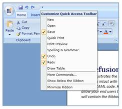

::: {style="DISPLAY: none"}
{#d2h_url_template}{#d2h_package_url style="WIDTH: 0px; DISPLAY: none; HEIGHT: 0px"}
:::

::: {.d2h_secondary_topic style="PADDING-BOTTOM: 10pt; MARGIN: 0pt; PADDING-LEFT: 0pt; PADDING-RIGHT: 0pt; PADDING-TOP: 0pt"}
#### Quick Access Toolbar Synchronization

Ribbon now allows the Quick Access Toolbar to synchronize with custom commands defined by the user. The user can add the custom commands to the Synchronized Commands Collection in the Ribbon. Those commands will be synchronized with QAT.

The code describes the implementation:

+---------------------------------------------------------------------------------------------------------------------------------------------------------------------------------------------------------------------------------------------------------------------------------------------------------------------------------------------------------------------------------------------------------------------+
| [C#[ ]{style="COLOR: #2b91af"}]{style="FONT-FAMILY: 'Courier New'"}                                                                                                                                                                                                                                                                                                                                                 |
|                                                                                                                                                                                                                                                                                                                                                                                                                     |
| []{style="FONT-FAMILY: 'Courier New'; COLOR: #2b91af"}                                                                                                                                                                                                                                                                                                                                                              |
|                                                                                                                                                                                                                                                                                                                                                                                                                     |
| [RibbonCommandProvider]{style="FONT-FAMILY: 'Courier New'; COLOR: #2b91af"}[ \_syncItem = [new]{style="COLOR: blue"} [RibbonCommandProvider]{style="COLOR: #2b91af"}([\"Synchronized Items\"]{style="COLOR: #a31515"}, [\"New\"]{style="COLOR: #a31515"}, [\"New32.png\"]{style="COLOR: #a31515"}) { Command = New };]{style="FONT-FAMILY: 'Courier New'"}                                                          |
|                                                                                                                                                                                                                                                                                                                                                                                                                     |
| [RibbonCommandProvider]{style="FONT-FAMILY: 'Courier New'; COLOR: #2b91af"}[ \_syncItem1 = [new]{style="COLOR: blue"} [RibbonCommandProvider]{style="COLOR: #2b91af"}([\"Synchronized Items\"]{style="COLOR: #a31515"}, [\"Open\"]{style="COLOR: #a31515"}, [\"Open32.png\"]{style="COLOR: #a31515"}) { Command = Open };]{style="FONT-FAMILY: 'Courier New'"}                                                      |
|                                                                                                                                                                                                                                                                                                                                                                                                                     |
| [RibbonCommandProvider]{style="FONT-FAMILY: 'Courier New'; COLOR: #2b91af"}[ \_syncItem2 = [new]{style="COLOR: blue"} [RibbonCommandProvider]{style="COLOR: #2b91af"}([\"Synchronized Items\"]{style="COLOR: #a31515"}, [\"Save\"]{style="COLOR: #a31515"}, [\"Save16.png\"]{style="COLOR: #a31515"}) { IsSynchronizedwithQAT = [true]{style="COLOR: blue"}, Command = Save };]{style="FONT-FAMILY: 'Courier New'"} |
|                                                                                                                                                                                                                                                                                                                                                                                                                     |
| [RibbonCommandProvider]{style="FONT-FAMILY: 'Courier New'; COLOR: #2b91af"}[ \_syncItem3 = [new]{style="COLOR: blue"} [RibbonCommandProvider]{style="COLOR: #2b91af"}([\"Synchronized Items\"]{style="COLOR: #a31515"}, [\"Undo\"]{style="COLOR: #a31515"}, [\"Undo16.png\"]{style="COLOR: #a31515"}) { IsSynchronizedwithQAT = [true]{style="COLOR: blue"}, Command = Undo };]{style="FONT-FAMILY: 'Courier New'"} |
|                                                                                                                                                                                                                                                                                                                                                                                                                     |
| [RibbonCommandProvider]{style="FONT-FAMILY: 'Courier New'; COLOR: #2b91af"}[ \_syncItem4 = [new]{style="COLOR: blue"} [RibbonCommandProvider]{style="COLOR: #2b91af"}([\"Synchronized Items\"]{style="COLOR: #a31515"}, [\"Redo\"]{style="COLOR: #a31515"}, [\"Redo16.png\"]{style="COLOR: #a31515"}) { IsSynchronizedwithQAT = [true]{style="COLOR: blue"}, Command = Redo };]{style="FONT-FAMILY: 'Courier New'"} |
|                                                                                                                                                                                                                                                                                                                                                                                                                     |
| [RibbonCommandProvider]{style="FONT-FAMILY: 'Courier New'; COLOR: #2b91af"}[ \_syncItem5 = [new]{style="COLOR: blue"} [RibbonCommandProvider]{style="COLOR: #2b91af"}([\"Synchronized Items\"]{style="COLOR: #a31515"}, [\"Quick Print\"]{style="COLOR: #a31515"}, [\"Print32.png\"]{style="COLOR: #a31515"}) { Command = Print };]{style="FONT-FAMILY: 'Courier New'"}                                             |
|                                                                                                                                                                                                                                                                                                                                                                                                                     |
| [RibbonCommandProvider]{style="FONT-FAMILY: 'Courier New'; COLOR: #2b91af"}[ \_syncItem6 = [new]{style="COLOR: blue"} [RibbonCommandProvider]{style="COLOR: #2b91af"}([\"Synchronized Items\"]{style="COLOR: #a31515"}, [\"Print Preview\"]{style="COLOR: #a31515"}, [\"preview.png\"]{style="COLOR: #a31515"}) { Command = PrintPreview };]{style="FONT-FAMILY: 'Courier New'"}                                    |
|                                                                                                                                                                                                                                                                                                                                                                                                                     |
| [RibbonCommandProvider]{style="FONT-FAMILY: 'Courier New'; COLOR: #2b91af"}[ \_syncItem7 = [new]{style="COLOR: blue"} [RibbonCommandProvider]{style="COLOR: #2b91af"}([\"Synchronized Items\"]{style="COLOR: #a31515"}, [\"Spelling & Grammar\"]{style="COLOR: #a31515"}, [\"spelling.png\"]{style="COLOR: #a31515"}) { Command = Spelling };]{style="FONT-FAMILY: 'Courier New'"}                                  |
|                                                                                                                                                                                                                                                                                                                                                                                                                     |
| [RibbonCommandProvider]{style="FONT-FAMILY: 'Courier New'; COLOR: #2b91af"}[ \_syncItem8 = [new]{style="COLOR: blue"} [RibbonCommandProvider]{style="COLOR: #2b91af"}([\"Synchronized Items\"]{style="COLOR: #a31515"}, [\"Draw Table\"]{style="COLOR: #a31515"}, [\"Table16.png\"]{style="COLOR: #a31515"}) { Command = DrawTable };]{style="FONT-FAMILY: 'Courier New'"}                                          |
|                                                                                                                                                                                                                                                                                                                                                                                                                     |
| []{style="FONT-FAMILY: 'Courier New'"}                                                                                                                                                                                                                                                                                                                                                                              |
|                                                                                                                                                                                                                                                                                                                                                                                                                     |
| [myRibbon.SynchronizedCommands.Add(\_syncItem);]{style="FONT-FAMILY: 'Courier New'"}                                                                                                                                                                                                                                                                                                                                |
|                                                                                                                                                                                                                                                                                                                                                                                                                     |
| [myRibbon.SynchronizedCommands.Add(\_syncItem1);]{style="FONT-FAMILY: 'Courier New'"}                                                                                                                                                                                                                                                                                                                               |
|                                                                                                                                                                                                                                                                                                                                                                                                                     |
| [myRibbon.SynchronizedCommands.Add(\_syncItem2);]{style="FONT-FAMILY: 'Courier New'"}                                                                                                                                                                                                                                                                                                                               |
|                                                                                                                                                                                                                                                                                                                                                                                                                     |
| [myRibbon.SynchronizedCommands.Add(\_syncItem5);]{style="FONT-FAMILY: 'Courier New'"}                                                                                                                                                                                                                                                                                                                               |
|                                                                                                                                                                                                                                                                                                                                                                                                                     |
| [myRibbon.SynchronizedCommands.Add(\_syncItem6);]{style="FONT-FAMILY: 'Courier New'"}                                                                                                                                                                                                                                                                                                                               |
|                                                                                                                                                                                                                                                                                                                                                                                                                     |
| [myRibbon.SynchronizedCommands.Add(\_syncItem7);]{style="FONT-FAMILY: 'Courier New'"}                                                                                                                                                                                                                                                                                                                               |
|                                                                                                                                                                                                                                                                                                                                                                                                                     |
| [myRibbon.SynchronizedCommands.Add(\_syncItem3);]{style="FONT-FAMILY: 'Courier New'"}                                                                                                                                                                                                                                                                                                                               |
|                                                                                                                                                                                                                                                                                                                                                                                                                     |
| [myRibbon.SynchronizedCommands.Add(\_syncItem4);]{style="FONT-FAMILY: 'Courier New'"}                                                                                                                                                                                                                                                                                                                               |
|                                                                                                                                                                                                                                                                                                                                                                                                                     |
| [myRibbon.SynchronizedCommands.Add(\_syncItem8);]{style="FONT-FAMILY: 'Courier New'"}                                                                                                                                                                                                                                                                                                                               |
+---------------------------------------------------------------------------------------------------------------------------------------------------------------------------------------------------------------------------------------------------------------------------------------------------------------------------------------------------------------------------------------------------------------------+

[]{style="FONT-FAMILY: 'Calibri','sans-serif'"} 

The output will be as follows:

{border="0"}

Figure 638: Custom commands synchronized with QAT

[]{#related-topics}
:::
