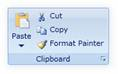
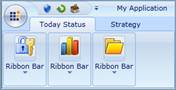
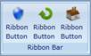
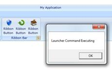

::: {style="DISPLAY: none"}
{#d2h_url_template}{#d2h_package_url style="WIDTH: 0px; DISPLAY: none; HEIGHT: 0px"}
:::

::: {.d2h_secondary_topic style="PADDING-BOTTOM: 10pt; MARGIN: 0pt; PADDING-LEFT: 0pt; PADDING-RIGHT: 0pt; PADDING-TOP: 0pt"}
##### Ribbon Bar

###### Members

[]{style="FONT-FAMILY: 'Calibri','sans-serif'"} 

The RibbonBar class exposes the following members:

Properties

  ------------------------- ------------- ------------------ ---------------------------------------------------- --------------- ------------------------------------------------------------------------------------------------------------------------------------
  Name                      Type          Value it accepts   Description                                          Default Value   Reference Link
  Header                    String        String             Represents the Name for Ribbon Bar                   String.empty    [Header]{style="FONT-FAMILY: 'Calibri','sans-serif'; COLOR: blue"}[]{style="FONT-FAMILY: 'Calibri','sans-serif'"}
  CollapseImage             ImageSource   Image URL          Used to show when Ribbon Bar is in Collapsed State   null            [Collapse Image]{style="FONT-FAMILY: 'Calibri','sans-serif'; COLOR: blue"}[]{style="FONT-FAMILY: 'Calibri','sans-serif'"}
  IsLauncherButtonVisible   Boolean       True or False      Used to show/hide the Launcher Button                True            [Launcher Button Visible]{style="FONT-FAMILY: 'Calibri','sans-serif'; COLOR: blue"}[]{style="FONT-FAMILY: 'Calibri','sans-serif'"}
  LauncherCommand           ICommand      ICommand           Occurs when the Launcher Button Clicked              null            [Launcher Command]{style="FONT-FAMILY: 'Calibri','sans-serif'; COLOR: blue"}[]{style="FONT-FAMILY: 'Calibri','sans-serif'"}
  ------------------------- ------------- ------------------ ---------------------------------------------------- --------------- ------------------------------------------------------------------------------------------------------------------------------------

###### Events

 

  ------------------ -------------------- ---------------------- ------------------------------------------ -----------------------------------------------------------------------------------------------------------------------------
  Name               Event Type           Event Args Parameter   Description                                Reference Link
  CollapsedChanged   EventHandler         Event Args             Occurs when the Ribbon bar Collapsed       [CollapsedChanged]{style="FONT-FAMILY: 'Calibri','sans-serif'; COLOR: blue"}[]{style="FONT-FAMILY: 'Calibri','sans-serif'"}
  LauncherClick      RoutedEventHandler   RoutedEventArgs        Occurs when the Lanucher button clicked.   [Launcher Click]{style="FONT-FAMILY: 'Calibri','sans-serif'; COLOR: blue"}[]{style="FONT-FAMILY: 'Calibri','sans-serif'"}
  ------------------ -------------------- ---------------------- ------------------------------------------ -----------------------------------------------------------------------------------------------------------------------------

[]{style="FONT-FAMILY: 'Calibri','sans-serif'"} 

See Also

[[·      ]{style="FONT-FAMILY: Symbol; TEXT-DECORATION: none; text-underline: none"}]{.UGHyperlink}[Ribbon Tab]{.UGHyperlink}[]{.UGHyperlink}

[]{#_LauncherClick_–_The}1.1.1.1.1.1.19     LauncherClick

 

The event is raised when the Launcher button is clicked.

 

+------------------------------------------------------------------------------------------------------------------------------------------------------------------------------------------------------------------------------------------------------------------------------------------------------------------------------------------------------------------------------------------------------------------------------------------------------------------------------------------------------------------------------------------------------------------------------------------------------------------------------------------+
| **[XAML[]{style="COLOR: blue"}]{style="FONT-FAMILY: 'Courier New'"}**                                                                                                                                                                                                                                                                                                                                                                                                                                                                                                                                                                    |
|                                                                                                                                                                                                                                                                                                                                                                                                                                                                                                                                                                                                                                          |
| []{style="FONT-FAMILY: 'Courier New'; COLOR: blue"}                                                                                                                                                                                                                                                                                                                                                                                                                                                                                                                                                                                      |
|                                                                                                                                                                                                                                                                                                                                                                                                                                                                                                                                                                                                                                          |
| [\<]{style="FONT-FAMILY: 'Courier New'; COLOR: blue"}[sync]{style="FONT-FAMILY: 'Courier New'; COLOR: #a31515"}[:]{style="FONT-FAMILY: 'Courier New'; COLOR: blue"}[RibbonBar]{style="FONT-FAMILY: 'Courier New'; COLOR: #a31515"}[ CollapseImage]{style="FONT-FAMILY: 'Courier New'; COLOR: red"}[=\"FolderOpen32.png\"]{style="FONT-FAMILY: 'Courier New'; COLOR: blue"}[ LauncherClick]{style="FONT-FAMILY: 'Courier New'; COLOR: red"}[=\"RibbonBar_LauncherClick\" /\>]{style="FONT-FAMILY: 'Courier New'; COLOR: blue"}[               ]{style="FONT-FAMILY: 'Courier New'; COLOR: #a31515"}[]{style="FONT-FAMILY: 'Courier New'"} |
+------------------------------------------------------------------------------------------------------------------------------------------------------------------------------------------------------------------------------------------------------------------------------------------------------------------------------------------------------------------------------------------------------------------------------------------------------------------------------------------------------------------------------------------------------------------------------------------------------------------------------------------+

[]{style="FONT-FAMILY: 'Courier New'"} 

+----------------------------------------------------------------------------------------------------------------------------------------------------------------------------------------------------------+
| **[C#[ ]{style="COLOR: #a31515"}]{style="FONT-FAMILY: 'Courier New'"}**                                                                                                                                  |
|                                                                                                                                                                                                          |
| []{style="FONT-FAMILY: 'Courier New'; COLOR: #a31515"}                                                                                                                                                   |
|                                                                                                                                                                                                          |
| [public]{style="FONT-FAMILY: 'Courier New'; COLOR: blue"}[ MainPage()]{style="FONT-FAMILY: 'Courier New'"}                                                                                               |
|                                                                                                                                                                                                          |
| [{]{style="FONT-FAMILY: 'Courier New'"}                                                                                                                                                                  |
|                                                                                                                                                                                                          |
| [     InitializeComponent();]{style="FONT-FAMILY: 'Courier New'"}                                                                                                                                        |
|                                                                                                                                                                                                          |
| [     ribbonBar.LauncherClick += [new]{style="COLOR: blue"} [RoutedEventHandler]{style="COLOR: #2b91af"}(ribbonBar_LauncherClick);]{style="FONT-FAMILY: 'Courier New'"}                                  |
|                                                                                                                                                                                                          |
| [}]{style="FONT-FAMILY: 'Courier New'"}                                                                                                                                                                  |
|                                                                                                                                                                                                          |
| []{style="FONT-FAMILY: 'Courier New'"}                                                                                                                                                                   |
|                                                                                                                                                                                                          |
| [void]{style="FONT-FAMILY: 'Courier New'; COLOR: blue"}[ ribbonBar_LauncherClick([object]{style="COLOR: blue"} sender, [RoutedEventArgs]{style="COLOR: #2b91af"} e)]{style="FONT-FAMILY: 'Courier New'"} |
|                                                                                                                                                                                                          |
| [{]{style="FONT-FAMILY: 'Courier New'"}                                                                                                                                                                  |
|                                                                                                                                                                                                          |
| [            ]{style="FONT-FAMILY: 'Courier New'"}                                                                                                                                                       |
|                                                                                                                                                                                                          |
| [}]{style="FONT-FAMILY: 'Courier New'"}                                                                                                                                                                  |
+----------------------------------------------------------------------------------------------------------------------------------------------------------------------------------------------------------+

 

[]{style="FONT-FAMILY: 'Calibri','sans-serif'"} 

[]{#_CollapsedChanged_–_The}1.1.1.1.1.1.20     CollapsedChanged

The event is raised when the Ribbon Bar is about to collapse.

+---------------------------------------------------------------------------------------------------------------------------------------------------------------------------------------------------------------------------------------------------------------------------------------------------------------------------------------------------------------------------------------------------------------------------------------------------------------------------------------------------------------------------------------------------------------------------------------------------------------------------------------------------------------------------------------------------+
| **[XAML[]{style="COLOR: blue"}]{style="FONT-FAMILY: 'Courier New'"}**                                                                                                                                                                                                                                                                                                                                                                                                                                                                                                                                                                                                                             |
|                                                                                                                                                                                                                                                                                                                                                                                                                                                                                                                                                                                                                                                                                                   |
| []{style="FONT-FAMILY: 'Courier New'; COLOR: blue"}                                                                                                                                                                                                                                                                                                                                                                                                                                                                                                                                                                                                                                               |
|                                                                                                                                                                                                                                                                                                                                                                                                                                                                                                                                                                                                                                                                                                   |
| [\<]{style="FONT-FAMILY: 'Courier New'; COLOR: blue"}[sync]{style="FONT-FAMILY: 'Courier New'; COLOR: #a31515"}[:]{style="FONT-FAMILY: 'Courier New'; COLOR: blue"}[RibbonBar]{style="FONT-FAMILY: 'Courier New'; COLOR: #a31515"}[ Name]{style="FONT-FAMILY: 'Courier New'; COLOR: red"}[=\"ribbonBar\"]{style="FONT-FAMILY: 'Courier New'; COLOR: blue"}[ CollapseImage]{style="FONT-FAMILY: 'Courier New'; COLOR: red"}[=\"FolderOpen32.png\"]{style="FONT-FAMILY: 'Courier New'; COLOR: blue"}[ CollapsedChanged]{style="FONT-FAMILY: 'Courier New'; COLOR: red"}[=\"ribbonBar_CollapsedChanged\" /\>]{style="FONT-FAMILY: 'Courier New'; COLOR: blue"}[]{style="FONT-FAMILY: 'Courier New'"} |
+---------------------------------------------------------------------------------------------------------------------------------------------------------------------------------------------------------------------------------------------------------------------------------------------------------------------------------------------------------------------------------------------------------------------------------------------------------------------------------------------------------------------------------------------------------------------------------------------------------------------------------------------------------------------------------------------------+

[]{style="FONT-FAMILY: 'Courier New'"} 

+----------------------------------------------------------------------------------------------------------------------------------------------------------------------------------------------------------+
| **[C#[]{style="COLOR: blue"}]{style="FONT-FAMILY: 'Courier New'"}**                                                                                                                                      |
|                                                                                                                                                                                                          |
| []{style="FONT-FAMILY: 'Courier New'; COLOR: blue"}                                                                                                                                                      |
|                                                                                                                                                                                                          |
| [public]{style="FONT-FAMILY: 'Courier New'; COLOR: blue"}[ MainPage()]{style="FONT-FAMILY: 'Courier New'"}                                                                                               |
|                                                                                                                                                                                                          |
| [{]{style="FONT-FAMILY: 'Courier New'"}                                                                                                                                                                  |
|                                                                                                                                                                                                          |
| [     InitializeComponent();]{style="FONT-FAMILY: 'Courier New'"}                                                                                                                                        |
|                                                                                                                                                                                                          |
| [     ribbonBar.LauncherClick += [new]{style="COLOR: blue"} [RoutedEventHandler]{style="COLOR: #2b91af"}(ribbonBar_LauncherClick);]{style="FONT-FAMILY: 'Courier New'"}                                  |
|                                                                                                                                                                                                          |
| [}]{style="FONT-FAMILY: 'Courier New'"}                                                                                                                                                                  |
|                                                                                                                                                                                                          |
| []{style="FONT-FAMILY: 'Courier New'"}                                                                                                                                                                   |
|                                                                                                                                                                                                          |
| [void]{style="FONT-FAMILY: 'Courier New'; COLOR: blue"}[ ribbonBar_LauncherClick([object]{style="COLOR: blue"} sender, [RoutedEventArgs]{style="COLOR: #2b91af"} e)]{style="FONT-FAMILY: 'Courier New'"} |
|                                                                                                                                                                                                          |
| [{]{style="FONT-FAMILY: 'Courier New'"}                                                                                                                                                                  |
|                                                                                                                                                                                                          |
| [}]{style="FONT-FAMILY: 'Courier New'"}                                                                                                                                                                  |
+----------------------------------------------------------------------------------------------------------------------------------------------------------------------------------------------------------+

[]{style="FONT-FAMILY: 'Calibri','sans-serif'"} 

###### Declaring Ribbon Bar

**Namespace**: Syncfusion.Windows.Tools.Controls

**Assembly**: Syncfusion.Ribbon.Silverlight

[]{#_Set_Header}1.1.1.1.1.1.21     Set Header

 

Ribbon Bars are the actual Items within the Ribbon Tab. Ribbon Bar segregates the tab content into small categories. It contains the Ribbon Items, which are grouped under a common header.

+--------------------------------------------------------------------------------------------------------------------------------------------------------------------------------------------------------------------------------------------------------------------------------------------------------------------------------------------------------------------------------------------------------------+
| **[XAML[]{style="COLOR: blue"}]{style="FONT-FAMILY: 'Courier New'"}**                                                                                                                                                                                                                                                                                                                                        |
|                                                                                                                                                                                                                                                                                                                                                                                                              |
| []{style="FONT-FAMILY: 'Courier New'; COLOR: blue"}                                                                                                                                                                                                                                                                                                                                                          |
|                                                                                                                                                                                                                                                                                                                                                                                                              |
| [\<]{style="FONT-FAMILY: 'Courier New'; COLOR: blue"}[syncfusion]{style="FONT-FAMILY: 'Courier New'; COLOR: #a31515"}[:]{style="FONT-FAMILY: 'Courier New'; COLOR: blue"}[RibbonBar]{style="FONT-FAMILY: 'Courier New'; COLOR: #a31515"}[ Header]{style="FONT-FAMILY: 'Courier New'; COLOR: red"}[=\"Clipboard\" /\>]{style="FONT-FAMILY: 'Courier New'; COLOR: blue"}[]{style="FONT-FAMILY: 'Courier New'"} |
+--------------------------------------------------------------------------------------------------------------------------------------------------------------------------------------------------------------------------------------------------------------------------------------------------------------------------------------------------------------------------------------------------------------+

[]{style="FONT-FAMILY: 'Courier New'"} 

+----------------------------------------------------------------------------------------------------------------------------------------------------------------------------------------------------------------------------------------------------------------------------------------------------------------------------------------------------------------+
| **[C#[]{style="COLOR: #2b91af"}]{style="FONT-FAMILY: 'Courier New'"}**                                                                                                                                                                                                                                                                                         |
|                                                                                                                                                                                                                                                                                                                                                                |
| []{style="FONT-FAMILY: 'Courier New'; COLOR: #2b91af"}                                                                                                                                                                                                                                                                                                         |
|                                                                                                                                                                                                                                                                                                                                                                |
| [RibbonBar]{style="FONT-FAMILY: 'Courier New'; COLOR: #2b91af"}[ ribbonBar = ]{style="FONT-FAMILY: 'Courier New'; COLOR: navy"}[new]{style="FONT-FAMILY: 'Courier New'; COLOR: blue"}[ ]{style="FONT-FAMILY: 'Courier New'; COLOR: navy"}[RibbonBar]{style="FONT-FAMILY: 'Courier New'; COLOR: #2b91af"}[();]{style="FONT-FAMILY: 'Courier New'; COLOR: navy"} |
|                                                                                                                                                                                                                                                                                                                                                                |
| [ribbonBar.Header = ]{style="FONT-FAMILY: 'Courier New'; COLOR: navy"}[\"Clipboard\"]{style="FONT-FAMILY: 'Courier New'; COLOR: #a31515"}[;]{style="FONT-FAMILY: 'Courier New'; COLOR: navy"}[]{style="FONT-FAMILY: 'Courier New'"}                                                                                                                            |
+----------------------------------------------------------------------------------------------------------------------------------------------------------------------------------------------------------------------------------------------------------------------------------------------------------------------------------------------------------------+

[]{style="FONT-FAMILY: 'Calibri','sans-serif'"} 

{border="0"}

[]{#_Collapsed_Image}Figure 532: Ribbon Bar

[]{#_Collapse_Image}1.1.1.1.1.1.22     Collapse Image

[]{style="FONT-FAMILY: 'Calibri','sans-serif'"} 

The Collapse Image in Ribbon bar will be shown when the Ribbon Bar is in Collapsed State. The collapse image can be set as follows:

+--------------------------------------------------------------------------------------------------------------------------------------------------------------------------------------------------------------------------------------------------------------------------------------------------------------------------------------------------------------------------------------------------------------+
| **[XAML[]{style="COLOR: blue"}]{style="FONT-FAMILY: 'Courier New'"}**                                                                                                                                                                                                                                                                                                                                        |
|                                                                                                                                                                                                                                                                                                                                                                                                              |
| []{style="FONT-FAMILY: 'Courier New'; COLOR: blue"}                                                                                                                                                                                                                                                                                                                                                          |
|                                                                                                                                                                                                                                                                                                                                                                                                              |
| [\<]{style="FONT-FAMILY: 'Courier New'; COLOR: blue"}[sync]{style="FONT-FAMILY: 'Courier New'; COLOR: #a31515"}[:]{style="FONT-FAMILY: 'Courier New'; COLOR: blue"}[RibbonBar]{style="FONT-FAMILY: 'Courier New'; COLOR: #a31515"}[ CollapseImage]{style="FONT-FAMILY: 'Courier New'; COLOR: red"}[=\"city.png\" /\>]{style="FONT-FAMILY: 'Courier New'; COLOR: blue"}[]{style="FONT-FAMILY: 'Courier New'"} |
+--------------------------------------------------------------------------------------------------------------------------------------------------------------------------------------------------------------------------------------------------------------------------------------------------------------------------------------------------------------------------------------------------------------+

[]{style="FONT-FAMILY: 'Courier New'"} 

+-------------------------------------------------------------------------------------------------------------------------------------------------------------------------------------------------------------------------------------+
| **[C#[]{style="COLOR: #2b91af"}]{style="FONT-FAMILY: 'Courier New'"}**                                                                                                                                                              |
|                                                                                                                                                                                                                                     |
| []{style="FONT-FAMILY: 'Courier New'; COLOR: #2b91af"}                                                                                                                                                                              |
|                                                                                                                                                                                                                                     |
| [RibbonBar]{style="FONT-FAMILY: 'Courier New'; COLOR: #2b91af"}[ ribbonBar = [new]{style="COLOR: blue"} [RibbonBar]{style="COLOR: #2b91af"}();]{style="FONT-FAMILY: 'Courier New'"}                                                 |
|                                                                                                                                                                                                                                     |
| [ribbonBar.CollapseImage = [new]{style="COLOR: blue"} [BitmapImage]{style="COLOR: #2b91af"}([new]{style="COLOR: blue"} [Uri]{style="COLOR: #2b91af"}([\"city.png\"]{style="COLOR: #a31515"}));]{style="FONT-FAMILY: 'Courier New'"} |
+-------------------------------------------------------------------------------------------------------------------------------------------------------------------------------------------------------------------------------------+

[                                                                      ]{style="FONT-FAMILY: 'Calibri','sans-serif'"}

[]{style="FONT-FAMILY: 'Calibri','sans-serif'"} 

{border="0"}

 

Figure 533: Ribbon Bar with Collapse Image

1.1.1.1.1.1.23     Launcher Button

[]{#_IsLauncherButtonVisible}1.1.1.1.1.1.23.1  IsLauncherButtonVisible

 

The Launcher Button is present at the bottom right corner of every Ribbon bar. The visibility of the Launcher button can be controlled using the property IsLauncherButtonVisible. The default value is true.

+---------------------------------------------------------------------------------------------------------------------------------------------------------------------------------------------------------------------------------------------------------------------------------------------------------------------------------------------------------------------------------------------------------------------+
| **[XAML[]{style="COLOR: blue"}]{style="FONT-FAMILY: 'Courier New'"}**                                                                                                                                                                                                                                                                                                                                               |
|                                                                                                                                                                                                                                                                                                                                                                                                                     |
| []{style="FONT-FAMILY: 'Courier New'; COLOR: blue"}                                                                                                                                                                                                                                                                                                                                                                 |
|                                                                                                                                                                                                                                                                                                                                                                                                                     |
| [\<]{style="FONT-FAMILY: 'Courier New'; COLOR: blue"}[sync]{style="FONT-FAMILY: 'Courier New'; COLOR: #a31515"}[:]{style="FONT-FAMILY: 'Courier New'; COLOR: blue"}[RibbonBar]{style="FONT-FAMILY: 'Courier New'; COLOR: #a31515"}[ IsLauncherButtonVisible]{style="FONT-FAMILY: 'Courier New'; COLOR: red"}[=\"False\" /\>]{style="FONT-FAMILY: 'Courier New'; COLOR: blue"}[]{style="FONT-FAMILY: 'Courier New'"} |
+---------------------------------------------------------------------------------------------------------------------------------------------------------------------------------------------------------------------------------------------------------------------------------------------------------------------------------------------------------------------------------------------------------------------+

[]{style="FONT-FAMILY: 'Courier New'"} 

+-------------------------------------------------------------------------------------------------------------------------------------------------------------------------------------+
| [C#[]{style="COLOR: #2b91af"}]{style="FONT-FAMILY: 'Courier New'"}                                                                                                                  |
|                                                                                                                                                                                     |
| []{style="FONT-FAMILY: 'Courier New'; COLOR: #2b91af"}                                                                                                                              |
|                                                                                                                                                                                     |
| [RibbonBar]{style="FONT-FAMILY: 'Courier New'; COLOR: #2b91af"}[ ribbonBar = [new]{style="COLOR: blue"} [RibbonBar]{style="COLOR: #2b91af"}();]{style="FONT-FAMILY: 'Courier New'"} |
|                                                                                                                                                                                     |
| [ribbonBar.IsLauncherButtonVisible = false;]{style="FONT-FAMILY: 'Courier New'"}                                                                                                    |
+-------------------------------------------------------------------------------------------------------------------------------------------------------------------------------------+

[]{style="FONT-FAMILY: 'Calibri','sans-serif'"} 

[]{style="FONT-FAMILY: 'Calibri','sans-serif'"} 

{border="0"}

[]{#_Launcher_Command}Figure 534: Ribbon Bar without Launcher Button

1.1.1.1.1.1.23.2  Launcher Command

 

The Launcher Command property allows the user to execute the action defined by the user.

+-------------------------------------------------------------------------------------------------------------------------------------------------------------------------------------------------------------------------------------------------------------------------------------------------------------------------------------------------------------------------------+
| [XAML[]{style="COLOR: blue"}]{style="FONT-FAMILY: 'Courier New'"}                                                                                                                                                                                                                                                                                                             |
|                                                                                                                                                                                                                                                                                                                                                                               |
| []{style="FONT-FAMILY: 'Courier New'; COLOR: blue"}                                                                                                                                                                                                                                                                                                                           |
|                                                                                                                                                                                                                                                                                                                                                                               |
| [\<]{style="FONT-FAMILY: 'Courier New'; COLOR: blue"}[sync]{style="FONT-FAMILY: 'Courier New'; COLOR: #a31515"}[:]{style="FONT-FAMILY: 'Courier New'; COLOR: blue"}[RibbonBar]{style="FONT-FAMILY: 'Courier New'; COLOR: #a31515"}[ Command]{style="FONT-FAMILY: 'Courier New'; COLOR: red"}[="{Binding CustomCommand}" /\>]{style="FONT-FAMILY: 'Courier New'; COLOR: blue"} |
+-------------------------------------------------------------------------------------------------------------------------------------------------------------------------------------------------------------------------------------------------------------------------------------------------------------------------------------------------------------------------------+

 

[]{style="FONT-FAMILY: 'Calibri','sans-serif'"} 

{border="0"}

Figure 535: Launcher Command Executing

[]{#related-topics}
:::
