::: {style="DISPLAY: none"}
{#d2h_url_template}{#d2h_package_url style="WIDTH: 0px; DISPLAY: none; HEIGHT: 0px"}
:::

::::: {.d2h_secondary_topic style="PADDING-BOTTOM: 10pt; MARGIN: 0pt; PADDING-LEFT: 0pt; PADDING-RIGHT: 0pt; PADDING-TOP: 0pt"}
##### []{#_Ribbon_Buttons}Ribbon Buttons

###### RibbonButton[]{style="FONT-FAMILY: 'Cambria','serif'"}

 

The RibbonButton control is a basic button control, which is used to design complex forms and applications. Also the control is shipped with the Commanding Support, which provides compatibility in MVVM design pattern.

 

1.1.1.1.1.1.24     Control Structure

 

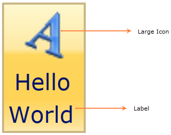{border="0"}

Figure 536: RibbonButton Control Structure

1.1.1.1.1.1.25     Members

1.1.1.1.1.1.25.1  Properties

 

+------------------+-------------+---------------------+--------------------------------------------------------------------------------------+---------------+------------------------------------------------------------------------------------------------------------------------------+
| Name             | Type        | Value it accepts    | Description                                                                          | Default Value | Reference Link                                                                                                               |
+------------------+-------------+---------------------+--------------------------------------------------------------------------------------+---------------+------------------------------------------------------------------------------------------------------------------------------+
| Label            | String      | String              | The Label Property of this element can be set to any string value                    | Null          | [Label]{style="FONT-FAMILY: 'Calibri','sans-serif'; COLOR: blue"}[]{style="FONT-FAMILY: 'Calibri','sans-serif'"}             |
+------------------+-------------+---------------------+--------------------------------------------------------------------------------------+---------------+------------------------------------------------------------------------------------------------------------------------------+
| SizeMode         | SizeMode    | Normal,             | Represents the size of the element, which may be Normal, Small or Large              | Normal        | [SizeMode]{style="FONT-FAMILY: 'Calibri','sans-serif'; COLOR: blue"}[]{style="FONT-FAMILY: 'Calibri','sans-serif'"}          |
|                  |             |                     |                                                                                      |               |                                                                                                                              |
|                  |             | Small,        Large |                                                                                      |               |                                                                                                                              |
+------------------+-------------+---------------------+--------------------------------------------------------------------------------------+---------------+------------------------------------------------------------------------------------------------------------------------------+
| SmallIcon        | ImageSource | Image URL           | Represents the image displayed in the element, when the size form is Small or Normal | \-            | [SmallIcon]{style="FONT-FAMILY: 'Calibri','sans-serif'; COLOR: blue"}[]{style="FONT-FAMILY: 'Calibri','sans-serif'"}         |
+------------------+-------------+---------------------+--------------------------------------------------------------------------------------+---------------+------------------------------------------------------------------------------------------------------------------------------+
| LargeIcon        | ImageSource | Image URL           | Represents the Image displayed in the element, when size form is large               | Null          | [LargeIcon]{style="FONT-FAMILY: 'Calibri','sans-serif'; COLOR: blue"}[]{style="FONT-FAMILY: 'Calibri','sans-serif'"}         |
+------------------+-------------+---------------------+--------------------------------------------------------------------------------------+---------------+------------------------------------------------------------------------------------------------------------------------------+
| IsCheckable      | Boolean     | True or False       | The button will act as a Checkable item if true.                                     | False         | [Checkable Support]{style="FONT-FAMILY: 'Calibri','sans-serif'; COLOR: blue"}[]{style="FONT-FAMILY: 'Calibri','sans-serif'"} |
+------------------+-------------+---------------------+--------------------------------------------------------------------------------------+---------------+------------------------------------------------------------------------------------------------------------------------------+
| IsChecked        | Boolean     | True or False       | Represents the Checked state of the element.                                         | False         | [Checkable Support]{style="FONT-FAMILY: 'Calibri','sans-serif'; COLOR: blue"}[]{style="FONT-FAMILY: 'Calibri','sans-serif'"} |
+------------------+-------------+---------------------+--------------------------------------------------------------------------------------+---------------+------------------------------------------------------------------------------------------------------------------------------+
| IsMultiline      | Boolean     | True or False       | The value represents whether the Label is displayed in two lines or not.             | True          | [MultiLine Support]{style="FONT-FAMILY: 'Calibri','sans-serif'; COLOR: blue"}[]{style="FONT-FAMILY: 'Calibri','sans-serif'"} |
+------------------+-------------+---------------------+--------------------------------------------------------------------------------------+---------------+------------------------------------------------------------------------------------------------------------------------------+
| Command          | ICommand    | ICommand            | Represents the command to invoke when the button is clicked.                         | Null          | [Command Binding]{style="FONT-FAMILY: 'Calibri','sans-serif'; COLOR: blue"}[]{style="FONT-FAMILY: 'Calibri','sans-serif'"}   |
+------------------+-------------+---------------------+--------------------------------------------------------------------------------------+---------------+------------------------------------------------------------------------------------------------------------------------------+
| CommandParameter | Object      | Object              | Represents the parameter to pass the Command property.                               | Null          | [Command Binding]{style="FONT-FAMILY: 'Calibri','sans-serif'; COLOR: blue"}[]{style="FONT-FAMILY: 'Calibri','sans-serif'"}   |
+------------------+-------------+---------------------+--------------------------------------------------------------------------------------+---------------+------------------------------------------------------------------------------------------------------------------------------+

[]{style="FONT-FAMILY: 'Calibri','sans-serif'"} 

1.1.1.1.1.1.25.2  Events

 

  --------- -------------------- ---------------------- ------------------------------------ --------------------------------------------------------------------------------------------------------------------
  Name      Event Type           Event Args Parameter   Description                          Reference Link
  Click     RoutedEventHandler   RoutedEvent Args       Occurs when buttonAdv isclicked.     [Click]{style="FONT-FAMILY: 'Calibri','sans-serif'; COLOR: blue"}[]{style="FONT-FAMILY: 'Calibri','sans-serif'"}
  Checked   RoutedEventHandler   RoutedEventArgs        Occurs when the button is checked.   [Checked]{style="FONT-FAMILY: 'Calibri','sans-serif'; COLOR: blue"}[]{style="FONT-FAMILY: 'Calibri','sans-serif'"}
  --------- -------------------- ---------------------- ------------------------------------ --------------------------------------------------------------------------------------------------------------------

[]{style="FONT-FAMILY: 'Calibri','sans-serif'"} 

The RibbonButton Control exposes the following events:

[]{#_Click_–_The}1.1.1.1.1.1.25.2.1 Click

 

The event occurs when the element isclicked.

+------------------------------------------------------------------------------------------------------------------------------------------------------------------------------------------------------------------------------------------------------------------------------------------------------------------------------------------------------------------------------------------------------------+
| [XAML[]{style="COLOR: blue"}]{style="FONT-FAMILY: 'Courier New'"}                                                                                                                                                                                                                                                                                                                                          |
|                                                                                                                                                                                                                                                                                                                                                                                                            |
| []{style="FONT-FAMILY: 'Courier New'; COLOR: blue"}                                                                                                                                                                                                                                                                                                                                                        |
|                                                                                                                                                                                                                                                                                                                                                                                                            |
| [\<]{style="FONT-FAMILY: 'Courier New'; COLOR: blue"}[sync]{style="FONT-FAMILY: 'Courier New'; COLOR: #a31515"}[:]{style="FONT-FAMILY: 'Courier New'; COLOR: blue"}[RibbonButton ]{style="FONT-FAMILY: 'Courier New'; COLOR: #a31515"}[Click]{style="FONT-FAMILY: 'Courier New'; COLOR: red"}[=\"button_Click\"/\>]{style="FONT-FAMILY: 'Courier New'; COLOR: blue"}[]{style="FONT-FAMILY: 'Courier New'"} |
+------------------------------------------------------------------------------------------------------------------------------------------------------------------------------------------------------------------------------------------------------------------------------------------------------------------------------------------------------------------------------------------------------------+

[]{style="FONT-FAMILY: 'Courier New'"} 

+---------------------------------------------------------------------------------------------------------------------------------------------------------------------------------------+
| [C#[]{style="COLOR: #2b91af"}]{style="FONT-FAMILY: 'Courier New'"}                                                                                                                    |
|                                                                                                                                                                                       |
| []{style="FONT-FAMILY: 'Courier New'; COLOR: #2b91af"}                                                                                                                                |
|                                                                                                                                                                                       |
| [RibbonButton]{style="FONT-FAMILY: 'Courier New'; COLOR: #2b91af"}[ button = [new]{style="COLOR: blue"} [RibbonButton]{style="COLOR: #2b91af"}()]{style="FONT-FAMILY: 'Courier New'"} |
|                                                                                                                                                                                       |
| [button.Click += [new]{style="COLOR: blue"} [RoutedEventHandler]{style="COLOR: #2b91af"}(button_Click);]{style="FONT-FAMILY: 'Courier New'"}                                          |
+---------------------------------------------------------------------------------------------------------------------------------------------------------------------------------------+

[]{style="FONT-FAMILY: 'Calibri','sans-serif'"} 

[]{#_Checked_–_The}1.1.1.1.1.1.25.2.2 Checked

The event occurs when the element is checked.

+----------------------------------------------------------------------------------------------------------------------------------------------------------------------------------------------------------------------------------------------------------------------------------------------------------------------------------------------------------------------------------------------------------------+
| [XAML[]{style="COLOR: blue"}]{style="FONT-FAMILY: 'Courier New'"}                                                                                                                                                                                                                                                                                                                                              |
|                                                                                                                                                                                                                                                                                                                                                                                                                |
| [\<]{style="FONT-FAMILY: 'Courier New'; COLOR: blue"}[sync]{style="FONT-FAMILY: 'Courier New'; COLOR: #a31515"}[:]{style="FONT-FAMILY: 'Courier New'; COLOR: blue"}[RibbonButton ]{style="FONT-FAMILY: 'Courier New'; COLOR: #a31515"}[Checked]{style="FONT-FAMILY: 'Courier New'; COLOR: red"}[=\"button_Checked\"/\>]{style="FONT-FAMILY: 'Courier New'; COLOR: blue"}[]{style="FONT-FAMILY: 'Courier New'"} |
+----------------------------------------------------------------------------------------------------------------------------------------------------------------------------------------------------------------------------------------------------------------------------------------------------------------------------------------------------------------------------------------------------------------+

[]{style="FONT-FAMILY: 'Courier New'"} 

+---------------------------------------------------------------------------------------------------------------------------------------------------------------------------------------+
| [C#[]{style="COLOR: #2b91af"}]{style="FONT-FAMILY: 'Courier New'"}                                                                                                                    |
|                                                                                                                                                                                       |
| []{style="FONT-FAMILY: 'Courier New'; COLOR: #2b91af"}                                                                                                                                |
|                                                                                                                                                                                       |
| [RibbonButton]{style="FONT-FAMILY: 'Courier New'; COLOR: #2b91af"}[ button = [new]{style="COLOR: blue"} [RibbonButton]{style="COLOR: #2b91af"}()]{style="FONT-FAMILY: 'Courier New'"} |
|                                                                                                                                                                                       |
| [button.Checked += [new]{style="COLOR: blue"} [RoutedEventHandler]{style="COLOR: #2b91af"}(button_Checked);]{style="FONT-FAMILY: 'Courier New'"}                                      |
+---------------------------------------------------------------------------------------------------------------------------------------------------------------------------------------+

[]{style="FONT-FAMILY: 'Courier New'"} 

1.1.1.1.1.1.26     Declaring RibbonButton

**[]{style="FONT-FAMILY: 'Calibri','sans-serif'"}** 

**Namespace:** Syncfusion.Windows.Tools.Controls

**Assembly:** Syncfusion.Ribbon.Silverlight

[]{#_Setting_Label}1.1.1.1.1.1.26.1  Setting Label

The following code explains the declaration of a RibbonButton control using XAML.

+--------------------------------------------------------------------------------------------------------------------------------------------------------------------------------------------------------------------------------------------------------------------------------------------------------------------------------------------------------------------------------------------------------------------------------------------------------------------------------------------------+
| **[XAML]{style="FONT-FAMILY: 'Calibri','sans-serif'"}[]{style="FONT-FAMILY: Consolas; COLOR: blue; FONT-SIZE: 9.5pt"}**                                                                                                                                                                                                                                                                                                                                                                          |
|                                                                                                                                                                                                                                                                                                                                                                                                                                                                                                  |
| []{style="FONT-FAMILY: Consolas; COLOR: blue; FONT-SIZE: 9.5pt"}                                                                                                                                                                                                                                                                                                                                                                                                                                 |
|                                                                                                                                                                                                                                                                                                                                                                                                                                                                                                  |
| [\<]{style="FONT-FAMILY: Consolas; COLOR: blue; FONT-SIZE: 9.5pt"}[sync]{style="FONT-FAMILY: Consolas; COLOR: #a31515; FONT-SIZE: 9.5pt"}[:]{style="FONT-FAMILY: Consolas; COLOR: blue; FONT-SIZE: 9.5pt"}[RibbonButton]{style="FONT-FAMILY: Consolas; COLOR: #a31515; FONT-SIZE: 9.5pt"}[ Label]{style="FONT-FAMILY: Consolas; COLOR: red; FONT-SIZE: 9.5pt"}[=\"Hello World\"/\>]{style="FONT-FAMILY: Consolas; COLOR: blue; FONT-SIZE: 9.5pt"}[]{style="FONT-FAMILY: 'Calibri','sans-serif'"} |
+--------------------------------------------------------------------------------------------------------------------------------------------------------------------------------------------------------------------------------------------------------------------------------------------------------------------------------------------------------------------------------------------------------------------------------------------------------------------------------------------------+

[]{style="FONT-FAMILY: 'Calibri','sans-serif'"} 

The RibbonButton control can be created through C# as follows:

+---------------------------------------------------------------------------------------------------------------------------------------------------------------------------------------+
| **[C#[]{style="COLOR: #2b91af"}]{style="FONT-FAMILY: 'Courier New'"}**                                                                                                                |
|                                                                                                                                                                                       |
| []{style="FONT-FAMILY: 'Courier New'; COLOR: #2b91af"}                                                                                                                                |
|                                                                                                                                                                                       |
| [RibbonButton]{style="FONT-FAMILY: 'Courier New'; COLOR: #2b91af"}[ button = [new]{style="COLOR: blue"} [RibbonButton]{style="COLOR: #2b91af"}()]{style="FONT-FAMILY: 'Courier New'"} |
|                                                                                                                                                                                       |
| [button.Label = [\"Hello World\"]{style="COLOR: #a31515"};]{style="FONT-FAMILY: 'Courier New'"}                                                                                       |
+---------------------------------------------------------------------------------------------------------------------------------------------------------------------------------------+

 

[]{style="FONT-FAMILY: 'Calibri','sans-serif'"} 

{border="0"}

[]{#_Setting_Size_Mode}Figure 537: RibbonButton Control

[]{#_Setting_Size_Mode_2}1.1.1.1.1.1.26.2  Setting Size Mode

 

The *Size Mode* of the Ribbon button can be easily changed using the property **SizeMode.** The **SizeMode** contains following values:

[·      ]{style="FONT-FAMILY: Symbol"}Small

[·      ]{style="FONT-FAMILY: Symbol"}Normal

[·      ]{style="FONT-FAMILY: Symbol"}Large

 

+-----------------------------------------------------------------------------------------------------------------------------------------------------------------------------------------------------------------------------------------------------------------------------------------------------------------------------------------------------------------------------------------------------------------------------------------------------------------------------------------------------------------------------------+
| [XAML[]{style="COLOR: blue"}]{style="FONT-FAMILY: 'Courier New'"}                                                                                                                                                                                                                                                                                                                                                                                                                                                                 |
|                                                                                                                                                                                                                                                                                                                                                                                                                                                                                                                                   |
| []{style="FONT-FAMILY: 'Courier New'; COLOR: blue"}                                                                                                                                                                                                                                                                                                                                                                                                                                                                               |
|                                                                                                                                                                                                                                                                                                                                                                                                                                                                                                                                   |
| [\<]{style="FONT-FAMILY: 'Courier New'; COLOR: blue"}[sync]{style="FONT-FAMILY: 'Courier New'; COLOR: #a31515"}[:]{style="FONT-FAMILY: 'Courier New'; COLOR: blue"}[RibbonButton]{style="FONT-FAMILY: 'Courier New'; COLOR: #a31515"}[ SizeMode]{style="FONT-FAMILY: 'Courier New'; COLOR: red"}[=\"Small\"]{style="FONT-FAMILY: 'Courier New'; COLOR: blue"}[ Label]{style="FONT-FAMILY: 'Courier New'; COLOR: red"}[=\"Hello World\"/\>]{style="FONT-FAMILY: 'Courier New'; COLOR: blue"}[]{style="FONT-FAMILY: 'Courier New'"} |
+-----------------------------------------------------------------------------------------------------------------------------------------------------------------------------------------------------------------------------------------------------------------------------------------------------------------------------------------------------------------------------------------------------------------------------------------------------------------------------------------------------------------------------------+

[]{style="FONT-FAMILY: 'Courier New'"} 

[]{style="FONT-FAMILY: 'Courier New'"} 

+---------------------------------------------------------------------------------------------------------------------------------------------------------------------------------------+
| [C#[]{style="COLOR: #2b91af"}]{style="FONT-FAMILY: 'Courier New'"}                                                                                                                    |
|                                                                                                                                                                                       |
| []{style="FONT-FAMILY: 'Courier New'; COLOR: #2b91af"}                                                                                                                                |
|                                                                                                                                                                                       |
| [RibbonButton]{style="FONT-FAMILY: 'Courier New'; COLOR: #2b91af"}[ button = [new]{style="COLOR: blue"} [RibbonButton]{style="COLOR: #2b91af"}()]{style="FONT-FAMILY: 'Courier New'"} |
|                                                                                                                                                                                       |
| [button.Label = [\"Hello World\"]{style="COLOR: #a31515"};]{style="FONT-FAMILY: 'Courier New'"}                                                                                       |
|                                                                                                                                                                                       |
| [button.SizeMode = SizeMode.Small;]{style="FONT-FAMILY: 'Courier New'"}                                                                                                               |
+---------------------------------------------------------------------------------------------------------------------------------------------------------------------------------------+

[]{style="FONT-FAMILY: 'Calibri','sans-serif'"} 

[]{style="FONT-FAMILY: 'Calibri','sans-serif'"} 

{border="0"}

Figure 538: RibbonButton Control with Small SizeMode

+------------------------------------------------------------------------------------------------------------------------------------------------------------------------------------------------------------------------------------------------------------------------------------------------------------------------------------------------------------------------------------------------------------------------------------------------------------------------------------------------------------------------------------+
| [XAML[]{style="COLOR: blue"}]{style="FONT-FAMILY: 'Courier New'"}                                                                                                                                                                                                                                                                                                                                                                                                                                                                  |
|                                                                                                                                                                                                                                                                                                                                                                                                                                                                                                                                    |
| []{style="FONT-FAMILY: 'Courier New'; COLOR: blue"}                                                                                                                                                                                                                                                                                                                                                                                                                                                                                |
|                                                                                                                                                                                                                                                                                                                                                                                                                                                                                                                                    |
| [\<]{style="FONT-FAMILY: 'Courier New'; COLOR: blue"}[sync]{style="FONT-FAMILY: 'Courier New'; COLOR: #a31515"}[:]{style="FONT-FAMILY: 'Courier New'; COLOR: blue"}[RibbonButton]{style="FONT-FAMILY: 'Courier New'; COLOR: #a31515"}[ SizeMode]{style="FONT-FAMILY: 'Courier New'; COLOR: red"}[=\"Normal\"]{style="FONT-FAMILY: 'Courier New'; COLOR: blue"}[ Label]{style="FONT-FAMILY: 'Courier New'; COLOR: red"}[=\"Hello World\"/\>]{style="FONT-FAMILY: 'Courier New'; COLOR: blue"}[]{style="FONT-FAMILY: 'Courier New'"} |
+------------------------------------------------------------------------------------------------------------------------------------------------------------------------------------------------------------------------------------------------------------------------------------------------------------------------------------------------------------------------------------------------------------------------------------------------------------------------------------------------------------------------------------+

**[]{style="FONT-FAMILY: 'Courier New'; COLOR: #4f81bd"}** 

+---------------------------------------------------------------------------------------------------------------------------------------------------------------------------------------+
| [C#[]{style="COLOR: #2b91af"}]{style="FONT-FAMILY: 'Courier New'"}                                                                                                                    |
|                                                                                                                                                                                       |
| []{style="FONT-FAMILY: 'Courier New'; COLOR: #2b91af"}                                                                                                                                |
|                                                                                                                                                                                       |
| [RibbonButton]{style="FONT-FAMILY: 'Courier New'; COLOR: #2b91af"}[ button = [new]{style="COLOR: blue"} [RibbonButton]{style="COLOR: #2b91af"}()]{style="FONT-FAMILY: 'Courier New'"} |
|                                                                                                                                                                                       |
| [button.Label = [\"Hello World\"]{style="COLOR: #a31515"};]{style="FONT-FAMILY: 'Courier New'"}                                                                                       |
|                                                                                                                                                                                       |
| [button.SizeMode = SizeMode.Normal;]{style="FONT-FAMILY: 'Courier New'"}                                                                                                              |
+---------------------------------------------------------------------------------------------------------------------------------------------------------------------------------------+

**[]{style="FONT-FAMILY: 'Calibri','sans-serif'; COLOR: #4f81bd"}** 

*[]{style="FONT-FAMILY: 'Calibri','sans-serif'"}* 

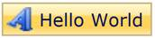{border="0"}

Figure 539: RibbonButton Control with Normal SizeMode

**[]{style="FONT-FAMILY: 'Calibri','sans-serif'; COLOR: #4f81bd"}** 

+-------------------------------------------------------------------------------------------------------------------------------------------------------------------------------------------------------------------------------------------------------------------------------------------------------------------------------------------------------------------------------------------------------------------------------------------------------------------------------------------------------------------------------------------------------+
| **[XAML[]{style="COLOR: blue"}]{style="FONT-FAMILY: 'Courier New'"}**                                                                                                                                                                                                                                                                                                                                                                                                                                                                                 |
|                                                                                                                                                                                                                                                                                                                                                                                                                                                                                                                                                       |
| []{style="FONT-FAMILY: 'Courier New'; COLOR: blue"}                                                                                                                                                                                                                                                                                                                                                                                                                                                                                                   |
|                                                                                                                                                                                                                                                                                                                                                                                                                                                                                                                                                       |
| [\<]{style="FONT-FAMILY: 'Courier New'; COLOR: blue"}[sync]{style="FONT-FAMILY: 'Courier New'; COLOR: #a31515"}[:]{style="FONT-FAMILY: 'Courier New'; COLOR: blue"}[RibbonButton]{style="FONT-FAMILY: 'Courier New'; COLOR: #a31515"}[ SizeMode]{style="FONT-FAMILY: 'Courier New'; COLOR: red"}[=\"Large\"]{style="FONT-FAMILY: 'Courier New'; COLOR: blue"}[ Label]{style="FONT-FAMILY: 'Courier New'; COLOR: red"}[=\"Hello World\"/\>]{style="FONT-FAMILY: 'Courier New'; COLOR: blue"}**[]{style="FONT-FAMILY: 'Courier New'; COLOR: #4f81bd"}** |
+-------------------------------------------------------------------------------------------------------------------------------------------------------------------------------------------------------------------------------------------------------------------------------------------------------------------------------------------------------------------------------------------------------------------------------------------------------------------------------------------------------------------------------------------------------+

**[]{style="FONT-FAMILY: 'Courier New'; COLOR: #4f81bd"}** 

+---------------------------------------------------------------------------------------------------------------------------------------------------------------------------------------+
| [C#[]{style="COLOR: #2b91af"}]{style="FONT-FAMILY: 'Courier New'"}                                                                                                                    |
|                                                                                                                                                                                       |
| []{style="FONT-FAMILY: 'Courier New'; COLOR: #2b91af"}                                                                                                                                |
|                                                                                                                                                                                       |
| [RibbonButton]{style="FONT-FAMILY: 'Courier New'; COLOR: #2b91af"}[ button = [new]{style="COLOR: blue"} [RibbonButton]{style="COLOR: #2b91af"}()]{style="FONT-FAMILY: 'Courier New'"} |
|                                                                                                                                                                                       |
| [button.Label = [\"Hello World\"]{style="COLOR: #a31515"};]{style="FONT-FAMILY: 'Courier New'"}                                                                                       |
|                                                                                                                                                                                       |
| [button.SizeMode = SizeMode.Large;**[]{style="COLOR: #4f81bd"}**]{style="FONT-FAMILY: 'Courier New'"}                                                                                 |
+---------------------------------------------------------------------------------------------------------------------------------------------------------------------------------------+

**[]{style="FONT-FAMILY: 'Calibri','sans-serif'; COLOR: #4f81bd"}** 

**[]{style="FONT-FAMILY: 'Calibri','sans-serif'; COLOR: #4f81bd"}** 

*[]{style="FONT-FAMILY: 'Calibri','sans-serif'"}* 

*[]{style="FONT-FAMILY: 'Calibri','sans-serif'"}* 

{border="0"}

Figure 540: RibbonButton Control with Large SizeMode

1.1.1.1.1.1.26.3  Setting Image

The image displayed in the control can be set using two properties:

[·      ]{style="FONT-FAMILY: Symbol"}SmallIcon -- Property used to set Image, when SizeMode is normal or small.

[·      ]{style="FONT-FAMILY: Symbol"}LargeIcon -- Property used to set image, when SizeMode is large.

The SmallIcon property can be set as follows:

 

+-------------------------------------------------------------------------------------------------------------------------------------------------------------------------------------------------------------------------------------------------------------------------------------------------------------------------------------------------------------------------------------------------------------------------------------------------------------------------------------------------------------------------------------------------------------------------------------------------------------------------------------------------------------------+
| **[XAML[]{style="COLOR: blue"}]{style="FONT-FAMILY: 'Courier New'"}**                                                                                                                                                                                                                                                                                                                                                                                                                                                                                                                                                                                             |
|                                                                                                                                                                                                                                                                                                                                                                                                                                                                                                                                                                                                                                                                   |
| []{style="FONT-FAMILY: 'Courier New'; COLOR: blue"}                                                                                                                                                                                                                                                                                                                                                                                                                                                                                                                                                                                                               |
|                                                                                                                                                                                                                                                                                                                                                                                                                                                                                                                                                                                                                                                                   |
| [\<]{style="FONT-FAMILY: 'Courier New'; COLOR: blue"}[sync]{style="FONT-FAMILY: 'Courier New'; COLOR: #a31515"}[:]{style="FONT-FAMILY: 'Courier New'; COLOR: blue"}[RibbonButton]{style="FONT-FAMILY: 'Courier New'; COLOR: #a31515"}[ SizeMode]{style="FONT-FAMILY: 'Courier New'; COLOR: red"}[=\"Small\"]{style="FONT-FAMILY: 'Courier New'; COLOR: blue"}[ Label]{style="FONT-FAMILY: 'Courier New'; COLOR: red"}[=\"Hello World\" ]{style="FONT-FAMILY: 'Courier New'; COLOR: blue"}[SmallIcon]{style="FONT-FAMILY: 'Courier New'; COLOR: red"}[=\"employee.png\"/\>]{style="FONT-FAMILY: 'Courier New'; COLOR: blue"}[]{style="FONT-FAMILY: 'Courier New'"} |
+-------------------------------------------------------------------------------------------------------------------------------------------------------------------------------------------------------------------------------------------------------------------------------------------------------------------------------------------------------------------------------------------------------------------------------------------------------------------------------------------------------------------------------------------------------------------------------------------------------------------------------------------------------------------+

[]{style="FONT-FAMILY: 'Courier New'"} 

+----------------------------------------------------------------------------------------------------------------------------------------------------------------------------------------------------------------------------------+
| **[C#[]{style="COLOR: #2b91af"}]{style="FONT-FAMILY: 'Courier New'"}**                                                                                                                                                           |
|                                                                                                                                                                                                                                  |
| []{style="FONT-FAMILY: 'Courier New'; COLOR: #2b91af"}                                                                                                                                                                           |
|                                                                                                                                                                                                                                  |
| [RibbonButton]{style="FONT-FAMILY: 'Courier New'; COLOR: #2b91af"}[ button = [new]{style="COLOR: blue"} [RibbonButton]{style="COLOR: #2b91af"}()]{style="FONT-FAMILY: 'Courier New'"}                                            |
|                                                                                                                                                                                                                                  |
| [button.Label = [\"Hello World\"]{style="COLOR: #a31515"};]{style="FONT-FAMILY: 'Courier New'"}                                                                                                                                  |
|                                                                                                                                                                                                                                  |
| [button.SizeMode = SizeMode.Small;]{style="FONT-FAMILY: 'Courier New'"}                                                                                                                                                          |
|                                                                                                                                                                                                                                  |
| [button.SmallIcon = [new]{style="COLOR: blue"} [BitmapImage]{style="COLOR: #2b91af"}([new]{style="COLOR: blue"} [Uri]{style="COLOR: #2b91af"}([\"employee.png\"]{style="COLOR: #a31515"}));]{style="FONT-FAMILY: 'Courier New'"} |
+----------------------------------------------------------------------------------------------------------------------------------------------------------------------------------------------------------------------------------+

[]{style="FONT-FAMILY: 'Calibri','sans-serif'"} 

[]{style="FONT-FAMILY: 'Calibri','sans-serif'"} 

{border="0"}

Figure 541: Small Sized RibbonButton Control with image

+--------------------------------------------------------------------------------------------------------------------------------------------------------------------------------------------------------------------------------------------------------------------------------------------------------------------------------------------------------------------------------------------------------------------------------------------------------------------------------------------------------------------------------------------------------------------------------------------------------------------------------------------------------------------+
| **[XAML[]{style="COLOR: blue"}]{style="FONT-FAMILY: 'Courier New'"}**                                                                                                                                                                                                                                                                                                                                                                                                                                                                                                                                                                                              |
|                                                                                                                                                                                                                                                                                                                                                                                                                                                                                                                                                                                                                                                                    |
| []{style="FONT-FAMILY: 'Courier New'; COLOR: blue"}                                                                                                                                                                                                                                                                                                                                                                                                                                                                                                                                                                                                                |
|                                                                                                                                                                                                                                                                                                                                                                                                                                                                                                                                                                                                                                                                    |
| [\<]{style="FONT-FAMILY: 'Courier New'; COLOR: blue"}[sync]{style="FONT-FAMILY: 'Courier New'; COLOR: #a31515"}[:]{style="FONT-FAMILY: 'Courier New'; COLOR: blue"}[RibbonButton]{style="FONT-FAMILY: 'Courier New'; COLOR: #a31515"}[ SizeMode]{style="FONT-FAMILY: 'Courier New'; COLOR: red"}[=\"Normal\" ]{style="FONT-FAMILY: 'Courier New'; COLOR: blue"}[SmallIcon]{style="FONT-FAMILY: 'Courier New'; COLOR: red"}[=\"employee.png\"]{style="FONT-FAMILY: 'Courier New'; COLOR: blue"}[ Label]{style="FONT-FAMILY: 'Courier New'; COLOR: red"}[=\"Hello World\"/\>]{style="FONT-FAMILY: 'Courier New'; COLOR: blue"}[]{style="FONT-FAMILY: 'Courier New'"} |
+--------------------------------------------------------------------------------------------------------------------------------------------------------------------------------------------------------------------------------------------------------------------------------------------------------------------------------------------------------------------------------------------------------------------------------------------------------------------------------------------------------------------------------------------------------------------------------------------------------------------------------------------------------------------+

**[]{style="FONT-FAMILY: 'Courier New'; COLOR: #4f81bd"}** 

+----------------------------------------------------------------------------------------------------------------------------------------------------------------------------------------------------------------------------------+
| **[C#[]{style="COLOR: #2b91af"}]{style="FONT-FAMILY: 'Courier New'"}**                                                                                                                                                           |
|                                                                                                                                                                                                                                  |
| []{style="FONT-FAMILY: 'Courier New'; COLOR: #2b91af"}                                                                                                                                                                           |
|                                                                                                                                                                                                                                  |
| [RibbonButton]{style="FONT-FAMILY: 'Courier New'; COLOR: #2b91af"}[ button = [new]{style="COLOR: blue"} [RibbonButton]{style="COLOR: #2b91af"}()]{style="FONT-FAMILY: 'Courier New'"}                                            |
|                                                                                                                                                                                                                                  |
| [button.Label = [\"Hello World\"]{style="COLOR: #a31515"};]{style="FONT-FAMILY: 'Courier New'"}                                                                                                                                  |
|                                                                                                                                                                                                                                  |
| [button.SizeMode = SizeMode.Normal;]{style="FONT-FAMILY: 'Courier New'"}                                                                                                                                                         |
|                                                                                                                                                                                                                                  |
| [button.SmallIcon = [new]{style="COLOR: blue"} [BitmapImage]{style="COLOR: #2b91af"}([new]{style="COLOR: blue"} [Uri]{style="COLOR: #2b91af"}([\"employee.png\"]{style="COLOR: #a31515"}));]{style="FONT-FAMILY: 'Courier New'"} |
+----------------------------------------------------------------------------------------------------------------------------------------------------------------------------------------------------------------------------------+

**[]{style="FONT-FAMILY: 'Calibri','sans-serif'; COLOR: #4f81bd"}** 

[]{style="FONT-FAMILY: 'Calibri','sans-serif'"} 

{border="0"}

Figure 542: Normal Sized RibbonButton Control with image

The Large Icon property can be set as follows:

  -----------------------------------------------------------------------------------------------------------------------------------------------------------------------------------------------------------------------------------------------------------------------------------------------------------------------------------------------------------------------------------------------------------------------------------------------------------------------------------------------------------------------------------------------------------------------------------------------------------------------------
  [XAML]{style="FONT-FAMILY: 'Courier New'"}
  [\<]{style="FONT-FAMILY: 'Courier New'; COLOR: blue"}[sync]{style="FONT-FAMILY: 'Courier New'; COLOR: #a31515"}[:]{style="FONT-FAMILY: 'Courier New'; COLOR: blue"}[RibbonButton]{style="FONT-FAMILY: 'Courier New'; COLOR: #a31515"}[ SizeMode]{style="FONT-FAMILY: 'Courier New'; COLOR: red"}[=\"Large\" ]{style="FONT-FAMILY: 'Courier New'; COLOR: blue"}[LargeIcon]{style="FONT-FAMILY: 'Courier New'; COLOR: red"}[=\"employee.png\"]{style="FONT-FAMILY: 'Courier New'; COLOR: blue"}[ Label]{style="FONT-FAMILY: 'Courier New'; COLOR: red"}[=\"Hello World\"/\>]{style="FONT-FAMILY: 'Courier New'; COLOR: blue"}
  -----------------------------------------------------------------------------------------------------------------------------------------------------------------------------------------------------------------------------------------------------------------------------------------------------------------------------------------------------------------------------------------------------------------------------------------------------------------------------------------------------------------------------------------------------------------------------------------------------------------------------

[]{style="FONT-FAMILY: 'Courier New'"} 

+----------------------------------------------------------------------------------------------------------------------------------------------------------------------------------------------------------------------------------+
| [C#]{style="FONT-FAMILY: 'Courier New'"}                                                                                                                                                                                         |
+----------------------------------------------------------------------------------------------------------------------------------------------------------------------------------------------------------------------------------+
| [RibbonButton]{style="FONT-FAMILY: 'Courier New'; COLOR: #2b91af"}[ button = [new]{style="COLOR: blue"} [RibbonButton]{style="COLOR: #2b91af"}()]{style="FONT-FAMILY: 'Courier New'"}                                            |
|                                                                                                                                                                                                                                  |
| [button.Label = [\"Hello World\"]{style="COLOR: #a31515"};]{style="FONT-FAMILY: 'Courier New'"}                                                                                                                                  |
|                                                                                                                                                                                                                                  |
| [button.SizeMode = SizeMode.Large;]{style="FONT-FAMILY: 'Courier New'"}                                                                                                                                                          |
|                                                                                                                                                                                                                                  |
| [button.SmallIcon = [new]{style="COLOR: blue"} [BitmapImage]{style="COLOR: #2b91af"}([new]{style="COLOR: blue"} [Uri]{style="COLOR: #2b91af"}([\"employee.png\"]{style="COLOR: #a31515"}));]{style="FONT-FAMILY: 'Courier New'"} |
+----------------------------------------------------------------------------------------------------------------------------------------------------------------------------------------------------------------------------------+

[]{style="FONT-FAMILY: 'Calibri','sans-serif'"} 

{border="0"}

Figure 543: Large Sized RibbonButton Control with image

1.1.1.1.1.1.27     Concepts and Features

[]{#_Command_Binding}1.1.1.1.1.1.27.1  Command Binding

 

The RibbonButton control supports Commanding. The Command and Command Parameter properties enable the user to execute any action on clicking the instance.

 

+----------------------------------------------------------------------------------------------------------------------------------------------------------------------------------------------------------------------------------------------------------------------------------------------------------------------------------------------------------------------------------------------------------------------------------------------------------------------------------------------------------------------------------------------------------------------------------------------------------------------------------------------------------------------------------------------------------------------------------------------------------------------------------------------------------------------------------------------+
| **[XAML[]{style="COLOR: blue"}]{style="FONT-FAMILY: 'Courier New'"}**                                                                                                                                                                                                                                                                                                                                                                                                                                                                                                                                                                                                                                                                                                                                                                        |
|                                                                                                                                                                                                                                                                                                                                                                                                                                                                                                                                                                                                                                                                                                                                                                                                                                              |
| []{style="FONT-FAMILY: 'Courier New'; COLOR: blue"}                                                                                                                                                                                                                                                                                                                                                                                                                                                                                                                                                                                                                                                                                                                                                                                          |
|                                                                                                                                                                                                                                                                                                                                                                                                                                                                                                                                                                                                                                                                                                                                                                                                                                              |
| [\<]{style="FONT-FAMILY: 'Courier New'; COLOR: blue"}[sync]{style="FONT-FAMILY: 'Courier New'; COLOR: #a31515"}[:]{style="FONT-FAMILY: 'Courier New'; COLOR: blue"}[RibbonButton ]{style="FONT-FAMILY: 'Courier New'; COLOR: #a31515"}[SizeMode]{style="FONT-FAMILY: 'Courier New'; COLOR: red"}[=\"Normal\"]{style="FONT-FAMILY: 'Courier New'; COLOR: blue"}[ Command]{style="FONT-FAMILY: 'Courier New'; COLOR: red"}[=\"{]{style="FONT-FAMILY: 'Courier New'; COLOR: blue"}[Binding]{style="FONT-FAMILY: 'Courier New'; COLOR: #a31515"}[ CustomCommand]{style="FONT-FAMILY: 'Courier New'; COLOR: red"}[}\"]{style="FONT-FAMILY: 'Courier New'; COLOR: blue"}[ CommandParameter]{style="FONT-FAMILY: 'Courier New'; COLOR: red"}[=\"CUSTOM\"/\>]{style="FONT-FAMILY: 'Courier New'; COLOR: blue"}[]{style="FONT-FAMILY: 'Courier New'"} |
+----------------------------------------------------------------------------------------------------------------------------------------------------------------------------------------------------------------------------------------------------------------------------------------------------------------------------------------------------------------------------------------------------------------------------------------------------------------------------------------------------------------------------------------------------------------------------------------------------------------------------------------------------------------------------------------------------------------------------------------------------------------------------------------------------------------------------------------------+

 

[]{style="FONT-FAMILY: 'Calibri','sans-serif'"} 

[]{#_Checkable_Support}1.1.1.1.1.1.27.2  Checkable Support

 

The RibbonButton Controls can also be used as Checkboxes, if IsCheckable property is set to true.[]{style="FONT-FAMILY: 'Calibri','sans-serif'"}

+---------------------------------------------------------------------------------------------------------------------------------------------------------------------------------------------------------------------------------------------------------------------------------------------------------------------------------------------------------------------------------------------------------------------------------------------------------------------------------------------------------------------------------------------------------------------------------------------------------------------+
| **[XAML[]{style="COLOR: blue"}]{style="FONT-FAMILY: 'Courier New'"}**                                                                                                                                                                                                                                                                                                                                                                                                                                                                                                                                               |
|                                                                                                                                                                                                                                                                                                                                                                                                                                                                                                                                                                                                                     |
| []{style="FONT-FAMILY: 'Courier New'; COLOR: blue"}                                                                                                                                                                                                                                                                                                                                                                                                                                                                                                                                                                 |
|                                                                                                                                                                                                                                                                                                                                                                                                                                                                                                                                                                                                                     |
| [\<]{style="FONT-FAMILY: 'Courier New'; COLOR: blue"}[sync]{style="FONT-FAMILY: 'Courier New'; COLOR: #a31515"}[:]{style="FONT-FAMILY: 'Courier New'; COLOR: blue"}[RibbonButton ]{style="FONT-FAMILY: 'Courier New'; COLOR: #a31515"}[SizeMode]{style="FONT-FAMILY: 'Courier New'; COLOR: red"}[=\"Normal\"]{style="FONT-FAMILY: 'Courier New'; COLOR: blue"}[ IsCheckable]{style="FONT-FAMILY: 'Courier New'; COLOR: red"}[=\"True\"]{style="FONT-FAMILY: 'Courier New'; COLOR: blue"}[ IsChecked]{style="FONT-FAMILY: 'Courier New'; COLOR: red"}[=\"True\"/\>]{style="FONT-FAMILY: 'Courier New'; COLOR: blue"} |
+---------------------------------------------------------------------------------------------------------------------------------------------------------------------------------------------------------------------------------------------------------------------------------------------------------------------------------------------------------------------------------------------------------------------------------------------------------------------------------------------------------------------------------------------------------------------------------------------------------------------+

[]{style="FONT-FAMILY: Consolas; COLOR: blue; FONT-SIZE: 9.5pt"} 

[]{style="FONT-FAMILY: 'Courier New'; COLOR: blue"} 

+----------------------------------------------------------------------------------------------------------------------------------------------------------------------------------------------------------------------------------+
| **[C#[]{style="COLOR: #2b91af"}]{style="FONT-FAMILY: 'Courier New'"}**                                                                                                                                                           |
|                                                                                                                                                                                                                                  |
| []{style="FONT-FAMILY: 'Courier New'; COLOR: #2b91af"}                                                                                                                                                                           |
|                                                                                                                                                                                                                                  |
| [RibbonButton]{style="FONT-FAMILY: 'Courier New'; COLOR: #2b91af"}[ button = [new]{style="COLOR: blue"} [RibbonButton]{style="COLOR: #2b91af"}()]{style="FONT-FAMILY: 'Courier New'"}                                            |
|                                                                                                                                                                                                                                  |
| [button.Label = [\"Hello World\"]{style="COLOR: #a31515"};]{style="FONT-FAMILY: 'Courier New'"}                                                                                                                                  |
|                                                                                                                                                                                                                                  |
| [button.SizeMode = SizeMode.Large;]{style="FONT-FAMILY: 'Courier New'"}                                                                                                                                                          |
|                                                                                                                                                                                                                                  |
| [button.SmallIcon = [new]{style="COLOR: blue"} [BitmapImage]{style="COLOR: #2b91af"}([new]{style="COLOR: blue"} [Uri]{style="COLOR: #2b91af"}([\"employee.png\"]{style="COLOR: #a31515"}));]{style="FONT-FAMILY: 'Courier New'"} |
|                                                                                                                                                                                                                                  |
| [button.IsCheckable = [true]{style="COLOR: blue"};]{style="FONT-FAMILY: 'Courier New'"}                                                                                                                                          |
|                                                                                                                                                                                                                                  |
| [button.IsChecked = [true]{style="COLOR: blue"};[]{style="COLOR: blue"}]{style="FONT-FAMILY: 'Courier New'"}                                                                                                                     |
+----------------------------------------------------------------------------------------------------------------------------------------------------------------------------------------------------------------------------------+

[]{style="FONT-FAMILY: Consolas; COLOR: blue; FONT-SIZE: 9.5pt"} 

[]{style="FONT-FAMILY: Consolas; COLOR: blue; FONT-SIZE: 9.5pt"} 

[]{style="FONT-FAMILY: Consolas; COLOR: blue; FONT-SIZE: 9.5pt"} 

{border="0"}

Figure 544: Checkable RibbonButton Control

[]{#_Multi_Line}1.1.1.1.1.1.27.3  Multi Line Support

 

The label displayed in the button can be shown in a line or two lines, when the property IsMultiLine is set to true. The default value is true.

+-----------------------------------------------------------------------------------------------------------------------------------------------------------------------------------------------------------------------------------------------------------------------------------------------------------------------------------------------------------------------------------------------------------------------------------------------------------------------------------------------------------------------------------------------------------------------------------------------------+
| **[XAML]{style="FONT-FAMILY: 'Calibri','sans-serif'"}[]{style="FONT-FAMILY: Consolas; COLOR: blue; FONT-SIZE: 9.5pt"}**                                                                                                                                                                                                                                                                                                                                                                                                                                                                             |
|                                                                                                                                                                                                                                                                                                                                                                                                                                                                                                                                                                                                     |
| []{style="FONT-FAMILY: Consolas; COLOR: blue; FONT-SIZE: 9.5pt"}                                                                                                                                                                                                                                                                                                                                                                                                                                                                                                                                    |
|                                                                                                                                                                                                                                                                                                                                                                                                                                                                                                                                                                                                     |
| [\<]{style="FONT-FAMILY: Consolas; COLOR: blue; FONT-SIZE: 9.5pt"}[sync]{style="FONT-FAMILY: Consolas; COLOR: #a31515; FONT-SIZE: 9.5pt"}[:]{style="FONT-FAMILY: Consolas; COLOR: blue; FONT-SIZE: 9.5pt"}[RibbonButton ]{style="FONT-FAMILY: Consolas; COLOR: #a31515; FONT-SIZE: 9.5pt"}[SizeMode]{style="FONT-FAMILY: Consolas; COLOR: red; FONT-SIZE: 9.5pt"}[=\"Large\"]{style="FONT-FAMILY: Consolas; COLOR: blue; FONT-SIZE: 9.5pt"}[ IsMultiLine]{style="FONT-FAMILY: Consolas; COLOR: red; FONT-SIZE: 9.5pt"}[=\"False\"/\>]{style="FONT-FAMILY: Consolas; COLOR: blue; FONT-SIZE: 9.5pt"} |
+-----------------------------------------------------------------------------------------------------------------------------------------------------------------------------------------------------------------------------------------------------------------------------------------------------------------------------------------------------------------------------------------------------------------------------------------------------------------------------------------------------------------------------------------------------------------------------------------------------+

 

 

[]{style="FONT-FAMILY: 'Calibri','sans-serif'"} 

{border="0"}

Figure 545: RibbonButton Control without MultiLine

::: {style="BORDER-BOTTOM: windowtext 1pt solid; BORDER-LEFT: medium none; PADDING-BOTTOM: 1pt; MARGIN-TOP: 9pt; PADDING-LEFT: 0pt; PADDING-RIGHT: 0pt; MARGIN-BOTTOM: 9pt; BORDER-TOP: windowtext 1pt solid; BORDER-RIGHT: medium none; PADDING-TOP: 1pt"}
{border="0"}Note: This property only applicable for Large Size Mode Buttons.
:::

[]{style="FONT-FAMILY: 'Calibri','sans-serif'"} 

1.1.1.1.1.1.28     Blendability

The RibbonButton Control can be easily editable using the Expression Blend.

1.   Open the Sample in the Expression Blend. Right Click the Button Control and Choosethe  Edit Template option as shown below:

{border="0"}

Figure 546: Edit Style for RibbonButton Control in Blend

2.   A window will appear as shown below. Click OK to create a new style for the Ribbon button.[ ]{style="FONT-FAMILY: 'Calibri','sans-serif'"}

[]{style="FONT-FAMILY: 'Calibri','sans-serif'"} 

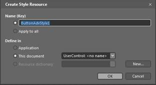{border="0"}

Figure 547: Add Style Name for RibbonButton Control in Blend

All the resources will be displayed on the resources pane on the right side of the Design area. These resources can be editable to create a new Style.

 

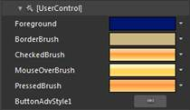{border="0"}

Figure 548: Default Resources for RibbonButton Control

{border="0"}

Figure 549: RibbonButton Control Edited in Blend

###### RibbonDropDownButton

It acts as a normal menu control. The Content will be displayed in the DropDown Popup when the button isclicked.

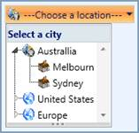{border="0"}

Figure 550: RibbonDropDownButton Control

1.1.1.1.1.1.29     Control Structure

 

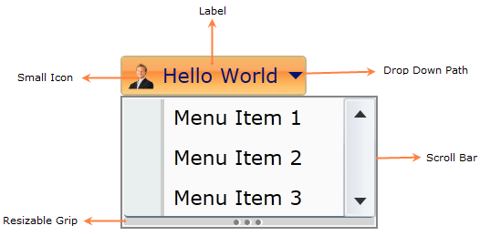{border="0"}

Figure 551: RibbonDropDownButton Control Structure

1.1.1.1.1.1.30     Members

1.1.1.1.1.1.30.1  Properties

 

+-------------+-------------+------------------+--------------------------------------------------------------------------------------+---------------+------------------------------------------------------------------------------------------------------------------------------+
| Name        | Type        | Value it accepts | Description                                                                          | Default Value | Reference Link[]{style="FONT-FAMILY: 'Calibri','sans-serif'"}                                                                |
+-------------+-------------+------------------+--------------------------------------------------------------------------------------+---------------+------------------------------------------------------------------------------------------------------------------------------+
| Label       | String      | String           | The Label property of this element can be set to any string value                    | Null          | [[Label]{style="FONT-FAMILY: 'Calibri','sans-serif'; COLOR: blue"}]()[]{style="FONT-FAMILY: 'Calibri','sans-serif'"}         |
+-------------+-------------+------------------+--------------------------------------------------------------------------------------+---------------+------------------------------------------------------------------------------------------------------------------------------+
| SizeMode    | SizeMode    | Normal,          | Represents the size of the element, which may be normal, Ssall or Llrge              | Normal        | [[SizeMode]{style="FONT-FAMILY: 'Calibri','sans-serif'; COLOR: blue"}]()[]{style="FONT-FAMILY: 'Calibri','sans-serif'"}      |
|             |             |                  |                                                                                      |               |                                                                                                                              |
|             |             | Small,           |                                                                                      |               |                                                                                                                              |
|             |             |                  |                                                                                      |               |                                                                                                                              |
|             |             | Large            |                                                                                      |               |                                                                                                                              |
+-------------+-------------+------------------+--------------------------------------------------------------------------------------+---------------+------------------------------------------------------------------------------------------------------------------------------+
| SmallIcon   | ImageSource | Image URL        | Represents the Image displayed in the element, when the size form is small or normal | \-            | [SmallIcon]{style="FONT-FAMILY: 'Calibri','sans-serif'; COLOR: blue"}[]{style="FONT-FAMILY: 'Calibri','sans-serif'"}         |
+-------------+-------------+------------------+--------------------------------------------------------------------------------------+---------------+------------------------------------------------------------------------------------------------------------------------------+
| LargeIcon   | ImageSource | Image URL        | Represents the image displayed in the element, when size form is large               | \-            | [LargeIcon]{style="FONT-FAMILY: 'Calibri','sans-serif'; COLOR: blue"}[]{style="FONT-FAMILY: 'Calibri','sans-serif'"}         |
+-------------+-------------+------------------+--------------------------------------------------------------------------------------+---------------+------------------------------------------------------------------------------------------------------------------------------+
| IsMultiline | Boolean     | True or False    | Value which represents whether the Label is displayed in two lines or not.           | True          | [Multiline Support]{style="FONT-FAMILY: 'Calibri','sans-serif'; COLOR: blue"}[]{style="FONT-FAMILY: 'Calibri','sans-serif'"} |
+-------------+-------------+------------------+--------------------------------------------------------------------------------------+---------------+------------------------------------------------------------------------------------------------------------------------------+

[]{style="FONT-FAMILY: 'Calibri','sans-serif'"} 

1.1.1.1.1.1.30.2  Events

 

  ----------------- -------------------- ---------------------- --------------------------------------- ----------------------------------------------------------------------------------------------------------------------------
  Name              Event Type           Event Args Parameter   Description                             Reference Link
  DropDownOpened    RoutedEventHandler   RoutedEvent Args       Occurs after the DropDown is opened.    [DropDownOpened]{style="FONT-FAMILY: 'Calibri','sans-serif'; COLOR: blue"}[]{style="FONT-FAMILY: 'Calibri','sans-serif'"}
  DropDownOpening   CancelEventHandler   CancelEventArgs        Occurs before the DropDown is opened.   [DropDownOpening]{style="FONT-FAMILY: 'Calibri','sans-serif'; COLOR: blue"}[]{style="FONT-FAMILY: 'Calibri','sans-serif'"}
  DropDownClosed    RoutedEventHandler   RoutedEvent Args       Occurs after the DropDown is closed.    [DropDownClosed]{style="FONT-FAMILY: 'Calibri','sans-serif'; COLOR: blue"}[]{style="FONT-FAMILY: 'Calibri','sans-serif'"}
  DropDownClosing   CancelEventHandler   CancelEventArgs        Occurs before the DropDown is closed.   [DropDownClosing]{style="FONT-FAMILY: 'Calibri','sans-serif'; COLOR: blue"}[]{style="FONT-FAMILY: 'Calibri','sans-serif'"}
  ----------------- -------------------- ---------------------- --------------------------------------- ----------------------------------------------------------------------------------------------------------------------------

[]{style="FONT-FAMILY: 'Calibri','sans-serif'"} 

The RibbonDropDown button control exposes the following events:

[]{#_DropDownOpening_–_This}1.1.1.1.1.1.30.2.1 DropDownOpening

 

This event occurs before opening the DropDown.

+-----------------------------------------------------------------------------------------------------------------------------------------------------------------------------------------------------------------------------------------------------------------------------------------------------------------------------------------------------------------------------------------------------------------------------------------------------+
| **[XAML[]{style="COLOR: blue"}]{style="FONT-FAMILY: 'Courier New'"}**                                                                                                                                                                                                                                                                                                                                                                               |
|                                                                                                                                                                                                                                                                                                                                                                                                                                                     |
| []{style="FONT-FAMILY: 'Courier New'; COLOR: blue"}                                                                                                                                                                                                                                                                                                                                                                                                 |
|                                                                                                                                                                                                                                                                                                                                                                                                                                                     |
| [\<]{style="FONT-FAMILY: 'Courier New'; COLOR: blue"}[shared]{style="FONT-FAMILY: 'Courier New'; COLOR: #a31515"}[:]{style="FONT-FAMILY: 'Courier New'; COLOR: blue"}[RibbonDropDownButton]{style="FONT-FAMILY: 'Courier New'; COLOR: #a31515"}[ DropDownOpening]{style="FONT-FAMILY: 'Courier New'; COLOR: red"}[=\"DropDownButtonAdv_DropDownOpening\"/\>]{style="FONT-FAMILY: 'Courier New'; COLOR: blue"}[]{style="FONT-FAMILY: 'Courier New'"} |
+-----------------------------------------------------------------------------------------------------------------------------------------------------------------------------------------------------------------------------------------------------------------------------------------------------------------------------------------------------------------------------------------------------------------------------------------------------+

[]{style="FONT-FAMILY: 'Courier New'"} 

+--------------------------------------------------------------------------------------------------------------------------------------------------------------------------------------------------------+
| **[C#[]{style="COLOR: #2b91af"}]{style="FONT-FAMILY: 'Courier New'"}**                                                                                                                                 |
|                                                                                                                                                                                                        |
| []{style="FONT-FAMILY: 'Courier New'; COLOR: #2b91af"}                                                                                                                                                 |
|                                                                                                                                                                                                        |
| [RibbonDropDownButton]{style="FONT-FAMILY: 'Courier New'; COLOR: #2b91af"}[ button = [new]{style="COLOR: blue"} [RibbonDropDownButton]{style="COLOR: #2b91af"}();]{style="FONT-FAMILY: 'Courier New'"} |
|                                                                                                                                                                                                        |
| [button.DropDownOpening +=[new]{style="COLOR: blue"} [CancelEventHandler]{style="COLOR: #2b91af"}(button_DropDownOpening);]{style="FONT-FAMILY: 'Courier New'"}                                        |
+--------------------------------------------------------------------------------------------------------------------------------------------------------------------------------------------------------+

[]{style="FONT-FAMILY: 'Calibri','sans-serif'"} 

[]{#_DropDownOpened_–_This}1.1.1.1.1.1.30.2.2 DropDownOpened

 

This event occurs after opening the DropDown.

+--------------------------------------------------------------------------------------------------------------------------------------------------------------------------------------------------------------------------------------------------------------------------------------------------------------------------------------------------------------------------------------------------------------------------------------------------+
| **[XAML[]{style="COLOR: blue"}]{style="FONT-FAMILY: 'Courier New'"}**                                                                                                                                                                                                                                                                                                                                                                            |
|                                                                                                                                                                                                                                                                                                                                                                                                                                                  |
| []{style="FONT-FAMILY: 'Courier New'; COLOR: blue"}                                                                                                                                                                                                                                                                                                                                                                                              |
|                                                                                                                                                                                                                                                                                                                                                                                                                                                  |
| [\<]{style="FONT-FAMILY: 'Courier New'; COLOR: blue"}[shared]{style="FONT-FAMILY: 'Courier New'; COLOR: #a31515"}[:]{style="FONT-FAMILY: 'Courier New'; COLOR: blue"}[RibbonropDownButton]{style="FONT-FAMILY: 'Courier New'; COLOR: #a31515"}[ DropDownOpened]{style="FONT-FAMILY: 'Courier New'; COLOR: red"}[=\"DropDownButtonAdv_DropDownOpened\"/\>]{style="FONT-FAMILY: 'Courier New'; COLOR: blue"}[]{style="FONT-FAMILY: 'Courier New'"} |
+--------------------------------------------------------------------------------------------------------------------------------------------------------------------------------------------------------------------------------------------------------------------------------------------------------------------------------------------------------------------------------------------------------------------------------------------------+

[]{style="FONT-FAMILY: 'Courier New'"} 

+----------------------------------------------------------------------------------------------------------------------------------------------------------------------------------------------------------+
| [C#[]{style="COLOR: #2b91af"}]{style="FONT-FAMILY: 'Courier New'"}                                                                                                                                       |
|                                                                                                                                                                                                          |
| []{style="FONT-FAMILY: 'Courier New'; COLOR: #2b91af"}                                                                                                                                                   |
|                                                                                                                                                                                                          |
| [RibbonDropDownButton]{style="FONT-FAMILY: 'Courier New'; COLOR: #2b91af"}[ button = [new]{style="COLOR: blue"} [RibbonropDownButtonAdv]{style="COLOR: #2b91af"}();]{style="FONT-FAMILY: 'Courier New'"} |
|                                                                                                                                                                                                          |
| [button.DropDownOpened +=[new]{style="COLOR: blue"} [RoutedEventHandler]{style="COLOR: #2b91af"}(button_DropDownOpened);]{style="FONT-FAMILY: 'Courier New'"}                                            |
+----------------------------------------------------------------------------------------------------------------------------------------------------------------------------------------------------------+

[]{style="FONT-FAMILY: 'Calibri','sans-serif'"} 

[]{#_DropDownClosing_–_This}1.1.1.1.1.1.30.2.3 DropDownClosing

 

This event occurs before closing the DropDown.

+-----------------------------------------------------------------------------------------------------------------------------------------------------------------------------------------------------------------------------------------------------------------------------------------------------------------------------------------------------------------------------------------------------------------------------------------------------+
| **[XAML[]{style="COLOR: blue"}]{style="FONT-FAMILY: 'Courier New'"}**                                                                                                                                                                                                                                                                                                                                                                               |
|                                                                                                                                                                                                                                                                                                                                                                                                                                                     |
| []{style="FONT-FAMILY: 'Courier New'; COLOR: blue"}                                                                                                                                                                                                                                                                                                                                                                                                 |
|                                                                                                                                                                                                                                                                                                                                                                                                                                                     |
| [\<]{style="FONT-FAMILY: 'Courier New'; COLOR: blue"}[shared]{style="FONT-FAMILY: 'Courier New'; COLOR: #a31515"}[:]{style="FONT-FAMILY: 'Courier New'; COLOR: blue"}[RibbonDropDownButton]{style="FONT-FAMILY: 'Courier New'; COLOR: #a31515"}[ DropDownClosing]{style="FONT-FAMILY: 'Courier New'; COLOR: red"}[=\"DropDownButtonAdv_DropDownClosing\"/\>]{style="FONT-FAMILY: 'Courier New'; COLOR: blue"}[]{style="FONT-FAMILY: 'Courier New'"} |
+-----------------------------------------------------------------------------------------------------------------------------------------------------------------------------------------------------------------------------------------------------------------------------------------------------------------------------------------------------------------------------------------------------------------------------------------------------+

[]{style="FONT-FAMILY: 'Courier New'"} 

+--------------------------------------------------------------------------------------------------------------------------------------------------------------------------------------------------------+
| **[C#[]{style="COLOR: #2b91af"}]{style="FONT-FAMILY: 'Courier New'"}**                                                                                                                                 |
|                                                                                                                                                                                                        |
| []{style="FONT-FAMILY: 'Courier New'; COLOR: #2b91af"}                                                                                                                                                 |
|                                                                                                                                                                                                        |
| [RibbonDropDownButton]{style="FONT-FAMILY: 'Courier New'; COLOR: #2b91af"}[ button = [new]{style="COLOR: blue"} [RibbonDropDownButton]{style="COLOR: #2b91af"}();]{style="FONT-FAMILY: 'Courier New'"} |
|                                                                                                                                                                                                        |
| [button.DropDownClosing +=[new]{style="COLOR: blue"} [CancelEventHandler]{style="COLOR: #2b91af"}(button_DropDownClosing);]{style="FONT-FAMILY: 'Courier New'"}                                        |
+--------------------------------------------------------------------------------------------------------------------------------------------------------------------------------------------------------+

[]{#_DropDownClosed_–_This} 

[]{#_DropDownClosed_1}1.1.1.1.1.1.30.2.4 DropDownClosed

This event occurs after closing the DropDown.

+---------------------------------------------------------------------------------------------------------------------------------------------------------------------------------------------------------------------------------------------------------------------------------------------------------------------------------------------------------------------------------------------------------------------------------------------------+
| [XAML[]{style="COLOR: blue"}]{style="FONT-FAMILY: 'Courier New'"}                                                                                                                                                                                                                                                                                                                                                                                 |
|                                                                                                                                                                                                                                                                                                                                                                                                                                                   |
| [\<]{style="FONT-FAMILY: 'Courier New'; COLOR: blue"}[shared]{style="FONT-FAMILY: 'Courier New'; COLOR: #a31515"}[:]{style="FONT-FAMILY: 'Courier New'; COLOR: blue"}[RibbonDropDownButton ]{style="FONT-FAMILY: 'Courier New'; COLOR: #a31515"}[DropDownClosed]{style="FONT-FAMILY: 'Courier New'; COLOR: red"}[=\"DropDownButtonAdv_DropDownClosed\"/\>]{style="FONT-FAMILY: 'Courier New'; COLOR: blue"}[]{style="FONT-FAMILY: 'Courier New'"} |
+---------------------------------------------------------------------------------------------------------------------------------------------------------------------------------------------------------------------------------------------------------------------------------------------------------------------------------------------------------------------------------------------------------------------------------------------------+

[]{style="FONT-FAMILY: 'Courier New'"} 

+--------------------------------------------------------------------------------------------------------------------------------------------------------------------------------------------------------+
| [C#[]{style="COLOR: #2b91af"}]{style="FONT-FAMILY: 'Courier New'"}                                                                                                                                     |
|                                                                                                                                                                                                        |
| []{style="FONT-FAMILY: 'Courier New'; COLOR: #2b91af"}                                                                                                                                                 |
|                                                                                                                                                                                                        |
| [RibbonDropDownButton]{style="FONT-FAMILY: 'Courier New'; COLOR: #2b91af"}[ button = [new]{style="COLOR: blue"} [RibbonDropDownButton]{style="COLOR: #2b91af"}();]{style="FONT-FAMILY: 'Courier New'"} |
|                                                                                                                                                                                                        |
| [button.DropDownClosed +=[new]{style="COLOR: blue"} [RoutedEventHandler]{style="COLOR: #2b91af"}(button_DropDownClosed);]{style="FONT-FAMILY: 'Courier New'"}                                          |
+--------------------------------------------------------------------------------------------------------------------------------------------------------------------------------------------------------+

 

1.1.1.1.1.1.31     Declaring RibbonDropDownButton

**Namespace:** Syncfusion.Windows.Tools.Controls

**Assembly:** Syncfusion.Ribbon.Silverlight

The following code explains the declaration of a *RibbonDropDownButton* control.

 

1.1.1.1.1.1.31.1  Setting Label

 

The following code explains the declaration of a RibbonDropDownButton control using XAML.[]{style="FONT-FAMILY: 'Calibri','sans-serif'"}

+----------------------------------------------------------------------------------------------------------------------------------------------------------------------------------------------------------------------------------------------------------------------------------------------------------------------------------------------------------------------------+
| [XAML[]{style="COLOR: blue"}]{style="FONT-FAMILY: 'Courier New'"}                                                                                                                                                                                                                                                                                                          |
|                                                                                                                                                                                                                                                                                                                                                                            |
| []{style="FONT-FAMILY: 'Courier New'; COLOR: blue"}                                                                                                                                                                                                                                                                                                                        |
|                                                                                                                                                                                                                                                                                                                                                                            |
| [\<]{style="FONT-FAMILY: 'Courier New'; COLOR: blue"}[sync]{style="FONT-FAMILY: 'Courier New'; COLOR: #a31515"}[:]{style="FONT-FAMILY: 'Courier New'; COLOR: blue"}[RibbonropDownButton]{style="FONT-FAMILY: 'Courier New'; COLOR: #a31515"}[ Label]{style="FONT-FAMILY: 'Courier New'; COLOR: red"}[=\"Hello World\"/\>]{style="FONT-FAMILY: 'Courier New'; COLOR: blue"} |
+----------------------------------------------------------------------------------------------------------------------------------------------------------------------------------------------------------------------------------------------------------------------------------------------------------------------------------------------------------------------------+

[]{style="FONT-FAMILY: 'Calibri','sans-serif'"} 

The RibbonDropDownButton control can be created using C# as follows

+-------------------------------------------------------------------------------------------------------------------------------------------------------------------------------------------------------+
| **[C#[]{style="COLOR: #2b91af"}]{style="FONT-FAMILY: 'Courier New'"}**                                                                                                                                |
|                                                                                                                                                                                                       |
| []{style="FONT-FAMILY: 'Courier New'; COLOR: #2b91af"}                                                                                                                                                |
|                                                                                                                                                                                                       |
| [RibbonDropDownButton]{style="FONT-FAMILY: 'Courier New'; COLOR: #2b91af"}[ button = [new]{style="COLOR: blue"} [RibbonDropDownButton]{style="COLOR: #2b91af"}()]{style="FONT-FAMILY: 'Courier New'"} |
|                                                                                                                                                                                                       |
| [button.Label = [\"Hello World\"]{style="COLOR: #a31515"};]{style="FONT-FAMILY: 'Courier New'"}                                                                                                       |
+-------------------------------------------------------------------------------------------------------------------------------------------------------------------------------------------------------+

[]{style="FONT-FAMILY: 'Calibri','sans-serif'"} 

[]{style="FONT-FAMILY: 'Calibri','sans-serif'"} 

[]{style="FONT-FAMILY: 'Calibri','sans-serif'"} 

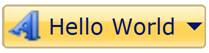{border="0"}

Figure 552: A typical RibbonDropDownButton Control

1.1.1.1.1.1.31.2  Setting Size Mode

The *Size Mode* of the *RibbonDropDownButton* can be easily changed using the property **SizeMode.** The **SizeMode** contains following values:

[·      ]{style="FONT-FAMILY: Symbol"}Small

[·      ]{style="FONT-FAMILY: Symbol"}Normal and

[·      ]{style="FONT-FAMILY: Symbol"}Large[]{style="FONT-FAMILY: 'Calibri','sans-serif'"}

 

+-------------------------------------------------------------------------------------------------------------------------------------------------------------------------------------------------------------------------------------------------------------------------------------------------------------------------------------------------------------------------------------------------------------------------------------------------------------------------------------------------------------------------------------------+
| **[XAML]{style="FONT-FAMILY: 'Courier New'"}**[]{style="FONT-FAMILY: 'Courier New'; COLOR: blue"}                                                                                                                                                                                                                                                                                                                                                                                                                                         |
|                                                                                                                                                                                                                                                                                                                                                                                                                                                                                                                                           |
| []{style="FONT-FAMILY: 'Courier New'; COLOR: blue"}                                                                                                                                                                                                                                                                                                                                                                                                                                                                                       |
|                                                                                                                                                                                                                                                                                                                                                                                                                                                                                                                                           |
| [\<]{style="FONT-FAMILY: 'Courier New'; COLOR: blue"}[sync]{style="FONT-FAMILY: 'Courier New'; COLOR: #a31515"}[:]{style="FONT-FAMILY: 'Courier New'; COLOR: blue"}[RibbonDropDownButton]{style="FONT-FAMILY: 'Courier New'; COLOR: #a31515"}[ SizeMode]{style="FONT-FAMILY: 'Courier New'; COLOR: red"}[=\"Small\"]{style="FONT-FAMILY: 'Courier New'; COLOR: blue"}[ Label]{style="FONT-FAMILY: 'Courier New'; COLOR: red"}[=\"Hello World\"/\>]{style="FONT-FAMILY: 'Courier New'; COLOR: blue"}[]{style="FONT-FAMILY: 'Courier New'"} |
+-------------------------------------------------------------------------------------------------------------------------------------------------------------------------------------------------------------------------------------------------------------------------------------------------------------------------------------------------------------------------------------------------------------------------------------------------------------------------------------------------------------------------------------------+

[]{style="FONT-FAMILY: 'Courier New'"} 

+-------------------------------------------------------------------------------------------------------------------------------------------------------------------------------------------------------+
| [C#[]{style="COLOR: #2b91af"}]{style="FONT-FAMILY: 'Courier New'"}                                                                                                                                    |
|                                                                                                                                                                                                       |
| []{style="FONT-FAMILY: 'Courier New'; COLOR: #2b91af"}                                                                                                                                                |
|                                                                                                                                                                                                       |
| [RibbonDropDownButton]{style="FONT-FAMILY: 'Courier New'; COLOR: #2b91af"}[ button = [new]{style="COLOR: blue"} [RibbonDropDownButton]{style="COLOR: #2b91af"}()]{style="FONT-FAMILY: 'Courier New'"} |
|                                                                                                                                                                                                       |
| [button.Label = [\"Hello World\"]{style="COLOR: #a31515"};]{style="FONT-FAMILY: 'Courier New'"}                                                                                                       |
|                                                                                                                                                                                                       |
| [button.SizeMode = SizeMode.Small;]{style="FONT-FAMILY: 'Courier New'"}                                                                                                                               |
+-------------------------------------------------------------------------------------------------------------------------------------------------------------------------------------------------------+

[]{style="FONT-FAMILY: 'Calibri','sans-serif'"} 

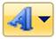{border="0"}

Figure 553: RibbonDropDownButton control with Small SizeMode

+------------------------------------------------------------------------------------------------------------------------------------------------------------------------------------------------------------------------------------------------------------------------------------------------------------------------------------------------------------------------------------------------------------------------------------------------------------------------------------------------------------------------------------------------------------------+
| [XAML[]{style="COLOR: blue"}]{style="FONT-FAMILY: 'Courier New'"}                                                                                                                                                                                                                                                                                                                                                                                                                                                                                                |
|                                                                                                                                                                                                                                                                                                                                                                                                                                                                                                                                                                  |
| []{style="FONT-FAMILY: 'Courier New'; COLOR: blue"}                                                                                                                                                                                                                                                                                                                                                                                                                                                                                                              |
|                                                                                                                                                                                                                                                                                                                                                                                                                                                                                                                                                                  |
| [\<]{style="FONT-FAMILY: 'Courier New'; COLOR: blue"}[sync]{style="FONT-FAMILY: 'Courier New'; COLOR: #a31515"}[:]{style="FONT-FAMILY: 'Courier New'; COLOR: blue"}[RibbonDropDownButton ]{style="FONT-FAMILY: 'Courier New'; COLOR: #a31515"}[SizeMode]{style="FONT-FAMILY: 'Courier New'; COLOR: red"}[=\"Normal\"]{style="FONT-FAMILY: 'Courier New'; COLOR: blue"}[ Label]{style="FONT-FAMILY: 'Courier New'; COLOR: red"}[=\"Hello World\"/\>]{style="FONT-FAMILY: 'Courier New'; COLOR: blue"}***[]{style="FONT-FAMILY: 'Courier New'; COLOR: #4f81bd"}*** |
+------------------------------------------------------------------------------------------------------------------------------------------------------------------------------------------------------------------------------------------------------------------------------------------------------------------------------------------------------------------------------------------------------------------------------------------------------------------------------------------------------------------------------------------------------------------+

***[]{style="FONT-FAMILY: 'Courier New'; COLOR: #4f81bd"}*** 

+-------------------------------------------------------------------------------------------------------------------------------------------------------------------------------------------------------+
| [C#[]{style="COLOR: #2b91af"}]{style="FONT-FAMILY: 'Courier New'"}                                                                                                                                    |
|                                                                                                                                                                                                       |
| []{style="FONT-FAMILY: 'Courier New'; COLOR: #2b91af"}                                                                                                                                                |
|                                                                                                                                                                                                       |
| [RibbonDropDownButton]{style="FONT-FAMILY: 'Courier New'; COLOR: #2b91af"}[ button = [new]{style="COLOR: blue"} [RibbonDropDownButton]{style="COLOR: #2b91af"}()]{style="FONT-FAMILY: 'Courier New'"} |
|                                                                                                                                                                                                       |
| [button.Label = [\"Hello World\"]{style="COLOR: #a31515"};]{style="FONT-FAMILY: 'Courier New'"}                                                                                                       |
|                                                                                                                                                                                                       |
| [button.SizeMode = SizeMode.Normal;***[]{style="COLOR: #4f81bd"}***]{style="FONT-FAMILY: 'Courier New'"}                                                                                              |
+-------------------------------------------------------------------------------------------------------------------------------------------------------------------------------------------------------+

***[]{style="FONT-FAMILY: 'Calibri','sans-serif'; COLOR: #4f81bd"}*** 

*[]{style="FONT-FAMILY: 'Calibri','sans-serif'"}* 

{border="0"}

Figure 554: RibbonDropDownButton control with Normal SizeMode

+-----------------------------------------------------------------------------------------------------------------------------------------------------------------------------------------------------------------------------------------------------------------------------------------------------------------------------------------------------------------------------------------------------------------------------------------------------------------------------------------------------+
| [XAML[]{style="COLOR: blue"}]{style="FONT-FAMILY: 'Courier New'"}                                                                                                                                                                                                                                                                                                                                                                                                                                   |
|                                                                                                                                                                                                                                                                                                                                                                                                                                                                                                     |
| []{style="FONT-FAMILY: 'Courier New'; COLOR: blue"}                                                                                                                                                                                                                                                                                                                                                                                                                                                 |
|                                                                                                                                                                                                                                                                                                                                                                                                                                                                                                     |
| [\<]{style="FONT-FAMILY: 'Courier New'; COLOR: blue"}[sync]{style="FONT-FAMILY: 'Courier New'; COLOR: #a31515"}[:]{style="FONT-FAMILY: 'Courier New'; COLOR: blue"}[RibbonDropDownButton ]{style="FONT-FAMILY: 'Courier New'; COLOR: #a31515"}[SizeMode]{style="FONT-FAMILY: 'Courier New'; COLOR: red"}[=\"Large\"]{style="FONT-FAMILY: 'Courier New'; COLOR: blue"}[ Label]{style="FONT-FAMILY: 'Courier New'; COLOR: red"}[=\"Hello World\"/\>]{style="FONT-FAMILY: 'Courier New'; COLOR: blue"} |
+-----------------------------------------------------------------------------------------------------------------------------------------------------------------------------------------------------------------------------------------------------------------------------------------------------------------------------------------------------------------------------------------------------------------------------------------------------------------------------------------------------+

***[]{style="FONT-FAMILY: 'Courier New'; COLOR: #4f81bd"}*** 

+-------------------------------------------------------------------------------------------------------------------------------------------------------------------------------------------------------+
| [C#[]{style="COLOR: #2b91af"}]{style="FONT-FAMILY: 'Courier New'"}                                                                                                                                    |
|                                                                                                                                                                                                       |
| []{style="FONT-FAMILY: 'Courier New'; COLOR: #2b91af"}                                                                                                                                                |
|                                                                                                                                                                                                       |
| [RibbonDropDownButton]{style="FONT-FAMILY: 'Courier New'; COLOR: #2b91af"}[ button = [new]{style="COLOR: blue"} [RibbonDropDownButton]{style="COLOR: #2b91af"}()]{style="FONT-FAMILY: 'Courier New'"} |
|                                                                                                                                                                                                       |
| [button.Label = [\"Hello World\"]{style="COLOR: #a31515"};]{style="FONT-FAMILY: 'Courier New'"}                                                                                                       |
|                                                                                                                                                                                                       |
| [button.SizeMode = SizeMode.Large;***[]{style="COLOR: #4f81bd"}***]{style="FONT-FAMILY: 'Courier New'"}                                                                                               |
+-------------------------------------------------------------------------------------------------------------------------------------------------------------------------------------------------------+

***[]{style="FONT-FAMILY: 'Calibri','sans-serif'; COLOR: #4f81bd"}*** 

*[]{style="FONT-FAMILY: 'Calibri','sans-serif'"}* 

{border="0"}

Figure 555: RibbonDropDownButton control with Large SizeMode

1.1.1.1.1.1.31.3  Setting Image

[]{style="FONT-FAMILY: 'Calibri','sans-serif'"} 

The image displayed in the control can be set using two properties namely:

[·      ]{style="FONT-FAMILY: Symbol"}SmallIcon -- Property used to set Image, when the SizeMode is normal or small.

[·      ]{style="FONT-FAMILY: Symbol"}LargeIcon -- Property used to set image, when SizeMode is large.

The *SmallIcon* property can be set as follows:

+---------------------------------------------------------------------------------------------------------------------------------------------------------------------------------------------------------------------------------------------------------------------------------------------------------------------------------------------------------------------------------------------------------------------------------------------------------------------------------------------------------------------------------------------------------------------------------------------------------------------------------------------------------------------------+
| **[XAML]{style="FONT-FAMILY: 'Courier New'"}**[]{style="FONT-FAMILY: 'Courier New'; COLOR: blue"}                                                                                                                                                                                                                                                                                                                                                                                                                                                                                                                                                                         |
|                                                                                                                                                                                                                                                                                                                                                                                                                                                                                                                                                                                                                                                                           |
| []{style="FONT-FAMILY: 'Courier New'; COLOR: blue"}                                                                                                                                                                                                                                                                                                                                                                                                                                                                                                                                                                                                                       |
|                                                                                                                                                                                                                                                                                                                                                                                                                                                                                                                                                                                                                                                                           |
| [\<]{style="FONT-FAMILY: 'Courier New'; COLOR: blue"}[sync]{style="FONT-FAMILY: 'Courier New'; COLOR: #a31515"}[:]{style="FONT-FAMILY: 'Courier New'; COLOR: blue"}[RibbonDropDownButton ]{style="FONT-FAMILY: 'Courier New'; COLOR: #a31515"}[SizeMode]{style="FONT-FAMILY: 'Courier New'; COLOR: red"}[=\"Small\"]{style="FONT-FAMILY: 'Courier New'; COLOR: blue"}[ Label]{style="FONT-FAMILY: 'Courier New'; COLOR: red"}[=\"Hello World\" ]{style="FONT-FAMILY: 'Courier New'; COLOR: blue"}[SmallIcon]{style="FONT-FAMILY: 'Courier New'; COLOR: red"}[=\"employee.png\"/\>]{style="FONT-FAMILY: 'Courier New'; COLOR: blue"}[]{style="FONT-FAMILY: 'Courier New'"} |
+---------------------------------------------------------------------------------------------------------------------------------------------------------------------------------------------------------------------------------------------------------------------------------------------------------------------------------------------------------------------------------------------------------------------------------------------------------------------------------------------------------------------------------------------------------------------------------------------------------------------------------------------------------------------------+

[]{style="FONT-FAMILY: 'Courier New'"} 

+----------------------------------------------------------------------------------------------------------------------------------------------------------------------------------------------------------------------------------+
| **[C#]{style="FONT-FAMILY: 'Courier New'"}**[]{style="FONT-FAMILY: 'Courier New'; COLOR: #2b91af"}                                                                                                                               |
|                                                                                                                                                                                                                                  |
| []{style="FONT-FAMILY: 'Courier New'; COLOR: #2b91af"}                                                                                                                                                                           |
|                                                                                                                                                                                                                                  |
| [RibbonDropDownButton]{style="FONT-FAMILY: 'Courier New'; COLOR: #2b91af"}[ button = [new]{style="COLOR: blue"} [RibbonDropDownButton]{style="COLOR: #2b91af"}()]{style="FONT-FAMILY: 'Courier New'"}                            |
|                                                                                                                                                                                                                                  |
| [button.Label = [\"Hello World\"]{style="COLOR: #a31515"};]{style="FONT-FAMILY: 'Courier New'"}                                                                                                                                  |
|                                                                                                                                                                                                                                  |
| [button.SizeMode = SizeMode.Small;]{style="FONT-FAMILY: 'Courier New'"}                                                                                                                                                          |
|                                                                                                                                                                                                                                  |
| [button.SmallIcon = [new]{style="COLOR: blue"} [BitmapImage]{style="COLOR: #2b91af"}([new]{style="COLOR: blue"} [Uri]{style="COLOR: #2b91af"}([\"employee.png\"]{style="COLOR: #a31515"}));]{style="FONT-FAMILY: 'Courier New'"} |
+----------------------------------------------------------------------------------------------------------------------------------------------------------------------------------------------------------------------------------+

 

[]{style="FONT-FAMILY: 'Calibri','sans-serif'"} 

{border="0"}

Figure 556: Small Sized RibbonDropDownButton Control with image

**[]{style="FONT-FAMILY: 'Calibri','sans-serif'; COLOR: #4f81bd"}** 

+------------------------------------------------------------------------------------------------------------------------------------------------------------------------------------------------------------------------------------------------------------------------------------------------------------------------------------------------------------------------------------------------------------------------------------------------------------------------------------------------------------------------------------------------------------------------------------------------------------------------------------------------------------------------------------------------+
| [XAML[]{style="COLOR: blue"}]{style="FONT-FAMILY: 'Courier New'"}                                                                                                                                                                                                                                                                                                                                                                                                                                                                                                                                                                                                                              |
|                                                                                                                                                                                                                                                                                                                                                                                                                                                                                                                                                                                                                                                                                                |
| []{style="FONT-FAMILY: 'Courier New'; COLOR: blue"}                                                                                                                                                                                                                                                                                                                                                                                                                                                                                                                                                                                                                                            |
|                                                                                                                                                                                                                                                                                                                                                                                                                                                                                                                                                                                                                                                                                                |
| [\<]{style="FONT-FAMILY: 'Courier New'; COLOR: blue"}[sync]{style="FONT-FAMILY: 'Courier New'; COLOR: #a31515"}[:]{style="FONT-FAMILY: 'Courier New'; COLOR: blue"}[RibbonDropDownButton ]{style="FONT-FAMILY: 'Courier New'; COLOR: #a31515"}[SizeMode]{style="FONT-FAMILY: 'Courier New'; COLOR: red"}[=\"Normal\" ]{style="FONT-FAMILY: 'Courier New'; COLOR: blue"}[SmallIcon]{style="FONT-FAMILY: 'Courier New'; COLOR: red"}[=\"employee.png\"]{style="FONT-FAMILY: 'Courier New'; COLOR: blue"}[ Label]{style="FONT-FAMILY: 'Courier New'; COLOR: red"}[=\"Hello World\"/\>]{style="FONT-FAMILY: 'Courier New'; COLOR: blue"}**[]{style="FONT-FAMILY: 'Courier New'; COLOR: #4f81bd"}** |
+------------------------------------------------------------------------------------------------------------------------------------------------------------------------------------------------------------------------------------------------------------------------------------------------------------------------------------------------------------------------------------------------------------------------------------------------------------------------------------------------------------------------------------------------------------------------------------------------------------------------------------------------------------------------------------------------+

**[]{style="FONT-FAMILY: 'Courier New'; COLOR: #4f81bd"}** 

+----------------------------------------------------------------------------------------------------------------------------------------------------------------------------------------------------------------------------------------------------------------+
| **[C#]{style="FONT-FAMILY: 'Courier New'"}**[]{style="FONT-FAMILY: 'Courier New'; COLOR: #2b91af"}                                                                                                                                                             |
|                                                                                                                                                                                                                                                                |
| []{style="FONT-FAMILY: 'Courier New'; COLOR: #2b91af"}                                                                                                                                                                                                         |
|                                                                                                                                                                                                                                                                |
| [RibbonDropDownButton]{style="FONT-FAMILY: 'Courier New'; COLOR: #2b91af"}[ button = [new]{style="COLOR: blue"} [RibbonDropDownButton]{style="COLOR: #2b91af"}()]{style="FONT-FAMILY: 'Courier New'"}                                                          |
|                                                                                                                                                                                                                                                                |
| [button.Label = [\"Hello World\"]{style="COLOR: #a31515"};]{style="FONT-FAMILY: 'Courier New'"}                                                                                                                                                                |
|                                                                                                                                                                                                                                                                |
| [button.SizeMode = SizeMode.Normal;]{style="FONT-FAMILY: 'Courier New'"}                                                                                                                                                                                       |
|                                                                                                                                                                                                                                                                |
| [button.SmallIcon = [new]{style="COLOR: blue"} [BitmapImage]{style="COLOR: #2b91af"}([new]{style="COLOR: blue"} [Uri]{style="COLOR: #2b91af"}([\"employee.png\"]{style="COLOR: #a31515"}));**[]{style="COLOR: #4f81bd"}**]{style="FONT-FAMILY: 'Courier New'"} |
+----------------------------------------------------------------------------------------------------------------------------------------------------------------------------------------------------------------------------------------------------------------+

**[]{style="FONT-FAMILY: 'Calibri','sans-serif'; COLOR: #4f81bd"}** 

[]{style="FONT-FAMILY: 'Calibri','sans-serif'"} 

{border="0"}

Figure 557: Normal Sized RibbonDropDownButton Control with Image

The Large Icon property can be set as follows:

+-----------------------------------------------------------------------------------------------------------------------------------------------------------------------------------------------------------------------------------------------------------------------------------------------------------------------------------------------------------------------------------------------------------------------------------------------------------------------------------------------------------------------------------------------------------------------------------------------------------------------------------------------------------------------------------------------+
| [XAML[]{style="COLOR: blue"}]{style="FONT-FAMILY: 'Courier New'"}                                                                                                                                                                                                                                                                                                                                                                                                                                                                                                                                                                                                                             |
|                                                                                                                                                                                                                                                                                                                                                                                                                                                                                                                                                                                                                                                                                               |
| []{style="FONT-FAMILY: 'Courier New'; COLOR: blue"}                                                                                                                                                                                                                                                                                                                                                                                                                                                                                                                                                                                                                                           |
|                                                                                                                                                                                                                                                                                                                                                                                                                                                                                                                                                                                                                                                                                               |
| [\<]{style="FONT-FAMILY: 'Courier New'; COLOR: blue"}[sync]{style="FONT-FAMILY: 'Courier New'; COLOR: #a31515"}[:]{style="FONT-FAMILY: 'Courier New'; COLOR: blue"}[RibbonDropDownButton ]{style="FONT-FAMILY: 'Courier New'; COLOR: #a31515"}[SizeMode]{style="FONT-FAMILY: 'Courier New'; COLOR: red"}[=\"Large\" ]{style="FONT-FAMILY: 'Courier New'; COLOR: blue"}[LargeIcon]{style="FONT-FAMILY: 'Courier New'; COLOR: red"}[=\"employee.png\"]{style="FONT-FAMILY: 'Courier New'; COLOR: blue"}[ Label]{style="FONT-FAMILY: 'Courier New'; COLOR: red"}[=\"Hello World\"/\>]{style="FONT-FAMILY: 'Courier New'; COLOR: blue"}**[]{style="FONT-FAMILY: 'Courier New'; COLOR: #4f81bd"}** |
+-----------------------------------------------------------------------------------------------------------------------------------------------------------------------------------------------------------------------------------------------------------------------------------------------------------------------------------------------------------------------------------------------------------------------------------------------------------------------------------------------------------------------------------------------------------------------------------------------------------------------------------------------------------------------------------------------+

[]{style="FONT-FAMILY: 'Courier New'"} 

+----------------------------------------------------------------------------------------------------------------------------------------------------------------------------------------------------------------------------------------------------------------+
| [C#[]{style="COLOR: #2b91af"}]{style="FONT-FAMILY: 'Courier New'"}                                                                                                                                                                                             |
|                                                                                                                                                                                                                                                                |
| []{style="FONT-FAMILY: 'Courier New'; COLOR: #2b91af"}                                                                                                                                                                                                         |
|                                                                                                                                                                                                                                                                |
| [RibbonDropDownButton]{style="FONT-FAMILY: 'Courier New'; COLOR: #2b91af"}[ button = [new]{style="COLOR: blue"} [RibbonDropDownButton]{style="COLOR: #2b91af"}();]{style="FONT-FAMILY: 'Courier New'"}                                                         |
|                                                                                                                                                                                                                                                                |
| [button.Label = [\"Hello World\"]{style="COLOR: #a31515"};]{style="FONT-FAMILY: 'Courier New'"}                                                                                                                                                                |
|                                                                                                                                                                                                                                                                |
| [button.SizeMode = SizeMode.Large;]{style="FONT-FAMILY: 'Courier New'"}                                                                                                                                                                                        |
|                                                                                                                                                                                                                                                                |
| [button.SmallIcon = [new]{style="COLOR: blue"} [BitmapImage]{style="COLOR: #2b91af"}([new]{style="COLOR: blue"} [Uri]{style="COLOR: #2b91af"}([\"employee.png\"]{style="COLOR: #a31515"}));**[]{style="COLOR: #4f81bd"}**]{style="FONT-FAMILY: 'Courier New'"} |
+----------------------------------------------------------------------------------------------------------------------------------------------------------------------------------------------------------------------------------------------------------------+

[]{style="FONT-FAMILY: 'Calibri','sans-serif'"} 

{border="0"}

Figure 558: Large Sized RibbonDropDownButton Control with Image

1.1.1.1.1.1.31.4  Adding Items to RibbonDropDownButton

[]{style="FONT-FAMILY: 'Calibri','sans-serif'"} 

The RibbonMenuGroup acts as a Container for RibbonDropDownButton, which provides full customization such as Resizing, Header and Scrollbar support.

+---------------------------------------------------------------------------------------------------------------------------------------------------------------------------------------------------------------------------------------------------------------------------------------------------------------------------------------------------------------------------------------------------------------------------------------------------------------------------------------------------------------------------------------------------------------------------------------------------------------------------------------------------------------------------------------------------------------------------------------------------------------------------------------------------------------------------------------------------------------------------------------------------------+
| [XAML[]{style="COLOR: blue"}]{style="FONT-FAMILY: 'Courier New'"}                                                                                                                                                                                                                                                                                                                                                                                                                                                                                                                                                                                                                                                                                                                                                                                                                                       |
|                                                                                                                                                                                                                                                                                                                                                                                                                                                                                                                                                                                                                                                                                                                                                                                                                                                                                                         |
| []{style="FONT-FAMILY: 'Courier New'; COLOR: blue"}                                                                                                                                                                                                                                                                                                                                                                                                                                                                                                                                                                                                                                                                                                                                                                                                                                                     |
|                                                                                                                                                                                                                                                                                                                                                                                                                                                                                                                                                                                                                                                                                                                                                                                                                                                                                                         |
| [\<]{style="FONT-FAMILY: 'Courier New'; COLOR: blue"}[shared]{style="FONT-FAMILY: 'Courier New'; COLOR: #a31515"}[:]{style="FONT-FAMILY: 'Courier New'; COLOR: blue"}[RibbonDropDownButton]{style="FONT-FAMILY: 'Courier New'; COLOR: #a31515"}[ Label]{style="FONT-FAMILY: 'Courier New'; COLOR: red"}[=\"Hello World\"]{style="FONT-FAMILY: 'Courier New'; COLOR: blue"}[ x]{style="FONT-FAMILY: 'Courier New'; COLOR: red"}[:]{style="FONT-FAMILY: 'Courier New'; COLOR: blue"}[Name]{style="FONT-FAMILY: 'Courier New'; COLOR: red"}[=\"button\"]{style="FONT-FAMILY: 'Courier New'; COLOR: blue"}[ SizeMode]{style="FONT-FAMILY: 'Courier New'; COLOR: red"}[=\"Normal\"]{style="FONT-FAMILY: 'Courier New'; COLOR: blue"}[ SmallIcon]{style="FONT-FAMILY: 'Courier New'; COLOR: red"}[=\"employee.png\"\>]{style="FONT-FAMILY: 'Courier New'; COLOR: blue"}[]{style="FONT-FAMILY: 'Courier New'"} |
|                                                                                                                                                                                                                                                                                                                                                                                                                                                                                                                                                                                                                                                                                                                                                                                                                                                                                                         |
| [   ]{style="FONT-FAMILY: 'Courier New'; COLOR: #a31515"}[\<]{style="FONT-FAMILY: 'Courier New'; COLOR: blue"}[shared]{style="FONT-FAMILY: 'Courier New'; COLOR: #a31515"}[:]{style="FONT-FAMILY: 'Courier New'; COLOR: blue"}[RibbonMenuGroup]{style="FONT-FAMILY: 'Courier New'; COLOR: #a31515"}[\>]{style="FONT-FAMILY: 'Courier New'; COLOR: blue"}[]{style="FONT-FAMILY: 'Courier New'"}                                                                                                                                                                                                                                                                                                                                                                                                                                                                                                          |
|                                                                                                                                                                                                                                                                                                                                                                                                                                                                                                                                                                                                                                                                                                                                                                                                                                                                                                         |
| [       ]{style="FONT-FAMILY: 'Courier New'; COLOR: #a31515"}[\<]{style="FONT-FAMILY: 'Courier New'; COLOR: blue"}[shared]{style="FONT-FAMILY: 'Courier New'; COLOR: #a31515"}[:]{style="FONT-FAMILY: 'Courier New'; COLOR: blue"}[RibbonMenuItem]{style="FONT-FAMILY: 'Courier New'; COLOR: #a31515"}[ Header]{style="FONT-FAMILY: 'Courier New'; COLOR: red"}[=\"Menu Item 1\"/\>]{style="FONT-FAMILY: 'Courier New'; COLOR: blue"}[]{style="FONT-FAMILY: 'Courier New'"}                                                                                                                                                                                                                                                                                                                                                                                                                             |
|                                                                                                                                                                                                                                                                                                                                                                                                                                                                                                                                                                                                                                                                                                                                                                                                                                                                                                         |
| [       ]{style="FONT-FAMILY: 'Courier New'; COLOR: #a31515"}[\<]{style="FONT-FAMILY: 'Courier New'; COLOR: blue"}[shared]{style="FONT-FAMILY: 'Courier New'; COLOR: #a31515"}[:]{style="FONT-FAMILY: 'Courier New'; COLOR: blue"}[RibbonMenuItem]{style="FONT-FAMILY: 'Courier New'; COLOR: #a31515"}[ Header]{style="FONT-FAMILY: 'Courier New'; COLOR: red"}[=\"Menu Item 2\"/\>]{style="FONT-FAMILY: 'Courier New'; COLOR: blue"}[]{style="FONT-FAMILY: 'Courier New'"}                                                                                                                                                                                                                                                                                                                                                                                                                             |
|                                                                                                                                                                                                                                                                                                                                                                                                                                                                                                                                                                                                                                                                                                                                                                                                                                                                                                         |
| [       ]{style="FONT-FAMILY: 'Courier New'; COLOR: #a31515"}[\<]{style="FONT-FAMILY: 'Courier New'; COLOR: blue"}[shared]{style="FONT-FAMILY: 'Courier New'; COLOR: #a31515"}[:]{style="FONT-FAMILY: 'Courier New'; COLOR: blue"}[RibbonMenuItem]{style="FONT-FAMILY: 'Courier New'; COLOR: #a31515"}[ Header]{style="FONT-FAMILY: 'Courier New'; COLOR: red"}[=\"Menu Item 3\"/\>]{style="FONT-FAMILY: 'Courier New'; COLOR: blue"}[]{style="FONT-FAMILY: 'Courier New'"}                                                                                                                                                                                                                                                                                                                                                                                                                             |
|                                                                                                                                                                                                                                                                                                                                                                                                                                                                                                                                                                                                                                                                                                                                                                                                                                                                                                         |
| [   ]{style="FONT-FAMILY: 'Courier New'; COLOR: #a31515"}[\</]{style="FONT-FAMILY: 'Courier New'; COLOR: blue"}[shared]{style="FONT-FAMILY: 'Courier New'; COLOR: #a31515"}[:]{style="FONT-FAMILY: 'Courier New'; COLOR: blue"}[RibbonMenuGroup]{style="FONT-FAMILY: 'Courier New'; COLOR: #a31515"}[\>]{style="FONT-FAMILY: 'Courier New'; COLOR: blue"}[]{style="FONT-FAMILY: 'Courier New'"}                                                                                                                                                                                                                                                                                                                                                                                                                                                                                                         |
|                                                                                                                                                                                                                                                                                                                                                                                                                                                                                                                                                                                                                                                                                                                                                                                                                                                                                                         |
| [\</]{style="FONT-FAMILY: 'Courier New'; COLOR: blue"}[shared]{style="FONT-FAMILY: 'Courier New'; COLOR: #a31515"}[:]{style="FONT-FAMILY: 'Courier New'; COLOR: blue"}[RibbonDropDownButton]{style="FONT-FAMILY: 'Courier New'; COLOR: #a31515"}[\>]{style="FONT-FAMILY: 'Courier New'; COLOR: blue"}**[]{style="FONT-FAMILY: 'Courier New'; COLOR: #4f81bd"}**                                                                                                                                                                                                                                                                                                                                                                                                                                                                                                                                         |
+---------------------------------------------------------------------------------------------------------------------------------------------------------------------------------------------------------------------------------------------------------------------------------------------------------------------------------------------------------------------------------------------------------------------------------------------------------------------------------------------------------------------------------------------------------------------------------------------------------------------------------------------------------------------------------------------------------------------------------------------------------------------------------------------------------------------------------------------------------------------------------------------------------+

[]{style="FONT-FAMILY: 'Courier New'"} 

+--------------------------------------------------------------------------------------------------------------------------------------------------------------------------------------------------------+
| [C#[]{style="COLOR: #2b91af"}]{style="FONT-FAMILY: 'Courier New'"}                                                                                                                                     |
|                                                                                                                                                                                                        |
| []{style="FONT-FAMILY: 'Courier New'; COLOR: #2b91af"}                                                                                                                                                 |
|                                                                                                                                                                                                        |
| [RibbonDropDownButton ]{style="FONT-FAMILY: 'Courier New'; COLOR: #2b91af"}[button = [new]{style="COLOR: blue"} [RibbonDropDownButton]{style="COLOR: #2b91af"}();]{style="FONT-FAMILY: 'Courier New'"} |
|                                                                                                                                                                                                        |
| [RibbonMenuGroup ]{style="FONT-FAMILY: 'Courier New'; COLOR: #2b91af"}[menu = [new]{style="COLOR: blue"} [RibbonMenuGroup]{style="COLOR: #2b91af"}();]{style="FONT-FAMILY: 'Courier New'"}             |
|                                                                                                                                                                                                        |
| [RibbonMenuItem ]{style="FONT-FAMILY: 'Courier New'; COLOR: #2b91af"}[menuItem1 = [new]{style="COLOR: blue"} [RibbonMenuItem]{style="COLOR: #2b91af"}();]{style="FONT-FAMILY: 'Courier New'"}          |
|                                                                                                                                                                                                        |
| [DropDownMenuItem]{style="FONT-FAMILY: 'Courier New'; COLOR: #2b91af"}[ menuItem2 = [new]{style="COLOR: blue"} [RibbonMenuItem]{style="COLOR: #2b91af"}();]{style="FONT-FAMILY: 'Courier New'"}        |
|                                                                                                                                                                                                        |
| [RibbonMenuItem]{style="FONT-FAMILY: 'Courier New'; COLOR: #2b91af"}[ menuItem3 = [new]{style="COLOR: blue"} [RibbonMenuItem]{style="COLOR: #2b91af"}();]{style="FONT-FAMILY: 'Courier New'"}          |
|                                                                                                                                                                                                        |
| [menu.Items.Add(menuItem1);]{style="FONT-FAMILY: 'Courier New'"}                                                                                                                                       |
|                                                                                                                                                                                                        |
| [menu.Items.Add(menuItem2);]{style="FONT-FAMILY: 'Courier New'"}                                                                                                                                       |
|                                                                                                                                                                                                        |
| [menu.Items.Add(menuItem3);]{style="FONT-FAMILY: 'Courier New'"}                                                                                                                                       |
|                                                                                                                                                                                                        |
| [button.Content = menuItem1;**[]{style="COLOR: #4f81bd"}**]{style="FONT-FAMILY: 'Courier New'"}                                                                                                        |
+--------------------------------------------------------------------------------------------------------------------------------------------------------------------------------------------------------+

[]{style="FONT-FAMILY: 'Calibri','sans-serif'"} 

[]{style="FONT-FAMILY: 'Calibri','sans-serif'"} 

{border="0"}

Figure 559: A typical RibbonDropDownButton

1.1.1.1.1.1.32     Concepts and Features

1.1.1.1.1.1.32.1  Drop Direction

[]{style="FONT-FAMILY: 'Calibri','sans-serif'"} 

The DropDown Direction can be changed using the property *DropDirection*. The *Enum* takes the following values. The default value is *BottomLeft*.

[·      ]{style="FONT-FAMILY: Symbol"}Left

[·      ]{style="FONT-FAMILY: Symbol"}Right

[·      ]{style="FONT-FAMILY: Symbol"}BottomLeft

[·      ]{style="FONT-FAMILY: Symbol"}BottomRight

[·      ]{style="FONT-FAMILY: Symbol"}TopLeft and

[·      ]{style="FONT-FAMILY: Symbol"}TopRight[]{style="FONT-FAMILY: 'Calibri','sans-serif'"}

[]{style="FONT-FAMILY: 'Calibri','sans-serif'"} 

[]{style="FONT-FAMILY: 'Calibri','sans-serif'"} 

[]{style="FONT-FAMILY: 'Calibri','sans-serif'"} 

+----------------------------------------------------------------------------------------------------------------------------------------------------------------------------------------------------------------------------------------------------------------------------------------------------------------------------------------------------------------------------------------------------------------------------------------------+
| [XAML[]{style="COLOR: blue"}]{style="FONT-FAMILY: 'Courier New'"}                                                                                                                                                                                                                                                                                                                                                                            |
|                                                                                                                                                                                                                                                                                                                                                                                                                                              |
| []{style="FONT-FAMILY: 'Courier New'; COLOR: blue"}                                                                                                                                                                                                                                                                                                                                                                                          |
|                                                                                                                                                                                                                                                                                                                                                                                                                                              |
| [\<]{style="FONT-FAMILY: 'Courier New'; COLOR: blue"}[sync]{style="FONT-FAMILY: 'Courier New'; COLOR: #a31515"}[:]{style="FONT-FAMILY: 'Courier New'; COLOR: blue"}[RibbonDropDownButton ]{style="FONT-FAMILY: 'Courier New'; COLOR: #a31515"}[DropDirection]{style="FONT-FAMILY: 'Courier New'; COLOR: red"}[=\"BottomLeft\"/\>]{style="FONT-FAMILY: 'Courier New'; COLOR: blue"}**[]{style="FONT-FAMILY: 'Courier New'; COLOR: #4f81bd"}** |
+----------------------------------------------------------------------------------------------------------------------------------------------------------------------------------------------------------------------------------------------------------------------------------------------------------------------------------------------------------------------------------------------------------------------------------------------+

[]{style="FONT-FAMILY: 'Calibri','sans-serif'"} 

[]{style="FONT-FAMILY: 'Calibri','sans-serif'"} 

[]{style="FONT-FAMILY: 'Calibri','sans-serif'"} 

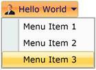{border="0"}

Figure 560: BottomLeft Drop Direction

**[]{style="FONT-FAMILY: 'Calibri','sans-serif'; COLOR: #4f81bd"}** 

+-----------------------------------------------------------------------------------------------------------------------------------------------------------------------------------------------------------------------------------------------------------------------------------------------------------------------------------------------------------------------------------------------------------------------------------------------+
| [XAML[]{style="COLOR: blue"}]{style="FONT-FAMILY: 'Courier New'"}                                                                                                                                                                                                                                                                                                                                                                             |
|                                                                                                                                                                                                                                                                                                                                                                                                                                               |
| []{style="FONT-FAMILY: 'Courier New'; COLOR: blue"}                                                                                                                                                                                                                                                                                                                                                                                           |
|                                                                                                                                                                                                                                                                                                                                                                                                                                               |
| [\<]{style="FONT-FAMILY: 'Courier New'; COLOR: blue"}[sync]{style="FONT-FAMILY: 'Courier New'; COLOR: #a31515"}[:]{style="FONT-FAMILY: 'Courier New'; COLOR: blue"}[RibbonDtopDownButton]{style="FONT-FAMILY: 'Courier New'; COLOR: #a31515"}[ DropDirection]{style="FONT-FAMILY: 'Courier New'; COLOR: red"}[=\"BottomRight\"/\>]{style="FONT-FAMILY: 'Courier New'; COLOR: blue"}**[]{style="FONT-FAMILY: 'Courier New'; COLOR: #4f81bd"}** |
+-----------------------------------------------------------------------------------------------------------------------------------------------------------------------------------------------------------------------------------------------------------------------------------------------------------------------------------------------------------------------------------------------------------------------------------------------+

**[]{style="FONT-FAMILY: 'Calibri','sans-serif'; COLOR: #4f81bd"}** 

[]{style="FONT-FAMILY: 'Calibri','sans-serif'"} 

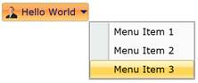{border="0"}

Figure 561: BottomRight Drop Direction

**[]{style="FONT-FAMILY: 'Calibri','sans-serif'; COLOR: #4f81bd"}** 

+-------------------------------------------------------------------------------------------------------------------------------------------------------------------------------------------------------------------------------------------------------------------------------------------------------------------------------------------------------------------------------+
| [XAML[]{style="COLOR: blue"}]{style="FONT-FAMILY: 'Courier New'"}                                                                                                                                                                                                                                                                                                             |
|                                                                                                                                                                                                                                                                                                                                                                               |
| []{style="FONT-FAMILY: 'Courier New'; COLOR: blue"}                                                                                                                                                                                                                                                                                                                           |
|                                                                                                                                                                                                                                                                                                                                                                               |
| [\<]{style="FONT-FAMILY: 'Courier New'; COLOR: blue"}[sync]{style="FONT-FAMILY: 'Courier New'; COLOR: #a31515"}[:]{style="FONT-FAMILY: 'Courier New'; COLOR: blue"}[RibbonDropDownButton]{style="FONT-FAMILY: 'Courier New'; COLOR: #a31515"}[ DropDirection]{style="FONT-FAMILY: 'Courier New'; COLOR: red"}[=\"Right\"/\>]{style="FONT-FAMILY: 'Courier New'; COLOR: blue"} |
+-------------------------------------------------------------------------------------------------------------------------------------------------------------------------------------------------------------------------------------------------------------------------------------------------------------------------------------------------------------------------------+

**[]{style="FONT-FAMILY: 'Calibri','sans-serif'; COLOR: #4f81bd"}** 

[]{style="FONT-FAMILY: 'Calibri','sans-serif'"} 

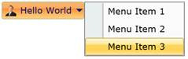{border="0"}

Figure 562: Right Drop Direction

+----------------------------------------------------------------------------------------------------------------------------------------------------------------------------------------------------------------------------------------------------------------------------------------------------------------------------------------------------------------------------------------------------------------------------------------+
| [XAML[]{style="COLOR: blue"}]{style="FONT-FAMILY: 'Courier New'"}                                                                                                                                                                                                                                                                                                                                                                      |
|                                                                                                                                                                                                                                                                                                                                                                                                                                        |
| []{style="FONT-FAMILY: 'Courier New'; COLOR: blue"}                                                                                                                                                                                                                                                                                                                                                                                    |
|                                                                                                                                                                                                                                                                                                                                                                                                                                        |
| [\<]{style="FONT-FAMILY: 'Courier New'; COLOR: blue"}[sync]{style="FONT-FAMILY: 'Courier New'; COLOR: #a31515"}[:]{style="FONT-FAMILY: 'Courier New'; COLOR: blue"}[RibbonDropDownButton]{style="FONT-FAMILY: 'Courier New'; COLOR: #a31515"}[ DropDirection]{style="FONT-FAMILY: 'Courier New'; COLOR: red"}[=\"Left\"/\>]{style="FONT-FAMILY: 'Courier New'; COLOR: blue"}**[]{style="FONT-FAMILY: 'Courier New'; COLOR: #4f81bd"}** |
+----------------------------------------------------------------------------------------------------------------------------------------------------------------------------------------------------------------------------------------------------------------------------------------------------------------------------------------------------------------------------------------------------------------------------------------+

[]{style="FONT-FAMILY: 'Calibri','sans-serif'"} 

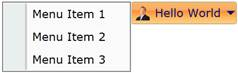{border="0"}

Figure 563: Left Drop Direction

1.1.1.1.1.1.32.2  Resizing Support

 

The RibbonMenuGroup supports resizing, if the property **IsResizable** is set to **true**.

+---------------------------------------------------------------------------------------------------------------------------------------------------------------------------------------------------------------------------------------------------------------------------------------------------------------------------------------------------------------------------------------------------------------------------------------------------------------------------------------------------------------------------------------------------------------------------------------------------------------------------------------------------------------------------------------------------------------------------------------------------------------------------------------------------------------------------------------------------------------------------------------------------------+
| [XAML[]{style="COLOR: blue"}]{style="FONT-FAMILY: 'Courier New'"}                                                                                                                                                                                                                                                                                                                                                                                                                                                                                                                                                                                                                                                                                                                                                                                                                                       |
|                                                                                                                                                                                                                                                                                                                                                                                                                                                                                                                                                                                                                                                                                                                                                                                                                                                                                                         |
| []{style="FONT-FAMILY: 'Courier New'; COLOR: blue"}                                                                                                                                                                                                                                                                                                                                                                                                                                                                                                                                                                                                                                                                                                                                                                                                                                                     |
|                                                                                                                                                                                                                                                                                                                                                                                                                                                                                                                                                                                                                                                                                                                                                                                                                                                                                                         |
| [\<]{style="FONT-FAMILY: 'Courier New'; COLOR: blue"}[shared]{style="FONT-FAMILY: 'Courier New'; COLOR: #a31515"}[:]{style="FONT-FAMILY: 'Courier New'; COLOR: blue"}[RibbonDropDownButton]{style="FONT-FAMILY: 'Courier New'; COLOR: #a31515"}[ Label]{style="FONT-FAMILY: 'Courier New'; COLOR: red"}[=\"Hello World\"]{style="FONT-FAMILY: 'Courier New'; COLOR: blue"}[ x]{style="FONT-FAMILY: 'Courier New'; COLOR: red"}[:]{style="FONT-FAMILY: 'Courier New'; COLOR: blue"}[Name]{style="FONT-FAMILY: 'Courier New'; COLOR: red"}[=\"button\"]{style="FONT-FAMILY: 'Courier New'; COLOR: blue"}[ SizeMode]{style="FONT-FAMILY: 'Courier New'; COLOR: red"}[=\"Normal\"]{style="FONT-FAMILY: 'Courier New'; COLOR: blue"}[ SmallIcon]{style="FONT-FAMILY: 'Courier New'; COLOR: red"}[=\"employee.png\"\>]{style="FONT-FAMILY: 'Courier New'; COLOR: blue"}[]{style="FONT-FAMILY: 'Courier New'"} |
|                                                                                                                                                                                                                                                                                                                                                                                                                                                                                                                                                                                                                                                                                                                                                                                                                                                                                                         |
| [   ]{style="FONT-FAMILY: 'Courier New'; COLOR: #a31515"}[\<]{style="FONT-FAMILY: 'Courier New'; COLOR: blue"}[shared]{style="FONT-FAMILY: 'Courier New'; COLOR: #a31515"}[:]{style="FONT-FAMILY: 'Courier New'; COLOR: blue"}[RibbonMenuGroup]{style="FONT-FAMILY: 'Courier New'; COLOR: #a31515"}[\>]{style="FONT-FAMILY: 'Courier New'; COLOR: blue"}[]{style="FONT-FAMILY: 'Courier New'"}                                                                                                                                                                                                                                                                                                                                                                                                                                                                                                          |
|                                                                                                                                                                                                                                                                                                                                                                                                                                                                                                                                                                                                                                                                                                                                                                                                                                                                                                         |
| [       ]{style="FONT-FAMILY: 'Courier New'; COLOR: #a31515"}[\<]{style="FONT-FAMILY: 'Courier New'; COLOR: blue"}[shared]{style="FONT-FAMILY: 'Courier New'; COLOR: #a31515"}[:]{style="FONT-FAMILY: 'Courier New'; COLOR: blue"}[RibbonMenuItem]{style="FONT-FAMILY: 'Courier New'; COLOR: #a31515"}[ Header]{style="FONT-FAMILY: 'Courier New'; COLOR: red"}[=\"Menu Item 1\"/\>]{style="FONT-FAMILY: 'Courier New'; COLOR: blue"}[]{style="FONT-FAMILY: 'Courier New'"}                                                                                                                                                                                                                                                                                                                                                                                                                             |
|                                                                                                                                                                                                                                                                                                                                                                                                                                                                                                                                                                                                                                                                                                                                                                                                                                                                                                         |
| [       ]{style="FONT-FAMILY: 'Courier New'; COLOR: #a31515"}[\<]{style="FONT-FAMILY: 'Courier New'; COLOR: blue"}[shared]{style="FONT-FAMILY: 'Courier New'; COLOR: #a31515"}[:]{style="FONT-FAMILY: 'Courier New'; COLOR: blue"}[RibbonMenuItem]{style="FONT-FAMILY: 'Courier New'; COLOR: #a31515"}[ Header]{style="FONT-FAMILY: 'Courier New'; COLOR: red"}[=\"Menu Item 2\"/\>]{style="FONT-FAMILY: 'Courier New'; COLOR: blue"}[]{style="FONT-FAMILY: 'Courier New'"}                                                                                                                                                                                                                                                                                                                                                                                                                             |
|                                                                                                                                                                                                                                                                                                                                                                                                                                                                                                                                                                                                                                                                                                                                                                                                                                                                                                         |
| [       ]{style="FONT-FAMILY: 'Courier New'; COLOR: #a31515"}[\<]{style="FONT-FAMILY: 'Courier New'; COLOR: blue"}[shared]{style="FONT-FAMILY: 'Courier New'; COLOR: #a31515"}[:]{style="FONT-FAMILY: 'Courier New'; COLOR: blue"}[RibbonMenuItem]{style="FONT-FAMILY: 'Courier New'; COLOR: #a31515"}[ Header]{style="FONT-FAMILY: 'Courier New'; COLOR: red"}[=\"Menu Item 3\"/\>]{style="FONT-FAMILY: 'Courier New'; COLOR: blue"}[]{style="FONT-FAMILY: 'Courier New'"}                                                                                                                                                                                                                                                                                                                                                                                                                             |
|                                                                                                                                                                                                                                                                                                                                                                                                                                                                                                                                                                                                                                                                                                                                                                                                                                                                                                         |
| [   ]{style="FONT-FAMILY: 'Courier New'; COLOR: #a31515"}[\</]{style="FONT-FAMILY: 'Courier New'; COLOR: blue"}[shared]{style="FONT-FAMILY: 'Courier New'; COLOR: #a31515"}[:]{style="FONT-FAMILY: 'Courier New'; COLOR: blue"}[RibbonMenuGroup]{style="FONT-FAMILY: 'Courier New'; COLOR: #a31515"}[\>]{style="FONT-FAMILY: 'Courier New'; COLOR: blue"}[]{style="FONT-FAMILY: 'Courier New'"}                                                                                                                                                                                                                                                                                                                                                                                                                                                                                                         |
|                                                                                                                                                                                                                                                                                                                                                                                                                                                                                                                                                                                                                                                                                                                                                                                                                                                                                                         |
| [\</]{style="FONT-FAMILY: 'Courier New'; COLOR: blue"}[shared]{style="FONT-FAMILY: 'Courier New'; COLOR: #a31515"}[:]{style="FONT-FAMILY: 'Courier New'; COLOR: blue"}[RibbonDropDownButton]{style="FONT-FAMILY: 'Courier New'; COLOR: #a31515"}[\>]{style="FONT-FAMILY: 'Courier New'; COLOR: blue"}**[]{style="FONT-FAMILY: 'Courier New'; COLOR: #4f81bd"}**                                                                                                                                                                                                                                                                                                                                                                                                                                                                                                                                         |
+---------------------------------------------------------------------------------------------------------------------------------------------------------------------------------------------------------------------------------------------------------------------------------------------------------------------------------------------------------------------------------------------------------------------------------------------------------------------------------------------------------------------------------------------------------------------------------------------------------------------------------------------------------------------------------------------------------------------------------------------------------------------------------------------------------------------------------------------------------------------------------------------------------+

[]{style="FONT-FAMILY: 'Calibri','sans-serif'"} 

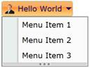{border="0"}

Figure 564: RibbonMenuGroup with Resizable Thumb

1.1.1.1.1.1.32.3  Scroll Bar Support

[]{style="FONT-FAMILY: 'Calibri','sans-serif'"} 

The RibbonMenuGroup is shipped with built-in Scrollbar support. It can be made visible by using the property ScrollBarVisibility.

+---------------------------------------------------------------------------------------------------------------------------------------------------------------------------------------------------------------------------------------------------------------------------------------------------------------------------------------------------------------------------------------------------------------------------------------------------------------------------------------------------------------------------------------------------------------------------------------------------------------------------------------------------------------------------------------------------------------------------------------------------------------------------------------------------------------------------------------------------------------------------------------------------------+
| [XAML[]{style="COLOR: blue"}]{style="FONT-FAMILY: 'Courier New'"}                                                                                                                                                                                                                                                                                                                                                                                                                                                                                                                                                                                                                                                                                                                                                                                                                                       |
|                                                                                                                                                                                                                                                                                                                                                                                                                                                                                                                                                                                                                                                                                                                                                                                                                                                                                                         |
| []{style="FONT-FAMILY: 'Courier New'; COLOR: blue"}                                                                                                                                                                                                                                                                                                                                                                                                                                                                                                                                                                                                                                                                                                                                                                                                                                                     |
|                                                                                                                                                                                                                                                                                                                                                                                                                                                                                                                                                                                                                                                                                                                                                                                                                                                                                                         |
| [\<]{style="FONT-FAMILY: 'Courier New'; COLOR: blue"}[shared]{style="FONT-FAMILY: 'Courier New'; COLOR: #a31515"}[:]{style="FONT-FAMILY: 'Courier New'; COLOR: blue"}[RibbonDropDownButton]{style="FONT-FAMILY: 'Courier New'; COLOR: #a31515"}[ Label]{style="FONT-FAMILY: 'Courier New'; COLOR: red"}[=\"Hello World\"]{style="FONT-FAMILY: 'Courier New'; COLOR: blue"}[ x]{style="FONT-FAMILY: 'Courier New'; COLOR: red"}[:]{style="FONT-FAMILY: 'Courier New'; COLOR: blue"}[Name]{style="FONT-FAMILY: 'Courier New'; COLOR: red"}[=\"button\"]{style="FONT-FAMILY: 'Courier New'; COLOR: blue"}[ SizeMode]{style="FONT-FAMILY: 'Courier New'; COLOR: red"}[=\"Normal\"]{style="FONT-FAMILY: 'Courier New'; COLOR: blue"}[ SmallIcon]{style="FONT-FAMILY: 'Courier New'; COLOR: red"}[=\"employee.png\"\>]{style="FONT-FAMILY: 'Courier New'; COLOR: blue"}[]{style="FONT-FAMILY: 'Courier New'"} |
|                                                                                                                                                                                                                                                                                                                                                                                                                                                                                                                                                                                                                                                                                                                                                                                                                                                                                                         |
| [   ]{style="FONT-FAMILY: 'Courier New'; COLOR: #a31515"}[\<]{style="FONT-FAMILY: 'Courier New'; COLOR: blue"}[shared]{style="FONT-FAMILY: 'Courier New'; COLOR: #a31515"}[:]{style="FONT-FAMILY: 'Courier New'; COLOR: blue"}[RibbonMenuGroup]{style="FONT-FAMILY: 'Courier New'; COLOR: #a31515"}[ IsResizable]{style="FONT-FAMILY: 'Courier New'; BACKGROUND: lightgrey; COLOR: red"}[=\"True\"]{style="FONT-FAMILY: 'Courier New'; BACKGROUND: lightgrey; COLOR: blue"}[ ScrollBarVisibility]{style="FONT-FAMILY: 'Courier New'; BACKGROUND: lightgrey; COLOR: red"}[=\"Visible \>]{style="FONT-FAMILY: 'Courier New'; BACKGROUND: lightgrey; COLOR: blue"}[]{style="FONT-FAMILY: 'Courier New'"}                                                                                                                                                                                                   |
|                                                                                                                                                                                                                                                                                                                                                                                                                                                                                                                                                                                                                                                                                                                                                                                                                                                                                                         |
| [       ]{style="FONT-FAMILY: 'Courier New'; COLOR: #a31515"}[\<]{style="FONT-FAMILY: 'Courier New'; COLOR: blue"}[shared]{style="FONT-FAMILY: 'Courier New'; COLOR: #a31515"}[:]{style="FONT-FAMILY: 'Courier New'; COLOR: blue"}[RibbonMenuItem]{style="FONT-FAMILY: 'Courier New'; COLOR: #a31515"}[ Header]{style="FONT-FAMILY: 'Courier New'; COLOR: red"}[=\"Menu Item 1\"/\>]{style="FONT-FAMILY: 'Courier New'; COLOR: blue"}[]{style="FONT-FAMILY: 'Courier New'"}                                                                                                                                                                                                                                                                                                                                                                                                                             |
|                                                                                                                                                                                                                                                                                                                                                                                                                                                                                                                                                                                                                                                                                                                                                                                                                                                                                                         |
| [       ]{style="FONT-FAMILY: 'Courier New'; COLOR: #a31515"}[\<]{style="FONT-FAMILY: 'Courier New'; COLOR: blue"}[shared]{style="FONT-FAMILY: 'Courier New'; COLOR: #a31515"}[:]{style="FONT-FAMILY: 'Courier New'; COLOR: blue"}[RibbonMenuItem]{style="FONT-FAMILY: 'Courier New'; COLOR: #a31515"}[ Header]{style="FONT-FAMILY: 'Courier New'; COLOR: red"}[=\"Menu Item 2\"/\>]{style="FONT-FAMILY: 'Courier New'; COLOR: blue"}[]{style="FONT-FAMILY: 'Courier New'"}                                                                                                                                                                                                                                                                                                                                                                                                                             |
|                                                                                                                                                                                                                                                                                                                                                                                                                                                                                                                                                                                                                                                                                                                                                                                                                                                                                                         |
| [       ]{style="FONT-FAMILY: 'Courier New'; COLOR: #a31515"}[\<]{style="FONT-FAMILY: 'Courier New'; COLOR: blue"}[shared]{style="FONT-FAMILY: 'Courier New'; COLOR: #a31515"}[:]{style="FONT-FAMILY: 'Courier New'; COLOR: blue"}[RibbonMenuItem]{style="FONT-FAMILY: 'Courier New'; COLOR: #a31515"}[ Header]{style="FONT-FAMILY: 'Courier New'; COLOR: red"}[=\"Menu Item 3\"/\>]{style="FONT-FAMILY: 'Courier New'; COLOR: blue"}[]{style="FONT-FAMILY: 'Courier New'"}                                                                                                                                                                                                                                                                                                                                                                                                                             |
|                                                                                                                                                                                                                                                                                                                                                                                                                                                                                                                                                                                                                                                                                                                                                                                                                                                                                                         |
| [   ]{style="FONT-FAMILY: 'Courier New'; COLOR: #a31515"}[\</]{style="FONT-FAMILY: 'Courier New'; COLOR: blue"}[shared]{style="FONT-FAMILY: 'Courier New'; COLOR: #a31515"}[:]{style="FONT-FAMILY: 'Courier New'; COLOR: blue"}[RibbonMenuGroup]{style="FONT-FAMILY: 'Courier New'; COLOR: #a31515"}[\>]{style="FONT-FAMILY: 'Courier New'; COLOR: blue"}[]{style="FONT-FAMILY: 'Courier New'"}                                                                                                                                                                                                                                                                                                                                                                                                                                                                                                         |
|                                                                                                                                                                                                                                                                                                                                                                                                                                                                                                                                                                                                                                                                                                                                                                                                                                                                                                         |
| [\</]{style="FONT-FAMILY: 'Courier New'; COLOR: blue"}[shared]{style="FONT-FAMILY: 'Courier New'; COLOR: #a31515"}[:]{style="FONT-FAMILY: 'Courier New'; COLOR: blue"}[RibbonDropDownButton]{style="FONT-FAMILY: 'Courier New'; COLOR: #a31515"}[\>]{style="FONT-FAMILY: 'Courier New'; COLOR: blue"}**[]{style="FONT-FAMILY: 'Courier New'; COLOR: #4f81bd"}**                                                                                                                                                                                                                                                                                                                                                                                                                                                                                                                                         |
+---------------------------------------------------------------------------------------------------------------------------------------------------------------------------------------------------------------------------------------------------------------------------------------------------------------------------------------------------------------------------------------------------------------------------------------------------------------------------------------------------------------------------------------------------------------------------------------------------------------------------------------------------------------------------------------------------------------------------------------------------------------------------------------------------------------------------------------------------------------------------------------------------------+

[]{style="FONT-FAMILY: 'Calibri','sans-serif'"} 

[]{style="FONT-FAMILY: 'Calibri','sans-serif'"} 

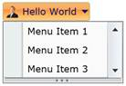{border="0"}

Figure 565: RibbonMenuGroup with Scrollbar

[]{#_Multi_Line_Support}1.1.1.1.1.1.32.4  Multi Line Support

The Label displayed in the button can be shown in a line or two lines, when the property IsMultiLine is set to true. The default value is **True**.

+------------------------------------------------------------------------------------------------------------------------------------------------------------------------------------------------------------------------------------------------------------------------------------------------------------------------------------------------------------------------------------------------------------------------------------------------------+
| [XAML**[]{style="COLOR: blue"}**]{style="FONT-FAMILY: 'Courier New'"}                                                                                                                                                                                                                                                                                                                                                                                |
|                                                                                                                                                                                                                                                                                                                                                                                                                                                      |
| []{style="FONT-FAMILY: 'Courier New'; COLOR: blue"}                                                                                                                                                                                                                                                                                                                                                                                                  |
|                                                                                                                                                                                                                                                                                                                                                                                                                                                      |
| [\<]{style="FONT-FAMILY: 'Courier New'; COLOR: blue"}[sync:RibbonDropDownButton]{style="FONT-FAMILY: 'Courier New'; COLOR: #a31515"}[ SizeMode]{style="FONT-FAMILY: 'Courier New'; COLOR: red"}[=\"Large\"]{style="FONT-FAMILY: 'Courier New'; COLOR: blue"}[ IsMultiLine]{style="FONT-FAMILY: 'Courier New'; COLOR: red"}[=\"False\"/\>]{style="FONT-FAMILY: 'Courier New'; COLOR: blue"}**[]{style="FONT-FAMILY: 'Courier New'; COLOR: #4f81bd"}** |
+------------------------------------------------------------------------------------------------------------------------------------------------------------------------------------------------------------------------------------------------------------------------------------------------------------------------------------------------------------------------------------------------------------------------------------------------------+

[]{style="FONT-FAMILY: 'Calibri','sans-serif'"} 

[]{style="FONT-FAMILY: 'Calibri','sans-serif'"} 

[]{style="FONT-FAMILY: 'Calibri','sans-serif'"} 

{border="0"}

Figure 566: RibbonDropDownButton control without MultiLine

::: {style="BORDER-BOTTOM: windowtext 1pt solid; BORDER-LEFT: medium none; PADDING-BOTTOM: 1pt; MARGIN-TOP: 9pt; PADDING-LEFT: 0pt; PADDING-RIGHT: 0pt; MARGIN-BOTTOM: 9pt; BORDER-TOP: windowtext 1pt solid; BORDER-RIGHT: medium none; PADDING-TOP: 1pt"}
{border="0"}Note: This property only applicable for Large Size Mode Buttons.
:::

[]{style="FONT-FAMILY: 'Calibri','sans-serif'"} 

1.1.1.1.1.1.32.5  RibbonMenuItem

1.1.1.1.1.1.32.5.1 Adding Icon to RibbonMenuItem

The RibbonMenuItem control is the basic MenuItem, which forms the actual items of RibbonMenuGroup. The Icon of the RibbonMenuItem can be added as follows:

+---------------------------------------------------------------------------------------------------------------------------------------------------------------------------------------------------------------------------------------------------------------------------------------------------------------------------------------------------------------------------------------------------------------------------------------------------------------------------------------------------------------------------------------------------------------------------------------------------------------------------------------------------------------------------------------------------------------------------------------------------------------------------------------------------------------------------------------------------------------------------------------------------------+
| [XAML[]{style="COLOR: blue"}]{style="FONT-FAMILY: 'Courier New'"}                                                                                                                                                                                                                                                                                                                                                                                                                                                                                                                                                                                                                                                                                                                                                                                                                                       |
|                                                                                                                                                                                                                                                                                                                                                                                                                                                                                                                                                                                                                                                                                                                                                                                                                                                                                                         |
| []{style="FONT-FAMILY: 'Courier New'; COLOR: blue"}                                                                                                                                                                                                                                                                                                                                                                                                                                                                                                                                                                                                                                                                                                                                                                                                                                                     |
|                                                                                                                                                                                                                                                                                                                                                                                                                                                                                                                                                                                                                                                                                                                                                                                                                                                                                                         |
| [\<]{style="FONT-FAMILY: 'Courier New'; COLOR: blue"}[shared]{style="FONT-FAMILY: 'Courier New'; COLOR: #a31515"}[:]{style="FONT-FAMILY: 'Courier New'; COLOR: blue"}[RibbonDropDownButton]{style="FONT-FAMILY: 'Courier New'; COLOR: #a31515"}[ Label]{style="FONT-FAMILY: 'Courier New'; COLOR: red"}[=\"Hello World\"]{style="FONT-FAMILY: 'Courier New'; COLOR: blue"}[ x]{style="FONT-FAMILY: 'Courier New'; COLOR: red"}[:]{style="FONT-FAMILY: 'Courier New'; COLOR: blue"}[Name]{style="FONT-FAMILY: 'Courier New'; COLOR: red"}[=\"button\"]{style="FONT-FAMILY: 'Courier New'; COLOR: blue"}[ SizeMode]{style="FONT-FAMILY: 'Courier New'; COLOR: red"}[=\"Normal\"]{style="FONT-FAMILY: 'Courier New'; COLOR: blue"}[ SmallIcon]{style="FONT-FAMILY: 'Courier New'; COLOR: red"}[=\"employee.png\"\>]{style="FONT-FAMILY: 'Courier New'; COLOR: blue"}[]{style="FONT-FAMILY: 'Courier New'"} |
|                                                                                                                                                                                                                                                                                                                                                                                                                                                                                                                                                                                                                                                                                                                                                                                                                                                                                                         |
| [   ]{style="FONT-FAMILY: 'Courier New'; COLOR: #a31515"}[\<]{style="FONT-FAMILY: 'Courier New'; COLOR: blue"}[shared]{style="FONT-FAMILY: 'Courier New'; COLOR: #a31515"}[:]{style="FONT-FAMILY: 'Courier New'; COLOR: blue"}[RibbonMenuGroup]{style="FONT-FAMILY: 'Courier New'; COLOR: #a31515"}[\>]{style="FONT-FAMILY: 'Courier New'; COLOR: blue"}[]{style="FONT-FAMILY: 'Courier New'"}                                                                                                                                                                                                                                                                                                                                                                                                                                                                                                          |
|                                                                                                                                                                                                                                                                                                                                                                                                                                                                                                                                                                                                                                                                                                                                                                                                                                                                                                         |
| [       \<shared]{style="FONT-FAMILY: 'Courier New'; COLOR: #a31515"}[:]{style="FONT-FAMILY: 'Courier New'; COLOR: blue"}[RibbonMenuItem]{style="FONT-FAMILY: 'Courier New'; COLOR: #a31515"}[ Header]{style="FONT-FAMILY: 'Courier New'; COLOR: red"}[=\"Menu Item 1\"\>]{style="FONT-FAMILY: 'Courier New'; COLOR: blue"}[]{style="FONT-FAMILY: 'Courier New'"}                                                                                                                                                                                                                                                                                                                                                                                                                                                                                                                                       |
|                                                                                                                                                                                                                                                                                                                                                                                                                                                                                                                                                                                                                                                                                                                                                                                                                                                                                                         |
| [          ]{style="FONT-FAMILY: 'Courier New'; COLOR: #a31515"}[\<]{style="FONT-FAMILY: 'Courier New'; COLOR: blue"}[shared]{style="FONT-FAMILY: 'Courier New'; COLOR: #a31515"}[:]{style="FONT-FAMILY: 'Courier New'; COLOR: blue"}[RibbonMenuItem.Icon]{style="FONT-FAMILY: 'Courier New'; COLOR: #a31515"}[\>]{style="FONT-FAMILY: 'Courier New'; COLOR: blue"}[]{style="FONT-FAMILY: 'Courier New'"}                                                                                                                                                                                                                                                                                                                                                                                                                                                                                               |
|                                                                                                                                                                                                                                                                                                                                                                                                                                                                                                                                                                                                                                                                                                                                                                                                                                                                                                         |
| [              ]{style="FONT-FAMILY: 'Courier New'; COLOR: #a31515"}[\<]{style="FONT-FAMILY: 'Courier New'; COLOR: blue"}[Image]{style="FONT-FAMILY: 'Courier New'; COLOR: #a31515"}[ Source]{style="FONT-FAMILY: 'Courier New'; COLOR: red"}[=\"Images/Drink2.png\"/\>]{style="FONT-FAMILY: 'Courier New'; COLOR: blue"}[]{style="FONT-FAMILY: 'Courier New'"}                                                                                                                                                                                                                                                                                                                                                                                                                                                                                                                                         |
|                                                                                                                                                                                                                                                                                                                                                                                                                                                                                                                                                                                                                                                                                                                                                                                                                                                                                                         |
| [          ]{style="FONT-FAMILY: 'Courier New'; COLOR: #a31515"}[\</]{style="FONT-FAMILY: 'Courier New'; COLOR: blue"}[shared]{style="FONT-FAMILY: 'Courier New'; COLOR: #a31515"}[:]{style="FONT-FAMILY: 'Courier New'; COLOR: blue"}[RibbonMenuItem.Icon]{style="FONT-FAMILY: 'Courier New'; COLOR: #a31515"}[\>]{style="FONT-FAMILY: 'Courier New'; COLOR: blue"}[]{style="FONT-FAMILY: 'Courier New'"}                                                                                                                                                                                                                                                                                                                                                                                                                                                                                              |
|                                                                                                                                                                                                                                                                                                                                                                                                                                                                                                                                                                                                                                                                                                                                                                                                                                                                                                         |
| [       ]{style="FONT-FAMILY: 'Courier New'; COLOR: #a31515"}[\</]{style="FONT-FAMILY: 'Courier New'; COLOR: blue"}[shared]{style="FONT-FAMILY: 'Courier New'; COLOR: #a31515"}[:]{style="FONT-FAMILY: 'Courier New'; COLOR: blue"}[RibbonMenuItem]{style="FONT-FAMILY: 'Courier New'; COLOR: #a31515"}[\>]{style="FONT-FAMILY: 'Courier New'; COLOR: blue"}                                                                                                                                                                                                                                                                                                                                                                                                                                                                                                                                            |
|                                                                                                                                                                                                                                                                                                                                                                                                                                                                                                                                                                                                                                                                                                                                                                                                                                                                                                         |
| [       ]{style="FONT-FAMILY: 'Courier New'; COLOR: #a31515"}[\<]{style="FONT-FAMILY: 'Courier New'; COLOR: blue"}[shared]{style="FONT-FAMILY: 'Courier New'; COLOR: #a31515"}[:]{style="FONT-FAMILY: 'Courier New'; COLOR: blue"}[RibbonMenuItem]{style="FONT-FAMILY: 'Courier New'; COLOR: #a31515"}[ Header]{style="FONT-FAMILY: 'Courier New'; COLOR: red"}[=\"Menu Item 2\"/\>]{style="FONT-FAMILY: 'Courier New'; COLOR: blue"}[]{style="FONT-FAMILY: 'Courier New'"}                                                                                                                                                                                                                                                                                                                                                                                                                             |
|                                                                                                                                                                                                                                                                                                                                                                                                                                                                                                                                                                                                                                                                                                                                                                                                                                                                                                         |
| [       ]{style="FONT-FAMILY: 'Courier New'; COLOR: #a31515"}[\<]{style="FONT-FAMILY: 'Courier New'; COLOR: blue"}[shared]{style="FONT-FAMILY: 'Courier New'; COLOR: #a31515"}[:]{style="FONT-FAMILY: 'Courier New'; COLOR: blue"}[RibbonMenuItem]{style="FONT-FAMILY: 'Courier New'; COLOR: #a31515"}[ Header]{style="FONT-FAMILY: 'Courier New'; COLOR: red"}[=\"Menu Item 3\"/\>]{style="FONT-FAMILY: 'Courier New'; COLOR: blue"}[]{style="FONT-FAMILY: 'Courier New'"}                                                                                                                                                                                                                                                                                                                                                                                                                             |
|                                                                                                                                                                                                                                                                                                                                                                                                                                                                                                                                                                                                                                                                                                                                                                                                                                                                                                         |
| [   ]{style="FONT-FAMILY: 'Courier New'; COLOR: #a31515"}[\</]{style="FONT-FAMILY: 'Courier New'; COLOR: blue"}[shared]{style="FONT-FAMILY: 'Courier New'; COLOR: #a31515"}[:]{style="FONT-FAMILY: 'Courier New'; COLOR: blue"}[RibbonMenuGroup]{style="FONT-FAMILY: 'Courier New'; COLOR: #a31515"}[\>]{style="FONT-FAMILY: 'Courier New'; COLOR: blue"}[]{style="FONT-FAMILY: 'Courier New'"}                                                                                                                                                                                                                                                                                                                                                                                                                                                                                                         |
|                                                                                                                                                                                                                                                                                                                                                                                                                                                                                                                                                                                                                                                                                                                                                                                                                                                                                                         |
| [\</]{style="FONT-FAMILY: 'Courier New'; COLOR: blue"}[shared]{style="FONT-FAMILY: 'Courier New'; COLOR: #a31515"}[:]{style="FONT-FAMILY: 'Courier New'; COLOR: blue"}[RibbonDropDownButton]{style="FONT-FAMILY: 'Courier New'; COLOR: #a31515"}[\>]{style="FONT-FAMILY: 'Courier New'; COLOR: blue"}**[]{style="FONT-FAMILY: 'Calibri','sans-serif'; COLOR: #4f81bd"}**                                                                                                                                                                                                                                                                                                                                                                                                                                                                                                                                |
+---------------------------------------------------------------------------------------------------------------------------------------------------------------------------------------------------------------------------------------------------------------------------------------------------------------------------------------------------------------------------------------------------------------------------------------------------------------------------------------------------------------------------------------------------------------------------------------------------------------------------------------------------------------------------------------------------------------------------------------------------------------------------------------------------------------------------------------------------------------------------------------------------------+

[]{style="FONT-FAMILY: 'Calibri','sans-serif'"} 

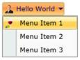{border="0"}

Figure 567: RibbonMenuItem with Icon

1.1.1.1.1.1.32.5.2 Checkable RibbonMenuItem

 

+---------------------------------------------------------------------------------------------------------------------------------------------------------------------------------------------------------------------------------------------------------------------------------------------------------------------------------------------------------------------------------------------------------------------------------------------------------------------------------------------------------------------------------------------------------------------------------------------------------------------------------------------------------------------------------------------------------------------------------------------------------------------------------------------------------------------------------------------------------------------------------------------------------+
| [XAML[]{style="COLOR: blue"}]{style="FONT-FAMILY: 'Courier New'"}                                                                                                                                                                                                                                                                                                                                                                                                                                                                                                                                                                                                                                                                                                                                                                                                                                       |
|                                                                                                                                                                                                                                                                                                                                                                                                                                                                                                                                                                                                                                                                                                                                                                                                                                                                                                         |
| []{style="FONT-FAMILY: 'Courier New'; COLOR: blue"}                                                                                                                                                                                                                                                                                                                                                                                                                                                                                                                                                                                                                                                                                                                                                                                                                                                     |
|                                                                                                                                                                                                                                                                                                                                                                                                                                                                                                                                                                                                                                                                                                                                                                                                                                                                                                         |
| [\<]{style="FONT-FAMILY: 'Courier New'; COLOR: blue"}[shared]{style="FONT-FAMILY: 'Courier New'; COLOR: #a31515"}[:]{style="FONT-FAMILY: 'Courier New'; COLOR: blue"}[RibbonDropDownButton]{style="FONT-FAMILY: 'Courier New'; COLOR: #a31515"}[ Label]{style="FONT-FAMILY: 'Courier New'; COLOR: red"}[=\"Hello World\"]{style="FONT-FAMILY: 'Courier New'; COLOR: blue"}[ x]{style="FONT-FAMILY: 'Courier New'; COLOR: red"}[:]{style="FONT-FAMILY: 'Courier New'; COLOR: blue"}[Name]{style="FONT-FAMILY: 'Courier New'; COLOR: red"}[=\"button\"]{style="FONT-FAMILY: 'Courier New'; COLOR: blue"}[ SizeMode]{style="FONT-FAMILY: 'Courier New'; COLOR: red"}[=\"Normal\"]{style="FONT-FAMILY: 'Courier New'; COLOR: blue"}[ SmallIcon]{style="FONT-FAMILY: 'Courier New'; COLOR: red"}[=\"employee.png\"\>]{style="FONT-FAMILY: 'Courier New'; COLOR: blue"}[]{style="FONT-FAMILY: 'Courier New'"} |
|                                                                                                                                                                                                                                                                                                                                                                                                                                                                                                                                                                                                                                                                                                                                                                                                                                                                                                         |
| [   ]{style="FONT-FAMILY: 'Courier New'; COLOR: #a31515"}[\<]{style="FONT-FAMILY: 'Courier New'; COLOR: blue"}[shared]{style="FONT-FAMILY: 'Courier New'; COLOR: #a31515"}[:]{style="FONT-FAMILY: 'Courier New'; COLOR: blue"}[RibbonMenuGroup]{style="FONT-FAMILY: 'Courier New'; COLOR: #a31515"}[\>]{style="FONT-FAMILY: 'Courier New'; COLOR: blue"}[]{style="FONT-FAMILY: 'Courier New'"}                                                                                                                                                                                                                                                                                                                                                                                                                                                                                                          |
|                                                                                                                                                                                                                                                                                                                                                                                                                                                                                                                                                                                                                                                                                                                                                                                                                                                                                                         |
| [        ]{style="FONT-FAMILY: 'Courier New'; COLOR: #a31515"}[\<]{style="FONT-FAMILY: 'Courier New'; COLOR: blue"}[shared]{style="FONT-FAMILY: 'Courier New'; COLOR: #a31515"}[:]{style="FONT-FAMILY: 'Courier New'; COLOR: blue"}[RibbonMenuItem]{style="FONT-FAMILY: 'Courier New'; COLOR: #a31515"}[ Header]{style="FONT-FAMILY: 'Courier New'; COLOR: red"}[=\"Menu Item 1\"]{style="FONT-FAMILY: 'Courier New'; COLOR: blue"}[ IsCheckable]{style="FONT-FAMILY: 'Courier New'; COLOR: red"}[=\"True\"/\>]{style="FONT-FAMILY: 'Courier New'; COLOR: blue"}[]{style="FONT-FAMILY: 'Courier New'"}                                                                                                                                                                                                                                                                                                  |
|                                                                                                                                                                                                                                                                                                                                                                                                                                                                                                                                                                                                                                                                                                                                                                                                                                                                                                         |
| [        ]{style="FONT-FAMILY: 'Courier New'; COLOR: #a31515"}[\<]{style="FONT-FAMILY: 'Courier New'; COLOR: blue"}[shared]{style="FONT-FAMILY: 'Courier New'; COLOR: #a31515"}[:]{style="FONT-FAMILY: 'Courier New'; COLOR: blue"}[RibbonMenuItem]{style="FONT-FAMILY: 'Courier New'; COLOR: #a31515"}[ Header]{style="FONT-FAMILY: 'Courier New'; COLOR: red"}[=\"Menu Item 2\"/\>]{style="FONT-FAMILY: 'Courier New'; COLOR: blue"}[]{style="FONT-FAMILY: 'Courier New'"}                                                                                                                                                                                                                                                                                                                                                                                                                            |
|                                                                                                                                                                                                                                                                                                                                                                                                                                                                                                                                                                                                                                                                                                                                                                                                                                                                                                         |
| [        ]{style="FONT-FAMILY: 'Courier New'; COLOR: #a31515"}[\<]{style="FONT-FAMILY: 'Courier New'; COLOR: blue"}[shared]{style="FONT-FAMILY: 'Courier New'; COLOR: #a31515"}[:]{style="FONT-FAMILY: 'Courier New'; COLOR: blue"}[RibbonMenuItem]{style="FONT-FAMILY: 'Courier New'; COLOR: #a31515"}[ Header]{style="FONT-FAMILY: 'Courier New'; COLOR: red"}[=\"Menu Item 3\"]{style="FONT-FAMILY: 'Courier New'; COLOR: blue"}[ IsCheckable]{style="FONT-FAMILY: 'Courier New'; COLOR: red"}[=\"True\"/\>]{style="FONT-FAMILY: 'Courier New'; COLOR: blue"}                                                                                                                                                                                                                                                                                                                                        |
|                                                                                                                                                                                                                                                                                                                                                                                                                                                                                                                                                                                                                                                                                                                                                                                                                                                                                                         |
| [   ]{style="FONT-FAMILY: 'Courier New'; COLOR: #a31515"}[\</]{style="FONT-FAMILY: 'Courier New'; COLOR: blue"}[shared]{style="FONT-FAMILY: 'Courier New'; COLOR: #a31515"}[:]{style="FONT-FAMILY: 'Courier New'; COLOR: blue"}[RibbonMenuGroup]{style="FONT-FAMILY: 'Courier New'; COLOR: #a31515"}[\>]{style="FONT-FAMILY: 'Courier New'; COLOR: blue"}[]{style="FONT-FAMILY: 'Courier New'"}                                                                                                                                                                                                                                                                                                                                                                                                                                                                                                         |
|                                                                                                                                                                                                                                                                                                                                                                                                                                                                                                                                                                                                                                                                                                                                                                                                                                                                                                         |
| [\</]{style="FONT-FAMILY: 'Courier New'; COLOR: blue"}[shared]{style="FONT-FAMILY: 'Courier New'; COLOR: #a31515"}[:]{style="FONT-FAMILY: 'Courier New'; COLOR: blue"}[RibbonDropDownButton]{style="FONT-FAMILY: 'Courier New'; COLOR: #a31515"}[\>]{style="FONT-FAMILY: 'Courier New'; COLOR: blue"}**[]{style="FONT-FAMILY: 'Courier New'; COLOR: #4f81bd"}**                                                                                                                                                                                                                                                                                                                                                                                                                                                                                                                                         |
+---------------------------------------------------------------------------------------------------------------------------------------------------------------------------------------------------------------------------------------------------------------------------------------------------------------------------------------------------------------------------------------------------------------------------------------------------------------------------------------------------------------------------------------------------------------------------------------------------------------------------------------------------------------------------------------------------------------------------------------------------------------------------------------------------------------------------------------------------------------------------------------------------------+

[]{style="FONT-FAMILY: 'Calibri','sans-serif'"} 

[]{style="FONT-FAMILY: 'Calibri','sans-serif'"} 

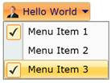{border="0"}

Figure 568: Checkable DropDownMenuItems

1.1.1.1.1.1.33     Blendability

The *Button* Controls can be easily editable using Expression Blend.

1.   Open the Sample in *Expression Blend*. Right Click the *Button* Control and Choose the *Edit Template* option as shown below:

 

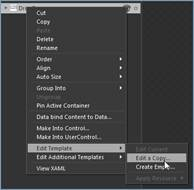{border="0"}

Figure 569: Edit Style for DropDownButton in Blend

2.   A window will appear as shown below. Click OK to create a new style for the Button Control.[]{style="FONT-FAMILY: 'Calibri','sans-serif'"}

[]{style="FONT-FAMILY: 'Calibri','sans-serif'"} 

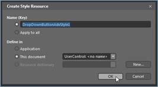{border="0"}

Figure 570: Add Style Name for DropDownButton in Blend

[]{style="FONT-FAMILY: 'Calibri','sans-serif'; COLOR: #4f81bd"} 

[·      ]{style="FONT-FAMILY: Symbol"}All the resources will be displayed on the resources pane on the right side of the Design area. These resources can be editable to create a new Style.

{border="0"}

Figure 571: Default Resources for DropDownButton in Blend

{border="0"}

Figure 572: RibbonDropDownButton style edited in Blend

1.1.1.1.1.1.34     How To:

1.1.1.1.1.1.34.1  disable the DropDown Popup?

 

The *DropDown* can be disabled by cancelling the event **DropDownOpening**. It is described with the help of a code snippet:

+-------------------------------------------------------------------------------------------------------------------------------------------------------------------------------------------------------------------------------+
| [C#[]{style="COLOR: blue"}]{style="FONT-FAMILY: 'Courier New'"}                                                                                                                                                               |
|                                                                                                                                                                                                                               |
| []{style="FONT-FAMILY: 'Courier New'; COLOR: blue"}                                                                                                                                                                           |
|                                                                                                                                                                                                                               |
| [public]{style="FONT-FAMILY: 'Courier New'; COLOR: blue"}[ MainPage()]{style="FONT-FAMILY: 'Courier New'"}                                                                                                                    |
|                                                                                                                                                                                                                               |
| [{]{style="FONT-FAMILY: 'Courier New'"}                                                                                                                                                                                       |
|                                                                                                                                                                                                                               |
| [    InitializeComponent();]{style="FONT-FAMILY: 'Courier New'"}                                                                                                                                                              |
|                                                                                                                                                                                                                               |
| [    button.DropDownOpening += [new]{style="COLOR: blue"} [CancelEventHandler]{style="COLOR: #2b91af"}(button_DropDownOpening);]{style="FONT-FAMILY: 'Courier New'"}                                                          |
|                                                                                                                                                                                                                               |
| [}]{style="FONT-FAMILY: 'Courier New'"}                                                                                                                                                                                       |
|                                                                                                                                                                                                                               |
| []{style="FONT-FAMILY: 'Courier New'"}                                                                                                                                                                                        |
|                                                                                                                                                                                                                               |
| [void]{style="FONT-FAMILY: 'Courier New'; COLOR: blue"}[ button_DropDownOpening([object]{style="COLOR: blue"} sender, System.ComponentModel.[CancelEventArgs]{style="COLOR: #2b91af"} e)]{style="FONT-FAMILY: 'Courier New'"} |
|                                                                                                                                                                                                                               |
| [{]{style="FONT-FAMILY: 'Courier New'"}                                                                                                                                                                                       |
|                                                                                                                                                                                                                               |
| [    e.Cancel = [true]{style="COLOR: blue"};]{style="FONT-FAMILY: 'Courier New'"}                                                                                                                                             |
|                                                                                                                                                                                                                               |
| [    [//DropDown will not open.]{style="COLOR: green"}]{style="FONT-FAMILY: 'Courier New'"}                                                                                                                                   |
|                                                                                                                                                                                                                               |
| [}]{style="FONT-FAMILY: 'Courier New'"}                                                                                                                                                                                       |
+-------------------------------------------------------------------------------------------------------------------------------------------------------------------------------------------------------------------------------+

[]{style="FONT-FAMILY: 'Calibri','sans-serif'"} 

1.1.1.1.1.1.34.2  Achieve StaysOpenOnClick behavior in RibbonDropDownButton?

[]{style="FONT-FAMILY: 'Calibri','sans-serif'"} 

The DropDown can stay open, when we cancel the **DropDownClosing** event.

+-------------------------------------------------------------------------------------------------------------------------------------------------------------------------------------------------------------------------------+
| [C#[]{style="COLOR: blue"}]{style="FONT-FAMILY: 'Courier New'"}                                                                                                                                                               |
|                                                                                                                                                                                                                               |
| []{style="FONT-FAMILY: 'Courier New'; COLOR: blue"}                                                                                                                                                                           |
|                                                                                                                                                                                                                               |
| [public]{style="FONT-FAMILY: 'Courier New'; COLOR: blue"}[ MainPage()]{style="FONT-FAMILY: 'Courier New'"}                                                                                                                    |
|                                                                                                                                                                                                                               |
| [{]{style="FONT-FAMILY: 'Courier New'"}                                                                                                                                                                                       |
|                                                                                                                                                                                                                               |
| [     InitializeComponent();]{style="FONT-FAMILY: 'Courier New'"}                                                                                                                                                             |
|                                                                                                                                                                                                                               |
| [     button.DropDownClosing += [new]{style="COLOR: blue"} [CancelEventHandler]{style="COLOR: #2b91af"}(button_DropDownClosing);]{style="FONT-FAMILY: 'Courier New'"}                                                         |
|                                                                                                                                                                                                                               |
| [}]{style="FONT-FAMILY: 'Courier New'"}                                                                                                                                                                                       |
|                                                                                                                                                                                                                               |
| []{style="FONT-FAMILY: 'Courier New'"}                                                                                                                                                                                        |
|                                                                                                                                                                                                                               |
| [void]{style="FONT-FAMILY: 'Courier New'; COLOR: blue"}[ button_DropDownClosing([object]{style="COLOR: blue"} sender, System.ComponentModel.[CancelEventArgs]{style="COLOR: #2b91af"} e)]{style="FONT-FAMILY: 'Courier New'"} |
|                                                                                                                                                                                                                               |
| [{]{style="FONT-FAMILY: 'Courier New'"}                                                                                                                                                                                       |
|                                                                                                                                                                                                                               |
| [     e.Cancel = [true]{style="COLOR: blue"};]{style="FONT-FAMILY: 'Courier New'"}                                                                                                                                            |
|                                                                                                                                                                                                                               |
| [     [//DropDown will not close.]{style="COLOR: green"}]{style="FONT-FAMILY: 'Courier New'"}                                                                                                                                 |
|                                                                                                                                                                                                                               |
| [}]{style="FONT-FAMILY: 'Courier New'"}                                                                                                                                                                                       |
+-------------------------------------------------------------------------------------------------------------------------------------------------------------------------------------------------------------------------------+

[]{style="FONT-FAMILY: 'Calibri','sans-serif'"} 

###### RibbonSplitButton

*RibbonSplitButton* control is inherited from SplitButtonAdv, which provides both *DropDown* support and *Commanding* support.

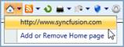{border="0"}

Figure 573: RibbonSplitButton**[]{style="FONT-FAMILY: 'Calibri','sans-serif'; COLOR: #4f81bd"}**

1.1.1.1.1.1.35     Control Structure

 

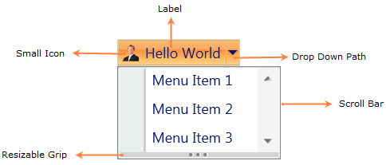{border="0"}[]{style="FONT-FAMILY: 'Calibri','sans-serif'"}

Figure 574: RibbonSplitButton Control Structure

1.1.1.1.1.1.36     Members

1.1.1.1.1.1.36.1  Properties

 

+-------------+-------------+---------------------+--------------------------------------------------------------------------------------+---------------+---------------------------------------------------------------------------------------------+
| Name        | Type        | Value it accepts    | Description                                                                          | Default Value | Reference Link                                                                              |
+-------------+-------------+---------------------+--------------------------------------------------------------------------------------+---------------+---------------------------------------------------------------------------------------------+
| Label       | String      | String              | The Label property of this element can be set to any string value                    | Null          | [Label]{style="COLOR: windowtext; TEXT-DECORATION: none; text-underline: none"}             |
+-------------+-------------+---------------------+--------------------------------------------------------------------------------------+---------------+---------------------------------------------------------------------------------------------+
| SizeMode    | SizeMode    | Normal,             | Represents the size of the element, which may be Normal, Small or Large              | Normal        | [SizeMode]{style="COLOR: windowtext; TEXT-DECORATION: none; text-underline: none"}          |
|             |             |                     |                                                                                      |               |                                                                                             |
|             |             | Small,        Large |                                                                                      |               |                                                                                             |
+-------------+-------------+---------------------+--------------------------------------------------------------------------------------+---------------+---------------------------------------------------------------------------------------------+
| SmallIcon   | ImageSource | Image URL           | Represents the image displayed in the element, when the size form is small or normal | \-            | [SmallIcon]{style="COLOR: windowtext; TEXT-DECORATION: none; text-underline: none"}         |
+-------------+-------------+---------------------+--------------------------------------------------------------------------------------+---------------+---------------------------------------------------------------------------------------------+
| LargeIcon   | ImageSource | Image URL           | Represents the image displayed in the element, when the size form is large           | \-            | [LargeIcon]{style="COLOR: windowtext; TEXT-DECORATION: none; text-underline: none"}         |
+-------------+-------------+---------------------+--------------------------------------------------------------------------------------+---------------+---------------------------------------------------------------------------------------------+
| IsMultiline | Boolean     | True or False       | The value, which represents whether the Label displayed is in two lines or not.      | True          | [Multiline Support]{style="COLOR: windowtext; TEXT-DECORATION: none; text-underline: none"} |
+-------------+-------------+---------------------+--------------------------------------------------------------------------------------+---------------+---------------------------------------------------------------------------------------------+

[]{style="FONT-FAMILY: 'Calibri','sans-serif'"} 

1.1.1.1.1.1.36.2  Events

 

  ----------------- -------------------- ---------------------- --------------------------------------- ----------------------------------------------------------------------------------------------------------------------------
  Name              Event Type           Event Args Parameter   Description                             Reference Link
  DropDownOpened    RoutedEventHandler   RoutedEvent Args       Occurs after the DropDown is opened.    [DropDownOpened]{style="FONT-FAMILY: 'Calibri','sans-serif'; COLOR: blue"}[]{style="FONT-FAMILY: 'Calibri','sans-serif'"}
  DropDownOpening   CancelEventHandler   CancelEventArgs        Occurs before the DropDown is opened.   [DropDownOpening]{style="FONT-FAMILY: 'Calibri','sans-serif'; COLOR: blue"}[]{style="FONT-FAMILY: 'Calibri','sans-serif'"}
  DropDownClosed    RoutedEventHandler   RoutedEvent Args       Occurs after the DropDown is closed.    [DropDownClosed]{style="FONT-FAMILY: 'Calibri','sans-serif'; COLOR: blue"}[]{style="FONT-FAMILY: 'Calibri','sans-serif'"}
  DropDownClosing   CancelEventHandler   CancelEventArgs        Occurs before DropDown is closed.       [DropDownClosing]{style="FONT-FAMILY: 'Calibri','sans-serif'; COLOR: blue"}[]{style="FONT-FAMILY: 'Calibri','sans-serif'"}
  Click             RoutedEventHandler   RoutedEventArgs        Occurs when the element is pressed.     [Click]{style="FONT-FAMILY: 'Calibri','sans-serif'; COLOR: blue"}[]{style="FONT-FAMILY: 'Calibri','sans-serif'"}
  ----------------- -------------------- ---------------------- --------------------------------------- ----------------------------------------------------------------------------------------------------------------------------

[]{style="FONT-FAMILY: 'Calibri','sans-serif'"} 

The RibbonSplitButton control exposes the following events.

[]{#_Click_–_This}[]{#_Click}1.1.1.1.1.1.36.2.1 Click

This event occurs when the element isclicked.

+---------------------------------------------------------------------------------------------------------------------------------------------------------------------------------------------------------------------------------------------------------------------------------------------------------------------------------------------------------------------------------------------------------------------------+
| **[XAML[]{style="COLOR: blue"}]{style="FONT-FAMILY: 'Courier New'"}**                                                                                                                                                                                                                                                                                                                                                     |
|                                                                                                                                                                                                                                                                                                                                                                                                                           |
| []{style="FONT-FAMILY: 'Courier New'; COLOR: blue"}                                                                                                                                                                                                                                                                                                                                                                       |
|                                                                                                                                                                                                                                                                                                                                                                                                                           |
| [\<]{style="FONT-FAMILY: 'Courier New'; COLOR: blue"}[shared]{style="FONT-FAMILY: 'Courier New'; COLOR: #a31515"}[:]{style="FONT-FAMILY: 'Courier New'; COLOR: blue"}[RibbonSplitButton]{style="FONT-FAMILY: 'Courier New'; COLOR: #a31515"}[ Click]{style="FONT-FAMILY: 'Courier New'; COLOR: red"}[=\"SplitButtonAdv_Click\"/\>]{style="FONT-FAMILY: 'Courier New'; COLOR: blue"}[]{style="FONT-FAMILY: 'Courier New'"} |
+---------------------------------------------------------------------------------------------------------------------------------------------------------------------------------------------------------------------------------------------------------------------------------------------------------------------------------------------------------------------------------------------------------------------------+

[]{style="FONT-FAMILY: 'Courier New'"} 

+-------------------------------------------------------------------------------------------------------------------------------------------------------------------------------------------------+
| **[C#[]{style="COLOR: #2b91af"}]{style="FONT-FAMILY: 'Courier New'"}**                                                                                                                          |
|                                                                                                                                                                                                 |
| []{style="FONT-FAMILY: 'Courier New'; COLOR: #2b91af"}                                                                                                                                          |
|                                                                                                                                                                                                 |
| [RibbonSplitButton]{style="FONT-FAMILY: 'Courier New'; COLOR: #2b91af"}[ button = [new]{style="COLOR: blue"} [RibbonplitButton]{style="COLOR: #2b91af"}();]{style="FONT-FAMILY: 'Courier New'"} |
|                                                                                                                                                                                                 |
| [button.Click +=[new]{style="COLOR: blue"} [RoutedEventHandler]{style="COLOR: #2b91af"}(button_Click);]{style="FONT-FAMILY: 'Courier New'"}                                                     |
+-------------------------------------------------------------------------------------------------------------------------------------------------------------------------------------------------+

[]{style="FONT-FAMILY: 'Calibri','sans-serif'"} 

[]{#_DropDownOpening}1.1.1.1.1.1.36.2.2 DropDownOpening

This event occurs before opening the DropDown[.]{style="FONT-FAMILY: 'Calibri','sans-serif'"}

+-----------------------------------------------------------------------------------------------------------------------------------------------------------------------------------------------------------------------------------------------------------------------------------------------------------------------------------------------------------------------------------------------------------------------------------------------+
| [XAML[]{style="COLOR: blue"}]{style="FONT-FAMILY: 'Courier New'"}                                                                                                                                                                                                                                                                                                                                                                             |
|                                                                                                                                                                                                                                                                                                                                                                                                                                               |
| []{style="FONT-FAMILY: 'Courier New'; COLOR: blue"}                                                                                                                                                                                                                                                                                                                                                                                           |
|                                                                                                                                                                                                                                                                                                                                                                                                                                               |
| [\<]{style="FONT-FAMILY: 'Courier New'; COLOR: blue"}[shared]{style="FONT-FAMILY: 'Courier New'; COLOR: #a31515"}[:]{style="FONT-FAMILY: 'Courier New'; COLOR: blue"}[RibbonSplitButton]{style="FONT-FAMILY: 'Courier New'; COLOR: #a31515"}[ DropDownOpening]{style="FONT-FAMILY: 'Courier New'; COLOR: red"}[=\"SplitButtonAdv_DropDownOpening\"/\>]{style="FONT-FAMILY: 'Courier New'; COLOR: blue"}[]{style="FONT-FAMILY: 'Courier New'"} |
+-----------------------------------------------------------------------------------------------------------------------------------------------------------------------------------------------------------------------------------------------------------------------------------------------------------------------------------------------------------------------------------------------------------------------------------------------+

[]{style="FONT-FAMILY: 'Courier New'"} 

+--------------------------------------------------------------------------------------------------------------------------------------------------------------------------------------------------+
| [C#[]{style="COLOR: #2b91af"}]{style="FONT-FAMILY: 'Courier New'"}                                                                                                                               |
|                                                                                                                                                                                                  |
| []{style="FONT-FAMILY: 'Courier New'; COLOR: #2b91af"}                                                                                                                                           |
|                                                                                                                                                                                                  |
| [RibbonSplitButton]{style="FONT-FAMILY: 'Courier New'; COLOR: #2b91af"}[ button = [new]{style="COLOR: blue"} [RibbonSplitButton]{style="COLOR: #2b91af"}();]{style="FONT-FAMILY: 'Courier New'"} |
|                                                                                                                                                                                                  |
| [button.DropDownOpening +=[new]{style="COLOR: blue"} [CancelEventHandler]{style="COLOR: #2b91af"}(button_DropDownOpening);]{style="FONT-FAMILY: 'Courier New'"}                                  |
+--------------------------------------------------------------------------------------------------------------------------------------------------------------------------------------------------+

[]{style="FONT-FAMILY: 'Calibri','sans-serif'"} 

[]{#_DropDownOpened}1.1.1.1.1.1.36.2.3 DropDownOpened

[This event occurs after opening the DropDown.]{style="FONT-FAMILY: 'Courier New'"}

+---------------------------------------------------------------------------------------------------------------------------------------------------------------------------------------------------------------------------------------------------------------------------------------------------------------------------------------------------------------------------------------------------------------------------------------------+
| **[XAML]{style="FONT-FAMILY: 'Courier New'"}**[]{style="FONT-FAMILY: 'Courier New'; COLOR: blue"}                                                                                                                                                                                                                                                                                                                                           |
|                                                                                                                                                                                                                                                                                                                                                                                                                                             |
| []{style="FONT-FAMILY: 'Courier New'; COLOR: blue"}                                                                                                                                                                                                                                                                                                                                                                                         |
|                                                                                                                                                                                                                                                                                                                                                                                                                                             |
| [\<]{style="FONT-FAMILY: 'Courier New'; COLOR: blue"}[shared]{style="FONT-FAMILY: 'Courier New'; COLOR: #a31515"}[:]{style="FONT-FAMILY: 'Courier New'; COLOR: blue"}[RibbonSplitButton]{style="FONT-FAMILY: 'Courier New'; COLOR: #a31515"}[ DropDownOpened]{style="FONT-FAMILY: 'Courier New'; COLOR: red"}[=\"SplitButtonAdv_DropDownOpened\"/\>]{style="FONT-FAMILY: 'Courier New'; COLOR: blue"}[]{style="FONT-FAMILY: 'Courier New'"} |
+---------------------------------------------------------------------------------------------------------------------------------------------------------------------------------------------------------------------------------------------------------------------------------------------------------------------------------------------------------------------------------------------------------------------------------------------+

[]{style="FONT-FAMILY: 'Courier New'"} 

+--------------------------------------------------------------------------------------------------------------------------------------------------------------------------------------------------+
| **[C#[]{style="COLOR: #2b91af"}]{style="FONT-FAMILY: 'Courier New'"}**                                                                                                                           |
|                                                                                                                                                                                                  |
| []{style="FONT-FAMILY: 'Courier New'; COLOR: #2b91af"}                                                                                                                                           |
|                                                                                                                                                                                                  |
| [RibbonSplitButton]{style="FONT-FAMILY: 'Courier New'; COLOR: #2b91af"}[ button = [new]{style="COLOR: blue"} [RibbonSplitButton]{style="COLOR: #2b91af"}();]{style="FONT-FAMILY: 'Courier New'"} |
|                                                                                                                                                                                                  |
| [button.DropDownOpened +=[new]{style="COLOR: blue"} [RoutedEventHandler]{style="COLOR: #2b91af"}(button_DropDownOpened);]{style="FONT-FAMILY: 'Courier New'"}                                    |
+--------------------------------------------------------------------------------------------------------------------------------------------------------------------------------------------------+

[]{style="FONT-FAMILY: 'Calibri','sans-serif'"} 

[]{style="FONT-FAMILY: 'Calibri','sans-serif'"} 

[]{#_DropDownClosing}1.1.1.1.1.1.36.2.4 DropDownClosing

This event occurs before closing the DropDown.

+-----------------------------------------------------------------------------------------------------------------------------------------------------------------------------------------------------------------------------------------------------------------------------------------------------------------------------------------------------------------------------------------------------------------------------------------------+
| **[XAML[]{style="COLOR: blue"}]{style="FONT-FAMILY: 'Courier New'"}**                                                                                                                                                                                                                                                                                                                                                                         |
|                                                                                                                                                                                                                                                                                                                                                                                                                                               |
| []{style="FONT-FAMILY: 'Courier New'; COLOR: blue"}                                                                                                                                                                                                                                                                                                                                                                                           |
|                                                                                                                                                                                                                                                                                                                                                                                                                                               |
| [\<]{style="FONT-FAMILY: 'Courier New'; COLOR: blue"}[shared]{style="FONT-FAMILY: 'Courier New'; COLOR: #a31515"}[:]{style="FONT-FAMILY: 'Courier New'; COLOR: blue"}[RibbonSplitButton]{style="FONT-FAMILY: 'Courier New'; COLOR: #a31515"}[ DropDownClosing]{style="FONT-FAMILY: 'Courier New'; COLOR: red"}[=\"SplitButtonAdv_DropDownClosing\"/\>]{style="FONT-FAMILY: 'Courier New'; COLOR: blue"}[]{style="FONT-FAMILY: 'Courier New'"} |
+-----------------------------------------------------------------------------------------------------------------------------------------------------------------------------------------------------------------------------------------------------------------------------------------------------------------------------------------------------------------------------------------------------------------------------------------------+

[]{style="FONT-FAMILY: 'Courier New'"} 

+--------------------------------------------------------------------------------------------------------------------------------------------------------------------------------------------------+
| **[C#[]{style="COLOR: #2b91af"}]{style="FONT-FAMILY: 'Courier New'"}**                                                                                                                           |
|                                                                                                                                                                                                  |
| []{style="FONT-FAMILY: 'Courier New'; COLOR: #2b91af"}                                                                                                                                           |
|                                                                                                                                                                                                  |
| [RIbbonSplitButton]{style="FONT-FAMILY: 'Courier New'; COLOR: #2b91af"}[ button = [new]{style="COLOR: blue"} [RibbonSplitButton]{style="COLOR: #2b91af"}();]{style="FONT-FAMILY: 'Courier New'"} |
|                                                                                                                                                                                                  |
| [button.DropDownClosing +=[new]{style="COLOR: blue"} [CancelEventHandler]{style="COLOR: #2b91af"}(button_DropDownClosing);]{style="FONT-FAMILY: 'Courier New'"}                                  |
+--------------------------------------------------------------------------------------------------------------------------------------------------------------------------------------------------+

[]{style="FONT-FAMILY: 'Calibri','sans-serif'"} 

[]{#_DropDownClosed}1.1.1.1.1.1.36.2.5 DropDownClosed

This event occurs after closing the DropDown.

+---------------------------------------------------------------------------------------------------------------------------------------------------------------------------------------------------------------------------------------------------------------------------------------------------------------------------------------------------------------------------------------------------------------------------------------------+
| [XAML[]{style="COLOR: blue"}]{style="FONT-FAMILY: 'Courier New'"}                                                                                                                                                                                                                                                                                                                                                                           |
|                                                                                                                                                                                                                                                                                                                                                                                                                                             |
| []{style="FONT-FAMILY: 'Courier New'; COLOR: blue"}                                                                                                                                                                                                                                                                                                                                                                                         |
|                                                                                                                                                                                                                                                                                                                                                                                                                                             |
| [\<]{style="FONT-FAMILY: 'Courier New'; COLOR: blue"}[shared]{style="FONT-FAMILY: 'Courier New'; COLOR: #a31515"}[:]{style="FONT-FAMILY: 'Courier New'; COLOR: blue"}[RibbonSplitButton]{style="FONT-FAMILY: 'Courier New'; COLOR: #a31515"}[ DropDownClosed]{style="FONT-FAMILY: 'Courier New'; COLOR: red"}[=\"SplitButtonAdv_DropDownClosed\"/\>]{style="FONT-FAMILY: 'Courier New'; COLOR: blue"}[]{style="FONT-FAMILY: 'Courier New'"} |
+---------------------------------------------------------------------------------------------------------------------------------------------------------------------------------------------------------------------------------------------------------------------------------------------------------------------------------------------------------------------------------------------------------------------------------------------+

[]{style="FONT-FAMILY: 'Courier New'"} 

+-------------------------------------------------------------------------------------------------------------------------------------------------------------------------------------------------+
| [C#[]{style="COLOR: #2b91af"}]{style="FONT-FAMILY: 'Courier New'"}                                                                                                                              |
|                                                                                                                                                                                                 |
| []{style="FONT-FAMILY: 'Courier New'; COLOR: #2b91af"}                                                                                                                                          |
|                                                                                                                                                                                                 |
| [RibbonSplitButton]{style="FONT-FAMILY: 'Courier New'; COLOR: #2b91af"}[ button = [new]{style="COLOR: blue"} [RibbonplitButton]{style="COLOR: #2b91af"}();]{style="FONT-FAMILY: 'Courier New'"} |
|                                                                                                                                                                                                 |
| [button.DropDownClosed +=[new]{style="COLOR: blue"} [RoutedEventHandler]{style="COLOR: #2b91af"}(button_DropDownClosed);]{style="FONT-FAMILY: 'Courier New'"}                                   |
+-------------------------------------------------------------------------------------------------------------------------------------------------------------------------------------------------+

[]{style="FONT-FAMILY: 'Calibri','sans-serif'"} 

1.1.1.1.1.1.37     Declaring RibbonSplitButton

**Namespace:** Syncfusion.Windows.Tools.Controls

**Assembly:** Syncfusion.Ribbon.Silverlight

[]{#_Setting_Label_1}1.1.1.1.1.1.37.1  Setting Label

The following code explains the declaration of a RibbonSplitButton control using XAML.

  --------------------------------------------------------------------------------------------------------------------------------------------------------------------------------------------------------------------------------------------------------------------------------------------------------------------------------------------------------------------------
  [XAML]{style="FONT-FAMILY: 'Courier New'"}
  [\<]{style="FONT-FAMILY: 'Courier New'; COLOR: blue"}[sync]{style="FONT-FAMILY: 'Courier New'; COLOR: #a31515"}[:]{style="FONT-FAMILY: 'Courier New'; COLOR: blue"}[RibbonSplitButton]{style="FONT-FAMILY: 'Courier New'; COLOR: #a31515"}[ Label]{style="FONT-FAMILY: 'Courier New'; COLOR: red"}[=\"Hello World\"/\>]{style="FONT-FAMILY: 'Courier New'; COLOR: blue"}
  --------------------------------------------------------------------------------------------------------------------------------------------------------------------------------------------------------------------------------------------------------------------------------------------------------------------------------------------------------------------------

[]{style="FONT-FAMILY: 'Calibri','sans-serif'"} 

The RibbonSplitButton control can be created through C# as follows:

+-------------------------------------------------------------------------------------------------------------------------------------------------------------------------------------------------+
| [C#]{style="FONT-FAMILY: 'Courier New'"}                                                                                                                                                        |
+-------------------------------------------------------------------------------------------------------------------------------------------------------------------------------------------------+
| [RibbonSplitButton]{style="FONT-FAMILY: 'Courier New'; COLOR: #2b91af"}[ button = [new]{style="COLOR: blue"} [RibbonSplitButton]{style="COLOR: #2b91af"}()]{style="FONT-FAMILY: 'Courier New'"} |
|                                                                                                                                                                                                 |
| [button.Label = [\"Hello World\"]{style="COLOR: #a31515"};]{style="FONT-FAMILY: 'Courier New'"}                                                                                                 |
+-------------------------------------------------------------------------------------------------------------------------------------------------------------------------------------------------+

[]{style="FONT-FAMILY: 'Calibri','sans-serif'"} 

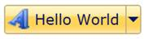{border="0"}

Figure 575: A typical RibbonSplitButton Control

[]{#_Setting_Size_Mode_1}1.1.1.1.1.1.37.2  Setting Size Mode

The *Size* Mode of the *RibbonSplit* button can be easily changed using the property **SizeMode.** The **SizeMode** contains following values:

[·      ]{style="FONT-FAMILY: Symbol"}Small

[·      ]{style="FONT-FAMILY: Symbol"}Normal and

[·      ]{style="FONT-FAMILY: Symbol"}Large

 

+-------------------------------------------------------------------------------------------------------------------------------------------------------------------------------------------------------------------------------------------------------------------------------------------------------------------------------------------------------------------------------------------------------------------------------------------------------------------------------------------------------------------------------------+
| **[XAML]{style="FONT-FAMILY: 'Courier New'"}**[]{style="FONT-FAMILY: 'Courier New'; COLOR: blue"}                                                                                                                                                                                                                                                                                                                                                                                                                                   |
|                                                                                                                                                                                                                                                                                                                                                                                                                                                                                                                                     |
| []{style="FONT-FAMILY: 'Courier New'; COLOR: blue"}                                                                                                                                                                                                                                                                                                                                                                                                                                                                                 |
|                                                                                                                                                                                                                                                                                                                                                                                                                                                                                                                                     |
| [\<]{style="FONT-FAMILY: 'Courier New'; COLOR: blue"}[sync]{style="FONT-FAMILY: 'Courier New'; COLOR: #a31515"}[:]{style="FONT-FAMILY: 'Courier New'; COLOR: blue"}[SplitButtonAdv]{style="FONT-FAMILY: 'Courier New'; COLOR: #a31515"}[ SizeMode]{style="FONT-FAMILY: 'Courier New'; COLOR: red"}[=\"Small\"]{style="FONT-FAMILY: 'Courier New'; COLOR: blue"}[ Label]{style="FONT-FAMILY: 'Courier New'; COLOR: red"}[=\"Hello World\"/\>]{style="FONT-FAMILY: 'Courier New'; COLOR: blue"}[]{style="FONT-FAMILY: 'Courier New'"} |
+-------------------------------------------------------------------------------------------------------------------------------------------------------------------------------------------------------------------------------------------------------------------------------------------------------------------------------------------------------------------------------------------------------------------------------------------------------------------------------------------------------------------------------------+

[]{style="FONT-FAMILY: 'Courier New'"} 

+-------------------------------------------------------------------------------------------------------------------------------------------------------------------------------------------+
| **[C#[]{style="COLOR: #2b91af"}]{style="FONT-FAMILY: 'Courier New'"}**                                                                                                                    |
|                                                                                                                                                                                           |
| []{style="FONT-FAMILY: 'Courier New'; COLOR: #2b91af"}                                                                                                                                    |
|                                                                                                                                                                                           |
| [SplitButtonAdv]{style="FONT-FAMILY: 'Courier New'; COLOR: #2b91af"}[ button = [new]{style="COLOR: blue"} [SplitButtonAdv]{style="COLOR: #2b91af"}()]{style="FONT-FAMILY: 'Courier New'"} |
|                                                                                                                                                                                           |
| [button.Label = [\"Hello World\"]{style="COLOR: #a31515"};]{style="FONT-FAMILY: 'Courier New'"}                                                                                           |
|                                                                                                                                                                                           |
| [button.SizeMode = SizeMode.Small;]{style="FONT-FAMILY: 'Courier New'"}                                                                                                                   |
+-------------------------------------------------------------------------------------------------------------------------------------------------------------------------------------------+

[]{style="FONT-FAMILY: 'Courier New'"} 

[]{style="FONT-FAMILY: 'Courier New'"} 

+--------------------------------------------------------------------------------------------------------------------------------------------------------------------------------------------------------------------------------------------------------------------------------------------------------------------------------------------------------------------------------------------------------------------------------------------------------------------------------------------------------------------------------------+
| **[XAML[]{style="COLOR: blue"}]{style="FONT-FAMILY: 'Courier New'"}**                                                                                                                                                                                                                                                                                                                                                                                                                                                                |
|                                                                                                                                                                                                                                                                                                                                                                                                                                                                                                                                      |
| []{style="FONT-FAMILY: 'Courier New'; COLOR: blue"}                                                                                                                                                                                                                                                                                                                                                                                                                                                                                  |
|                                                                                                                                                                                                                                                                                                                                                                                                                                                                                                                                      |
| [\<]{style="FONT-FAMILY: 'Courier New'; COLOR: blue"}[sync]{style="FONT-FAMILY: 'Courier New'; COLOR: #a31515"}[:]{style="FONT-FAMILY: 'Courier New'; COLOR: blue"}[SplitButtonAdv]{style="FONT-FAMILY: 'Courier New'; COLOR: #a31515"}[ SizeMode]{style="FONT-FAMILY: 'Courier New'; COLOR: red"}[=\"Normal\"]{style="FONT-FAMILY: 'Courier New'; COLOR: blue"}[ Label]{style="FONT-FAMILY: 'Courier New'; COLOR: red"}[=\"Hello World\"/\>]{style="FONT-FAMILY: 'Courier New'; COLOR: blue"}[]{style="FONT-FAMILY: 'Courier New'"} |
+--------------------------------------------------------------------------------------------------------------------------------------------------------------------------------------------------------------------------------------------------------------------------------------------------------------------------------------------------------------------------------------------------------------------------------------------------------------------------------------------------------------------------------------+

[]{style="FONT-FAMILY: 'Courier New'"} 

+-------------------------------------------------------------------------------------------------------------------------------------------------------------------------------------------+
| **[C#[]{style="COLOR: #2b91af"}]{style="FONT-FAMILY: 'Courier New'"}**                                                                                                                    |
|                                                                                                                                                                                           |
| []{style="FONT-FAMILY: 'Courier New'; COLOR: #2b91af"}                                                                                                                                    |
|                                                                                                                                                                                           |
| [SplitButtonAdv]{style="FONT-FAMILY: 'Courier New'; COLOR: #2b91af"}[ button = [new]{style="COLOR: blue"} [SplitButtonAdv]{style="COLOR: #2b91af"}()]{style="FONT-FAMILY: 'Courier New'"} |
|                                                                                                                                                                                           |
| [button.Label = [\"Hello World\"]{style="COLOR: #a31515"};]{style="FONT-FAMILY: 'Courier New'"}                                                                                           |
|                                                                                                                                                                                           |
| [button.SizeMode = SizeMode.Normal;]{style="FONT-FAMILY: 'Courier New'"}                                                                                                                  |
+-------------------------------------------------------------------------------------------------------------------------------------------------------------------------------------------+

[]{style="FONT-FAMILY: 'Calibri','sans-serif'"} 

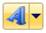{border="0"}

Figure 576: RibbonSplitButton control with Small SizeMode

*[]{style="FONT-FAMILY: 'Calibri','sans-serif'"}* 

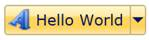{border="0"}

**[]{style="FONT-FAMILY: 'Calibri','sans-serif'; COLOR: #4f81bd"}** 

Figure 577: RibbonSplitButton control with Normal SizeMode

+-------------------------------------------------------------------------------------------------------------------------------------------------------------------------------------------------------------------------------------------------------------------------------------------------------------------------------------------------------------------------------------------------------------------------------------------------------------------------------------------------------------------------------------+
| **[XAML]{style="FONT-FAMILY: 'Courier New'"}**[]{style="FONT-FAMILY: 'Courier New'; COLOR: blue"}                                                                                                                                                                                                                                                                                                                                                                                                                                   |
|                                                                                                                                                                                                                                                                                                                                                                                                                                                                                                                                     |
| []{style="FONT-FAMILY: 'Courier New'; COLOR: blue"}                                                                                                                                                                                                                                                                                                                                                                                                                                                                                 |
|                                                                                                                                                                                                                                                                                                                                                                                                                                                                                                                                     |
| [\<]{style="FONT-FAMILY: 'Courier New'; COLOR: blue"}[sync]{style="FONT-FAMILY: 'Courier New'; COLOR: #a31515"}[:]{style="FONT-FAMILY: 'Courier New'; COLOR: blue"}[SplitButtonAdv]{style="FONT-FAMILY: 'Courier New'; COLOR: #a31515"}[ SizeMode]{style="FONT-FAMILY: 'Courier New'; COLOR: red"}[=\"Large\"]{style="FONT-FAMILY: 'Courier New'; COLOR: blue"}[ Label]{style="FONT-FAMILY: 'Courier New'; COLOR: red"}[=\"Hello World\"/\>]{style="FONT-FAMILY: 'Courier New'; COLOR: blue"}[]{style="FONT-FAMILY: 'Courier New'"} |
+-------------------------------------------------------------------------------------------------------------------------------------------------------------------------------------------------------------------------------------------------------------------------------------------------------------------------------------------------------------------------------------------------------------------------------------------------------------------------------------------------------------------------------------+

[]{style="FONT-FAMILY: 'Courier New'"} 

+-------------------------------------------------------------------------------------------------------------------------------------------------------------------------------------------+
| **[C#[]{style="COLOR: #2b91af"}]{style="FONT-FAMILY: 'Courier New'"}**                                                                                                                    |
|                                                                                                                                                                                           |
| []{style="FONT-FAMILY: 'Courier New'; COLOR: #2b91af"}                                                                                                                                    |
|                                                                                                                                                                                           |
| [SplitButtonAdv]{style="FONT-FAMILY: 'Courier New'; COLOR: #2b91af"}[ button = [new]{style="COLOR: blue"} [SplitButtonAdv]{style="COLOR: #2b91af"}()]{style="FONT-FAMILY: 'Courier New'"} |
|                                                                                                                                                                                           |
| [button.Label = [\"Hello World\"]{style="COLOR: #a31515"};]{style="FONT-FAMILY: 'Courier New'"}                                                                                           |
|                                                                                                                                                                                           |
| [button.SizeMode = SizeMode.Large;]{style="FONT-FAMILY: 'Courier New'"}                                                                                                                   |
+-------------------------------------------------------------------------------------------------------------------------------------------------------------------------------------------+

[]{style="FONT-FAMILY: 'Calibri','sans-serif'"} 

*[]{style="FONT-FAMILY: 'Calibri','sans-serif'"}* 

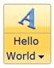{border="0"}

Figure 578: RibbonSplitButton control with Large SizeMode

[]{#_Setting_Image_1} 

[]{#_Setting_Image_2}1.1.1.1.1.1.37.3  Setting Image

 

The image displayed in the control can be set using two properties namely:

[·      ]{style="FONT-FAMILY: Symbol"}SmallIcon -- The property is used to set Image, when SizeMode is Normal or Small.

[·      ]{style="FONT-FAMILY: Symbol"}LargeIcon -- The property is used to set image, when SizeMode is Large.

The *SmallIcon* property can be set as follows:

+-----------------------------------------------------------------------------------------------------------------------------------------------------------------------------------------------------------------------------------------------------------------------------------------------------------------------------------------------------------------------------------------------------------------------------------------------------------------------------------------------------------------------------------------------------------------------------------------------------------------------------------------------------------------------+
| **[XAML[]{style="COLOR: blue"}]{style="FONT-FAMILY: 'Courier New'"}**                                                                                                                                                                                                                                                                                                                                                                                                                                                                                                                                                                                                 |
|                                                                                                                                                                                                                                                                                                                                                                                                                                                                                                                                                                                                                                                                       |
| []{style="FONT-FAMILY: 'Courier New'; COLOR: blue"}                                                                                                                                                                                                                                                                                                                                                                                                                                                                                                                                                                                                                   |
|                                                                                                                                                                                                                                                                                                                                                                                                                                                                                                                                                                                                                                                                       |
| [\<]{style="FONT-FAMILY: 'Courier New'; COLOR: blue"}[sync]{style="FONT-FAMILY: 'Courier New'; COLOR: #a31515"}[:]{style="FONT-FAMILY: 'Courier New'; COLOR: blue"}[RibbonplitButton]{style="FONT-FAMILY: 'Courier New'; COLOR: #a31515"}[ SizeMode]{style="FONT-FAMILY: 'Courier New'; COLOR: red"}[=\"Small\"]{style="FONT-FAMILY: 'Courier New'; COLOR: blue"}[ Label]{style="FONT-FAMILY: 'Courier New'; COLOR: red"}[=\"Hello World\" ]{style="FONT-FAMILY: 'Courier New'; COLOR: blue"}[SmallIcon]{style="FONT-FAMILY: 'Courier New'; COLOR: red"}[=\"employee.png\"/\>]{style="FONT-FAMILY: 'Courier New'; COLOR: blue"}[]{style="FONT-FAMILY: 'Courier New'"} |
+-----------------------------------------------------------------------------------------------------------------------------------------------------------------------------------------------------------------------------------------------------------------------------------------------------------------------------------------------------------------------------------------------------------------------------------------------------------------------------------------------------------------------------------------------------------------------------------------------------------------------------------------------------------------------+

[]{style="FONT-FAMILY: 'Courier New'"} 

+----------------------------------------------------------------------------------------------------------------------------------------------------------------------------------------------------------------------------------+
| **[C#]{style="FONT-FAMILY: 'Courier New'"}**[]{style="FONT-FAMILY: 'Courier New'; COLOR: #2b91af"}                                                                                                                               |
|                                                                                                                                                                                                                                  |
| []{style="FONT-FAMILY: 'Courier New'; COLOR: #2b91af"}                                                                                                                                                                           |
|                                                                                                                                                                                                                                  |
| [RibbonSplitButton]{style="FONT-FAMILY: 'Courier New'; COLOR: #2b91af"}[ button = [new]{style="COLOR: blue"} [RibbonSplitButton]{style="COLOR: #2b91af"}()]{style="FONT-FAMILY: 'Courier New'"}                                  |
|                                                                                                                                                                                                                                  |
| [button.Label = [\"Hello World\"]{style="COLOR: #a31515"};]{style="FONT-FAMILY: 'Courier New'"}                                                                                                                                  |
|                                                                                                                                                                                                                                  |
| [button.SizeMode = SizeMode.Small;]{style="FONT-FAMILY: 'Courier New'"}                                                                                                                                                          |
|                                                                                                                                                                                                                                  |
| [button.SmallIcon = [new]{style="COLOR: blue"} [BitmapImage]{style="COLOR: #2b91af"}([new]{style="COLOR: blue"} [Uri]{style="COLOR: #2b91af"}([\"employee.png\"]{style="COLOR: #a31515"}));]{style="FONT-FAMILY: 'Courier New'"} |
+----------------------------------------------------------------------------------------------------------------------------------------------------------------------------------------------------------------------------------+

[]{style="FONT-FAMILY: 'Calibri','sans-serif'"} 

{border="0"}

Figure 579: Small Sized RibbonSplitButton Control with image

+-------------------------------------------------------------------------------------------------------------------------------------------------------------------------------------------------------------------------------------------------------------------------------------------------------------------------------------------------------------------------------------------------------------------------------------------------------------------------------------------------------------------------------------------------------------------------------------------------------------------------------------------------------------------------+
| **[XAML[]{style="COLOR: blue"}]{style="FONT-FAMILY: 'Courier New'"}**                                                                                                                                                                                                                                                                                                                                                                                                                                                                                                                                                                                                   |
|                                                                                                                                                                                                                                                                                                                                                                                                                                                                                                                                                                                                                                                                         |
| []{style="FONT-FAMILY: 'Courier New'; COLOR: blue"}                                                                                                                                                                                                                                                                                                                                                                                                                                                                                                                                                                                                                     |
|                                                                                                                                                                                                                                                                                                                                                                                                                                                                                                                                                                                                                                                                         |
| [\<]{style="FONT-FAMILY: 'Courier New'; COLOR: blue"}[sync]{style="FONT-FAMILY: 'Courier New'; COLOR: #a31515"}[:]{style="FONT-FAMILY: 'Courier New'; COLOR: blue"}[RibbonSplitButton]{style="FONT-FAMILY: 'Courier New'; COLOR: #a31515"}[ SizeMode]{style="FONT-FAMILY: 'Courier New'; COLOR: red"}[=\"Normal\" ]{style="FONT-FAMILY: 'Courier New'; COLOR: blue"}[SmallIcon]{style="FONT-FAMILY: 'Courier New'; COLOR: red"}[=\"employee.png\"]{style="FONT-FAMILY: 'Courier New'; COLOR: blue"}[ Label]{style="FONT-FAMILY: 'Courier New'; COLOR: red"}[=\"Hello World\"/\>]{style="FONT-FAMILY: 'Courier New'; COLOR: blue"}[]{style="FONT-FAMILY: 'Courier New'"} |
+-------------------------------------------------------------------------------------------------------------------------------------------------------------------------------------------------------------------------------------------------------------------------------------------------------------------------------------------------------------------------------------------------------------------------------------------------------------------------------------------------------------------------------------------------------------------------------------------------------------------------------------------------------------------------+

**[]{style="FONT-FAMILY: 'Courier New'; COLOR: #4f81bd"}** 

+----------------------------------------------------------------------------------------------------------------------------------------------------------------------------------------------------------------------------------+
| **[C#[]{style="COLOR: #2b91af"}]{style="FONT-FAMILY: 'Courier New'"}**                                                                                                                                                           |
|                                                                                                                                                                                                                                  |
| []{style="FONT-FAMILY: 'Courier New'; COLOR: #2b91af"}                                                                                                                                                                           |
|                                                                                                                                                                                                                                  |
| [RibbonSplitButtonAdv]{style="FONT-FAMILY: 'Courier New'; COLOR: #2b91af"}[ button = [new]{style="COLOR: blue"} [RibbonSplitButton]{style="COLOR: #2b91af"}()]{style="FONT-FAMILY: 'Courier New'"}                               |
|                                                                                                                                                                                                                                  |
| [button.Label = [\"Hello World\"]{style="COLOR: #a31515"};]{style="FONT-FAMILY: 'Courier New'"}                                                                                                                                  |
|                                                                                                                                                                                                                                  |
| [button.SizeMode = SizeMode.Normal;]{style="FONT-FAMILY: 'Courier New'"}                                                                                                                                                         |
|                                                                                                                                                                                                                                  |
| [button.SmallIcon = [new]{style="COLOR: blue"} [BitmapImage]{style="COLOR: #2b91af"}([new]{style="COLOR: blue"} [Uri]{style="COLOR: #2b91af"}([\"employee.png\"]{style="COLOR: #a31515"}));]{style="FONT-FAMILY: 'Courier New'"} |
+----------------------------------------------------------------------------------------------------------------------------------------------------------------------------------------------------------------------------------+

**[]{style="FONT-FAMILY: 'Calibri','sans-serif'; COLOR: #4f81bd"}** 

{border="0"}

Figure 580: Normal Sized RibbonSplitButton Control with Image

[]{style="FONT-FAMILY: 'Calibri','sans-serif'"} 

 

The Large Icon property can be set as follows:

+------------------------------------------------------------------------------------------------------------------------------------------------------------------------------------------------------------------------------------------------------------------------------------------------------------------------------------------------------------------------------------------------------------------------------------------------------------------------------------------------------------------------------------------------------------------------------------------------------------------------------------------------------------------------+
| **[XAML[]{style="COLOR: blue"}]{style="FONT-FAMILY: 'Courier New'"}**                                                                                                                                                                                                                                                                                                                                                                                                                                                                                                                                                                                                  |
|                                                                                                                                                                                                                                                                                                                                                                                                                                                                                                                                                                                                                                                                        |
| []{style="FONT-FAMILY: 'Courier New'; COLOR: blue"}                                                                                                                                                                                                                                                                                                                                                                                                                                                                                                                                                                                                                    |
|                                                                                                                                                                                                                                                                                                                                                                                                                                                                                                                                                                                                                                                                        |
| [\<]{style="FONT-FAMILY: 'Courier New'; COLOR: blue"}[sync]{style="FONT-FAMILY: 'Courier New'; COLOR: #a31515"}[:]{style="FONT-FAMILY: 'Courier New'; COLOR: blue"}[RibbonSplitButton]{style="FONT-FAMILY: 'Courier New'; COLOR: #a31515"}[ SizeMode]{style="FONT-FAMILY: 'Courier New'; COLOR: red"}[=\"Large\" ]{style="FONT-FAMILY: 'Courier New'; COLOR: blue"}[LargeIcon]{style="FONT-FAMILY: 'Courier New'; COLOR: red"}[=\"employee.png\"]{style="FONT-FAMILY: 'Courier New'; COLOR: blue"}[ Label]{style="FONT-FAMILY: 'Courier New'; COLOR: red"}[=\"Hello World\"/\>]{style="FONT-FAMILY: 'Courier New'; COLOR: blue"}[]{style="FONT-FAMILY: 'Courier New'"} |
+------------------------------------------------------------------------------------------------------------------------------------------------------------------------------------------------------------------------------------------------------------------------------------------------------------------------------------------------------------------------------------------------------------------------------------------------------------------------------------------------------------------------------------------------------------------------------------------------------------------------------------------------------------------------+

[]{style="FONT-FAMILY: 'Courier New'"} 

+----------------------------------------------------------------------------------------------------------------------------------------------------------------------------------------------------------------------------------+
| **[C#[]{style="COLOR: #2b91af"}]{style="FONT-FAMILY: 'Courier New'"}**                                                                                                                                                           |
|                                                                                                                                                                                                                                  |
| []{style="FONT-FAMILY: 'Courier New'; COLOR: #2b91af"}                                                                                                                                                                           |
|                                                                                                                                                                                                                                  |
| [RibbonSplitButton]{style="FONT-FAMILY: 'Courier New'; COLOR: #2b91af"}[ button = [new]{style="COLOR: blue"} [RibbonSplitButton]{style="COLOR: #2b91af"}();]{style="FONT-FAMILY: 'Courier New'"}                                 |
|                                                                                                                                                                                                                                  |
| [button.Label = [\"Hello World\"]{style="COLOR: #a31515"};]{style="FONT-FAMILY: 'Courier New'"}                                                                                                                                  |
|                                                                                                                                                                                                                                  |
| [button.SizeMode = SizeMode.Large;]{style="FONT-FAMILY: 'Courier New'"}                                                                                                                                                          |
|                                                                                                                                                                                                                                  |
| [button.SmallIcon = [new]{style="COLOR: blue"} [BitmapImage]{style="COLOR: #2b91af"}([new]{style="COLOR: blue"} [Uri]{style="COLOR: #2b91af"}([\"employee.png\"]{style="COLOR: #a31515"}));]{style="FONT-FAMILY: 'Courier New'"} |
+----------------------------------------------------------------------------------------------------------------------------------------------------------------------------------------------------------------------------------+

[]{style="FONT-FAMILY: 'Calibri','sans-serif'"} 

{border="0"}

Figure 581: Large Sized RibbonSplitButton Control with Image

 

1.1.1.1.1.1.37.4  Adding Items to RibbonSplitButton

The *RibbonMenuGroup* acts as a Container for RibbonSplitButton, which provides full customization such as *Resizing*, *Header* and *Scrollbar* support.

+------------------------------------------------------------------------------------------------------------------------------------------------------------------------------------------------------------------------------------------------------------------------------------------------------------------------------------------------------------------------------------------------------------------------------------------------------------------------------------------------------------------------------------------------------------------------------------------------------------------------------------------------------------------------------------------------------------------------------------------------------------------------------------------------------------------------------------------------------------------------------------------------------+
| [XAML[]{style="COLOR: blue"}]{style="FONT-FAMILY: 'Courier New'"}                                                                                                                                                                                                                                                                                                                                                                                                                                                                                                                                                                                                                                                                                                                                                                                                                                    |
|                                                                                                                                                                                                                                                                                                                                                                                                                                                                                                                                                                                                                                                                                                                                                                                                                                                                                                      |
| []{style="FONT-FAMILY: 'Courier New'; COLOR: blue"}                                                                                                                                                                                                                                                                                                                                                                                                                                                                                                                                                                                                                                                                                                                                                                                                                                                  |
|                                                                                                                                                                                                                                                                                                                                                                                                                                                                                                                                                                                                                                                                                                                                                                                                                                                                                                      |
| [\<]{style="FONT-FAMILY: 'Courier New'; COLOR: blue"}[shared]{style="FONT-FAMILY: 'Courier New'; COLOR: #a31515"}[:]{style="FONT-FAMILY: 'Courier New'; COLOR: blue"}[RibbonSplitButton]{style="FONT-FAMILY: 'Courier New'; COLOR: #a31515"}[ Label]{style="FONT-FAMILY: 'Courier New'; COLOR: red"}[=\"Hello World\"]{style="FONT-FAMILY: 'Courier New'; COLOR: blue"}[ x]{style="FONT-FAMILY: 'Courier New'; COLOR: red"}[:]{style="FONT-FAMILY: 'Courier New'; COLOR: blue"}[Name]{style="FONT-FAMILY: 'Courier New'; COLOR: red"}[=\"button\"]{style="FONT-FAMILY: 'Courier New'; COLOR: blue"}[ SizeMode]{style="FONT-FAMILY: 'Courier New'; COLOR: red"}[=\"Normal\"]{style="FONT-FAMILY: 'Courier New'; COLOR: blue"}[ SmallIcon]{style="FONT-FAMILY: 'Courier New'; COLOR: red"}[=\"employee.png\"\>]{style="FONT-FAMILY: 'Courier New'; COLOR: blue"}[]{style="FONT-FAMILY: 'Courier New'"} |
|                                                                                                                                                                                                                                                                                                                                                                                                                                                                                                                                                                                                                                                                                                                                                                                                                                                                                                      |
| [   ]{style="FONT-FAMILY: 'Courier New'; COLOR: #a31515"}[\<]{style="FONT-FAMILY: 'Courier New'; COLOR: blue"}[shared]{style="FONT-FAMILY: 'Courier New'; COLOR: #a31515"}[:]{style="FONT-FAMILY: 'Courier New'; COLOR: blue"}[RibbonMenuGroup]{style="FONT-FAMILY: 'Courier New'; COLOR: #a31515"}[\>]{style="FONT-FAMILY: 'Courier New'; COLOR: blue"}[]{style="FONT-FAMILY: 'Courier New'"}                                                                                                                                                                                                                                                                                                                                                                                                                                                                                                       |
|                                                                                                                                                                                                                                                                                                                                                                                                                                                                                                                                                                                                                                                                                                                                                                                                                                                                                                      |
| [       ]{style="FONT-FAMILY: 'Courier New'; COLOR: #a31515"}[\<]{style="FONT-FAMILY: 'Courier New'; COLOR: blue"}[shared]{style="FONT-FAMILY: 'Courier New'; COLOR: #a31515"}[:]{style="FONT-FAMILY: 'Courier New'; COLOR: blue"}[RibbonMenuItem]{style="FONT-FAMILY: 'Courier New'; COLOR: #a31515"}[ Header]{style="FONT-FAMILY: 'Courier New'; COLOR: red"}[=\"Menu Item 1\"/\>]{style="FONT-FAMILY: 'Courier New'; COLOR: blue"}[]{style="FONT-FAMILY: 'Courier New'"}                                                                                                                                                                                                                                                                                                                                                                                                                          |
|                                                                                                                                                                                                                                                                                                                                                                                                                                                                                                                                                                                                                                                                                                                                                                                                                                                                                                      |
| [       ]{style="FONT-FAMILY: 'Courier New'; COLOR: #a31515"}[\<]{style="FONT-FAMILY: 'Courier New'; COLOR: blue"}[shared]{style="FONT-FAMILY: 'Courier New'; COLOR: #a31515"}[:]{style="FONT-FAMILY: 'Courier New'; COLOR: blue"}[RibbonMenuItem]{style="FONT-FAMILY: 'Courier New'; COLOR: #a31515"}[ Header]{style="FONT-FAMILY: 'Courier New'; COLOR: red"}[=\"Menu Item 2\"/\>]{style="FONT-FAMILY: 'Courier New'; COLOR: blue"}[]{style="FONT-FAMILY: 'Courier New'"}                                                                                                                                                                                                                                                                                                                                                                                                                          |
|                                                                                                                                                                                                                                                                                                                                                                                                                                                                                                                                                                                                                                                                                                                                                                                                                                                                                                      |
| [       ]{style="FONT-FAMILY: 'Courier New'; COLOR: #a31515"}[\<]{style="FONT-FAMILY: 'Courier New'; COLOR: blue"}[shared]{style="FONT-FAMILY: 'Courier New'; COLOR: #a31515"}[:]{style="FONT-FAMILY: 'Courier New'; COLOR: blue"}[RibbonMenuItem]{style="FONT-FAMILY: 'Courier New'; COLOR: #a31515"}[ Header]{style="FONT-FAMILY: 'Courier New'; COLOR: red"}[=\"Menu Item 3\"/\>]{style="FONT-FAMILY: 'Courier New'; COLOR: blue"}[]{style="FONT-FAMILY: 'Courier New'"}                                                                                                                                                                                                                                                                                                                                                                                                                          |
|                                                                                                                                                                                                                                                                                                                                                                                                                                                                                                                                                                                                                                                                                                                                                                                                                                                                                                      |
| [   ]{style="FONT-FAMILY: 'Courier New'; COLOR: #a31515"}[\</]{style="FONT-FAMILY: 'Courier New'; COLOR: blue"}[shared]{style="FONT-FAMILY: 'Courier New'; COLOR: #a31515"}[:]{style="FONT-FAMILY: 'Courier New'; COLOR: blue"}[RibbonMenuGroup]{style="FONT-FAMILY: 'Courier New'; COLOR: #a31515"}[\>]{style="FONT-FAMILY: 'Courier New'; COLOR: blue"}[]{style="FONT-FAMILY: 'Courier New'"}                                                                                                                                                                                                                                                                                                                                                                                                                                                                                                      |
|                                                                                                                                                                                                                                                                                                                                                                                                                                                                                                                                                                                                                                                                                                                                                                                                                                                                                                      |
| [\</]{style="FONT-FAMILY: 'Courier New'; COLOR: blue"}[shared]{style="FONT-FAMILY: 'Courier New'; COLOR: #a31515"}[:]{style="FONT-FAMILY: 'Courier New'; COLOR: blue"}[RibbonSplitButton]{style="FONT-FAMILY: 'Courier New'; COLOR: #a31515"}[\>]{style="FONT-FAMILY: 'Courier New'; COLOR: blue"}[]{style="FONT-FAMILY: 'Courier New'"}                                                                                                                                                                                                                                                                                                                                                                                                                                                                                                                                                             |
+------------------------------------------------------------------------------------------------------------------------------------------------------------------------------------------------------------------------------------------------------------------------------------------------------------------------------------------------------------------------------------------------------------------------------------------------------------------------------------------------------------------------------------------------------------------------------------------------------------------------------------------------------------------------------------------------------------------------------------------------------------------------------------------------------------------------------------------------------------------------------------------------------+

[]{style="FONT-FAMILY: 'Calibri','sans-serif'"} 

+-------------------------------------------------------------------------------------------------------------------------------------------------------------------------------------------------+
| **[C#]{style="FONT-FAMILY: 'Courier New'"}**[]{style="FONT-FAMILY: 'Courier New'; COLOR: #2b91af"}                                                                                              |
|                                                                                                                                                                                                 |
| []{style="FONT-FAMILY: 'Courier New'; COLOR: #2b91af"}                                                                                                                                          |
|                                                                                                                                                                                                 |
| [RibbonSplitButton]{style="FONT-FAMILY: 'Courier New'; COLOR: #2b91af"}[ button = [new]{style="COLOR: blue"} [RibbonplitButton]{style="COLOR: #2b91af"}();]{style="FONT-FAMILY: 'Courier New'"} |
|                                                                                                                                                                                                 |
| [RibbonMenuGroup]{style="FONT-FAMILY: 'Courier New'; COLOR: #2b91af"}[ menu = [new]{style="COLOR: blue"} [RibbonMenuGroup]{style="COLOR: #2b91af"}();]{style="FONT-FAMILY: 'Courier New'"}      |
|                                                                                                                                                                                                 |
| [RibbonMenuItem]{style="FONT-FAMILY: 'Courier New'; COLOR: #2b91af"}[ menuItem1 = [new]{style="COLOR: blue"} [RibbonMenuItem]{style="COLOR: #2b91af"}();]{style="FONT-FAMILY: 'Courier New'"}   |
|                                                                                                                                                                                                 |
| [RibbonMenuItem]{style="FONT-FAMILY: 'Courier New'; COLOR: #2b91af"}[ menuItem2 = [new]{style="COLOR: blue"} [RibbonMenuItem]{style="COLOR: #2b91af"}();]{style="FONT-FAMILY: 'Courier New'"}   |
|                                                                                                                                                                                                 |
| [RibbonMenuItem]{style="FONT-FAMILY: 'Courier New'; COLOR: #2b91af"}[ menuItem3 = [new]{style="COLOR: blue"} [RibbonMenuItem]{style="COLOR: #2b91af"}();]{style="FONT-FAMILY: 'Courier New'"}   |
|                                                                                                                                                                                                 |
| [menu.Items.Add(menuItem1);]{style="FONT-FAMILY: 'Courier New'"}                                                                                                                                |
|                                                                                                                                                                                                 |
| [menu.Items.Add(menuItem2);]{style="FONT-FAMILY: 'Courier New'"}                                                                                                                                |
|                                                                                                                                                                                                 |
| [menu.Items.Add(menuItem3);]{style="FONT-FAMILY: 'Courier New'"}                                                                                                                                |
|                                                                                                                                                                                                 |
| [button.Content = menuItem1;]{style="FONT-FAMILY: 'Courier New'"}                                                                                                                               |
+-------------------------------------------------------------------------------------------------------------------------------------------------------------------------------------------------+

[]{style="FONT-FAMILY: 'Calibri','sans-serif'"} 

[]{style="FONT-FAMILY: 'Calibri','sans-serif'"} 

[]{style="FONT-FAMILY: 'Calibri','sans-serif'"} 

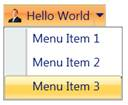{border="0"}

Figure 582: A Typical RibbonSplitButton

1.1.1.1.1.1.38     Concepts and Features

1.1.1.1.1.1.38.1  Drop Direction

The DropDown Direction can be changed using the property *DropDirection*. The *Enum* takes the following values. The default value is BottomLeft.

[·      ]{style="FONT-FAMILY: Symbol"}Left

[·      ]{style="FONT-FAMILY: Symbol"}Right

[·      ]{style="FONT-FAMILY: Symbol"}BottomLeft

[·      ]{style="FONT-FAMILY: Symbol"}BottomRight

[·      ]{style="FONT-FAMILY: Symbol"}TopLeft

[·      ]{style="FONT-FAMILY: Symbol"}TopRight

 

+-----------------------------------------------------------------------------------------------------------------------------------------------------------------------------------------------------------------------------------------------------------------------------------------------------------------------------------------------------------------------------------------------------------------------+
| **[XAML[]{style="COLOR: blue"}]{style="FONT-FAMILY: 'Courier New'"}**                                                                                                                                                                                                                                                                                                                                                 |
|                                                                                                                                                                                                                                                                                                                                                                                                                       |
| []{style="FONT-FAMILY: 'Courier New'; COLOR: blue"}                                                                                                                                                                                                                                                                                                                                                                   |
|                                                                                                                                                                                                                                                                                                                                                                                                                       |
| [\<]{style="FONT-FAMILY: 'Courier New'; COLOR: blue"}[sync]{style="FONT-FAMILY: 'Courier New'; COLOR: #a31515"}[:]{style="FONT-FAMILY: 'Courier New'; COLOR: blue"}[RibbonSplitButton]{style="FONT-FAMILY: 'Courier New'; COLOR: #a31515"}[ DropDirection]{style="FONT-FAMILY: 'Courier New'; COLOR: red"}[=\"BottomLeft\"/\>]{style="FONT-FAMILY: 'Courier New'; COLOR: blue"}[]{style="FONT-FAMILY: 'Courier New'"} |
+-----------------------------------------------------------------------------------------------------------------------------------------------------------------------------------------------------------------------------------------------------------------------------------------------------------------------------------------------------------------------------------------------------------------------+

 

 

[]{style="FONT-FAMILY: 'Calibri','sans-serif'"} 

{border="0"}

Figure 583: BottomLeft Drop Direction

+----------------------------------------------------------------------------------------------------------------------------------------------------------------------------------------------------------------------------------------------------------------------------------------------------------------------------------------------------------------------------------+
| **[XAML[]{style="COLOR: blue"}]{style="FONT-FAMILY: 'Courier New'"}**                                                                                                                                                                                                                                                                                                            |
|                                                                                                                                                                                                                                                                                                                                                                                  |
| []{style="FONT-FAMILY: 'Courier New'; COLOR: blue"}                                                                                                                                                                                                                                                                                                                              |
|                                                                                                                                                                                                                                                                                                                                                                                  |
| [\<]{style="FONT-FAMILY: 'Courier New'; COLOR: blue"}[sync]{style="FONT-FAMILY: 'Courier New'; COLOR: #a31515"}[:]{style="FONT-FAMILY: 'Courier New'; COLOR: blue"}[RibbonSplitButton]{style="FONT-FAMILY: 'Courier New'; COLOR: #a31515"}[ DropDirection]{style="FONT-FAMILY: 'Courier New'; COLOR: red"}[=\"BottomRight\"/\>]{style="FONT-FAMILY: 'Courier New'; COLOR: blue"} |
+----------------------------------------------------------------------------------------------------------------------------------------------------------------------------------------------------------------------------------------------------------------------------------------------------------------------------------------------------------------------------------+

**[]{style="FONT-FAMILY: 'Calibri','sans-serif'; COLOR: #4f81bd"}** 

[]{style="FONT-FAMILY: 'Calibri','sans-serif'"} 

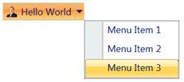{border="0"}

Figure 584: BottomRight Drop Direction

**[]{style="FONT-FAMILY: 'Calibri','sans-serif'; COLOR: #4f81bd"}** 

+------------------------------------------------------------------------------------------------------------------------------------------------------------------------------------------------------------------------------------------------------------------------------------------------------------------------------------------------------------------------------------------------------------------+
| **[XAML]{style="FONT-FAMILY: 'Courier New'"}**[]{style="FONT-FAMILY: 'Courier New'; COLOR: blue"}                                                                                                                                                                                                                                                                                                                |
|                                                                                                                                                                                                                                                                                                                                                                                                                  |
| []{style="FONT-FAMILY: 'Courier New'; COLOR: blue"}                                                                                                                                                                                                                                                                                                                                                              |
|                                                                                                                                                                                                                                                                                                                                                                                                                  |
| [\<]{style="FONT-FAMILY: 'Courier New'; COLOR: blue"}[sync]{style="FONT-FAMILY: 'Courier New'; COLOR: #a31515"}[:]{style="FONT-FAMILY: 'Courier New'; COLOR: blue"}[RibbonSplitButton ]{style="FONT-FAMILY: 'Courier New'; COLOR: #a31515"}[DropDirection]{style="FONT-FAMILY: 'Courier New'; COLOR: red"}[=\"Right\"/\>]{style="FONT-FAMILY: 'Courier New'; COLOR: blue"}[]{style="FONT-FAMILY: 'Courier New'"} |
+------------------------------------------------------------------------------------------------------------------------------------------------------------------------------------------------------------------------------------------------------------------------------------------------------------------------------------------------------------------------------------------------------------------+

**[]{style="FONT-FAMILY: 'Calibri','sans-serif'; COLOR: #4f81bd"}** 

[]{style="FONT-FAMILY: 'Calibri','sans-serif'"} 

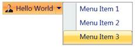{border="0"}

Figure 585: Right Drop Direction

+-----------------------------------------------------------------------------------------------------------------------------------------------------------------------------------------------------------------------------------------------------------------------------------------------------------------------------------------------------------------------------------------------------------------+
| **[XAML]{style="FONT-FAMILY: 'Courier New'"}**[]{style="FONT-FAMILY: 'Courier New'; COLOR: blue"}                                                                                                                                                                                                                                                                                                               |
|                                                                                                                                                                                                                                                                                                                                                                                                                 |
| []{style="FONT-FAMILY: 'Courier New'; COLOR: blue"}                                                                                                                                                                                                                                                                                                                                                             |
|                                                                                                                                                                                                                                                                                                                                                                                                                 |
| [\<]{style="FONT-FAMILY: 'Courier New'; COLOR: blue"}[sync]{style="FONT-FAMILY: 'Courier New'; COLOR: #a31515"}[:]{style="FONT-FAMILY: 'Courier New'; COLOR: blue"}[RibbonSplitButton ]{style="FONT-FAMILY: 'Courier New'; COLOR: #a31515"}[DropDirection]{style="FONT-FAMILY: 'Courier New'; COLOR: red"}[=\"Left\"/\>]{style="FONT-FAMILY: 'Courier New'; COLOR: blue"}[]{style="FONT-FAMILY: 'Courier New'"} |
+-----------------------------------------------------------------------------------------------------------------------------------------------------------------------------------------------------------------------------------------------------------------------------------------------------------------------------------------------------------------------------------------------------------------+

**[]{style="FONT-FAMILY: 'Calibri','sans-serif'; COLOR: #4f81bd"}** 

[]{style="FONT-FAMILY: 'Calibri','sans-serif'"} 

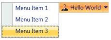{border="0"}

Figure 586: Left Drop Direction

1.1.1.1.1.1.38.2  Resizing Support

The RibbonMenuGroup supports resizing, if the property IsResizable is set to true.[]{style="FONT-FAMILY: 'Calibri','sans-serif'"}

+------------------------------------------------------------------------------------------------------------------------------------------------------------------------------------------------------------------------------------------------------------------------------------------------------------------------------------------------------------------------------------------------------------------------------------------------------------------------------------------------------------------------------------------------------------------------------------------------------------------------------------------------------------------------------------------------------------------------------------------------------------------------------------------------------------------------------------------------------------------------------------------------------+
| **[XAML]{style="FONT-FAMILY: 'Courier New'"}**[]{style="FONT-FAMILY: 'Courier New'; COLOR: blue"}                                                                                                                                                                                                                                                                                                                                                                                                                                                                                                                                                                                                                                                                                                                                                                                                    |
|                                                                                                                                                                                                                                                                                                                                                                                                                                                                                                                                                                                                                                                                                                                                                                                                                                                                                                      |
| []{style="FONT-FAMILY: 'Courier New'; COLOR: blue"}                                                                                                                                                                                                                                                                                                                                                                                                                                                                                                                                                                                                                                                                                                                                                                                                                                                  |
|                                                                                                                                                                                                                                                                                                                                                                                                                                                                                                                                                                                                                                                                                                                                                                                                                                                                                                      |
| [\<]{style="FONT-FAMILY: 'Courier New'; COLOR: blue"}[shared]{style="FONT-FAMILY: 'Courier New'; COLOR: #a31515"}[:]{style="FONT-FAMILY: 'Courier New'; COLOR: blue"}[RibbonSplitButton]{style="FONT-FAMILY: 'Courier New'; COLOR: #a31515"}[ Label]{style="FONT-FAMILY: 'Courier New'; COLOR: red"}[=\"Hello World\"]{style="FONT-FAMILY: 'Courier New'; COLOR: blue"}[ x]{style="FONT-FAMILY: 'Courier New'; COLOR: red"}[:]{style="FONT-FAMILY: 'Courier New'; COLOR: blue"}[Name]{style="FONT-FAMILY: 'Courier New'; COLOR: red"}[=\"button\"]{style="FONT-FAMILY: 'Courier New'; COLOR: blue"}[ SizeMode]{style="FONT-FAMILY: 'Courier New'; COLOR: red"}[=\"Normal\"]{style="FONT-FAMILY: 'Courier New'; COLOR: blue"}[ SmallIcon]{style="FONT-FAMILY: 'Courier New'; COLOR: red"}[=\"employee.png\"\>]{style="FONT-FAMILY: 'Courier New'; COLOR: blue"}[]{style="FONT-FAMILY: 'Courier New'"} |
|                                                                                                                                                                                                                                                                                                                                                                                                                                                                                                                                                                                                                                                                                                                                                                                                                                                                                                      |
| [   ]{style="FONT-FAMILY: 'Courier New'; COLOR: #a31515"}[\<]{style="FONT-FAMILY: 'Courier New'; COLOR: blue"}[shared]{style="FONT-FAMILY: 'Courier New'; COLOR: #a31515"}[:]{style="FONT-FAMILY: 'Courier New'; COLOR: blue"}[RibbonMenuGroup]{style="FONT-FAMILY: 'Courier New'; COLOR: #a31515"}[ IsResizable]{style="FONT-FAMILY: 'Courier New'; BACKGROUND: lightgrey; COLOR: red"}[=\"True\"\>]{style="FONT-FAMILY: 'Courier New'; BACKGROUND: lightgrey; COLOR: blue"}[]{style="FONT-FAMILY: 'Courier New'"}                                                                                                                                                                                                                                                                                                                                                                                  |
|                                                                                                                                                                                                                                                                                                                                                                                                                                                                                                                                                                                                                                                                                                                                                                                                                                                                                                      |
| [       ]{style="FONT-FAMILY: 'Courier New'; COLOR: #a31515"}[\<]{style="FONT-FAMILY: 'Courier New'; COLOR: blue"}[shared]{style="FONT-FAMILY: 'Courier New'; COLOR: #a31515"}[:]{style="FONT-FAMILY: 'Courier New'; COLOR: blue"}[RibbonMenuItem]{style="FONT-FAMILY: 'Courier New'; COLOR: #a31515"}[ Header]{style="FONT-FAMILY: 'Courier New'; COLOR: red"}[=\"Menu Item 1\"/\>]{style="FONT-FAMILY: 'Courier New'; COLOR: blue"}[]{style="FONT-FAMILY: 'Courier New'"}                                                                                                                                                                                                                                                                                                                                                                                                                          |
|                                                                                                                                                                                                                                                                                                                                                                                                                                                                                                                                                                                                                                                                                                                                                                                                                                                                                                      |
| [       ]{style="FONT-FAMILY: 'Courier New'; COLOR: #a31515"}[\<]{style="FONT-FAMILY: 'Courier New'; COLOR: blue"}[shared]{style="FONT-FAMILY: 'Courier New'; COLOR: #a31515"}[:]{style="FONT-FAMILY: 'Courier New'; COLOR: blue"}[RibbonMenuItem]{style="FONT-FAMILY: 'Courier New'; COLOR: #a31515"}[ Header]{style="FONT-FAMILY: 'Courier New'; COLOR: red"}[=\"Menu Item 2\"/\>]{style="FONT-FAMILY: 'Courier New'; COLOR: blue"}[]{style="FONT-FAMILY: 'Courier New'"}                                                                                                                                                                                                                                                                                                                                                                                                                          |
|                                                                                                                                                                                                                                                                                                                                                                                                                                                                                                                                                                                                                                                                                                                                                                                                                                                                                                      |
| [       ]{style="FONT-FAMILY: 'Courier New'; COLOR: #a31515"}[\<]{style="FONT-FAMILY: 'Courier New'; COLOR: blue"}[shared]{style="FONT-FAMILY: 'Courier New'; COLOR: #a31515"}[:]{style="FONT-FAMILY: 'Courier New'; COLOR: blue"}[RibbonMenuItem]{style="FONT-FAMILY: 'Courier New'; COLOR: #a31515"}[ Header]{style="FONT-FAMILY: 'Courier New'; COLOR: red"}[=\"Menu Item 3\"/\>]{style="FONT-FAMILY: 'Courier New'; COLOR: blue"}[]{style="FONT-FAMILY: 'Courier New'"}                                                                                                                                                                                                                                                                                                                                                                                                                          |
|                                                                                                                                                                                                                                                                                                                                                                                                                                                                                                                                                                                                                                                                                                                                                                                                                                                                                                      |
| [   ]{style="FONT-FAMILY: 'Courier New'; COLOR: #a31515"}[\</]{style="FONT-FAMILY: 'Courier New'; COLOR: blue"}[shared]{style="FONT-FAMILY: 'Courier New'; COLOR: #a31515"}[:]{style="FONT-FAMILY: 'Courier New'; COLOR: blue"}[RibbonMenuGroup]{style="FONT-FAMILY: 'Courier New'; COLOR: #a31515"}[\>]{style="FONT-FAMILY: 'Courier New'; COLOR: blue"}[]{style="FONT-FAMILY: 'Courier New'"}                                                                                                                                                                                                                                                                                                                                                                                                                                                                                                      |
|                                                                                                                                                                                                                                                                                                                                                                                                                                                                                                                                                                                                                                                                                                                                                                                                                                                                                                      |
| [\</]{style="FONT-FAMILY: 'Courier New'; COLOR: blue"}[shared]{style="FONT-FAMILY: 'Courier New'; COLOR: #a31515"}[:]{style="FONT-FAMILY: 'Courier New'; COLOR: blue"}[RibbonSplitButton]{style="FONT-FAMILY: 'Courier New'; COLOR: #a31515"}[\>]{style="FONT-FAMILY: 'Courier New'; COLOR: blue"}[]{style="FONT-FAMILY: 'Courier New'"}                                                                                                                                                                                                                                                                                                                                                                                                                                                                                                                                                             |
+------------------------------------------------------------------------------------------------------------------------------------------------------------------------------------------------------------------------------------------------------------------------------------------------------------------------------------------------------------------------------------------------------------------------------------------------------------------------------------------------------------------------------------------------------------------------------------------------------------------------------------------------------------------------------------------------------------------------------------------------------------------------------------------------------------------------------------------------------------------------------------------------------+

[]{style="FONT-FAMILY: 'Calibri','sans-serif'"} 

[]{style="FONT-FAMILY: 'Calibri','sans-serif'"} 

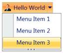{border="0"}

Figure 587: RibbonMenuGroup with Resizable Thumb

1.1.1.1.1.1.38.3  Scroll Bar Support

The RibbonMenuGroup is shipped with built-in Scrollbar support. It can be made visible by using the property ScrollBarVisibility.

+------------------------------------------------------------------------------------------------------------------------------------------------------------------------------------------------------------------------------------------------------------------------------------------------------------------------------------------------------------------------------------------------------------------------------------------------------------------------------------------------------------------------------------------------------------------------------------------------------------------------------------------------------------------------------------------------------------------------------------------------------------------------------------------------------------------------------------------------------------------------------------------------------+
| **[XAML]{style="FONT-FAMILY: 'Courier New'"}**[]{style="FONT-FAMILY: 'Courier New'; COLOR: blue"}                                                                                                                                                                                                                                                                                                                                                                                                                                                                                                                                                                                                                                                                                                                                                                                                    |
|                                                                                                                                                                                                                                                                                                                                                                                                                                                                                                                                                                                                                                                                                                                                                                                                                                                                                                      |
| []{style="FONT-FAMILY: 'Courier New'; COLOR: blue"}                                                                                                                                                                                                                                                                                                                                                                                                                                                                                                                                                                                                                                                                                                                                                                                                                                                  |
|                                                                                                                                                                                                                                                                                                                                                                                                                                                                                                                                                                                                                                                                                                                                                                                                                                                                                                      |
| [\<]{style="FONT-FAMILY: 'Courier New'; COLOR: blue"}[shared]{style="FONT-FAMILY: 'Courier New'; COLOR: #a31515"}[:]{style="FONT-FAMILY: 'Courier New'; COLOR: blue"}[RibbonSplitButton]{style="FONT-FAMILY: 'Courier New'; COLOR: #a31515"}[ Label]{style="FONT-FAMILY: 'Courier New'; COLOR: red"}[=\"Hello World\"]{style="FONT-FAMILY: 'Courier New'; COLOR: blue"}[ x]{style="FONT-FAMILY: 'Courier New'; COLOR: red"}[:]{style="FONT-FAMILY: 'Courier New'; COLOR: blue"}[Name]{style="FONT-FAMILY: 'Courier New'; COLOR: red"}[=\"button\"]{style="FONT-FAMILY: 'Courier New'; COLOR: blue"}[ SizeMode]{style="FONT-FAMILY: 'Courier New'; COLOR: red"}[=\"Normal\"]{style="FONT-FAMILY: 'Courier New'; COLOR: blue"}[ SmallIcon]{style="FONT-FAMILY: 'Courier New'; COLOR: red"}[=\"employee.png\"\>]{style="FONT-FAMILY: 'Courier New'; COLOR: blue"}[]{style="FONT-FAMILY: 'Courier New'"} |
|                                                                                                                                                                                                                                                                                                                                                                                                                                                                                                                                                                                                                                                                                                                                                                                                                                                                                                      |
| [   ]{style="FONT-FAMILY: 'Courier New'; COLOR: #a31515"}[\<]{style="FONT-FAMILY: 'Courier New'; COLOR: blue"}[shared]{style="FONT-FAMILY: 'Courier New'; COLOR: #a31515"}[:]{style="FONT-FAMILY: 'Courier New'; COLOR: blue"}[RibbonMenuGroup]{style="FONT-FAMILY: 'Courier New'; COLOR: #a31515"}[ IsResizable]{style="FONT-FAMILY: 'Courier New'; BACKGROUND: lightgrey; COLOR: red"}[=\"True\"]{style="FONT-FAMILY: 'Courier New'; BACKGROUND: lightgrey; COLOR: blue"}[ ScrollBarVisibility]{style="FONT-FAMILY: 'Courier New'; BACKGROUND: lightgrey; COLOR: red"}[=\"Visible \>]{style="FONT-FAMILY: 'Courier New'; BACKGROUND: lightgrey; COLOR: blue"}[]{style="FONT-FAMILY: 'Courier New'"}                                                                                                                                                                                                |
|                                                                                                                                                                                                                                                                                                                                                                                                                                                                                                                                                                                                                                                                                                                                                                                                                                                                                                      |
| [       ]{style="FONT-FAMILY: 'Courier New'; COLOR: #a31515"}[\<]{style="FONT-FAMILY: 'Courier New'; COLOR: blue"}[shared]{style="FONT-FAMILY: 'Courier New'; COLOR: #a31515"}[:]{style="FONT-FAMILY: 'Courier New'; COLOR: blue"}[RibbonMenuItem]{style="FONT-FAMILY: 'Courier New'; COLOR: #a31515"}[ Header]{style="FONT-FAMILY: 'Courier New'; COLOR: red"}[=\"Menu Item 1\"/\>]{style="FONT-FAMILY: 'Courier New'; COLOR: blue"}[]{style="FONT-FAMILY: 'Courier New'"}                                                                                                                                                                                                                                                                                                                                                                                                                          |
|                                                                                                                                                                                                                                                                                                                                                                                                                                                                                                                                                                                                                                                                                                                                                                                                                                                                                                      |
| [       ]{style="FONT-FAMILY: 'Courier New'; COLOR: #a31515"}[\<]{style="FONT-FAMILY: 'Courier New'; COLOR: blue"}[shared]{style="FONT-FAMILY: 'Courier New'; COLOR: #a31515"}[:]{style="FONT-FAMILY: 'Courier New'; COLOR: blue"}[RibbonMenuItem]{style="FONT-FAMILY: 'Courier New'; COLOR: #a31515"}[ Header]{style="FONT-FAMILY: 'Courier New'; COLOR: red"}[=\"Menu Item 2\"/\>]{style="FONT-FAMILY: 'Courier New'; COLOR: blue"}[]{style="FONT-FAMILY: 'Courier New'"}                                                                                                                                                                                                                                                                                                                                                                                                                          |
|                                                                                                                                                                                                                                                                                                                                                                                                                                                                                                                                                                                                                                                                                                                                                                                                                                                                                                      |
| [       ]{style="FONT-FAMILY: 'Courier New'; COLOR: #a31515"}[\<]{style="FONT-FAMILY: 'Courier New'; COLOR: blue"}[shared]{style="FONT-FAMILY: 'Courier New'; COLOR: #a31515"}[:]{style="FONT-FAMILY: 'Courier New'; COLOR: blue"}[RibbonMenuItem]{style="FONT-FAMILY: 'Courier New'; COLOR: #a31515"}[ Header]{style="FONT-FAMILY: 'Courier New'; COLOR: red"}[=\"Menu Item 3\"/\>]{style="FONT-FAMILY: 'Courier New'; COLOR: blue"}[]{style="FONT-FAMILY: 'Courier New'"}                                                                                                                                                                                                                                                                                                                                                                                                                          |
|                                                                                                                                                                                                                                                                                                                                                                                                                                                                                                                                                                                                                                                                                                                                                                                                                                                                                                      |
| [   ]{style="FONT-FAMILY: 'Courier New'; COLOR: #a31515"}[\</]{style="FONT-FAMILY: 'Courier New'; COLOR: blue"}[shared]{style="FONT-FAMILY: 'Courier New'; COLOR: #a31515"}[:]{style="FONT-FAMILY: 'Courier New'; COLOR: blue"}[RibbonMenuGroup]{style="FONT-FAMILY: 'Courier New'; COLOR: #a31515"}[\>]{style="FONT-FAMILY: 'Courier New'; COLOR: blue"}[]{style="FONT-FAMILY: 'Courier New'"}                                                                                                                                                                                                                                                                                                                                                                                                                                                                                                      |
|                                                                                                                                                                                                                                                                                                                                                                                                                                                                                                                                                                                                                                                                                                                                                                                                                                                                                                      |
| [\</]{style="FONT-FAMILY: 'Courier New'; COLOR: blue"}[shared]{style="FONT-FAMILY: 'Courier New'; COLOR: #a31515"}[:]{style="FONT-FAMILY: 'Courier New'; COLOR: blue"}[RibbonSplitButton]{style="FONT-FAMILY: 'Courier New'; COLOR: #a31515"}[\>]{style="FONT-FAMILY: 'Courier New'; COLOR: blue"}[]{style="FONT-FAMILY: 'Courier New'"}                                                                                                                                                                                                                                                                                                                                                                                                                                                                                                                                                             |
+------------------------------------------------------------------------------------------------------------------------------------------------------------------------------------------------------------------------------------------------------------------------------------------------------------------------------------------------------------------------------------------------------------------------------------------------------------------------------------------------------------------------------------------------------------------------------------------------------------------------------------------------------------------------------------------------------------------------------------------------------------------------------------------------------------------------------------------------------------------------------------------------------+

[]{style="FONT-FAMILY: 'Calibri','sans-serif'"} 

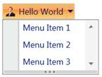{border="0"}

Figure 588: RibbonMenuGroup with Scrollbar

[]{#_Multi_Line_Support_1}1.1.1.1.1.1.38.4  Multi Line Support

The Label displayed in the button can be shown in a single line or two lines, when the property IsMultiLine is set to True. The default value is **True**.

+-------------------------------------------------------------------------------------------------------------------------------------------------------------------------------------------------------------------------------------------------------------------------------------------------------------------------------------------------------------------------------------------------------------------------------+
| **[XAML]{style="FONT-FAMILY: 'Courier New'"}**[]{style="FONT-FAMILY: 'Courier New'; COLOR: blue"}                                                                                                                                                                                                                                                                                                                             |
|                                                                                                                                                                                                                                                                                                                                                                                                                               |
| []{style="FONT-FAMILY: 'Courier New'; COLOR: blue"}                                                                                                                                                                                                                                                                                                                                                                           |
|                                                                                                                                                                                                                                                                                                                                                                                                                               |
| [\<]{style="FONT-FAMILY: 'Courier New'; COLOR: blue"}[sync:RibbonSplitButton]{style="FONT-FAMILY: 'Courier New'; COLOR: #a31515"}[ SizeMode]{style="FONT-FAMILY: 'Courier New'; COLOR: red"}[=\"Large\"]{style="FONT-FAMILY: 'Courier New'; COLOR: blue"}[ IsMultiLine]{style="FONT-FAMILY: 'Courier New'; COLOR: red"}[=\"False\"/\>]{style="FONT-FAMILY: 'Courier New'; COLOR: blue"}[]{style="FONT-FAMILY: 'Courier New'"} |
+-------------------------------------------------------------------------------------------------------------------------------------------------------------------------------------------------------------------------------------------------------------------------------------------------------------------------------------------------------------------------------------------------------------------------------+

[]{style="FONT-FAMILY: 'Calibri','sans-serif'"} 

{border="0"}

Figure 589: RibbonSplitButton Control without MultiLine

 

**[                ]{style="FONT-FAMILY: 'Calibri','sans-serif'; COLOR: #4f81bd"}**{border="0"}Note***:*[ ]{style="FONT-FAMILY: 'Calibri','sans-serif'; COLOR: #4f81bd"}**This property only applicable for Large Size Mode Buttons.

[]{style="FONT-FAMILY: 'Calibri','sans-serif'"} 

1.1.1.1.1.1.39     Blendability

The *Button* Controls can be easily editable using the Expression Blend.

1.   Open the Sample in Expression Blend. Right Click the the *Button* Control and Choose the *Edit Template* option as shown below.

{border="0"}

Figure 590: Edit Style for RibbonSplitButton Control in Blend

2.   A window will appear as shown below. Click *OK* to create a new style for the *Button* Control.

[]{style="FONT-FAMILY: 'Calibri','sans-serif'"} 

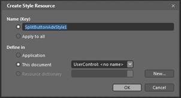{border="0"}

Figure 591: Add Style Name for RibbonSplitButton Control in Blend

All the resources will be displayed on the resources pane on the right side of the Design area. These resources can be editable to create a new style.

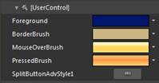{border="0"}

Figure 592: Default Resources for RibbonSplitButton Control in Blend

{border="0"}

Figure 593: RibbonSplitButton Control style edited in Blend

See also:

[[·      ]{style="FONT-FAMILY: Symbol; TEXT-DECORATION: none; text-underline: none"}]{.UGHyperlink}[Command Binding Support]{.UGHyperlink}[]{.UGHyperlink}

[[·      ]{style="FONT-FAMILY: Symbol; TEXT-DECORATION: none; text-underline: none"}]{.UGHyperlink}[Ribbon Command Manager]{.UGHyperlink}[]{.UGHyperlink}

[[]{style="TEXT-DECORATION: none"}]{.UGHyperlink} 

###### Ribbon Radio Button

 

RibbonRadioButton control is used to select options among a group. RibbonRadioButton has a similar set of functionalities as in WPF controls. A RibbonRadioButton is added to the application using the following code snippet. RibbonRadioButton is inherited from a RadioButton.

 

+-------------------------------------------------------------------------------------------------------------------------------------------------------------------------------------------------------------------------------------------------------------------------------------------------------------------------------------------------------------------------------------------------------------------------------------------------------------------------------------------------------------------------------------------------------------------------------------------------------------------------------------------------------------------------------+
| **[XAML]{style="FONT-FAMILY: 'Courier New'"}**[]{style="FONT-FAMILY: 'Courier New'; COLOR: blue"}                                                                                                                                                                                                                                                                                                                                                                                                                                                                                                                                                                             |
|                                                                                                                                                                                                                                                                                                                                                                                                                                                                                                                                                                                                                                                                               |
| []{style="FONT-FAMILY: 'Courier New'; COLOR: blue"}                                                                                                                                                                                                                                                                                                                                                                                                                                                                                                                                                                                                                           |
|                                                                                                                                                                                                                                                                                                                                                                                                                                                                                                                                                                                                                                                                               |
| [\<]{style="FONT-FAMILY: 'Courier New'; COLOR: blue"}[syncfusion]{style="FONT-FAMILY: 'Courier New'; COLOR: #a31515"}[:]{style="FONT-FAMILY: 'Courier New'; COLOR: blue"}[RibbonRadioButton]{style="FONT-FAMILY: 'Courier New'; COLOR: #a31515"}[ Content]{style="FONT-FAMILY: 'Courier New'; COLOR: red"}[=\"Radio button 1\" \>\</]{style="FONT-FAMILY: 'Courier New'; COLOR: blue"}[syncfusion]{style="FONT-FAMILY: 'Courier New'; COLOR: #a31515"}[:]{style="FONT-FAMILY: 'Courier New'; COLOR: blue"}[RibbonRadioButton/]{style="FONT-FAMILY: 'Courier New'; COLOR: #a31515"}[\>]{style="FONT-FAMILY: 'Courier New'; COLOR: blue"}[]{style="FONT-FAMILY: 'Courier New'"} |
+-------------------------------------------------------------------------------------------------------------------------------------------------------------------------------------------------------------------------------------------------------------------------------------------------------------------------------------------------------------------------------------------------------------------------------------------------------------------------------------------------------------------------------------------------------------------------------------------------------------------------------------------------------------------------------+

 

+-------------------------------------------------------------------------------------------------------------------------------------------------------------------------------------------------------+
| **[C#]{style="FONT-FAMILY: 'Courier New'"}**[]{style="FONT-FAMILY: 'Courier New'; COLOR: #2b91af"}                                                                                                    |
|                                                                                                                                                                                                       |
| []{style="FONT-FAMILY: 'Courier New'; COLOR: #2b91af"}                                                                                                                                                |
|                                                                                                                                                                                                       |
| [RibbonRadioButton]{style="FONT-FAMILY: 'Courier New'; COLOR: #2b91af"}[ radiobutton = [new]{style="COLOR: blue"} [RibbonRadioButton]{style="COLOR: #2b91af"}();]{style="FONT-FAMILY: 'Courier New'"} |
|                                                                                                                                                                                                       |
| [radiobutton.Content = [\"Radio Button 1\"]{style="COLOR: #a31515"};]{style="FONT-FAMILY: 'Courier New'"}                                                                                             |
+-------------------------------------------------------------------------------------------------------------------------------------------------------------------------------------------------------+

 

[]{style="FONT-FAMILY: 'Calibri','sans-serif'"} 

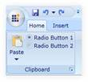{border="0"}

Figure 594: Ribbon Radio Button

[]{#related-topics}
:::::
