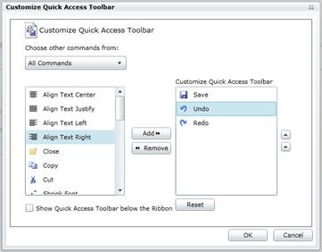

::: {style="DISPLAY: none"}
{#d2h_url_template}{#d2h_package_url style="WIDTH: 0px; DISPLAY: none; HEIGHT: 0px"}
:::

:::: {.d2h_secondary_topic style="PADDING-BOTTOM: 10pt; MARGIN: 0pt; PADDING-LEFT: 0pt; PADDING-RIGHT: 0pt; PADDING-TOP: 0pt"}
#### []{#_Ribbon_Command_Manager}Ribbon Command Manager

Ribbon Command manager allows the user to register their custom commands. Those commands will be shown in **QAT Customization Dialog**. End-users can pick the commands and add them to QAT.

The following code describes the implementation:

+-------------------------------------------------------------------------------------------------------------------------------------------------------------------------------------------------------------------------------------------------------------------------------------------------------------------------------------------------------------------------------------------------------------------------------------------------------------------------------------------------------------------------------------------------+
| [C#[ ]{style="COLOR: #2b91af"}]{style="FONT-FAMILY: 'Courier New'"}                                                                                                                                                                                                                                                                                                                                                                                                                                                                             |
|                                                                                                                                                                                                                                                                                                                                                                                                                                                                                                                                                 |
| []{style="FONT-FAMILY: 'Courier New'; COLOR: #2b91af"}                                                                                                                                                                                                                                                                                                                                                                                                                                                                                          |
|                                                                                                                                                                                                                                                                                                                                                                                                                                                                                                                                                 |
| [RibbonCommandManager]{style="FONT-FAMILY: 'Courier New'; COLOR: #2b91af"}[.Register(Bold, [new]{style="COLOR: blue"} [RibbonCommandProvider]{style="COLOR: #2b91af"}([\"Font Commands\"]{style="COLOR: #a31515"}, [\"Bold\"]{style="COLOR: #a31515"}, [\"Bold16.png\"]{style="COLOR: #a31515"}, [\"Make the selected text bold.\"]{style="COLOR: #a31515"}));]{style="FONT-FAMILY: 'Courier New'"}                                                                                                                                             |
|                                                                                                                                                                                                                                                                                                                                                                                                                                                                                                                                                 |
| []{style="FONT-FAMILY: 'Courier New'"}                                                                                                                                                                                                                                                                                                                                                                                                                                                                                                          |
|                                                                                                                                                                                                                                                                                                                                                                                                                                                                                                                                                 |
| [RibbonCommandManager]{style="FONT-FAMILY: 'Courier New'; COLOR: #2b91af"}[.Register(Italic, [new]{style="COLOR: blue"} [RibbonCommandProvider]{style="COLOR: #2b91af"}([\"Font Commands\"]{style="COLOR: #a31515"}, [\"Italic\"]{style="COLOR: #a31515"}, [\"Italic16.png\"]{style="COLOR: #a31515"},                   [\"Italicize the selected text.\"]{style="COLOR: #a31515"}));]{style="FONT-FAMILY: 'Courier New'"}                                                                                                                     |
|                                                                                                                                                                                                                                                                                                                                                                                                                                                                                                                                                 |
| []{style="FONT-FAMILY: 'Courier New'"}                                                                                                                                                                                                                                                                                                                                                                                                                                                                                                          |
|                                                                                                                                                                                                                                                                                                                                                                                                                                                                                                                                                 |
| [RibbonCommandManager]{style="FONT-FAMILY: 'Courier New'; COLOR: #2b91af"}[.Register([new]{style="COLOR: blue"} [RibbonCommand]{style="COLOR: #2b91af"}(param =\> OnAlignCenterExecute()),                [new]{style="COLOR: blue"} [RibbonCommandProvider]{style="COLOR: #2b91af"}([\"Font Commands\"]{style="COLOR: #a31515"}, [\"Subscript\"]{style="COLOR: #a31515"}, [\"Subscript16.png\"]{style="COLOR: #a31515"},[\"Create small letters below the text baseline.\"]{style="COLOR: #a31515"}));]{style="FONT-FAMILY: 'Courier New'"}    |
|                                                                                                                                                                                                                                                                                                                                                                                                                                                                                                                                                 |
| []{style="FONT-FAMILY: 'Courier New'"}                                                                                                                                                                                                                                                                                                                                                                                                                                                                                                          |
|                                                                                                                                                                                                                                                                                                                                                                                                                                                                                                                                                 |
| [RibbonCommandManager]{style="FONT-FAMILY: 'Courier New'; COLOR: #2b91af"}[.Register([new]{style="COLOR: blue"} [RibbonCommand]{style="COLOR: #2b91af"}(param =\> OnAlignCenterExecute()),                [new]{style="COLOR: blue"} [RibbonCommandProvider]{style="COLOR: #2b91af"}([\"Font Commands\"]{style="COLOR: #a31515"}, [\"Superscript\"]{style="COLOR: #a31515"}, [\"Superscript16.png\"]{style="COLOR: #a31515"},[\"Create small letters above the line of text.\"]{style="COLOR: #a31515"}));]{style="FONT-FAMILY: 'Courier New'"} |
|                                                                                                                                                                                                                                                                                                                                                                                                                                                                                                                                                 |
| []{style="FONT-FAMILY: 'Courier New'"}                                                                                                                                                                                                                                                                                                                                                                                                                                                                                                          |
|                                                                                                                                                                                                                                                                                                                                                                                                                                                                                                                                                 |
| [RibbonCommandManager]{style="FONT-FAMILY: 'Courier New'; COLOR: #2b91af"}[.Register(Underline, [new]{style="COLOR: blue"} [RibbonCommandProvider]{style="COLOR: #2b91af"}([\"Font Commands\"]{style="COLOR: #a31515"}, [\"Underline\"]{style="COLOR: #a31515"}, [\"Underline16.png\"]{style="COLOR: #a31515"}, [\"Underline the selected text.\"]{style="COLOR: #a31515"}));]{style="FONT-FAMILY: 'Courier New'"}                                                                                                                              |
|                                                                                                                                                                                                                                                                                                                                                                                                                                                                                                                                                 |
| []{style="FONT-FAMILY: 'Courier New'"}                                                                                                                                                                                                                                                                                                                                                                                                                                                                                                          |
|                                                                                                                                                                                                                                                                                                                                                                                                                                                                                                                                                 |
| [RibbonCommandManager]{style="FONT-FAMILY: 'Courier New'; COLOR: #2b91af"}[.Register([new]{style="COLOR: blue"} [RibbonCommand]{style="COLOR: #2b91af"}(param =\> OnAlignCenterExecute()),              [new]{style="COLOR: blue"} [RibbonCommandProvider]{style="COLOR: #2b91af"}([\"Editing Commands\"]{style="COLOR: #a31515"}, [\"Undo\"]{style="COLOR: #a31515"}, [Undo16.png\"]{style="COLOR: #a31515"}));]{style="FONT-FAMILY: 'Courier New'"}                                                                                           |
+-------------------------------------------------------------------------------------------------------------------------------------------------------------------------------------------------------------------------------------------------------------------------------------------------------------------------------------------------------------------------------------------------------------------------------------------------------------------------------------------------------------------------------------------------+

[]{style="FONT-FAMILY: 'Calibri','sans-serif'"} 

The Customization dialog will show the commands under the Group Name:

{border="0"}

Figure 639: Customization Window

Using this window, the end user can add commands to the QAT.

::: {style="BORDER-BOTTOM: windowtext 1pt solid; BORDER-LEFT: medium none; PADDING-BOTTOM: 1pt; MARGIN-TOP: 9pt; PADDING-LEFT: 0pt; PADDING-RIGHT: 0pt; MARGIN-BOTTOM: 9pt; BORDER-TOP: windowtext 1pt solid; BORDER-RIGHT: medium none; PADDING-TOP: 1pt"}
{border="0"}Note: Using Ribbon Command Manager static class, 'n' number of User defined commands can be registered into Ribbon Command Manger[.]{style="FONT-FAMILY: 'Calibri','sans-serif'"}
:::

[]{style="FONT-FAMILY: 'Calibri','sans-serif'"} 

[]{#related-topics}
::::
