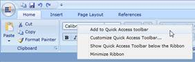

::: {style="DISPLAY: none"}
{#d2h_url_template}{#d2h_package_url style="WIDTH: 0px; DISPLAY: none; HEIGHT: 0px"}
:::

::: {.d2h_secondary_topic style="PADDING-BOTTOM: 10pt; MARGIN: 0pt; PADDING-LEFT: 0pt; PADDING-RIGHT: 0pt; PADDING-TOP: 0pt"}
#### Ribbon Context Menu

Ribbon Control is now shipped with built-in Context Menu. It provides several options, through which the user can customize the QAT, minimize the ribbon or add an item to QAT.

[]{style="FONT-FAMILY: 'Calibri','sans-serif'"} 

[{border="0"}]{style="BORDER-BOTTOM: windowtext 1pt solid; BORDER-LEFT: windowtext 1pt solid; PADDING-BOTTOM: 0pt; PADDING-LEFT: 0pt; PADDING-RIGHT: 0pt; BORDER-TOP: windowtext 1pt solid; BORDER-RIGHT: windowtext 1pt solid; PADDING-TOP: 0pt"}

Figure 647: Ribbon Context Menu

+-------------------------------------------------------------------------------------------------------------------------------------------------------------------------------------------------------------------------------------------------------------+
| ::: {style="BORDER-BOTTOM: windowtext 1pt solid; BORDER-LEFT: medium none; PADDING-BOTTOM: 1pt; MARGIN-TOP: 9pt; PADDING-LEFT: 0pt; PADDING-RIGHT: 0pt; MARGIN-BOTTOM: 9pt; BORDER-TOP: windowtext 1pt solid; BORDER-RIGHT: medium none; PADDING-TOP: 1pt"} |
|   {border="0"}Note:                                                                                                                                                                                                         |
| :::                                                                                                                                                                                                                                                         |
+-------------------------------------------------------------------------------------------------------------------------------------------------------------------------------------------------------------------------------------------------------------+
| ::: {style="BORDER-BOTTOM: windowtext 1pt solid; BORDER-LEFT: medium none; PADDING-BOTTOM: 1pt; MARGIN-TOP: 9pt; PADDING-LEFT: 0pt; PADDING-RIGHT: 0pt; MARGIN-BOTTOM: 9pt; BORDER-TOP: windowtext 1pt solid; BORDER-RIGHT: medium none; PADDING-TOP: 1pt"} |
| Using Ribbon Context menu end user can easily pick the frequently used Items from Ribbon and add to QAT.                                                                                                                                                    |
| :::                                                                                                                                                                                                                                                         |
+-------------------------------------------------------------------------------------------------------------------------------------------------------------------------------------------------------------------------------------------------------------+

*[]{style="FONT-FAMILY: 'Calibri','sans-serif'"}* 

[\[See Also\]]{.UGHyperlink}[]{.UGHyperlink}

[]{#related-topics}
:::
