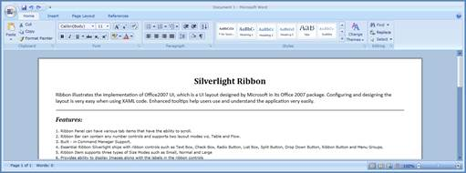

::: {style="DISPLAY: none"}
{#d2h_url_template}{#d2h_package_url style="WIDTH: 0px; DISPLAY: none; HEIGHT: 0px"}
:::

::::: {#nsbanner .d2h_main_nsbanner style="BORDER-BOTTOM: #999999 1px solid; POSITION: relative; PADDING-BOTTOM: 0px; BACKGROUND-COLOR: transparent; PADDING-LEFT: 0px; PADDING-RIGHT: 0px; DISPLAY: none; BORDER-TOP: #999999 1px solid; PADDING-TOP: 0px; LEFT: 0px"}
:::: {#TitleRow .d2h_main_titlerow style="PADDING-BOTTOM: 4px; BACKGROUND-COLOR: transparent; PADDING-LEFT: 22px; WIDTH: 100%; PADDING-RIGHT: 10px; DISPLAY: none; PADDING-TOP: 4px"}
::: {#ienav .d2h_main_ienav style="DISPLAY: none"}
{#D2HPrevious .D2HPreviousEnabled}  {#D2HNext .D2HNextEnabled}
:::
::::
:::::

::: {#nstext .d2h_main_nstext style="PADDING-BOTTOM: 10px; BACKGROUND-COLOR: transparent; PADDING-LEFT: 22px; PADDING-RIGHT: 10px; HEIGHT: 100%; OVERFLOW: auto; PADDING-TOP: 5px" hasuserbackground="true" valign="bottom"}
## []{#_Ribbon_Control}Ribbon Control

*Ribbon* illustrates the Microsoft Office 2007 UI. Our product exposes most of the features of the new UI and keeps intact with the Silverlight architecture. Configuring and designing the layout is very easy through XAML code. *Ribbon* tabs and *Ribbon* bars are the main client area in *Ribbon*. *Ribbon* tabs will allow your end users to navigate and find the appropriate tools for the task at hand. The *Ribbon* bars will contain the *Ribbon* tools[. ]{style="FONT-FAMILY: 'Calibri','sans-serif'"}

{border="0"}

Figure 499: Ribbon Control

Features

[·      ]{style="FONT-FAMILY: Symbol"}Microsoft Office 2007 UI

[·      ]{style="FONT-FAMILY: Symbol"}Dynamic Resizing and Minimization

[·      ]{style="FONT-FAMILY: Symbol"}Ribbon Galleries and Ribbon Menu Groups

[·      ]{style="FONT-FAMILY: Symbol"}Application Menu

[·      ]{style="FONT-FAMILY: Symbol"}Quick Access Toolbar (QAT)

[·      ]{style="FONT-FAMILY: Symbol"}QAT Customization Dialog

[·      ]{style="FONT-FAMILY: Symbol"}Screen Tips

[·      ]{style="FONT-FAMILY: Symbol"}Easily customization using Expression Blend

[·      ]{style="FONT-FAMILY: Symbol"}Commands Support

[·      ]{style="FONT-FAMILY: Symbol"}Localization Support

[·      ]{style="FONT-FAMILY: Symbol"}Out of Browser Support

[·      ]{style="FONT-FAMILY: Symbol; COLOR: black"}Keyboard Interaction[]{style="FONT-FAMILY: 'Calibri','sans-serif'; COLOR: black"}

[]{style="FONT-FAMILY: 'Calibri','sans-serif'; COLOR: black"} 

More:

[ ]{#related-topics}

[{border="0" align="absMiddle"}Getting Started](ms-xhelp:///?Id=dda9132a-ec00-4536-bf36-d55e9345627a){style="TEXT-DECORATION: none"}

[{border="0" align="absMiddle"}Features](ms-xhelp:///?Id=82fe766e-c7e0-4b2d-a97d-4d52bfb86dc1){style="TEXT-DECORATION: none"}

[{border="0" align="absMiddle"}How To](ms-xhelp:///?Id=016f07a8-f536-4176-8bbe-8a9380f1f4b8){style="TEXT-DECORATION: none"}
:::
