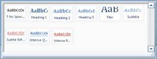
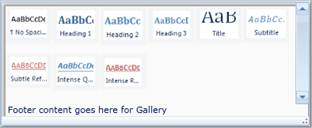
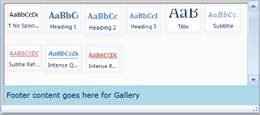
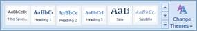

::: {style="DISPLAY: none"}
{#d2h_url_template}{#d2h_package_url style="WIDTH: 0px; DISPLAY: none; HEIGHT: 0px"}
:::

::: {.d2h_secondary_topic style="PADDING-BOTTOM: 10pt; MARGIN: 0pt; PADDING-LEFT: 0pt; PADDING-RIGHT: 0pt; PADDING-TOP: 0pt"}
##### Ribbon Gallery

The Ribbon control provides support to add the Gallery control to the[ ]{style="FONT-FAMILY: 'Calibri','sans-serif'"}[Ribbon ]{style="FONT-FAMILY: 'Calibri','sans-serif'; COLOR: windowtext; TEXT-DECORATION: none; text-underline: none"}[control]{style="COLOR: windowtext; TEXT-DECORATION: none; text-underline: none"}. Ribbon Gallery control displays items in a neat manner and also enables you to classify the items as groups for easy navigation.

###### Members

Ribbon Gallery class exposes the following members:

1.1.1.1.1.1.52     Properties

 

+----------------+-------------------+------------------+----------------------------------------------------------------------------------------------------+---------------+----------------------------------------------------------------------------------------------------------------------------+
| Name           | Type              | Value it accepts | Description                                                                                        | Default Value | Reference Link                                                                                                             |
+----------------+-------------------+------------------+----------------------------------------------------------------------------------------------------+---------------+----------------------------------------------------------------------------------------------------------------------------+
| Footer         | object            | object           | Used as footer for Ribbon Gallery on Fixed Mode                                                    | null          | [Footer]{style="FONT-FAMILY: 'Calibri','sans-serif'; COLOR: blue"}[]{style="FONT-FAMILY: 'Calibri','sans-serif'"}          |
+----------------+-------------------+------------------+----------------------------------------------------------------------------------------------------+---------------+----------------------------------------------------------------------------------------------------------------------------+
| FooterTemplate | DataTemplate      | DataTemplate     | Used to show as a template for footer                                                              | null          | [Footer Template]{style="FONT-FAMILY: 'Calibri','sans-serif'; COLOR: blue"}[]{style="FONT-FAMILY: 'Calibri','sans-serif'"} |
+----------------+-------------------+------------------+----------------------------------------------------------------------------------------------------+---------------+----------------------------------------------------------------------------------------------------------------------------+
| ItemHeight     | Double            | double           | Used to set Height value for the Gallery Item, by default.  It takes the actual height of the item | 0.00          | []{style="FONT-FAMILY: 'Calibri','sans-serif'"}                                                                            |
+----------------+-------------------+------------------+----------------------------------------------------------------------------------------------------+---------------+----------------------------------------------------------------------------------------------------------------------------+
| ItemWidth      | Double            | double           | Used to set the Width value for Gallery Item, by default. Iit takes the actual width of the item   | 0.00          | []{style="FONT-FAMILY: 'Calibri','sans-serif'"}                                                                            |
+----------------+-------------------+------------------+----------------------------------------------------------------------------------------------------+---------------+----------------------------------------------------------------------------------------------------------------------------+
| Mode           | RibbonGalleryMode | General,         | Used to Show / Hide Scroll option for the Ribbon Gallery                                           | General       | [Mode]{style="FONT-FAMILY: 'Calibri','sans-serif'; COLOR: blue"}[]{style="FONT-FAMILY: 'Calibri','sans-serif'"}            |
|                |                   |                  |                                                                                                    |               |                                                                                                                            |
|                |                   | Fixed            |                                                                                                    |               |                                                                                                                            |
+----------------+-------------------+------------------+----------------------------------------------------------------------------------------------------+---------------+----------------------------------------------------------------------------------------------------------------------------+
| SelectedItem   | object            | object           | Used to get the current selected item or to select the item                                        | null          | []{style="FONT-FAMILY: 'Calibri','sans-serif'"}                                                                            |
+----------------+-------------------+------------------+----------------------------------------------------------------------------------------------------+---------------+----------------------------------------------------------------------------------------------------------------------------+

[]{style="FONT-FAMILY: 'Calibri','sans-serif'"} 

1.1.1.1.1.1.53     Events

 

  --------------------- ------------------------- ------------------------------------ ------------------------------------------ ----------------------------------------------------------------------------------------------------------------------------------
  Name                  Event Type                Event Args Parameter                 Description                                Reference Link
  SelectedItemChanged   PropertyChangedCallback   DependencyPropertyChangedEventArgs   Occurs when the selected item is changed   [Selected Item Changed]{style="FONT-FAMILY: 'Calibri','sans-serif'; COLOR: blue"}[]{style="FONT-FAMILY: 'Calibri','sans-serif'"}
  --------------------- ------------------------- ------------------------------------ ------------------------------------------ ----------------------------------------------------------------------------------------------------------------------------------

[]{#_SelectedItemChanged}1.1.1.1.1.1.53.1  SelectedItemChanged

This event rises when the selected item changes for RibbonGallery[.]{style="FONT-FAMILY: 'Calibri','sans-serif'"}

+-------------------------------------------------------------------------------------------------------------------------------------------------------------------------------------------------------------------------------------------------------------------------------------------------------------------------------------------------------------------------------------------------------------------------------------------------------+
| **[XAML]{style="FONT-FAMILY: 'Courier New'"}**[]{style="FONT-FAMILY: 'Courier New'; COLOR: blue"}                                                                                                                                                                                                                                                                                                                                                     |
|                                                                                                                                                                                                                                                                                                                                                                                                                                                       |
| []{style="FONT-FAMILY: 'Courier New'; COLOR: blue"}                                                                                                                                                                                                                                                                                                                                                                                                   |
|                                                                                                                                                                                                                                                                                                                                                                                                                                                       |
| [\<]{style="FONT-FAMILY: 'Courier New'; COLOR: blue"}[syncfusion]{style="FONT-FAMILY: 'Courier New'; COLOR: #a31515"}[:]{style="FONT-FAMILY: 'Courier New'; COLOR: blue"}[RibbonGallery]{style="FONT-FAMILY: 'Courier New'; COLOR: #a31515"}[ SelectedItemChanged]{style="FONT-FAMILY: 'Courier New'; COLOR: red"}[=\"RibbonGallery_SelectedItemChanged\" /\>]{style="FONT-FAMILY: 'Courier New'; COLOR: blue"}[]{style="FONT-FAMILY: 'Courier New'"} |
+-------------------------------------------------------------------------------------------------------------------------------------------------------------------------------------------------------------------------------------------------------------------------------------------------------------------------------------------------------------------------------------------------------------------------------------------------------+

[]{style="FONT-FAMILY: 'Calibri','sans-serif'"} 

+------------------------------------------------------------------------------------------------------------------------------------------------------------------------------------------------------------------------------------------+
| **[C#]{style="FONT-FAMILY: 'Courier New'"}**[]{style="FONT-FAMILY: 'Courier New'; COLOR: #2b91af"}                                                                                                                                       |
|                                                                                                                                                                                                                                          |
| []{style="FONT-FAMILY: 'Courier New'; COLOR: #2b91af"}                                                                                                                                                                                   |
|                                                                                                                                                                                                                                          |
| [RibbonGallery]{style="FONT-FAMILY: 'Courier New'; COLOR: #2b91af"}[ rgallery = [new]{style="COLOR: blue"} [RibbonGallery]{style="COLOR: #2b91af"}();\                                                                                   |
| rgallery.SelectedItemChanged += [new]{style="COLOR: blue"} [PropertyChangedCallback]{style="COLOR: #2b91af"}(RibbonGallery_SelectedItemChanged);]{style="FONT-FAMILY: 'Courier New'"}                                                    |
|                                                                                                                                                                                                                                          |
| []{style="FONT-FAMILY: 'Courier New'"}                                                                                                                                                                                                   |
|                                                                                                                                                                                                                                          |
| [private]{style="FONT-FAMILY: 'Courier New'; COLOR: blue"}[ [void]{style="COLOR: blue"} RibbonGallery_SelectedItemChanged([DependencyObject]{style="COLOR: #2b91af"} d, [DependencyPropertyChangedEventArgs]{style="COLOR: #2b91af"} e)\ |
| {\                                                                                                                                                                                                                                       |
|    [//Occurs when selected item changed]{style="COLOR: green"}\                                                                                                                                                                          |
| }]{style="FONT-FAMILY: 'Courier New'"}                                                                                                                                                                                                   |
+------------------------------------------------------------------------------------------------------------------------------------------------------------------------------------------------------------------------------------------+

[]{style="FONT-FAMILY: 'Calibri','sans-serif'"} 

[]{style="FONT-FAMILY: 'Calibri','sans-serif'"} 

###### Declaring Ribbon Gallery

The following code example illustrates the adding of a Gallery control to the ribbon instance.

+----------------------------------------------------------------------------------------------------------------------------------------------------------------------------------------------------------------------------------------------------------------------------------------------------------------------------------------------------------------------------------------------------------------------------------+
| **[XAML]{style="FONT-FAMILY: 'Courier New'"}**[]{style="FONT-FAMILY: 'Courier New'; COLOR: blue"}                                                                                                                                                                                                                                                                                                                                |
|                                                                                                                                                                                                                                                                                                                                                                                                                                  |
| []{style="FONT-FAMILY: 'Courier New'; COLOR: blue"}                                                                                                                                                                                                                                                                                                                                                                              |
|                                                                                                                                                                                                                                                                                                                                                                                                                                  |
| [\<]{style="FONT-FAMILY: 'Courier New'; COLOR: blue"}[syncfusion]{style="FONT-FAMILY: 'Courier New'; COLOR: #a31515"}[:]{style="FONT-FAMILY: 'Courier New'; COLOR: blue"}[RibbonGallery]{style="FONT-FAMILY: 'Courier New'; COLOR: #a31515"}[\>]{style="FONT-FAMILY: 'Courier New'; COLOR: blue"}[]{style="FONT-FAMILY: 'Courier New'; COLOR: navy"}                                                                             |
|                                                                                                                                                                                                                                                                                                                                                                                                                                  |
| [    ]{style="FONT-FAMILY: 'Courier New'; COLOR: #a31515"}[\<]{style="FONT-FAMILY: 'Courier New'; COLOR: blue"}[syncfusion]{style="FONT-FAMILY: 'Courier New'; COLOR: #a31515"}[:]{style="FONT-FAMILY: 'Courier New'; COLOR: blue"}[RibbonGalleryItem]{style="FONT-FAMILY: 'Courier New'; COLOR: #a31515"}[\>]{style="FONT-FAMILY: 'Courier New'; COLOR: blue"}[]{style="FONT-FAMILY: 'Courier New'; COLOR: navy"}               |
|                                                                                                                                                                                                                                                                                                                                                                                                                                  |
| [         ]{style="FONT-FAMILY: 'Courier New'; COLOR: #a31515"}[\<]{style="FONT-FAMILY: 'Courier New'; COLOR: blue"}[syncfusion]{style="FONT-FAMILY: 'Courier New'; COLOR: #a31515"}[:]{style="FONT-FAMILY: 'Courier New'; COLOR: blue"}[RibbonGalleryItem.Content]{style="FONT-FAMILY: 'Courier New'; COLOR: #a31515"}[\>]{style="FONT-FAMILY: 'Courier New'; COLOR: blue"}[]{style="FONT-FAMILY: 'Courier New'; COLOR: navy"}  |
|                                                                                                                                                                                                                                                                                                                                                                                                                                  |
| [              ]{style="FONT-FAMILY: 'Courier New'; COLOR: #a31515"}[\<]{style="FONT-FAMILY: 'Courier New'; COLOR: blue"}[Image]{style="FONT-FAMILY: 'Courier New'; COLOR: #a31515"}[ Source]{style="FONT-FAMILY: 'Courier New'; COLOR: red"}[=\"Images/Apex.png\"/\>]{style="FONT-FAMILY: 'Courier New'; COLOR: blue"}[]{style="FONT-FAMILY: 'Courier New'; COLOR: navy"}                                                       |
|                                                                                                                                                                                                                                                                                                                                                                                                                                  |
| [         ]{style="FONT-FAMILY: 'Courier New'; COLOR: #a31515"}[\</]{style="FONT-FAMILY: 'Courier New'; COLOR: blue"}[syncfusion]{style="FONT-FAMILY: 'Courier New'; COLOR: #a31515"}[:]{style="FONT-FAMILY: 'Courier New'; COLOR: blue"}[RibbonGalleryItem.Content]{style="FONT-FAMILY: 'Courier New'; COLOR: #a31515"}[\>]{style="FONT-FAMILY: 'Courier New'; COLOR: blue"}[]{style="FONT-FAMILY: 'Courier New'; COLOR: navy"} |
|                                                                                                                                                                                                                                                                                                                                                                                                                                  |
| [    ]{style="FONT-FAMILY: 'Courier New'; COLOR: #a31515"}[\</]{style="FONT-FAMILY: 'Courier New'; COLOR: blue"}[syncfusion]{style="FONT-FAMILY: 'Courier New'; COLOR: #a31515"}[:]{style="FONT-FAMILY: 'Courier New'; COLOR: blue"}[RibbonGalleryItem]{style="FONT-FAMILY: 'Courier New'; COLOR: #a31515"}[\>]{style="FONT-FAMILY: 'Courier New'; COLOR: blue"}[]{style="FONT-FAMILY: 'Courier New'; COLOR: navy"}              |
|                                                                                                                                                                                                                                                                                                                                                                                                                                  |
| [\</]{style="FONT-FAMILY: 'Courier New'; COLOR: blue"}[syncfusion]{style="FONT-FAMILY: 'Courier New'; COLOR: #a31515"}[:]{style="FONT-FAMILY: 'Courier New'; COLOR: blue"}[RibbonGallery]{style="FONT-FAMILY: 'Courier New'; COLOR: #a31515"}[\>]{style="FONT-FAMILY: 'Courier New'; COLOR: blue"}[]{style="FONT-FAMILY: 'Courier New'"}                                                                                         |
+----------------------------------------------------------------------------------------------------------------------------------------------------------------------------------------------------------------------------------------------------------------------------------------------------------------------------------------------------------------------------------------------------------------------------------+

 

+---------------------------------------------------------------------------------------------------------------------------------------------------------------------------------------------------------------------------------------------------------------------------------------------------------------------------------------------------------------------------------------------------------------------------------------------------------------------------------------------------------------------------------------------------------------------------------------------------------------------------------------------------------------------------------------------------------------------------------------------------------------------------------------------------------------------------------------------------------------------------------------------------------------------------------------+
| **[C#]{style="FONT-FAMILY: 'Courier New'"}**[]{style="FONT-FAMILY: 'Courier New'; COLOR: #2b91af"}                                                                                                                                                                                                                                                                                                                                                                                                                                                                                                                                                                                                                                                                                                                                                                                                                                    |
|                                                                                                                                                                                                                                                                                                                                                                                                                                                                                                                                                                                                                                                                                                                                                                                                                                                                                                                                       |
| []{style="FONT-FAMILY: 'Courier New'; COLOR: #2b91af"}                                                                                                                                                                                                                                                                                                                                                                                                                                                                                                                                                                                                                                                                                                                                                                                                                                                                                |
|                                                                                                                                                                                                                                                                                                                                                                                                                                                                                                                                                                                                                                                                                                                                                                                                                                                                                                                                       |
| [RibbonGallery]{style="FONT-FAMILY: 'Courier New'; COLOR: #2b91af"}[ gallery = ]{style="FONT-FAMILY: 'Courier New'; COLOR: navy"}[new]{style="FONT-FAMILY: 'Courier New'; COLOR: blue"}[ ]{style="FONT-FAMILY: 'Courier New'; COLOR: navy"}[RibbonGallery]{style="FONT-FAMILY: 'Courier New'; COLOR: #2b91af"}[();]{style="FONT-FAMILY: 'Courier New'; COLOR: navy"}                                                                                                                                                                                                                                                                                                                                                                                                                                                                                                                                                                  |
|                                                                                                                                                                                                                                                                                                                                                                                                                                                                                                                                                                                                                                                                                                                                                                                                                                                                                                                                       |
| [RibbonGalleryItem]{style="FONT-FAMILY: 'Courier New'; COLOR: #2b91af"}[ galleryItem = ]{style="FONT-FAMILY: 'Courier New'; COLOR: navy"}[new]{style="FONT-FAMILY: 'Courier New'; COLOR: blue"}[ ]{style="FONT-FAMILY: 'Courier New'; COLOR: navy"}[RibbonGalleryItem]{style="FONT-FAMILY: 'Courier New'; COLOR: #2b91af"}[();]{style="FONT-FAMILY: 'Courier New'; COLOR: navy"}                                                                                                                                                                                                                                                                                                                                                                                                                                                                                                                                                      |
|                                                                                                                                                                                                                                                                                                                                                                                                                                                                                                                                                                                                                                                                                                                                                                                                                                                                                                                                       |
| [galleryItem.Content = ]{style="FONT-FAMILY: 'Courier New'; COLOR: navy"}[new]{style="FONT-FAMILY: 'Courier New'; COLOR: blue"}[ ]{style="FONT-FAMILY: 'Courier New'; COLOR: navy"}[Image]{style="FONT-FAMILY: 'Courier New'; COLOR: #2b91af"}[() { Source = ]{style="FONT-FAMILY: 'Courier New'; COLOR: navy"}[new]{style="FONT-FAMILY: 'Courier New'; COLOR: blue"}[ ]{style="FONT-FAMILY: 'Courier New'; COLOR: navy"}[BitmapImage]{style="FONT-FAMILY: 'Courier New'; COLOR: #2b91af"}[(]{style="FONT-FAMILY: 'Courier New'; COLOR: navy"}[new]{style="FONT-FAMILY: 'Courier New'; COLOR: blue"}[ ]{style="FONT-FAMILY: 'Courier New'; COLOR: navy"}[Uri]{style="FONT-FAMILY: 'Courier New'; COLOR: #2b91af"}[(]{style="FONT-FAMILY: 'Courier New'; COLOR: navy"}[\"Apex.png\"]{style="FONT-FAMILY: 'Courier New'; COLOR: #a31515"}[)) };]{style="FONT-FAMILY: 'Courier New'; COLOR: navy"}[]{style="FONT-FAMILY: 'Courier New'"} |
+---------------------------------------------------------------------------------------------------------------------------------------------------------------------------------------------------------------------------------------------------------------------------------------------------------------------------------------------------------------------------------------------------------------------------------------------------------------------------------------------------------------------------------------------------------------------------------------------------------------------------------------------------------------------------------------------------------------------------------------------------------------------------------------------------------------------------------------------------------------------------------------------------------------------------------------+

 

[]{style="FONT-FAMILY: 'Calibri','sans-serif'"} 

{border="0"}

Figure 610: A typical Ribbon gallery

{border="0"}

Figure 611: Ribbon Gallery in expanded state

[]{#_Set_Footer}1.1.1.1.1.1.54     Set Footer

+----------------------------------------------------------------------------------------------------------------------------------------------------------------------------------------------------------------------------------------------------------------------------------------------------------------------------------------------------------------------------------------------------------------------------------------------------+
| **[XAML[]{style="COLOR: blue"}]{style="FONT-FAMILY: 'Courier New'"}**                                                                                                                                                                                                                                                                                                                                                                              |
|                                                                                                                                                                                                                                                                                                                                                                                                                                                    |
| []{style="FONT-FAMILY: 'Courier New'; COLOR: blue"}                                                                                                                                                                                                                                                                                                                                                                                                |
|                                                                                                                                                                                                                                                                                                                                                                                                                                                    |
| [\<]{style="FONT-FAMILY: 'Courier New'; COLOR: blue"}[syncfusion]{style="FONT-FAMILY: 'Courier New'; COLOR: #a31515"}[:]{style="FONT-FAMILY: 'Courier New'; COLOR: blue"}[RibbonGallery ]{style="FONT-FAMILY: 'Courier New'; COLOR: #a31515"}[Footer]{style="FONT-FAMILY: 'Courier New'; COLOR: red"}[=\"Footer content goes here for Gallery\"\>.........]{style="FONT-FAMILY: 'Courier New'; COLOR: blue"}[]{style="FONT-FAMILY: 'Courier New'"} |
+----------------------------------------------------------------------------------------------------------------------------------------------------------------------------------------------------------------------------------------------------------------------------------------------------------------------------------------------------------------------------------------------------------------------------------------------------+

 

+-------------------------------------------------------------------------------------------------------------------------------------------------------+
| **[C#]{style="FONT-FAMILY: 'Courier New'"}**[]{style="FONT-FAMILY: 'Courier New'; COLOR: #2b91af"}                                                    |
|                                                                                                                                                       |
| []{style="FONT-FAMILY: 'Courier New'; COLOR: #2b91af"}                                                                                                |
|                                                                                                                                                       |
| [RibbonGallery]{style="FONT-FAMILY: 'Courier New'; COLOR: #2b91af"}[ gallery = [new]{style="COLOR: blue"} [RibbonGallery]{style="COLOR: #2b91af"}();\ |
| gallery.Footer = [\"Footer content goes here for Gallery\"]{style="COLOR: #a31515"};]{style="FONT-FAMILY: 'Courier New'"}                             |
+-------------------------------------------------------------------------------------------------------------------------------------------------------+

 

[]{style="FONT-FAMILY: 'Calibri','sans-serif'"} 

{border="0"}

Figure 612: Footer for Ribbon Gallery

[]{#_Set_Footer_Template}1.1.1.1.1.1.55     Set Footer Template

 

+---------------------------------------------------------------------------------------------------------------------------------------------------------------------------------------------------------------------------------------------------------------------------------------------------------------------------------------------------------------------+
| *[XAML]{style="FONT-FAMILY: 'Courier New'"}*[]{style="FONT-FAMILY: 'Courier New'; COLOR: blue"}                                                                                                                                                                                                                                                                     |
|                                                                                                                                                                                                                                                                                                                                                                     |
| []{style="FONT-FAMILY: 'Courier New'; COLOR: blue"}                                                                                                                                                                                                                                                                                                                 |
|                                                                                                                                                                                                                                                                                                                                                                     |
| [\<]{style="FONT-FAMILY: 'Courier New'; COLOR: blue"}[syncfusion]{style="FONT-FAMILY: 'Courier New'; COLOR: #a31515"}[:]{style="FONT-FAMILY: 'Courier New'; COLOR: blue"}[RibbonGallery]{style="FONT-FAMILY: 'Courier New'; COLOR: #a31515"}[ Width]{style="FONT-FAMILY: 'Courier New'; COLOR: red"}[=\"390\"\>]{style="FONT-FAMILY: 'Courier New'; COLOR: blue"}[\ |
| [  ]{style="COLOR: #a31515"}[\<]{style="COLOR: blue"}[syncfusion]{style="COLOR: #a31515"}[:]{style="COLOR: blue"}[RibbonGallery.FooterTemplate]{style="COLOR: #a31515"}[\>]{style="COLOR: blue"}\                                                                                                                                                                   |
| [    ]{style="COLOR: #a31515"}[\<]{style="COLOR: blue"}[DataTemplate]{style="COLOR: #a31515"}[\>]{style="COLOR: blue"}\                                                                                                                                                                                                                                             |
| [     \<]{style="COLOR: blue"}[Border]{style="COLOR: #a31515"}[ Background]{style="COLOR: red"}[=\"LightBlue\"]{style="COLOR: blue"}[ Height]{style="COLOR: red"}[=\"30\"]{style="COLOR: blue"}[ Width]{style="COLOR: red"}[=\"390\"\>]{style="COLOR: blue"}\                                                                                                       |
| [      ]{style="COLOR: #a31515"}[\<]{style="COLOR: blue"}[TextBlock]{style="COLOR: #a31515"}[ Text]{style="COLOR: red"}[=\" Footer content goes here for Gallery\"]{style="COLOR: blue"}[ VerticalAlignment]{style="COLOR: red"}[=\"Center\" /\>]{style="COLOR: blue"}\                                                                                             |
| [     \</]{style="COLOR: blue"}[Border]{style="COLOR: #a31515"}[\>]{style="COLOR: blue"}\                                                                                                                                                                                                                                                                           |
| [    ]{style="COLOR: #a31515"}[\</]{style="COLOR: blue"}[DataTemplate]{style="COLOR: #a31515"}[\>]{style="COLOR: blue"}\                                                                                                                                                                                                                                            |
| [\</]{style="COLOR: blue"}[syncfusion]{style="COLOR: #a31515"}[:]{style="COLOR: blue"}[RibbonGallery.FooterTemplate]{style="COLOR: #a31515"}[\>]{style="COLOR: blue"}[  ]{style="COLOR: #a31515"}]{style="FONT-FAMILY: 'Courier New'"}                                                                                                                              |
|                                                                                                                                                                                                                                                                                                                                                                     |
| [..................]{style="FONT-FAMILY: 'Courier New'; COLOR: #a31515"}[]{style="FONT-FAMILY: 'Courier New'"}                                                                                                                                                                                                                                                      |
+---------------------------------------------------------------------------------------------------------------------------------------------------------------------------------------------------------------------------------------------------------------------------------------------------------------------------------------------------------------------+

[]{style="FONT-FAMILY: 'Calibri','sans-serif'"} 

[]{style="FONT-FAMILY: 'Calibri','sans-serif'"} 

{border="0"}

Figure 613: Footer Template for Ribbon Gallery

[]{#_Set_Mode}1.1.1.1.1.1.56     Set Mode

 

+-------------------------------------------------------------------------------------------------------------------------------------------------------------------------------------------------------------------------------------------------------------------------------------------------------------------------------------------------------------------------------------------------------------------+
| [XAML[]{style="COLOR: blue"}]{style="FONT-FAMILY: 'Courier New'"}                                                                                                                                                                                                                                                                                                                                                 |
|                                                                                                                                                                                                                                                                                                                                                                                                                   |
| []{style="FONT-FAMILY: 'Courier New'; COLOR: blue"}                                                                                                                                                                                                                                                                                                                                                               |
|                                                                                                                                                                                                                                                                                                                                                                                                                   |
| [\<]{style="FONT-FAMILY: 'Courier New'; COLOR: blue"}[syncfusion]{style="FONT-FAMILY: 'Courier New'; COLOR: #a31515"}[:]{style="FONT-FAMILY: 'Courier New'; COLOR: blue"}[RibbonGallery ]{style="FONT-FAMILY: 'Courier New'; COLOR: #a31515"}[Mode]{style="FONT-FAMILY: 'Courier New'; COLOR: red"}[=\"Fixed\"\>.........]{style="FONT-FAMILY: 'Courier New'; COLOR: blue"}[]{style="FONT-FAMILY: 'Courier New'"} |
+-------------------------------------------------------------------------------------------------------------------------------------------------------------------------------------------------------------------------------------------------------------------------------------------------------------------------------------------------------------------------------------------------------------------+

 

+-------------------------------------------------------------------------------------------------------------------------------------------------------+
| [C#[]{style="COLOR: #2b91af"}]{style="FONT-FAMILY: 'Courier New'"}                                                                                    |
|                                                                                                                                                       |
| []{style="FONT-FAMILY: 'Courier New'; COLOR: #2b91af"}                                                                                                |
|                                                                                                                                                       |
| [RibbonGallery]{style="FONT-FAMILY: 'Courier New'; COLOR: #2b91af"}[ gallery = [new]{style="COLOR: blue"} [RibbonGallery]{style="COLOR: #2b91af"}();\ |
| gallery.Mode = [RibbonGalleryMode]{style="COLOR: #2b91af"}.Fixed;]{style="FONT-FAMILY: 'Courier New'"}                                                |
+-------------------------------------------------------------------------------------------------------------------------------------------------------+

 

[]{style="FONT-FAMILY: 'Calibri','sans-serif'"} 

{border="0"}

Figure 614: Fixed Mode

+---------------------------------------------------------------------------------------------------------------------------------------------------------------------------------------------------------------------------------------------------------------------------------------------------------------------------------------------------------------------------------------------------------------------+
| [XAML[]{style="COLOR: blue"}]{style="FONT-FAMILY: 'Courier New'"}                                                                                                                                                                                                                                                                                                                                                   |
|                                                                                                                                                                                                                                                                                                                                                                                                                     |
| []{style="FONT-FAMILY: 'Courier New'; COLOR: blue"}                                                                                                                                                                                                                                                                                                                                                                 |
|                                                                                                                                                                                                                                                                                                                                                                                                                     |
| [\<]{style="FONT-FAMILY: 'Courier New'; COLOR: blue"}[syncfusion]{style="FONT-FAMILY: 'Courier New'; COLOR: #a31515"}[:]{style="FONT-FAMILY: 'Courier New'; COLOR: blue"}[RibbonGallery ]{style="FONT-FAMILY: 'Courier New'; COLOR: #a31515"}[Mode]{style="FONT-FAMILY: 'Courier New'; COLOR: red"}[=\"General\"\>.........]{style="FONT-FAMILY: 'Courier New'; COLOR: blue"}[]{style="FONT-FAMILY: 'Courier New'"} |
+---------------------------------------------------------------------------------------------------------------------------------------------------------------------------------------------------------------------------------------------------------------------------------------------------------------------------------------------------------------------------------------------------------------------+

***[]{style="FONT-FAMILY: 'Calibri','sans-serif'; COLOR: #4f81bd"}*** 

+-------------------------------------------------------------------------------------------------------------------------------------------------------+
| [C#[]{style="COLOR: #2b91af"}]{style="FONT-FAMILY: 'Courier New'"}                                                                                    |
|                                                                                                                                                       |
| []{style="FONT-FAMILY: 'Courier New'; COLOR: #2b91af"}                                                                                                |
|                                                                                                                                                       |
| [RibbonGallery]{style="FONT-FAMILY: 'Courier New'; COLOR: #2b91af"}[ gallery = [new]{style="COLOR: blue"} [RibbonGallery]{style="COLOR: #2b91af"}();\ |
| gallery.Mode = [RibbonGalleryMode]{style="COLOR: #2b91af"}.General;]{style="FONT-FAMILY: 'Courier New'"}                                              |
+-------------------------------------------------------------------------------------------------------------------------------------------------------+

***[]{style="FONT-FAMILY: 'Calibri','sans-serif'; COLOR: #4f81bd"}*** 

*[]{style="FONT-FAMILY: 'Calibri','sans-serif'"}* 

{border="0"}

Figure 615: General Mode

[]{#related-topics}
:::
