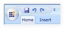

::: {style="DISPLAY: none"}
{#d2h_url_template}{#d2h_package_url style="WIDTH: 0px; DISPLAY: none; HEIGHT: 0px"}
:::

::: {.d2h_secondary_topic style="PADDING-BOTTOM: 10pt; MARGIN: 0pt; PADDING-LEFT: 0pt; PADDING-RIGHT: 0pt; PADDING-TOP: 0pt"}
##### []{#_Ribbon_Tab}Ribbon Tab

###### Members

 

The RibbonTab Type exposes the following members:

1.1.1.1.1.1.14     Properties

  ----------- --------- ------------------ ---------------------------------------- --------------- --------------------------------------
  Name        Type      Value it accepts   Description                              Default Value   Reference Link
  IsChecked   Boolean   True or False      Used to select Ribbon Tab                False           [Select]{style="COLOR: windowtext"}
  Caption     String    String             Represents Display Name for Ribbon Tab   String.Empty    [Caption]{style="COLOR: windowtext"}
  ----------- --------- ------------------ ---------------------------------------- --------------- --------------------------------------

1.1.1.1.1.1.15     Methods

 

  -------- ------------ ---------------- --------------------------- -------------------------------------
  Name     Parameters   Return Type      Description                 Reference Link
  Select   Empty        No return type   Used to select Ribbon Tab   [Select]{style="COLOR: windowtext"}
  -------- ------------ ---------------- --------------------------- -------------------------------------

[]{style="FONT-FAMILY: 'Calibri','sans-serif'"} 

###### Declaring RibbonTab

**[]{style="FONT-FAMILY: 'Calibri','sans-serif'"}** 

**Namespace**: Syncfusion.Windows.Tools.Controls

**Assembly**: Syncfusion.Ribbon.Silverlight

The *Ribbon* Tab is used to categorize contents. Each tab relates to a particular type of activity, such as adding annotations with the drawing tools, and so on.

[]{#_Setting_Caption}1.1.1.1.1.1.16     Set Caption

 

+----------------------------------------------------------------------------------------------------------------------------------------------------------------------------------------------------------------------------------------------------------------------------------------------------------------------------------------------------------------------------------------------------------+
| [XAML[]{style="COLOR: blue"}]{style="FONT-FAMILY: 'Courier New'"}                                                                                                                                                                                                                                                                                                                                        |
|                                                                                                                                                                                                                                                                                                                                                                                                          |
| []{style="FONT-FAMILY: 'Courier New'; COLOR: blue"}                                                                                                                                                                                                                                                                                                                                                      |
|                                                                                                                                                                                                                                                                                                                                                                                                          |
| [\<]{style="FONT-FAMILY: 'Courier New'; COLOR: blue"}[syncfusion]{style="FONT-FAMILY: 'Courier New'; COLOR: #a31515"}[:]{style="FONT-FAMILY: 'Courier New'; COLOR: blue"}[RibbonTab]{style="FONT-FAMILY: 'Courier New'; COLOR: #a31515"}[ Caption]{style="FONT-FAMILY: 'Courier New'; COLOR: red"}[=\"Home\" /\>]{style="FONT-FAMILY: 'Courier New'; COLOR: blue"}[]{style="FONT-FAMILY: 'Courier New'"} |
+----------------------------------------------------------------------------------------------------------------------------------------------------------------------------------------------------------------------------------------------------------------------------------------------------------------------------------------------------------------------------------------------------------+

[]{style="FONT-FAMILY: 'Courier New'"} 

+----------------------------------------------------------------------------------------------------------------------------------------------------------------------------------------------------------------------------------------------------------------------------------------------------------------------------------------------------------------+
| [C#[]{style="COLOR: #2b91af"}]{style="FONT-FAMILY: 'Courier New'"}                                                                                                                                                                                                                                                                                             |
|                                                                                                                                                                                                                                                                                                                                                                |
| []{style="FONT-FAMILY: 'Courier New'; COLOR: #2b91af"}                                                                                                                                                                                                                                                                                                         |
|                                                                                                                                                                                                                                                                                                                                                                |
| [RibbonTab]{style="FONT-FAMILY: 'Courier New'; COLOR: #2b91af"}[ ribbonTab = ]{style="FONT-FAMILY: 'Courier New'; COLOR: navy"}[new]{style="FONT-FAMILY: 'Courier New'; COLOR: blue"}[ ]{style="FONT-FAMILY: 'Courier New'; COLOR: navy"}[RibbonTab]{style="FONT-FAMILY: 'Courier New'; COLOR: #2b91af"}[();]{style="FONT-FAMILY: 'Courier New'; COLOR: navy"} |
|                                                                                                                                                                                                                                                                                                                                                                |
| [ribbonTab.Caption = ]{style="FONT-FAMILY: 'Courier New'; COLOR: navy"}[\"Home\"]{style="FONT-FAMILY: 'Courier New'; COLOR: #a31515"}[;]{style="FONT-FAMILY: 'Courier New'; COLOR: navy"}[]{style="FONT-FAMILY: 'Courier New'"}                                                                                                                                |
+----------------------------------------------------------------------------------------------------------------------------------------------------------------------------------------------------------------------------------------------------------------------------------------------------------------------------------------------------------------+

[]{style="FONT-FAMILY: 'Calibri','sans-serif'"} 

{border="0"}

[]{#_Select_Tab_programmatically}Figure 530: Ribbon tab

[]{#_Select_Tab_programmatically_1}1.1.1.1.1.1.17     Select Tab programmatically

[]{style="FONT-FAMILY: 'Calibri','sans-serif'"} 

The Ribbon tab can be selected programmatically using the property IsSelected. The following code snippet explains the usage:

 

+---------------------------------------------------------------------------------------------------------------------------------------------------------------------------------------------------------------------------------------------------------------------------------------------------------------------------------------------------------------------------------------------------------------------------------------------------------------------------------------------------------------------------------+
| **[XAML[]{style="COLOR: blue"}]{style="FONT-FAMILY: 'Courier New'"}**                                                                                                                                                                                                                                                                                                                                                                                                                                                           |
|                                                                                                                                                                                                                                                                                                                                                                                                                                                                                                                                 |
| []{style="FONT-FAMILY: 'Courier New'; COLOR: blue"}                                                                                                                                                                                                                                                                                                                                                                                                                                                                             |
|                                                                                                                                                                                                                                                                                                                                                                                                                                                                                                                                 |
| [\<]{style="FONT-FAMILY: 'Courier New'; COLOR: blue"}[syncfusion]{style="FONT-FAMILY: 'Courier New'; COLOR: #a31515"}[:]{style="FONT-FAMILY: 'Courier New'; COLOR: blue"}[RibbonTab]{style="FONT-FAMILY: 'Courier New'; COLOR: #a31515"}[ Caption]{style="FONT-FAMILY: 'Courier New'; COLOR: red"}[=\"Home\" ]{style="FONT-FAMILY: 'Courier New'; COLOR: blue"}[IsChecked]{style="FONT-FAMILY: 'Courier New'; COLOR: red"}[=\"True" /\>]{style="FONT-FAMILY: 'Courier New'; COLOR: blue"}[]{style="FONT-FAMILY: 'Courier New'"} |
+---------------------------------------------------------------------------------------------------------------------------------------------------------------------------------------------------------------------------------------------------------------------------------------------------------------------------------------------------------------------------------------------------------------------------------------------------------------------------------------------------------------------------------+

[]{style="FONT-FAMILY: 'Courier New'"} 

+----------------------------------------------------------------------------------------------------------------------------------------------------------------------------------------------------------------------------------------------------------------------------------------------------------------------------------------------------------------+
| **[C#[]{style="COLOR: #2b91af"}]{style="FONT-FAMILY: 'Courier New'"}**                                                                                                                                                                                                                                                                                         |
|                                                                                                                                                                                                                                                                                                                                                                |
| []{style="FONT-FAMILY: 'Courier New'; COLOR: #2b91af"}                                                                                                                                                                                                                                                                                                         |
|                                                                                                                                                                                                                                                                                                                                                                |
| [RibbonTab]{style="FONT-FAMILY: 'Courier New'; COLOR: #2b91af"}[ ribbonTab = ]{style="FONT-FAMILY: 'Courier New'; COLOR: navy"}[new]{style="FONT-FAMILY: 'Courier New'; COLOR: blue"}[ ]{style="FONT-FAMILY: 'Courier New'; COLOR: navy"}[RibbonTab]{style="FONT-FAMILY: 'Courier New'; COLOR: #2b91af"}[();]{style="FONT-FAMILY: 'Courier New'; COLOR: navy"} |
|                                                                                                                                                                                                                                                                                                                                                                |
| [ribbonTab.Caption = ]{style="FONT-FAMILY: 'Courier New'; COLOR: navy"}[\"Home\"]{style="FONT-FAMILY: 'Courier New'; COLOR: #a31515"}[; ]{style="FONT-FAMILY: 'Courier New'; COLOR: navy"}                                                                                                                                                                     |
|                                                                                                                                                                                                                                                                                                                                                                |
| [ribbonTab.IsChecked =  ]{style="FONT-FAMILY: 'Courier New'; COLOR: navy"}[true]{style="FONT-FAMILY: 'Courier New'; COLOR: blue"}[;]{style="FONT-FAMILY: 'Courier New'; COLOR: navy"}[]{style="FONT-FAMILY: 'Courier New'"}                                                                                                                                    |
+----------------------------------------------------------------------------------------------------------------------------------------------------------------------------------------------------------------------------------------------------------------------------------------------------------------------------------------------------------------+

[]{style="FONT-FAMILY: 'Calibri','sans-serif'"} 

Also, the Ribbon Tab can be selected using the method Ribbontab.SelectTab(int tabindextoselect):

+-----------------------------------------------------------------------+
| **[C#]{style="FONT-FAMILY: 'Courier New'"}**                          |
|                                                                       |
| []{style="FONT-FAMILY: 'Courier New'"}                                |
|                                                                       |
| [myRibbon.SelectTab(2);]{style="FONT-FAMILY: 'Courier New'"}          |
+-----------------------------------------------------------------------+

 

[]{#related-topics}
:::
