::: {style="DISPLAY: none"}
{#d2h_url_template}{#d2h_package_url style="WIDTH: 0px; DISPLAY: none; HEIGHT: 0px"}
:::

:::: {.d2h_secondary_topic style="PADDING-BOTTOM: 10pt; MARGIN: 0pt; PADDING-LEFT: 0pt; PADDING-RIGHT: 0pt; PADDING-TOP: 0pt"}
##### Ribbon Window

The *Ribbon* *Window* will provide Office 2007 look and feel, when hosted in any application. The following code demonstrates the usage of *Ribbon Window* in application. *RibbonWindow* control is inherited from WindowControl (Syncfusion.Shared.Silverlight).

###### Members

1.1.1.1.1.1.57     Methods

 

  --------- -------------------------- ------------- ----------- ------------------------------------------------------------------------------------------------------------------
  Name      Description                Return Type   Overloads   Reference Link
  Show()    Opens a Ribbon Window.     Null          \-          [Show]{style="FONT-FAMILY: 'Calibri','sans-serif'; COLOR: blue"}[]{style="FONT-FAMILY: 'Calibri','sans-serif'"}
  Close()   Close the Ribbon Window.   Null          \-          [Close]{style="FONT-FAMILY: 'Calibri','sans-serif'; COLOR: blue"}[]{style="FONT-FAMILY: 'Calibri','sans-serif'"}
  --------- -------------------------- ------------- ----------- ------------------------------------------------------------------------------------------------------------------

1.1.1.1.1.1.58     Properties

 

+-----------------------+-----------+--------------------+-------------------------------------------------------------------------------------------------------------------------------------+---------------+----------------------------------------------------------------------------------------------------------------------------+
| Name                  | Type      | Value it accepts   | Description                                                                                                                         | Default Value | Reference Link                                                                                                             |
+-----------------------+-----------+--------------------+-------------------------------------------------------------------------------------------------------------------------------------+---------------+----------------------------------------------------------------------------------------------------------------------------+
| WindowState           | Enum      | Normal,            | Represents the state of the window. It might be normal, minimized or maximized.                                                     | Normal        | [Window State]{style="FONT-FAMILY: 'Calibri','sans-serif'; COLOR: blue"}[]{style="FONT-FAMILY: 'Calibri','sans-serif'"}    |
|                       |           |                    |                                                                                                                                     |               |                                                                                                                            |
|                       |           | Minimize, Maximize |                                                                                                                                     |               |                                                                                                                            |
|                       |           |                    |                                                                                                                                     |               |                                                                                                                            |
|                       |           |                    |                                                                                                                                     |               |                                                                                                                            |
+-----------------------+-----------+--------------------+-------------------------------------------------------------------------------------------------------------------------------------+---------------+----------------------------------------------------------------------------------------------------------------------------+
| WindowStartUpLocation | Enum      | CenterScreen,      | Represents the Startup location of the window. It might be Center Screen, Center Owner or manual.                                   | CenterScreen  | [Window Position]{style="FONT-FAMILY: 'Calibri','sans-serif'; COLOR: blue"}[]{style="FONT-FAMILY: 'Calibri','sans-serif'"} |
|                       |           |                    |                                                                                                                                     |               |                                                                                                                            |
|                       |           | CenterOwner,       |                                                                                                                                     |               |                                                                                                                            |
|                       |           |                    |                                                                                                                                     |               |                                                                                                                            |
|                       |           | Manual             |                                                                                                                                     |               |                                                                                                                            |
+-----------------------+-----------+--------------------+-------------------------------------------------------------------------------------------------------------------------------------+---------------+----------------------------------------------------------------------------------------------------------------------------+
| Title                 | String    | String             | Represents the title displays at the top of the element.                                                                            | Untitled      | [Set Title]{style="FONT-FAMILY: 'Calibri','sans-serif'; COLOR: blue"}[]{style="FONT-FAMILY: 'Calibri','sans-serif'"}       |
+-----------------------+-----------+--------------------+-------------------------------------------------------------------------------------------------------------------------------------+---------------+----------------------------------------------------------------------------------------------------------------------------+
| ResizeMode            | Enum      | CanResize,         | Represents the resizing mode of RibbonWindow Control. It can be CanResize, NoResize, CanMinimize, CanMaximize or CanResizeWithGrip. | CanResize     | [Resize Mode]{style="FONT-FAMILY: 'Calibri','sans-serif'; COLOR: blue"}[]{style="FONT-FAMILY: 'Calibri','sans-serif'"}     |
|                       |           |                    |                                                                                                                                     |               |                                                                                                                            |
|                       |           | CanResizeWithGrip, |                                                                                                                                     |               |                                                                                                                            |
|                       |           |                    |                                                                                                                                     |               |                                                                                                                            |
|                       |           | CanMinimize,       |                                                                                                                                     |               |                                                                                                                            |
|                       |           |                    |                                                                                                                                     |               |                                                                                                                            |
|                       |           | CanMaximize,       |                                                                                                                                     |               |                                                                                                                            |
|                       |           |                    |                                                                                                                                     |               |                                                                                                                            |
|                       |           | Noresize           |                                                                                                                                     |               |                                                                                                                            |
+-----------------------+-----------+--------------------+-------------------------------------------------------------------------------------------------------------------------------------+---------------+----------------------------------------------------------------------------------------------------------------------------+

[]{style="FONT-FAMILY: 'Calibri','sans-serif'"} 

1.1.1.1.1.1.59     Events

 

  ---------------------- ------------------------- -------------------------- ------------------------------------------ ---------------------------------------------------------------------------------------------------------------------------------
  Name                   Event Type                Event Args Parameter       Description                                Reference Link
  Opened                 RoutedEventHandler        RoutedEventArgs            Occurs after the RibbonWindow Opened       [Opened]{style="FONT-FAMILY: 'Calibri','sans-serif'; COLOR: blue"}[]{style="FONT-FAMILY: 'Calibri','sans-serif'"}
  Opening                CancelEventHandler        CancelEventArgs            Occurs before the RibbonWindow Opened      [Opening]{style="FONT-FAMILY: 'Calibri','sans-serif'; COLOR: blue"}[]{style="FONT-FAMILY: 'Calibri','sans-serif'"}
  Closed                 RoutedEventhandler        RoutedEventArgs            Occurs after the RibbonWindow is closed.   [Closed]{style="FONT-FAMILY: 'Calibri','sans-serif'; COLOR: blue"}[]{style="FONT-FAMILY: 'Calibri','sans-serif'"}
  Closing                CancelEventHandler        CancelEventArgs            Occurs before the RibbonWindow closed.     [Closing]{style="FONT-FAMILY: 'Calibri','sans-serif'; COLOR: blue"}[]{style="FONT-FAMILY: 'Calibri','sans-serif'"}
  OnWindowStateChanged   PropertyChangedCallBack   PropertyChangedEventArgs   Occurs on Window State Changed.            [OnWindowStateChanged]{style="FONT-FAMILY: 'Calibri','sans-serif'; COLOR: blue"}[]{style="FONT-FAMILY: 'Calibri','sans-serif'"}
  ContextMenuOpened      RoutedEventHandler        RoutedEventArgs            Occurs on Context MenuOpened               [ContextMenuopened]{style="FONT-FAMILY: 'Calibri','sans-serif'; COLOR: blue"}[]{style="FONT-FAMILY: 'Calibri','sans-serif'"}
  ContextMenuClosed      RoutedEventHandler        RoutedEventArgs            Occurs on ContextMenuClosed                [ContextMenuClosed]{style="FONT-FAMILY: 'Calibri','sans-serif'; COLOR: blue"}[]{style="FONT-FAMILY: 'Calibri','sans-serif'"}
  ---------------------- ------------------------- -------------------------- ------------------------------------------ ---------------------------------------------------------------------------------------------------------------------------------

 

The Ribbonwindow exposes the following events.

[]{#_Opening_–_The}[]{#_Opening}1.1.1.1.1.1.59.1  Opening

 

The event occurs before the instance opens

 

+-----------------------------------------------------------------------------------------------------------------------------------------------------------------------------------------------------------------------------------------------------------------------------------------------------------------------------------------------------------------------------------------------------------------------+
| [XAML[]{style="COLOR: blue"}]{style="FONT-FAMILY: 'Courier New'"}                                                                                                                                                                                                                                                                                                                                                     |
|                                                                                                                                                                                                                                                                                                                                                                                                                       |
| []{style="FONT-FAMILY: 'Courier New'; COLOR: blue"}                                                                                                                                                                                                                                                                                                                                                                   |
|                                                                                                                                                                                                                                                                                                                                                                                                                       |
| [\<]{style="FONT-FAMILY: 'Courier New'; COLOR: blue"}[sync]{style="FONT-FAMILY: 'Courier New'; COLOR: #a31515"}[:]{style="FONT-FAMILY: 'Courier New'; COLOR: blue"}[RibbonWindow]{style="FONT-FAMILY: 'Courier New'; COLOR: #a31515"}[ Opening]{style="FONT-FAMILY: 'Courier New'; COLOR: red"}[=\"WindowControl_Opening\"/\>]{style="FONT-FAMILY: 'Courier New'; COLOR: blue"}[]{style="FONT-FAMILY: 'Courier New'"} |
+-----------------------------------------------------------------------------------------------------------------------------------------------------------------------------------------------------------------------------------------------------------------------------------------------------------------------------------------------------------------------------------------------------------------------+

 

+----------------------------------------------------------------------------------------------------------------------------------------------------------------------------------------+
| [C#[]{style="COLOR: #2b91af"}]{style="FONT-FAMILY: 'Courier New'"}                                                                                                                     |
|                                                                                                                                                                                        |
| []{style="FONT-FAMILY: 'Courier New'; COLOR: #2b91af"}                                                                                                                                 |
|                                                                                                                                                                                        |
| [RibbonWindow]{style="FONT-FAMILY: 'Courier New'; COLOR: #2b91af"}[ window = [new]{style="COLOR: blue"} [RibbonWindow]{style="COLOR: #2b91af"}();]{style="FONT-FAMILY: 'Courier New'"} |
|                                                                                                                                                                                        |
| [window.Opening+=[new]{style="COLOR: blue"} [RoutedEventHandler]{style="COLOR: #2b91af"}(window_Opening);]{style="FONT-FAMILY: 'Courier New'"}                                         |
+----------------------------------------------------------------------------------------------------------------------------------------------------------------------------------------+

 

[]{#_Opened_–_The}[]{#_Opened}1.1.1.1.1.1.59.2  Opened

 

The event occurs after the instance opens.

+---------------------------------------------------------------------------------------------------------------------------------------------------------------------------------------------------------------------------------------------------------------------------------------------------------------------------------------------------------------------------------------------------------------------+
| [XAML[]{style="COLOR: blue"}]{style="FONT-FAMILY: 'Courier New'"}                                                                                                                                                                                                                                                                                                                                                   |
|                                                                                                                                                                                                                                                                                                                                                                                                                     |
| []{style="FONT-FAMILY: 'Courier New'; COLOR: blue"}                                                                                                                                                                                                                                                                                                                                                                 |
|                                                                                                                                                                                                                                                                                                                                                                                                                     |
| [\<]{style="FONT-FAMILY: 'Courier New'; COLOR: blue"}[sync]{style="FONT-FAMILY: 'Courier New'; COLOR: #a31515"}[:]{style="FONT-FAMILY: 'Courier New'; COLOR: blue"}[RibbonWindow ]{style="FONT-FAMILY: 'Courier New'; COLOR: #a31515"}[Opened]{style="FONT-FAMILY: 'Courier New'; COLOR: red"}[=\"WindowControl_Opened\"/\>]{style="FONT-FAMILY: 'Courier New'; COLOR: blue"}[]{style="FONT-FAMILY: 'Courier New'"} |
+---------------------------------------------------------------------------------------------------------------------------------------------------------------------------------------------------------------------------------------------------------------------------------------------------------------------------------------------------------------------------------------------------------------------+

[]{style="FONT-FAMILY: 'Calibri','sans-serif'"} 

+----------------------------------------------------------------------------------------------------------------------------------------------------------------------------------------+
| [C#[]{style="COLOR: #2b91af"}]{style="FONT-FAMILY: 'Courier New'"}                                                                                                                     |
|                                                                                                                                                                                        |
| []{style="FONT-FAMILY: 'Courier New'; COLOR: #2b91af"}                                                                                                                                 |
|                                                                                                                                                                                        |
| [RibbonWindow]{style="FONT-FAMILY: 'Courier New'; COLOR: #2b91af"}[ window = [new]{style="COLOR: blue"} [RibbonWindow]{style="COLOR: #2b91af"}();]{style="FONT-FAMILY: 'Courier New'"} |
|                                                                                                                                                                                        |
| [window.Opened+=[new]{style="COLOR: blue"} [RoutedEventHandler]{style="COLOR: #2b91af"}(window_Opened);]{style="FONT-FAMILY: 'Courier New'"}                                           |
+----------------------------------------------------------------------------------------------------------------------------------------------------------------------------------------+

[]{style="FONT-FAMILY: 'Calibri','sans-serif'"} 

[]{#_Closing_–_The}[]{#_Closing}1.1.1.1.1.1.59.3  Closing

The event occurs before the instance closes.

 

+-----------------------------------------------------------------------------------------------------------------------------------------------------------------------------------------------------------------------------------------------------------------------------------------------------------------------------------------------------------------------------------------------------------------------+
| **[XAML]{style="FONT-FAMILY: 'Courier New'"}**[]{style="FONT-FAMILY: 'Courier New'; COLOR: blue"}                                                                                                                                                                                                                                                                                                                     |
|                                                                                                                                                                                                                                                                                                                                                                                                                       |
| []{style="FONT-FAMILY: 'Courier New'; COLOR: blue"}                                                                                                                                                                                                                                                                                                                                                                   |
|                                                                                                                                                                                                                                                                                                                                                                                                                       |
| [\<]{style="FONT-FAMILY: 'Courier New'; COLOR: blue"}[sync]{style="FONT-FAMILY: 'Courier New'; COLOR: #a31515"}[:]{style="FONT-FAMILY: 'Courier New'; COLOR: blue"}[RibbonWindow ]{style="FONT-FAMILY: 'Courier New'; COLOR: #a31515"}[Closing]{style="FONT-FAMILY: 'Courier New'; COLOR: red"}[=\"WindowControl_Closing\"/\>]{style="FONT-FAMILY: 'Courier New'; COLOR: blue"}[]{style="FONT-FAMILY: 'Courier New'"} |
+-----------------------------------------------------------------------------------------------------------------------------------------------------------------------------------------------------------------------------------------------------------------------------------------------------------------------------------------------------------------------------------------------------------------------+

 

+----------------------------------------------------------------------------------------------------------------------------------------------------------------------------------------+
| **[C#]{style="FONT-FAMILY: 'Courier New'"}**[]{style="FONT-FAMILY: 'Courier New'; COLOR: #2b91af"}                                                                                     |
|                                                                                                                                                                                        |
| []{style="FONT-FAMILY: 'Courier New'; COLOR: #2b91af"}                                                                                                                                 |
|                                                                                                                                                                                        |
| [RibbonWindow]{style="FONT-FAMILY: 'Courier New'; COLOR: #2b91af"}[ window = [new]{style="COLOR: blue"} [RibbonWindow]{style="COLOR: #2b91af"}();]{style="FONT-FAMILY: 'Courier New'"} |
|                                                                                                                                                                                        |
| [window.Closing+=[new]{style="COLOR: blue"} [ClosedEventHandler]{style="COLOR: #2b91af"}(window_Closing);]{style="FONT-FAMILY: 'Courier New'"}                                         |
+----------------------------------------------------------------------------------------------------------------------------------------------------------------------------------------+

 

 

[]{style="FONT-FAMILY: 'Calibri','sans-serif'"} 

[]{#_Closed_–_The}[]{#_Closed}1.1.1.1.1.1.59.4  Closed

The event occurs after the instance closes.

+---------------------------------------------------------------------------------------------------------------------------------------------------------------------------------------------------------------------------------------------------------------------------------------------------------------------------------------------------------------------------------------------------------------------+
| **[XAML]{style="FONT-FAMILY: 'Courier New'"}**[]{style="FONT-FAMILY: 'Courier New'; COLOR: blue"}                                                                                                                                                                                                                                                                                                                   |
|                                                                                                                                                                                                                                                                                                                                                                                                                     |
| []{style="FONT-FAMILY: 'Courier New'; COLOR: blue"}                                                                                                                                                                                                                                                                                                                                                                 |
|                                                                                                                                                                                                                                                                                                                                                                                                                     |
| [\<]{style="FONT-FAMILY: 'Courier New'; COLOR: blue"}[sync]{style="FONT-FAMILY: 'Courier New'; COLOR: #a31515"}[:]{style="FONT-FAMILY: 'Courier New'; COLOR: blue"}[RibbonWindow ]{style="FONT-FAMILY: 'Courier New'; COLOR: #a31515"}[Closed]{style="FONT-FAMILY: 'Courier New'; COLOR: red"}[=\"WindowControl_Closed\"/\>]{style="FONT-FAMILY: 'Courier New'; COLOR: blue"}[]{style="FONT-FAMILY: 'Courier New'"} |
+---------------------------------------------------------------------------------------------------------------------------------------------------------------------------------------------------------------------------------------------------------------------------------------------------------------------------------------------------------------------------------------------------------------------+

[]{style="FONT-FAMILY: 'Calibri','sans-serif'"} 

+----------------------------------------------------------------------------------------------------------------------------------------------------------------------------------------+
| **[C#]{style="FONT-FAMILY: 'Courier New'"}**[]{style="FONT-FAMILY: 'Courier New'; COLOR: #2b91af"}                                                                                     |
|                                                                                                                                                                                        |
| []{style="FONT-FAMILY: 'Courier New'; COLOR: #2b91af"}                                                                                                                                 |
|                                                                                                                                                                                        |
| [RibbonWindow]{style="FONT-FAMILY: 'Courier New'; COLOR: #2b91af"}[ window = [new]{style="COLOR: blue"} [RibbonWindow]{style="COLOR: #2b91af"}();]{style="FONT-FAMILY: 'Courier New'"} |
|                                                                                                                                                                                        |
| [window.Closed+=[new]{style="COLOR: blue"} [ClosedEventHandler]{style="COLOR: #2b91af"}(window_Closed);]{style="FONT-FAMILY: 'Courier New'"}                                           |
+----------------------------------------------------------------------------------------------------------------------------------------------------------------------------------------+

[]{style="FONT-FAMILY: 'Calibri','sans-serif'"} 

[]{style="FONT-FAMILY: 'Calibri','sans-serif'"} 

[]{#_OnWindowStateChanged-The_event_occu}[]{#_OnWindowStateChanged}1.1.1.1.1.1.59.5  OnWindowStateChanged

The event occurs when the window state changes.

+-------------------------------------------------------------------------------------------------------------------------------------------------------------------------------------------------------------------------------------------------------------------------------------------------------------------------------------------------------------------------------------------------------------------------------------------------+
| [XAML[]{style="COLOR: blue"}]{style="FONT-FAMILY: 'Courier New'"}                                                                                                                                                                                                                                                                                                                                                                               |
|                                                                                                                                                                                                                                                                                                                                                                                                                                                 |
| []{style="FONT-FAMILY: 'Courier New'; COLOR: blue"}                                                                                                                                                                                                                                                                                                                                                                                             |
|                                                                                                                                                                                                                                                                                                                                                                                                                                                 |
| [\<]{style="FONT-FAMILY: 'Courier New'; COLOR: blue"}[sync]{style="FONT-FAMILY: 'Courier New'; COLOR: #a31515"}[:]{style="FONT-FAMILY: 'Courier New'; COLOR: blue"}[RibbonWindow ]{style="FONT-FAMILY: 'Courier New'; COLOR: #a31515"}[OnWindowStateChanged]{style="FONT-FAMILY: 'Courier New'; COLOR: red"}[=\"WindowControl_OnWindowStateChanged\"/\>]{style="FONT-FAMILY: 'Courier New'; COLOR: blue"}[]{style="FONT-FAMILY: 'Courier New'"} |
+-------------------------------------------------------------------------------------------------------------------------------------------------------------------------------------------------------------------------------------------------------------------------------------------------------------------------------------------------------------------------------------------------------------------------------------------------+

[]{style="FONT-FAMILY: 'Calibri','sans-serif'"} 

+----------------------------------------------------------------------------------------------------------------------------------------------------------------------------------------+
| **[C#[]{style="COLOR: #2b91af"}]{style="FONT-FAMILY: 'Courier New'"}**                                                                                                                 |
|                                                                                                                                                                                        |
| []{style="FONT-FAMILY: 'Courier New'; COLOR: #2b91af"}                                                                                                                                 |
|                                                                                                                                                                                        |
| [RibbonWindow]{style="FONT-FAMILY: 'Courier New'; COLOR: #2b91af"}[ window = [new]{style="COLOR: blue"} [RibbonWindow]{style="COLOR: #2b91af"}();]{style="FONT-FAMILY: 'Courier New'"} |
|                                                                                                                                                                                        |
| [window.OnWindowStateChanged+=[new]{style="COLOR: blue"} [PropertyChangedCallback]{style="COLOR: #2b91af"}(window_OnWindowStateChanged);]{style="FONT-FAMILY: 'Courier New'"}          |
+----------------------------------------------------------------------------------------------------------------------------------------------------------------------------------------+

[]{style="FONT-FAMILY: 'Calibri','sans-serif'"} 

[]{#_ContextMenuOpened_–_The}[]{#_ContextMenuOpened}1.1.1.1.1.1.59.6  ContextMenuOpened

The event occurs when the Context Menu opens.[]{style="FONT-FAMILY: 'Calibri','sans-serif'"}

+-------------------------------------------------------------------------------------------------------------------------------------------------------------------------------------------------------------------------------------------------------------------------------------------------------------------------------------------------------------------------------------------------------------------------------------------+
| [XAML[]{style="COLOR: blue"}]{style="FONT-FAMILY: 'Courier New'"}                                                                                                                                                                                                                                                                                                                                                                         |
|                                                                                                                                                                                                                                                                                                                                                                                                                                           |
| []{style="FONT-FAMILY: 'Courier New'; COLOR: blue"}                                                                                                                                                                                                                                                                                                                                                                                       |
|                                                                                                                                                                                                                                                                                                                                                                                                                                           |
| [\<]{style="FONT-FAMILY: 'Courier New'; COLOR: blue"}[sync]{style="FONT-FAMILY: 'Courier New'; COLOR: #a31515"}[:]{style="FONT-FAMILY: 'Courier New'; COLOR: blue"}[RibbonWindow ]{style="FONT-FAMILY: 'Courier New'; COLOR: #a31515"}[ContextMenuOpened]{style="FONT-FAMILY: 'Courier New'; COLOR: red"}[=\"WindowControl_ContextMenuOpened\"/\>]{style="FONT-FAMILY: 'Courier New'; COLOR: blue"}[]{style="FONT-FAMILY: 'Courier New'"} |
+-------------------------------------------------------------------------------------------------------------------------------------------------------------------------------------------------------------------------------------------------------------------------------------------------------------------------------------------------------------------------------------------------------------------------------------------+

[]{style="FONT-FAMILY: 'Calibri','sans-serif'"} 

+----------------------------------------------------------------------------------------------------------------------------------------------------------------------------------------+
| [C#[]{style="COLOR: #2b91af"}]{style="FONT-FAMILY: 'Courier New'"}                                                                                                                     |
|                                                                                                                                                                                        |
| []{style="FONT-FAMILY: 'Courier New'; COLOR: #2b91af"}                                                                                                                                 |
|                                                                                                                                                                                        |
| [RibbonWindow]{style="FONT-FAMILY: 'Courier New'; COLOR: #2b91af"}[ window = [new]{style="COLOR: blue"} [RibbonWindow]{style="COLOR: #2b91af"}();]{style="FONT-FAMILY: 'Courier New'"} |
|                                                                                                                                                                                        |
| [window.ContextMenuOpened+=[new]{style="COLOR: blue"} [RoutedEventHandler]{style="COLOR: #2b91af"}(window_ContextMenuOpened);]{style="FONT-FAMILY: 'Courier New'"}                     |
+----------------------------------------------------------------------------------------------------------------------------------------------------------------------------------------+

[]{style="FONT-FAMILY: 'Calibri','sans-serif'"} 

[]{#_ContextMenuClosed_–_The}[]{#_ContextMenuClosed}1.1.1.1.1.1.59.7  ContextMenuClosed

The event occurs when Context Menu Closes.

+-------------------------------------------------------------------------------------------------------------------------------------------------------------------------------------------------------------------------------------------------------------------------------------------------------------------------------------------------------------------------------------------------------------------------------------------+
| **[XAML[]{style="COLOR: blue"}]{style="FONT-FAMILY: 'Courier New'"}**                                                                                                                                                                                                                                                                                                                                                                     |
|                                                                                                                                                                                                                                                                                                                                                                                                                                           |
| []{style="FONT-FAMILY: 'Courier New'; COLOR: blue"}                                                                                                                                                                                                                                                                                                                                                                                       |
|                                                                                                                                                                                                                                                                                                                                                                                                                                           |
| [\<]{style="FONT-FAMILY: 'Courier New'; COLOR: blue"}[sync]{style="FONT-FAMILY: 'Courier New'; COLOR: #a31515"}[:]{style="FONT-FAMILY: 'Courier New'; COLOR: blue"}[RibbonWindow ]{style="FONT-FAMILY: 'Courier New'; COLOR: #a31515"}[ContextMenuClosed]{style="FONT-FAMILY: 'Courier New'; COLOR: red"}[=\"WindowControl_ContextMenuClosed\"/\>]{style="FONT-FAMILY: 'Courier New'; COLOR: blue"}[]{style="FONT-FAMILY: 'Courier New'"} |
+-------------------------------------------------------------------------------------------------------------------------------------------------------------------------------------------------------------------------------------------------------------------------------------------------------------------------------------------------------------------------------------------------------------------------------------------+

[]{style="FONT-FAMILY: 'Calibri','sans-serif'"} 

+----------------------------------------------------------------------------------------------------------------------------------------------------------------------------------------+
| **[C#[]{style="COLOR: #2b91af"}]{style="FONT-FAMILY: 'Courier New'"}**                                                                                                                 |
|                                                                                                                                                                                        |
| []{style="FONT-FAMILY: 'Courier New'; COLOR: #2b91af"}                                                                                                                                 |
|                                                                                                                                                                                        |
| [RibbonWindow]{style="FONT-FAMILY: 'Courier New'; COLOR: #2b91af"}[ window = [new]{style="COLOR: blue"} [RibbonWindow]{style="COLOR: #2b91af"}();]{style="FONT-FAMILY: 'Courier New'"} |
|                                                                                                                                                                                        |
| [window.ContextMenuClosed+=[new]{style="COLOR: blue"} [RoutedEventHandler]{style="COLOR: #2b91af"}(window_ContextMenuClosed);]{style="FONT-FAMILY: 'Courier New'"}                     |
+----------------------------------------------------------------------------------------------------------------------------------------------------------------------------------------+

[]{style="FONT-FAMILY: 'Calibri','sans-serif'"} 

###### Declaring RibbonWindow Control

+---------------------------------------------------------------------------------------------------------------------------------------------------------------------------------------------------------------------------------------------------------------------------------------------------------------------------------------------------------------------------------------------------------------------------------------------+
| [XAML**[]{style="COLOR: blue"}**]{style="FONT-FAMILY: 'Courier New'"}                                                                                                                                                                                                                                                                                                                                                                       |
|                                                                                                                                                                                                                                                                                                                                                                                                                                             |
| []{style="FONT-FAMILY: 'Courier New'; COLOR: blue"}                                                                                                                                                                                                                                                                                                                                                                                         |
|                                                                                                                                                                                                                                                                                                                                                                                                                                             |
| [\<]{style="FONT-FAMILY: 'Courier New'; COLOR: blue"}[syncfusion]{style="FONT-FAMILY: 'Courier New'; COLOR: #a31515"}[:]{style="FONT-FAMILY: 'Courier New'; COLOR: blue"}[RibbonWindow]{style="FONT-FAMILY: 'Courier New'; COLOR: #a31515"}[]{style="FONT-FAMILY: 'Courier New'"}                                                                                                                                                           |
|                                                                                                                                                                                                                                                                                                                                                                                                                                             |
| [      xmlns]{style="FONT-FAMILY: 'Courier New'; COLOR: red"}[=\"http://schemas.microsoft.com/winfx/2006/xaml/presentation\"]{style="FONT-FAMILY: 'Courier New'; COLOR: blue"}[]{style="FONT-FAMILY: 'Courier New'"}                                                                                                                                                                                                                        |
|                                                                                                                                                                                                                                                                                                                                                                                                                                             |
| [      xmlns]{style="FONT-FAMILY: 'Courier New'; COLOR: red"}[:]{style="FONT-FAMILY: 'Courier New'; COLOR: blue"}[x]{style="FONT-FAMILY: 'Courier New'; COLOR: red"}[=\"http://schemas.microsoft.com/winfx/2006/xaml\"]{style="FONT-FAMILY: 'Courier New'; COLOR: blue"}[ Title]{style="FONT-FAMILY: 'Courier New'; COLOR: red"}[=\"Ribbon Window\"]{style="FONT-FAMILY: 'Courier New'; COLOR: blue"}[]{style="FONT-FAMILY: 'Courier New'"} |
|                                                                                                                                                                                                                                                                                                                                                                                                                                             |
| [      xmlns]{style="FONT-FAMILY: 'Courier New'; COLOR: red"}[:]{style="FONT-FAMILY: 'Courier New'; COLOR: blue"}[syncfusion]{style="FONT-FAMILY: 'Courier New'; COLOR: red"}[=\"clr-namespace:Syncfusion.Windows.Tools.Controls;assembly=Syncfusion.Ribbon.Silverlight\"]{style="FONT-FAMILY: 'Courier New'; COLOR: blue"}[ ]{style="FONT-FAMILY: 'Courier New'; COLOR: red"}[]{style="FONT-FAMILY: 'Courier New'"}                        |
|                                                                                                                                                                                                                                                                                                                                                                                                                                             |
| [      x]{style="FONT-FAMILY: 'Courier New'; COLOR: red"}[:]{style="FONT-FAMILY: 'Courier New'; COLOR: blue"}[Class]{style="FONT-FAMILY: 'Courier New'; COLOR: red"}[=\"RibbonSample.RibbonDemo\"]{style="FONT-FAMILY: 'Courier New'; COLOR: blue"}[]{style="FONT-FAMILY: 'Courier New'"}                                                                                                                                                   |
|                                                                                                                                                                                                                                                                                                                                                                                                                                             |
| [      Width]{style="FONT-FAMILY: 'Courier New'; COLOR: red"}[=\"500\"]{style="FONT-FAMILY: 'Courier New'; COLOR: blue"}[ Height]{style="FONT-FAMILY: 'Courier New'; COLOR: red"}[=\"450\"\>]{style="FONT-FAMILY: 'Courier New'; COLOR: blue"}[]{style="FONT-FAMILY: 'Courier New'"}                                                                                                                                                        |
|                                                                                                                                                                                                                                                                                                                                                                                                                                             |
| [\</]{style="FONT-FAMILY: 'Courier New'; COLOR: blue"}[syncfusion]{style="FONT-FAMILY: 'Courier New'; COLOR: #a31515"}[:]{style="FONT-FAMILY: 'Courier New'; COLOR: blue"}[RibbonWindow]{style="FONT-FAMILY: 'Courier New'; COLOR: #a31515"}[\>]{style="FONT-FAMILY: 'Courier New'; COLOR: blue"}[]{style="FONT-FAMILY: 'Courier New'"}                                                                                                     |
+---------------------------------------------------------------------------------------------------------------------------------------------------------------------------------------------------------------------------------------------------------------------------------------------------------------------------------------------------------------------------------------------------------------------------------------------+

 

+----------------------------------------------------------------------------------------------------------------------------------------------------------------------------------+
| [C#]{style="FONT-FAMILY: 'Courier New'"}                                                                                                                                         |
|                                                                                                                                                                                  |
| []{style="FONT-FAMILY: 'Courier New'; COLOR: #2b91af"}                                                                                                                           |
|                                                                                                                                                                                  |
| [RibbonDemo]{style="FONT-FAMILY: 'Courier New'; COLOR: #2b91af"}[ demo = [new]{style="COLOR: blue"} [RibbonDemo]{style="COLOR: #2b91af"}();]{style="FONT-FAMILY: 'Courier New'"} |
|                                                                                                                                                                                  |
| [demo.Show();]{style="FONT-FAMILY: 'Courier New'"}                                                                                                                               |
+----------------------------------------------------------------------------------------------------------------------------------------------------------------------------------+

 

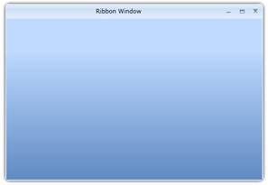{border="0"}**[]{style="COLOR: #4f81bd"}**

Figure 616: A typical Ribbon Window

[]{#_Show_Window_Control}1.1.1.1.1.1.60     Show RibbonWindow Control

The RibbonWindow Control can be shown using Show().

Show() -- Shows the RibbonWindow normally.

+----------------------------------------------------------------------------------------------------------------------------------------------------------------------------------------+
| [C#]{style="FONT-FAMILY: 'Courier New'"}[]{style="FONT-FAMILY: 'Courier New'"}                                                                                                         |
|                                                                                                                                                                                        |
| []{style="FONT-FAMILY: 'Courier New'; COLOR: #2b91af"}                                                                                                                                 |
|                                                                                                                                                                                        |
| [RibbonWindow]{style="FONT-FAMILY: 'Courier New'; COLOR: #2b91af"}[ window = [new]{style="COLOR: blue"} [RibbonWindow]{style="COLOR: #2b91af"}();]{style="FONT-FAMILY: 'Courier New'"} |
|                                                                                                                                                                                        |
| [window.Title = [\"Ribbon Window Demo\"]{style="COLOR: #a31515"};]{style="FONT-FAMILY: 'Courier New'"}                                                                                 |
|                                                                                                                                                                                        |
| [window.Show();]{style="FONT-FAMILY: 'Courier New'"}                                                                                                                                   |
+----------------------------------------------------------------------------------------------------------------------------------------------------------------------------------------+

 

 

[]{#_Close_Window_Control}1.1.1.1.1.1.61     Close RibbonWindow Control

The window instance can be closed by pressing the close button or by calling the Close() method.

+------------------------------------------------------------------------------------------------------------------------------------------------------------------------------------+
| [C#[]{style="COLOR: #2b91af"}]{style="FONT-FAMILY: 'Courier New'"}                                                                                                                 |
|                                                                                                                                                                                    |
| []{style="FONT-FAMILY: 'Courier New'; COLOR: #2b91af"}                                                                                                                             |
|                                                                                                                                                                                    |
| [WindowDemo]{style="FONT-FAMILY: 'Courier New'; COLOR: #2b91af"}[ window = [new]{style="COLOR: blue"} [WindowDemo]{style="COLOR: #2b91af"}();]{style="FONT-FAMILY: 'Courier New'"} |
|                                                                                                                                                                                    |
| [window.Close();]{style="FONT-FAMILY: 'Courier New'"}                                                                                                                              |
+------------------------------------------------------------------------------------------------------------------------------------------------------------------------------------+

[]{style="FONT-FAMILY: 'Calibri','sans-serif'"} 

**[]{style="FONT-FAMILY: 'Calibri','sans-serif'; COLOR: #4f81bd"}** 

[]{#_RibbonWindow_Position}1.1.1.1.1.1.62     RibbonWindow Position

The position of the *RibbonWindow* can be controlled by the user by setting the property. **WindowStartUpLocation.** The Enum takes the following values:

[·      ]{style="FONT-FAMILY: Symbol"}CenterScreen -- RibbonWindow will appear at the center of the screen.

[·      ]{style="FONT-FAMILY: Symbol"}Manual - The location of the window can be controlled by **Top** and **Left** properties.

The property can be set as follows:

1.1.1.1.1.1.62.1  Center Screen

+----------------------------------------------------------------------------------------------------------------------------------------------------------------------------------------------------------------------------------------------------------------------------------------------------------------------------------------------------------------------------------------------------------------------------------------------------------------------------------+
| [XAML[]{style="COLOR: blue"}]{style="FONT-FAMILY: 'Courier New'"}                                                                                                                                                                                                                                                                                                                                                                                                                |
|                                                                                                                                                                                                                                                                                                                                                                                                                                                                                  |
| []{style="FONT-FAMILY: 'Courier New'; COLOR: blue"}                                                                                                                                                                                                                                                                                                                                                                                                                              |
|                                                                                                                                                                                                                                                                                                                                                                                                                                                                                  |
| [\<]{style="FONT-FAMILY: 'Courier New'; COLOR: blue"}[syncfusion]{style="FONT-FAMILY: 'Courier New'; COLOR: #a31515"}[:]{style="FONT-FAMILY: 'Courier New'; COLOR: blue"}[RibbonWindow]{style="FONT-FAMILY: 'Courier New'; COLOR: #a31515"}[ x]{style="FONT-FAMILY: 'Courier New'; COLOR: red"}[:]{style="FONT-FAMILY: 'Courier New'; COLOR: blue"}[Name]{style="FONT-FAMILY: 'Courier New'; COLOR: red"}[=\"windowControl\"]{style="FONT-FAMILY: 'Courier New'; COLOR: blue"}[\ |
| [        xmlns]{style="COLOR: red"}[=\"http://schemas.microsoft.com/winfx/2006/xaml/presentation\"]{style="COLOR: blue"}\                                                                                                                                                                                                                                                                                                                                                        |
| [        xmlns]{style="COLOR: red"}[:]{style="COLOR: blue"}[x]{style="COLOR: red"}[=\"http://schemas.microsoft.com/winfx/2006/xaml\"]{style="COLOR: blue"}\                                                                                                                                                                                                                                                                                                                      |
| [        x]{style="COLOR: red"}[:]{style="COLOR: blue"}[Class]{style="COLOR: red"}[=\"RibbonSample.RibbonWindowControl\"]{style="COLOR: blue"}\                                                                                                                                                                                                                                                                                                                                  |
|    [ WindowStartupLocation]{style="COLOR: red"}[=\"CenterScreen\"]{style="COLOR: blue"}\                                                                                                                                                                                                                                                                                                                                                                                         |
|    [ xmlns]{style="COLOR: red"}[:]{style="COLOR: blue"}[syncfusion]{style="COLOR: red"}[=\"clr-namespace:Syncfusion.Windows.Tools.Controls;assembly=Syncfusion.Ribbon.Silverlight\"]{style="COLOR: blue"}]{style="FONT-FAMILY: 'Courier New'"}                                                                                                                                                                                                                                   |
|                                                                                                                                                                                                                                                                                                                                                                                                                                                                                  |
| [Height]{style="FONT-FAMILY: 'Courier New'; COLOR: red"}[=\"465\"]{style="FONT-FAMILY: 'Courier New'; COLOR: blue"}[ Width]{style="FONT-FAMILY: 'Courier New'; COLOR: red"}[=\"800\"\>]{style="FONT-FAMILY: 'Courier New'; COLOR: blue"}[\                                                                                                                                                                                                                                       |
| [   \<]{style="COLOR: blue"}[syncfusion]{style="COLOR: #a31515"}[:]{style="COLOR: blue"}[Ribbon]{style="COLOR: #a31515"}[ HorizontalAlignment]{style="COLOR: red"}[=\"Left\"]{style="COLOR: blue"}[ IsInRibbonWindow]{style="COLOR: red"}[=\"True\"\>]{style="COLOR: blue"}\                                                                                                                                                                                                     |
| [      ]{style="COLOR: #a31515"}[\<]{style="COLOR: blue"}[syncfusion]{style="COLOR: #a31515"}[:]{style="COLOR: blue"}[RibbonTab]{style="COLOR: #a31515"}[ Caption]{style="COLOR: red"}[=\"Home\"\>]{style="COLOR: blue"}\                                                                                                                                                                                                                                                        |
| [            ]{style="COLOR: #a31515"}[\<]{style="COLOR: blue"}[syncfusion]{style="COLOR: #a31515"}[:]{style="COLOR: blue"}[RibbonBar]{style="COLOR: #a31515"}[ Header]{style="COLOR: red"}[=\"Clipboard\"\>]{style="COLOR: blue"}\                                                                                                                                                                                                                                              |
| [            ]{style="COLOR: #a31515"}[\<]{style="COLOR: blue"}[syncfusion]{style="COLOR: #a31515"}[:]{style="COLOR: blue"}[RibbonSplitButton]{style="COLOR: #a31515"}[ SizeMode]{style="COLOR: red"}[=\"Small\" /\>]{style="COLOR: blue"}\                                                                                                                                                                                                                                      |
| [        ]{style="COLOR: #a31515"}[\</]{style="COLOR: blue"}[syncfusion]{style="COLOR: #a31515"}[:]{style="COLOR: blue"}[RibbonBar]{style="COLOR: #a31515"}[\>]{style="COLOR: blue"}\                                                                                                                                                                                                                                                                                            |
| [      ]{style="COLOR: #a31515"}[\</]{style="COLOR: blue"}[syncfusion]{style="COLOR: #a31515"}[:]{style="COLOR: blue"}[RibbonTab]{style="COLOR: #a31515"}[\>]{style="COLOR: blue"}\                                                                                                                                                                                                                                                                                              |
| [      \</]{style="COLOR: blue"}[syncfusion]{style="COLOR: #a31515"}[:]{style="COLOR: blue"}[Ribbon]{style="COLOR: #a31515"}[\>]{style="COLOR: blue"}\                                                                                                                                                                                                                                                                                                                           |
| [\</]{style="COLOR: blue"}[syncfusion]{style="COLOR: #a31515"}[:]{style="COLOR: blue"}[RibbonWindow]{style="COLOR: #a31515"}[\>]{style="COLOR: blue"}]{style="FONT-FAMILY: 'Courier New'"}[]{style="FONT-FAMILY: 'Courier New'"}                                                                                                                                                                                                                                                 |
+----------------------------------------------------------------------------------------------------------------------------------------------------------------------------------------------------------------------------------------------------------------------------------------------------------------------------------------------------------------------------------------------------------------------------------------------------------------------------------+

 

+------------------------------------------------------------------------------------------------------------------------------------------------------------------------------------------------+
| [C#[]{style="COLOR: #2b91af"}]{style="FONT-FAMILY: 'Courier New'"}                                                                                                                             |
|                                                                                                                                                                                                |
| []{style="FONT-FAMILY: 'Courier New'; COLOR: #2b91af"}                                                                                                                                         |
|                                                                                                                                                                                                |
| [RibbonWindowControl]{style="FONT-FAMILY: 'Courier New'; COLOR: #2b91af"}[ window = [new]{style="COLOR: blue"} [RibbonWindowControl]{style="COLOR: #2b91af"}() { Height = 465, Width = 800 };\ |
| window.WindowStartupLocation = Syncfusion.Windows.Tools.Controls.[WindowStartupLocation]{style="COLOR: #2b91af"}.CenterScreen;\                                                                |
| [var]{style="COLOR: blue"} ribbon = [new]{style="COLOR: blue"} [Ribbon]{style="COLOR: #2b91af"}();\                                                                                            |
| window.Content = ribbon;\                                                                                                                                                                      |
| [var]{style="COLOR: blue"} ribbontab = [new]{style="COLOR: blue"} [RibbonTab]{style="COLOR: #2b91af"}() { Caption =[\"Home\"]{style="COLOR: #a31515"} };\                                      |
| ribbon.Items.Add(ribbontab);\                                                                                                                                                                  |
| [var]{style="COLOR: blue"} ribbonbar = [new]{style="COLOR: blue"} [RibbonBar]{style="COLOR: #2b91af"}() { Header = [\"Clipboard\"]{style="COLOR: #a31515"} };\                                 |
| ribbontab.Items.Add(ribbonbar);\                                                                                                                                                               |
| ribbonbar.Items.Add([new]{style="COLOR: blue"} [RibbonSplitButton]{style="COLOR: #2b91af"}() { SizeMode = [SizeMode]{style="COLOR: #2b91af"}.Small });\                                        |
| window.Show();]{style="FONT-FAMILY: 'Courier New'"}[]{style="FONT-FAMILY: 'Courier New'"}                                                                                                      |
+------------------------------------------------------------------------------------------------------------------------------------------------------------------------------------------------+

 

[]{style="FONT-FAMILY: 'Calibri','sans-serif'"} 

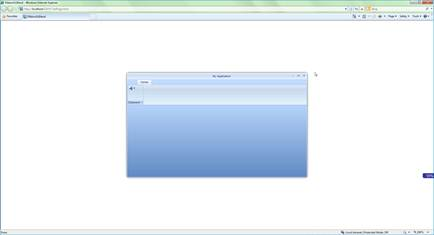{border="0"}

Figure 617: RibbonWindow appears in the Center of the Screen

[]{#_Owner_Window}[]{#_Manual}1.1.1.1.1.1.62.2  Manual

+----------------------------------------------------------------------------------------------------------------------------------------------------------------------------------------------------------------------------------------------------------------------------------------------------------------------------------------------------------------------------------------------------------------------------------------------------------------------------------+
| [XAML[]{style="COLOR: blue"}]{style="FONT-FAMILY: 'Courier New'"}                                                                                                                                                                                                                                                                                                                                                                                                                |
|                                                                                                                                                                                                                                                                                                                                                                                                                                                                                  |
| []{style="FONT-FAMILY: 'Courier New'; COLOR: blue"}                                                                                                                                                                                                                                                                                                                                                                                                                              |
|                                                                                                                                                                                                                                                                                                                                                                                                                                                                                  |
| [\<]{style="FONT-FAMILY: 'Courier New'; COLOR: blue"}[syncfusion]{style="FONT-FAMILY: 'Courier New'; COLOR: #a31515"}[:]{style="FONT-FAMILY: 'Courier New'; COLOR: blue"}[RibbonWindow]{style="FONT-FAMILY: 'Courier New'; COLOR: #a31515"}[ x]{style="FONT-FAMILY: 'Courier New'; COLOR: red"}[:]{style="FONT-FAMILY: 'Courier New'; COLOR: blue"}[Name]{style="FONT-FAMILY: 'Courier New'; COLOR: red"}[=\"windowControl\"]{style="FONT-FAMILY: 'Courier New'; COLOR: blue"}[\ |
| [    xmlns]{style="COLOR: red"}[=\"http://schemas.microsoft.com/winfx/2006/xaml/presentation\"]{style="COLOR: blue"}\                                                                                                                                                                                                                                                                                                                                                            |
| [    xmlns]{style="COLOR: red"}[:]{style="COLOR: blue"}[x]{style="COLOR: red"}[=\"http://schemas.microsoft.com/winfx/2006/xaml\"]{style="COLOR: blue"}\                                                                                                                                                                                                                                                                                                                          |
| [    x]{style="COLOR: red"}[:]{style="COLOR: blue"}[Class]{style="COLOR: red"}[=\"RibbonSample.RibbonWindowControl\"]{style="COLOR: blue"}\                                                                                                                                                                                                                                                                                                                                      |
|    [ WindowStartupLocation]{style="COLOR: red"}[=\"Manual\"]{style="COLOR: blue"}[ Top]{style="COLOR: red"}[=\"100\"]{style="COLOR: blue"}[ Left]{style="COLOR: red"}[=\"100\"]{style="COLOR: blue"}\                                                                                                                                                                                                                                                                            |
|    [xmlns]{style="COLOR: red"}[:]{style="COLOR: blue"}[syncfusion]{style="COLOR: red"}[=\"clr-namespace:Syncfusion.Windows.Tools.Controls;assembly=Syncfusion.Ribbon.Silverlight\"]{style="COLOR: blue"}[ ]{style="COLOR: red"}]{style="FONT-FAMILY: 'Courier New'"}                                                                                                                                                                                                             |
|                                                                                                                                                                                                                                                                                                                                                                                                                                                                                  |
| [Height]{style="FONT-FAMILY: 'Courier New'; COLOR: red"}[=\"450\"]{style="FONT-FAMILY: 'Courier New'; COLOR: blue"}[ Width]{style="FONT-FAMILY: 'Courier New'; COLOR: red"}[=\"800\"\>]{style="FONT-FAMILY: 'Courier New'; COLOR: blue"}[\                                                                                                                                                                                                                                       |
| [     \<]{style="COLOR: blue"}[syncfusion]{style="COLOR: #a31515"}[:]{style="COLOR: blue"}[Ribbon]{style="COLOR: #a31515"}[ HorizontalAlignment]{style="COLOR: red"}[=\"Left\"]{style="COLOR: blue"}[ IsInRibbonWindow]{style="COLOR: red"}[=\"True\"\>]{style="COLOR: blue"}\                                                                                                                                                                                                   |
| [      ]{style="COLOR: #a31515"}[\<]{style="COLOR: blue"}[syncfusion]{style="COLOR: #a31515"}[:]{style="COLOR: blue"}[RibbonTab]{style="COLOR: #a31515"}[ Caption]{style="COLOR: red"}[=\"Home\"\>]{style="COLOR: blue"}\                                                                                                                                                                                                                                                        |
| [          ]{style="COLOR: #a31515"}[\<]{style="COLOR: blue"}[syncfusion]{style="COLOR: #a31515"}[:]{style="COLOR: blue"}[RibbonBar]{style="COLOR: #a31515"}[ Header]{style="COLOR: red"}[=\"Clipboard\"\>]{style="COLOR: blue"}\                                                                                                                                                                                                                                                |
| [              ]{style="COLOR: #a31515"}[\<]{style="COLOR: blue"}[syncfusion]{style="COLOR: #a31515"}[:]{style="COLOR: blue"}[RibbonSplitButton]{style="COLOR: #a31515"}[ SizeMode]{style="COLOR: red"}[=\"Small\" /\>]{style="COLOR: blue"}\                                                                                                                                                                                                                                    |
| [                ]{style="COLOR: #a31515"}[\</]{style="COLOR: blue"}[syncfusion]{style="COLOR: #a31515"}[:]{style="COLOR: blue"}[RibbonBar]{style="COLOR: #a31515"}[\>]{style="COLOR: blue"}\                                                                                                                                                                                                                                                                                    |
| [      ]{style="COLOR: #a31515"}[\</]{style="COLOR: blue"}[syncfusion]{style="COLOR: #a31515"}[:]{style="COLOR: blue"}[RibbonTab]{style="COLOR: #a31515"}[\>]{style="COLOR: blue"}\                                                                                                                                                                                                                                                                                              |
| [     ]{style="COLOR: #a31515"}[\</]{style="COLOR: blue"}[syncfusion]{style="COLOR: #a31515"}[:]{style="COLOR: blue"}[Ribbon]{style="COLOR: #a31515"}[\>]{style="COLOR: blue"}\                                                                                                                                                                                                                                                                                                  |
| [\</]{style="COLOR: blue"}[syncfusion]{style="COLOR: #a31515"}[:]{style="COLOR: blue"}[RibbonWindow]{style="COLOR: #a31515"}[\>]{style="COLOR: blue"}]{style="FONT-FAMILY: 'Courier New'"}[]{style="FONT-FAMILY: 'Courier New'"}                                                                                                                                                                                                                                                 |
+----------------------------------------------------------------------------------------------------------------------------------------------------------------------------------------------------------------------------------------------------------------------------------------------------------------------------------------------------------------------------------------------------------------------------------------------------------------------------------+

 

+------------------------------------------------------------------------------------------------------------------------------------------------------------------------------------------------+
| [C#[]{style="COLOR: #2b91af"}]{style="FONT-FAMILY: 'Courier New'"}                                                                                                                             |
|                                                                                                                                                                                                |
| []{style="FONT-FAMILY: 'Courier New'; COLOR: #2b91af"}                                                                                                                                         |
|                                                                                                                                                                                                |
| [RibbonWindowControl]{style="FONT-FAMILY: 'Courier New'; COLOR: #2b91af"}[ window = [new]{style="COLOR: blue"} [RibbonWindowControl]{style="COLOR: #2b91af"}() { Height = 465, Width = 800 };\ |
| window.Top = 100;\                                                                                                                                                                             |
| window.Left = 100;\                                                                                                                                                                            |
| window.WindowStartupLocation =[ WindowStartupLocation]{style="COLOR: #2b91af"}.Manual;\                                                                                                        |
| [var]{style="COLOR: blue"} ribbon = [new]{style="COLOR: blue"} [Ribbon]{style="COLOR: #2b91af"}();\                                                                                            |
| window.Content = ribbon;\                                                                                                                                                                      |
| [var]{style="COLOR: blue"} ribbontab = [new]{style="COLOR: blue"} [RibbonTab]{style="COLOR: #2b91af"}() { Caption = [\"Home\"]{style="COLOR: #a31515"} };\                                     |
| ribbon.Items.Add(ribbontab);\                                                                                                                                                                  |
| [var]{style="COLOR: blue"} ribbonbar = [new]{style="COLOR: blue"} [RibbonBar]{style="COLOR: #2b91af"}() { Header = [\"Clipboard\"]{style="COLOR: #a31515"} };\                                 |
| ribbontab.Items.Add(ribbonbar);\                                                                                                                                                               |
| ribbonbar.Items.Add([new]{style="COLOR: blue"} [RibbonSplitButton]{style="COLOR: #2b91af"}() { SizeMode = [SizeMode]{style="COLOR: #2b91af"}.Small });\                                        |
| window.Show();]{style="FONT-FAMILY: 'Courier New'"}                                                                                                                                            |
+------------------------------------------------------------------------------------------------------------------------------------------------------------------------------------------------+

[]{style="FONT-FAMILY: 'Calibri','sans-serif'"} 

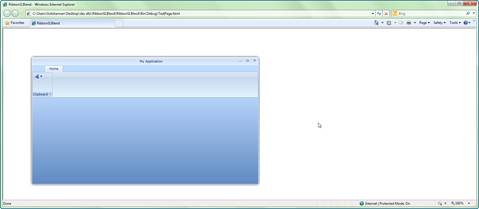{border="0"}

Figure 618: RibbonWindow appears Top position at 100 and Left at 100

The RibbonWindow control can be positioned manually, using the properties Top and Left. The following code snippet explains the making of cascade windows using the properties Top and Left.

[]{#_Resize_Mode}[]{#_Set_Title}1.1.1.1.1.1.63     Set Title

+---------------------------------------------------------------------------------------------------------------------------------------------------------------------------------------------------------------------------------------------------------------------------------------------------------------------------------------------------------------------------------------------------------------------------------------------------------------------------------------------------------------------------+
| **[XAML[]{style="COLOR: blue"}]{style="FONT-FAMILY: 'Courier New'"}**                                                                                                                                                                                                                                                                                                                                                                                                                                                     |
|                                                                                                                                                                                                                                                                                                                                                                                                                                                                                                                           |
| []{style="FONT-FAMILY: 'Courier New'; COLOR: blue"}                                                                                                                                                                                                                                                                                                                                                                                                                                                                       |
|                                                                                                                                                                                                                                                                                                                                                                                                                                                                                                                           |
| [\<]{style="FONT-FAMILY: 'Courier New'; COLOR: blue"}[sync]{style="FONT-FAMILY: 'Courier New'; COLOR: #a31515"}[:]{style="FONT-FAMILY: 'Courier New'; COLOR: blue"}[RibbonWindow]{style="FONT-FAMILY: 'Courier New'; COLOR: #a31515"}[ x]{style="FONT-FAMILY: 'Courier New'; COLOR: red"}[:]{style="FONT-FAMILY: 'Courier New'; COLOR: blue"}[Name]{style="FONT-FAMILY: 'Courier New'; COLOR: red"}[=\"RibbonDemo\"]{style="FONT-FAMILY: 'Courier New'; COLOR: blue"}[  ]{style="FONT-FAMILY: 'Courier New'; COLOR: red"} |
|                                                                                                                                                                                                                                                                                                                                                                                                                                                                                                                           |
| [    x]{style="FONT-FAMILY: 'Courier New'; COLOR: red"}[:]{style="FONT-FAMILY: 'Courier New'; COLOR: blue"}[Class]{style="FONT-FAMILY: 'Courier New'; COLOR: red"}[=\"Syncfusion.Tools.Silverlight.Samples.RibbonDemo\"]{style="FONT-FAMILY: 'Courier New'; COLOR: blue"}[]{style="FONT-FAMILY: 'Courier New'"}                                                                                                                                                                                                           |
|                                                                                                                                                                                                                                                                                                                                                                                                                                                                                                                           |
| [   [ xmlns]{style="COLOR: red"}[=\"http://schemas.microsoft.com/winfx/2006/xaml/presentation\"]{style="COLOR: blue"}[   ]{style="COLOR: red"}]{style="FONT-FAMILY: 'Courier New'"}                                                                                                                                                                                                                                                                                                                                       |
|                                                                                                                                                                                                                                                                                                                                                                                                                                                                                                                           |
| [    xmlns]{style="FONT-FAMILY: 'Courier New'; COLOR: red"}[:]{style="FONT-FAMILY: 'Courier New'; COLOR: blue"}[x]{style="FONT-FAMILY: 'Courier New'; COLOR: red"}[=\"http://schemas.microsoft.com/winfx/2006/xaml\"]{style="FONT-FAMILY: 'Courier New'; COLOR: blue"}[ ]{style="FONT-FAMILY: 'Courier New'"}                                                                                                                                                                                                             |
|                                                                                                                                                                                                                                                                                                                                                                                                                                                                                                                           |
| [   [ [Title]{style="BACKGROUND: lightgrey"}]{style="COLOR: red"}[=\"Ribbon Window\"]{style="BACKGROUND: lightgrey; COLOR: blue"}[ ]{style="COLOR: red"}]{style="FONT-FAMILY: 'Courier New'"}                                                                                                                                                                                                                                                                                                                             |
|                                                                                                                                                                                                                                                                                                                                                                                                                                                                                                                           |
| [   [ xmlns]{style="COLOR: red"}[:]{style="COLOR: blue"}[sync]{style="COLOR: red"}[=\"clr-namespace:Syncfusion.Windows.Tools.Controls;assembly=Syncfusion.Ribbon.Silverlight\"]{style="COLOR: blue"}[ Height]{style="COLOR: red"}[=\"465\"]{style="COLOR: blue"}[ Width]{style="COLOR: red"}[=\"800\"\>]{style="COLOR: blue"}]{style="FONT-FAMILY: 'Courier New'"}                                                                                                                                                        |
|                                                                                                                                                                                                                                                                                                                                                                                                                                                                                                                           |
| [\</]{style="FONT-FAMILY: 'Courier New'; COLOR: blue"}[sync]{style="FONT-FAMILY: 'Courier New'; COLOR: #a31515"}[:]{style="FONT-FAMILY: 'Courier New'; COLOR: blue"}[RibbonWindow]{style="FONT-FAMILY: 'Courier New'; COLOR: #a31515"}[\>]{style="FONT-FAMILY: 'Courier New'; COLOR: blue"}[]{style="FONT-FAMILY: 'Courier New'"}                                                                                                                                                                                         |
+---------------------------------------------------------------------------------------------------------------------------------------------------------------------------------------------------------------------------------------------------------------------------------------------------------------------------------------------------------------------------------------------------------------------------------------------------------------------------------------------------------------------------+

 

+------------------------------------------------------------------------------------------------------------------------------------------------------------------------------------+
| [C#[]{style="COLOR: #2b91af"}]{style="FONT-FAMILY: 'Courier New'"}                                                                                                                 |
|                                                                                                                                                                                    |
| []{style="FONT-FAMILY: 'Courier New'; COLOR: #2b91af"}                                                                                                                             |
|                                                                                                                                                                                    |
| [RibbonDemo ]{style="FONT-FAMILY: 'Courier New'; COLOR: #2b91af"}[window = [new]{style="COLOR: blue"} [RibbonDemo]{style="COLOR: #2b91af"}();]{style="FONT-FAMILY: 'Courier New'"} |
|                                                                                                                                                                                    |
| [window.Title = [\"Ribbon Window\"]{style="COLOR: #a31515"};]{style="FONT-FAMILY: 'Courier New'"}                                                                                  |
+------------------------------------------------------------------------------------------------------------------------------------------------------------------------------------+

 

 

[]{style="FONT-FAMILY: 'Calibri','sans-serif'"} 

{border="0"}

Figure 619: RibbonWindow control with Title

::: {style="BORDER-BOTTOM: windowtext 1pt solid; BORDER-LEFT: medium none; PADDING-BOTTOM: 1pt; MARGIN-TOP: 9pt; PADDING-LEFT: 0pt; PADDING-RIGHT: 0pt; MARGIN-BOTTOM: 9pt; BORDER-TOP: windowtext 1pt solid; BORDER-RIGHT: medium none; PADDING-TOP: 1pt"}
{border="0"}Note: RibbonWindow Control should not add as a Child of any Control. It should be a UserControl as shown above.
:::

[]{#_Resize_Mode_1}1.1.1.1.1.1.64     Resize Mode

The *Resizing* capability of the *RibbonWindow* Control can be controlled using the *ResizeMode* property. The Enumeration takes the following values:

[·      ]{style="FONT-FAMILY: Symbol"}CanResize

[·      ]{style="FONT-FAMILY: Symbol"}NoResize

[·      ]{style="FONT-FAMILY: Symbol"}CanResizeWithGrip

[·      ]{style="FONT-FAMILY: Symbol"}CanMinimize

[·      ]{style="FONT-FAMILY: Symbol"}CanMaximize

1.1.1.1.1.1.64.1  CanResize

This is the default Resize Mode of the RibbonWindow Control. Setting this value enables the user to resize the RibbonWindow Control in all aspects.

+----------------------------------------------------------------------------------------------------------------------------------------------------------------------------------------------------------------------------------------------------------------------------------------------------------------------------------------------------------------------------------------------------------------------------------------------------------------------------------+
| [XAML[]{style="COLOR: blue"}]{style="FONT-FAMILY: 'Courier New'"}                                                                                                                                                                                                                                                                                                                                                                                                                |
|                                                                                                                                                                                                                                                                                                                                                                                                                                                                                  |
| []{style="FONT-FAMILY: 'Courier New'; COLOR: blue"}                                                                                                                                                                                                                                                                                                                                                                                                                              |
|                                                                                                                                                                                                                                                                                                                                                                                                                                                                                  |
| [\<]{style="FONT-FAMILY: 'Courier New'; COLOR: blue"}[syncfusion]{style="FONT-FAMILY: 'Courier New'; COLOR: #a31515"}[:]{style="FONT-FAMILY: 'Courier New'; COLOR: blue"}[RibbonWindow]{style="FONT-FAMILY: 'Courier New'; COLOR: #a31515"}[ x]{style="FONT-FAMILY: 'Courier New'; COLOR: red"}[:]{style="FONT-FAMILY: 'Courier New'; COLOR: blue"}[Name]{style="FONT-FAMILY: 'Courier New'; COLOR: red"}[=\"windowControl\"]{style="FONT-FAMILY: 'Courier New'; COLOR: blue"}[\ |
| [   xmlns]{style="COLOR: red"}[=\"http://schemas.microsoft.com/winfx/2006/xaml/presentation\"]{style="COLOR: blue"}\                                                                                                                                                                                                                                                                                                                                                             |
| [   xmlns]{style="COLOR: red"}[:]{style="COLOR: blue"}[x]{style="COLOR: red"}[=\"http://schemas.microsoft.com/winfx/2006/xaml\"]{style="COLOR: blue"}\                                                                                                                                                                                                                                                                                                                           |
| [   x]{style="COLOR: red"}[:]{style="COLOR: blue"}[Class]{style="COLOR: red"}[=\"RibbonSample.RibbonWindowControl\" ]{style="COLOR: blue"}[ResizeMode]{style="COLOR: red"}[=\"CanMinimize\"]{style="COLOR: blue"}]{style="FONT-FAMILY: 'Courier New'"}                                                                                                                                                                                                                           |
|                                                                                                                                                                                                                                                                                                                                                                                                                                                                                  |
| [   [xmlns]{style="COLOR: red"}[:]{style="COLOR: blue"}[syncfusion]{style="COLOR: red"}[=\"clr-namespace:Syncfusion.Windows.Tools.Controls;assembly=Syncfusion.Ribbon.Silverlight\"]{style="COLOR: blue"}[ ]{style="COLOR: red"}]{style="FONT-FAMILY: 'Courier New'"}                                                                                                                                                                                                            |
|                                                                                                                                                                                                                                                                                                                                                                                                                                                                                  |
| [   Height]{style="FONT-FAMILY: 'Courier New'; COLOR: red"}[=\"450\"]{style="FONT-FAMILY: 'Courier New'; COLOR: blue"}[ Width]{style="FONT-FAMILY: 'Courier New'; COLOR: red"}[=\"800\"\>]{style="FONT-FAMILY: 'Courier New'; COLOR: blue"}[\                                                                                                                                                                                                                                    |
|  [\</]{style="COLOR: blue"}[syncfusion]{style="COLOR: #a31515"}[:]{style="COLOR: blue"}[RibbonWindow]{style="COLOR: #a31515"}[\>]{style="COLOR: blue"}]{style="FONT-FAMILY: 'Courier New'"}                                                                                                                                                                                                                                                                                      |
+----------------------------------------------------------------------------------------------------------------------------------------------------------------------------------------------------------------------------------------------------------------------------------------------------------------------------------------------------------------------------------------------------------------------------------------------------------------------------------+

[]{style="FONT-FAMILY: 'Calibri','sans-serif'"} 

+------------------------------------------------------------------------------------------------------------------------------------------------------------------------------------------------+
| [C#[]{style="COLOR: #2b91af"}]{style="FONT-FAMILY: 'Courier New'"}                                                                                                                             |
|                                                                                                                                                                                                |
| []{style="FONT-FAMILY: 'Courier New'; COLOR: #2b91af"}                                                                                                                                         |
|                                                                                                                                                                                                |
| [RibbonWindowControl]{style="FONT-FAMILY: 'Courier New'; COLOR: #2b91af"}[ window = [new]{style="COLOR: blue"} [RibbonWindowControl]{style="COLOR: #2b91af"}() { Height = 350, Width = 400 };\ |
| window.ResizeMode = [ResizeMode]{style="COLOR: #2b91af"}.CanResize;]{style="FONT-FAMILY: 'Courier New'"}                                                                                       |
+------------------------------------------------------------------------------------------------------------------------------------------------------------------------------------------------+

[]{style="FONT-FAMILY: 'Calibri','sans-serif'"} 

[]{style="FONT-FAMILY: 'Calibri','sans-serif'"} 

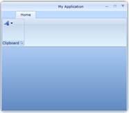{border="0"}

Figure 620: Resizable RibbonWindow Control

[]{#_No_Resize}1.1.1.1.1.1.64.2  No Resize

Setting this value disables the Resizing behavior of RibbonWindow Control.

+----------------------------------------------------------------------------------------------------------------------------------------------------------------------------------------------------------------------------------------------------------------------------------------------------------------------------------------------------------------------------------------------------------------------------------------------------------------------------------+
| [XAML[]{style="COLOR: blue"}]{style="FONT-FAMILY: 'Courier New'"}                                                                                                                                                                                                                                                                                                                                                                                                                |
|                                                                                                                                                                                                                                                                                                                                                                                                                                                                                  |
| []{style="FONT-FAMILY: 'Courier New'; COLOR: blue"}                                                                                                                                                                                                                                                                                                                                                                                                                              |
|                                                                                                                                                                                                                                                                                                                                                                                                                                                                                  |
| [\<]{style="FONT-FAMILY: 'Courier New'; COLOR: blue"}[syncfusion]{style="FONT-FAMILY: 'Courier New'; COLOR: #a31515"}[:]{style="FONT-FAMILY: 'Courier New'; COLOR: blue"}[RibbonWindow]{style="FONT-FAMILY: 'Courier New'; COLOR: #a31515"}[ x]{style="FONT-FAMILY: 'Courier New'; COLOR: red"}[:]{style="FONT-FAMILY: 'Courier New'; COLOR: blue"}[Name]{style="FONT-FAMILY: 'Courier New'; COLOR: red"}[=\"windowControl\"]{style="FONT-FAMILY: 'Courier New'; COLOR: blue"}[\ |
| [   xmlns]{style="COLOR: red"}[=\"http://schemas.microsoft.com/winfx/2006/xaml/presentation\"]{style="COLOR: blue"}\                                                                                                                                                                                                                                                                                                                                                             |
| [   xmlns]{style="COLOR: red"}[:]{style="COLOR: blue"}[x]{style="COLOR: red"}[=\"http://schemas.microsoft.com/winfx/2006/xaml\"]{style="COLOR: blue"}\                                                                                                                                                                                                                                                                                                                           |
| [   x]{style="COLOR: red"}[:]{style="COLOR: blue"}[Class]{style="COLOR: red"}[=\"RibbonSample.RibbonWindowControl\" ]{style="COLOR: blue"}[ResizeMode]{style="COLOR: red"}[=\"NoResize\"]{style="COLOR: blue"}]{style="FONT-FAMILY: 'Courier New'"}                                                                                                                                                                                                                              |
|                                                                                                                                                                                                                                                                                                                                                                                                                                                                                  |
| [   [xmlns]{style="COLOR: red"}[:]{style="COLOR: blue"}[syncfusion]{style="COLOR: red"}[=\"clr-namespace:Syncfusion.Windows.Tools.Controls;assembly=Syncfusion.Ribbon.Silverlight\"]{style="COLOR: blue"}[ ]{style="COLOR: red"}]{style="FONT-FAMILY: 'Courier New'"}                                                                                                                                                                                                            |
|                                                                                                                                                                                                                                                                                                                                                                                                                                                                                  |
| [   Height]{style="FONT-FAMILY: 'Courier New'; COLOR: red"}[=\"450\"]{style="FONT-FAMILY: 'Courier New'; COLOR: blue"}[ Width]{style="FONT-FAMILY: 'Courier New'; COLOR: red"}[=\"800\"\>]{style="FONT-FAMILY: 'Courier New'; COLOR: blue"}[\                                                                                                                                                                                                                                    |
|  [\</]{style="COLOR: blue"}[syncfusion]{style="COLOR: #a31515"}[:]{style="COLOR: blue"}[RibbonWindow]{style="COLOR: #a31515"}[\>]{style="COLOR: blue"}]{style="FONT-FAMILY: 'Courier New'"}                                                                                                                                                                                                                                                                                      |
+----------------------------------------------------------------------------------------------------------------------------------------------------------------------------------------------------------------------------------------------------------------------------------------------------------------------------------------------------------------------------------------------------------------------------------------------------------------------------------+

[]{style="FONT-FAMILY: 'Calibri','sans-serif'"} 

+------------------------------------------------------------------------------------------------------------------------------------------------------------------------------------------------+
| [C#[]{style="COLOR: #2b91af"}]{style="FONT-FAMILY: 'Courier New'"}                                                                                                                             |
|                                                                                                                                                                                                |
| []{style="FONT-FAMILY: 'Courier New'; COLOR: #2b91af"}                                                                                                                                         |
|                                                                                                                                                                                                |
| [RibbonWindowControl]{style="FONT-FAMILY: 'Courier New'; COLOR: #2b91af"}[ window = [new]{style="COLOR: blue"} [RibbonWindowControl]{style="COLOR: #2b91af"}() { Height = 350, Width = 400 };\ |
| window.ResizeMode = [ResizeMode]{style="COLOR: #2b91af"}.NoResize;]{style="FONT-FAMILY: 'Courier New'"}                                                                                        |
+------------------------------------------------------------------------------------------------------------------------------------------------------------------------------------------------+

[]{style="FONT-FAMILY: 'Calibri','sans-serif'"} 

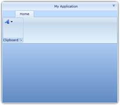{border="0"}

Figure 621: RibbonWindow Control without Resizing behavior

1.1.1.1.1.1.64.3  Can Minimize

Setting this value disables the Maximize button, so that the user cannot maximize the window[. ]{style="FONT-FAMILY: 'Calibri','sans-serif'"}

+----------------------------------------------------------------------------------------------------------------------------------------------------------------------------------------------------------------------------------------------------------------------------------------------------------------------------------------------------------------------------------------------------------------------------------------------------------------------------------+
| [XAML[]{style="COLOR: blue"}]{style="FONT-FAMILY: 'Courier New'"}                                                                                                                                                                                                                                                                                                                                                                                                                |
|                                                                                                                                                                                                                                                                                                                                                                                                                                                                                  |
| []{style="FONT-FAMILY: 'Courier New'; COLOR: blue"}                                                                                                                                                                                                                                                                                                                                                                                                                              |
|                                                                                                                                                                                                                                                                                                                                                                                                                                                                                  |
| [\<]{style="FONT-FAMILY: 'Courier New'; COLOR: blue"}[syncfusion]{style="FONT-FAMILY: 'Courier New'; COLOR: #a31515"}[:]{style="FONT-FAMILY: 'Courier New'; COLOR: blue"}[RibbonWindow]{style="FONT-FAMILY: 'Courier New'; COLOR: #a31515"}[ x]{style="FONT-FAMILY: 'Courier New'; COLOR: red"}[:]{style="FONT-FAMILY: 'Courier New'; COLOR: blue"}[Name]{style="FONT-FAMILY: 'Courier New'; COLOR: red"}[=\"windowControl\"]{style="FONT-FAMILY: 'Courier New'; COLOR: blue"}[\ |
| [   xmlns]{style="COLOR: red"}[=\"http://schemas.microsoft.com/winfx/2006/xaml/presentation\"]{style="COLOR: blue"}\                                                                                                                                                                                                                                                                                                                                                             |
| [   xmlns]{style="COLOR: red"}[:]{style="COLOR: blue"}[x]{style="COLOR: red"}[=\"http://schemas.microsoft.com/winfx/2006/xaml\"]{style="COLOR: blue"}\                                                                                                                                                                                                                                                                                                                           |
| [   x]{style="COLOR: red"}[:]{style="COLOR: blue"}[Class]{style="COLOR: red"}[=\"RibbonSample.RibbonWindowControl\" ]{style="COLOR: blue"}[ResizeMode]{style="COLOR: red"}[=\"CanMinimize\"]{style="COLOR: blue"}]{style="FONT-FAMILY: 'Courier New'"}                                                                                                                                                                                                                           |
|                                                                                                                                                                                                                                                                                                                                                                                                                                                                                  |
| [   [xmlns]{style="COLOR: red"}[:]{style="COLOR: blue"}[syncfusion]{style="COLOR: red"}[=\"clr-namespace:Syncfusion.Windows.Tools.Controls;assembly=Syncfusion.Ribbon.Silverlight\"]{style="COLOR: blue"}[ ]{style="COLOR: red"}]{style="FONT-FAMILY: 'Courier New'"}                                                                                                                                                                                                            |
|                                                                                                                                                                                                                                                                                                                                                                                                                                                                                  |
| [   Height]{style="FONT-FAMILY: 'Courier New'; COLOR: red"}[=\"450\"]{style="FONT-FAMILY: 'Courier New'; COLOR: blue"}[ Width]{style="FONT-FAMILY: 'Courier New'; COLOR: red"}[=\"800\"\>]{style="FONT-FAMILY: 'Courier New'; COLOR: blue"}[\                                                                                                                                                                                                                                    |
|  [\</]{style="COLOR: blue"}[syncfusion]{style="COLOR: #a31515"}[:]{style="COLOR: blue"}[RibbonWindow]{style="COLOR: #a31515"}[\>]{style="COLOR: blue"}]{style="FONT-FAMILY: 'Courier New'"}                                                                                                                                                                                                                                                                                      |
+----------------------------------------------------------------------------------------------------------------------------------------------------------------------------------------------------------------------------------------------------------------------------------------------------------------------------------------------------------------------------------------------------------------------------------------------------------------------------------+

[]{style="FONT-FAMILY: 'Calibri','sans-serif'"} 

+------------------------------------------------------------------------------------------------------------------------------------------------------------------------------------------------+
| [C#[]{style="COLOR: #2b91af"}]{style="FONT-FAMILY: 'Courier New'"}                                                                                                                             |
|                                                                                                                                                                                                |
| []{style="FONT-FAMILY: 'Courier New'; COLOR: #2b91af"}                                                                                                                                         |
|                                                                                                                                                                                                |
| [RibbonWindowControl]{style="FONT-FAMILY: 'Courier New'; COLOR: #2b91af"}[ window = [new]{style="COLOR: blue"} [RibbonWindowControl]{style="COLOR: #2b91af"}() { Height = 350, Width = 400 };\ |
| window.ResizeMode = [ResizeMode]{style="COLOR: #2b91af"}.CanMinimize;]{style="FONT-FAMILY: 'Courier New'"}                                                                                     |
+------------------------------------------------------------------------------------------------------------------------------------------------------------------------------------------------+

[]{style="FONT-FAMILY: 'Calibri','sans-serif'"} 

[]{style="FONT-FAMILY: 'Calibri','sans-serif'"} 

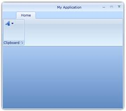{border="0"}

Figure 622: RibbonWindow Control with Maximize button disabled

1.1.1.1.1.1.64.4  CanMaximize

Setting this value disables the Minimize button.

+----------------------------------------------------------------------------------------------------------------------------------------------------------------------------------------------------------------------------------------------------------------------------------------------------------------------------------------------------------------------------------------------------------------------------------------------------------------------------------+
| [XAML[]{style="COLOR: blue"}]{style="FONT-FAMILY: 'Courier New'"}                                                                                                                                                                                                                                                                                                                                                                                                                |
|                                                                                                                                                                                                                                                                                                                                                                                                                                                                                  |
| []{style="FONT-FAMILY: 'Courier New'; COLOR: blue"}                                                                                                                                                                                                                                                                                                                                                                                                                              |
|                                                                                                                                                                                                                                                                                                                                                                                                                                                                                  |
| [\<]{style="FONT-FAMILY: 'Courier New'; COLOR: blue"}[syncfusion]{style="FONT-FAMILY: 'Courier New'; COLOR: #a31515"}[:]{style="FONT-FAMILY: 'Courier New'; COLOR: blue"}[RibbonWindow]{style="FONT-FAMILY: 'Courier New'; COLOR: #a31515"}[ x]{style="FONT-FAMILY: 'Courier New'; COLOR: red"}[:]{style="FONT-FAMILY: 'Courier New'; COLOR: blue"}[Name]{style="FONT-FAMILY: 'Courier New'; COLOR: red"}[=\"windowControl\"]{style="FONT-FAMILY: 'Courier New'; COLOR: blue"}[\ |
| [   xmlns]{style="COLOR: red"}[=\"http://schemas.microsoft.com/winfx/2006/xaml/presentation\"]{style="COLOR: blue"}\                                                                                                                                                                                                                                                                                                                                                             |
| [   xmlns]{style="COLOR: red"}[:]{style="COLOR: blue"}[x]{style="COLOR: red"}[=\"http://schemas.microsoft.com/winfx/2006/xaml\"]{style="COLOR: blue"}\                                                                                                                                                                                                                                                                                                                           |
| [   x]{style="COLOR: red"}[:]{style="COLOR: blue"}[Class]{style="COLOR: red"}[=\"RibbonSample.RibbonWindowControl\" ]{style="COLOR: blue"}[ResizeMode]{style="COLOR: red"}[=\"CanMinimize\"]{style="COLOR: blue"}]{style="FONT-FAMILY: 'Courier New'"}                                                                                                                                                                                                                           |
|                                                                                                                                                                                                                                                                                                                                                                                                                                                                                  |
| [   [xmlns]{style="COLOR: red"}[:]{style="COLOR: blue"}[syncfusion]{style="COLOR: red"}[=\"clr-namespace:Syncfusion.Windows.Tools.Controls;assembly=Syncfusion.Ribbon.Silverlight\"]{style="COLOR: blue"}[ ]{style="COLOR: red"}]{style="FONT-FAMILY: 'Courier New'"}                                                                                                                                                                                                            |
|                                                                                                                                                                                                                                                                                                                                                                                                                                                                                  |
| [   Height]{style="FONT-FAMILY: 'Courier New'; COLOR: red"}[=\"450\"]{style="FONT-FAMILY: 'Courier New'; COLOR: blue"}[ Width]{style="FONT-FAMILY: 'Courier New'; COLOR: red"}[=\"800\"\>]{style="FONT-FAMILY: 'Courier New'; COLOR: blue"}[\                                                                                                                                                                                                                                    |
|  [\</]{style="COLOR: blue"}[syncfusion]{style="COLOR: #a31515"}[:]{style="COLOR: blue"}[RibbonWindow]{style="COLOR: #a31515"}[\>]{style="COLOR: blue"}]{style="FONT-FAMILY: 'Courier New'"}                                                                                                                                                                                                                                                                                      |
+----------------------------------------------------------------------------------------------------------------------------------------------------------------------------------------------------------------------------------------------------------------------------------------------------------------------------------------------------------------------------------------------------------------------------------------------------------------------------------+

[]{style="FONT-FAMILY: 'Calibri','sans-serif'"} 

+------------------------------------------------------------------------------------------------------------------------------------------------------------------------------------------------+
| [C#[]{style="COLOR: #2b91af"}]{style="FONT-FAMILY: 'Courier New'"}                                                                                                                             |
|                                                                                                                                                                                                |
| []{style="FONT-FAMILY: 'Courier New'; COLOR: #2b91af"}                                                                                                                                         |
|                                                                                                                                                                                                |
| [RibbonWindowControl]{style="FONT-FAMILY: 'Courier New'; COLOR: #2b91af"}[ window = [new]{style="COLOR: blue"} [RibbonWindowControl]{style="COLOR: #2b91af"}() { Height = 350, Width = 400 };\ |
| window.ResizeMode = [ResizeMode]{style="COLOR: #2b91af"}.CanMinimize;]{style="FONT-FAMILY: 'Courier New'"}                                                                                     |
+------------------------------------------------------------------------------------------------------------------------------------------------------------------------------------------------+

[]{style="FONT-FAMILY: 'Calibri','sans-serif'"} 

[]{style="FONT-FAMILY: 'Calibri','sans-serif'"} 

[]{style="FONT-FAMILY: 'Calibri','sans-serif'"} 

 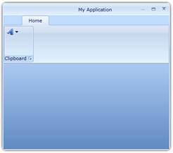{border="0"}

Figure 623: RibbonWindow with Minimize button Disabled

[]{#_Window_State}1.1.1.1.1.1.65     Window State

The state of the windows can be controlled by the property WindowState. The Enum takes the following values:

[·      ]{style="FONT-FAMILY: Symbol"}Normal

[·      ]{style="FONT-FAMILY: Symbol"}Minimized and

[·      ]{style="FONT-FAMILY: Symbol"}Maximized

1.1.1.1.1.1.65.1  Normal

This is the default state of the RibbonWindow[.]{style="FONT-FAMILY: 'Calibri','sans-serif'"}

+-------------------------------------------------------------------------------------------------------------------------------------------------------------------------------------------------------------------------------------------------------------------------------------------------------------------------------------------------------------------------------------------------------------------------------------------------------------------------------------------------------------------------------------+
| [XAML[]{style="COLOR: blue"}]{style="FONT-FAMILY: 'Courier New'"}                                                                                                                                                                                                                                                                                                                                                                                                                                                                   |
|                                                                                                                                                                                                                                                                                                                                                                                                                                                                                                                                     |
| []{style="FONT-FAMILY: 'Courier New'; COLOR: blue"}                                                                                                                                                                                                                                                                                                                                                                                                                                                                                 |
|                                                                                                                                                                                                                                                                                                                                                                                                                                                                                                                                     |
| [\<]{style="FONT-FAMILY: 'Courier New'; COLOR: blue"}[sync]{style="FONT-FAMILY: 'Courier New'; COLOR: #a31515"}[:]{style="FONT-FAMILY: 'Courier New'; COLOR: blue"}[RibbonWindow]{style="FONT-FAMILY: 'Courier New'; COLOR: #a31515"}[ x]{style="FONT-FAMILY: 'Courier New'; COLOR: red"}[:]{style="FONT-FAMILY: 'Courier New'; COLOR: blue"}[Name]{style="FONT-FAMILY: 'Courier New'; COLOR: red"}[=\"RibbonWindowControl\"]{style="FONT-FAMILY: 'Courier New'; COLOR: blue"}[   ]{style="FONT-FAMILY: 'Courier New'; COLOR: red"} |
|                                                                                                                                                                                                                                                                                                                                                                                                                                                                                                                                     |
| [    x]{style="FONT-FAMILY: 'Courier New'; COLOR: red"}[:]{style="FONT-FAMILY: 'Courier New'; COLOR: blue"}[Class]{style="FONT-FAMILY: 'Courier New'; COLOR: red"}[=\"Syncfusion.RibbonWindowControl\"]{style="FONT-FAMILY: 'Courier New'; COLOR: blue"}[]{style="FONT-FAMILY: 'Courier New'"}                                                                                                                                                                                                                                      |
|                                                                                                                                                                                                                                                                                                                                                                                                                                                                                                                                     |
| [   [ xmlns]{style="COLOR: red"}[=\"http://schemas.microsoft.com/winfx/2006/xaml/presentation\"]{style="COLOR: blue"}[   ]{style="COLOR: red"}]{style="FONT-FAMILY: 'Courier New'"}                                                                                                                                                                                                                                                                                                                                                 |
|                                                                                                                                                                                                                                                                                                                                                                                                                                                                                                                                     |
| [    xmlns]{style="FONT-FAMILY: 'Courier New'; COLOR: red"}[:]{style="FONT-FAMILY: 'Courier New'; COLOR: blue"}[x]{style="FONT-FAMILY: 'Courier New'; COLOR: red"}[=\"http://schemas.microsoft.com/winfx/2006/xaml\"]{style="FONT-FAMILY: 'Courier New'; COLOR: blue"}[ ]{style="FONT-FAMILY: 'Courier New'"}                                                                                                                                                                                                                       |
|                                                                                                                                                                                                                                                                                                                                                                                                                                                                                                                                     |
| [   [ Title]{style="COLOR: red"}[=\"Ribbon Window Demo\"]{style="COLOR: blue"}]{style="FONT-FAMILY: 'Courier New'"}                                                                                                                                                                                                                                                                                                                                                                                                                 |
|                                                                                                                                                                                                                                                                                                                                                                                                                                                                                                                                     |
| [   [ WindowStartupLocation]{style="COLOR: red"}[=\"CenterScreen\"]{style="COLOR: blue"}[ ResizeMode]{style="COLOR: red"}[=\"CanMaximize\"]{style="COLOR: blue"}]{style="FONT-FAMILY: 'Courier New'"}                                                                                                                                                                                                                                                                                                                               |
|                                                                                                                                                                                                                                                                                                                                                                                                                                                                                                                                     |
| [   [ xmlns]{style="COLOR: red"}[:]{style="COLOR: blue"}[sync]{style="COLOR: red"}[=\"clr-namespace:Syncfusion.Windows.Tools.Controls;assembly=Syncfusion.Ribbon.Silverlight\"]{style="COLOR: blue"}[ Height]{style="COLOR: red"}[=\"465\"]{style="COLOR: blue"}[ Width]{style="COLOR: red"}[=\"800\"]{style="COLOR: blue"}[ WindowState]{style="COLOR: red"}[=\"Normal\"\>]{style="COLOR: blue"}]{style="FONT-FAMILY: 'Courier New'"}                                                                                              |
|                                                                                                                                                                                                                                                                                                                                                                                                                                                                                                                                     |
| [\</]{style="FONT-FAMILY: 'Courier New'; COLOR: blue"}[sync]{style="FONT-FAMILY: 'Courier New'; COLOR: #a31515"}[:]{style="FONT-FAMILY: 'Courier New'; COLOR: blue"}[RibbonWindow]{style="FONT-FAMILY: 'Courier New'; COLOR: #a31515"}[\>]{style="FONT-FAMILY: 'Courier New'; COLOR: blue"}[]{style="FONT-FAMILY: 'Courier New'"}                                                                                                                                                                                                   |
+-------------------------------------------------------------------------------------------------------------------------------------------------------------------------------------------------------------------------------------------------------------------------------------------------------------------------------------------------------------------------------------------------------------------------------------------------------------------------------------------------------------------------------------+

[]{style="FONT-FAMILY: 'Calibri','sans-serif'"} 

+------------------------------------------------------------------------------------------------------------------------------------------------------------------------------------------------------+
| [C#[]{style="COLOR: #2b91af"}]{style="FONT-FAMILY: 'Courier New'"}                                                                                                                                   |
|                                                                                                                                                                                                      |
| []{style="FONT-FAMILY: 'Courier New'; COLOR: #2b91af"}                                                                                                                                               |
|                                                                                                                                                                                                      |
| [RibbonWindowControl]{style="FONT-FAMILY: 'Courier New'; COLOR: #2b91af"}[ window = [new]{style="COLOR: blue"} [RibbonWindowControl]{style="COLOR: #2b91af"}();]{style="FONT-FAMILY: 'Courier New'"} |
|                                                                                                                                                                                                      |
| [window.Title = [\"Ribbon Window Demo\"]{style="COLOR: #a31515"};]{style="FONT-FAMILY: 'Courier New'"}                                                                                               |
|                                                                                                                                                                                                      |
| [window.WindowStartupLocation = Syncfusion.Windows.Tools.Controls.[WindowStartupLocation]{style="COLOR: #2b91af"}.CenterScreen;]{style="FONT-FAMILY: 'Courier New'"}                                 |
|                                                                                                                                                                                                      |
| [window.ResizeMode = [ResizeMode]{style="COLOR: #2b91af"}.CanMaximize;]{style="FONT-FAMILY: 'Courier New'"}                                                                                          |
|                                                                                                                                                                                                      |
| [window.WindowState = Syncfusion.Windows.Tools.Controls.[WindowState]{style="COLOR: #2b91af"}.Normal;]{style="FONT-FAMILY: 'Courier New'"}                                                           |
+------------------------------------------------------------------------------------------------------------------------------------------------------------------------------------------------------+

[]{style="FONT-FAMILY: 'Calibri','sans-serif'"} 

[]{style="FONT-FAMILY: 'Calibri','sans-serif'"} 

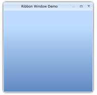{border="0"}

Figure 624: A normal RibbonWindow Control

1.1.1.1.1.1.65.2  Minimized

Setting the value hosts the RibbonWindow Control in the minimized State.

+-------------------------------------------------------------------------------------------------------------------------------------------------------------------------------------------------------------------------------------------------------------------------------------------------------------------------------------------------------------------------------------------------------------------------------------------------------------------------------------------------------------------------------------+
| [XAML[]{style="COLOR: blue"}]{style="FONT-FAMILY: 'Courier New'"}                                                                                                                                                                                                                                                                                                                                                                                                                                                                   |
|                                                                                                                                                                                                                                                                                                                                                                                                                                                                                                                                     |
| []{style="FONT-FAMILY: 'Courier New'; COLOR: blue"}                                                                                                                                                                                                                                                                                                                                                                                                                                                                                 |
|                                                                                                                                                                                                                                                                                                                                                                                                                                                                                                                                     |
| [\<]{style="FONT-FAMILY: 'Courier New'; COLOR: blue"}[sync]{style="FONT-FAMILY: 'Courier New'; COLOR: #a31515"}[:]{style="FONT-FAMILY: 'Courier New'; COLOR: blue"}[RibbonWindow]{style="FONT-FAMILY: 'Courier New'; COLOR: #a31515"}[ x]{style="FONT-FAMILY: 'Courier New'; COLOR: red"}[:]{style="FONT-FAMILY: 'Courier New'; COLOR: blue"}[Name]{style="FONT-FAMILY: 'Courier New'; COLOR: red"}[=\"RibbonWindowControl\"]{style="FONT-FAMILY: 'Courier New'; COLOR: blue"}[   ]{style="FONT-FAMILY: 'Courier New'; COLOR: red"} |
|                                                                                                                                                                                                                                                                                                                                                                                                                                                                                                                                     |
| [    x]{style="FONT-FAMILY: 'Courier New'; COLOR: red"}[:]{style="FONT-FAMILY: 'Courier New'; COLOR: blue"}[Class]{style="FONT-FAMILY: 'Courier New'; COLOR: red"}[=\"Syncfusion.RibbonWindowControl\"]{style="FONT-FAMILY: 'Courier New'; COLOR: blue"}[]{style="FONT-FAMILY: 'Courier New'"}                                                                                                                                                                                                                                      |
|                                                                                                                                                                                                                                                                                                                                                                                                                                                                                                                                     |
| [   [ xmlns]{style="COLOR: red"}[=\"http://schemas.microsoft.com/winfx/2006/xaml/presentation\"]{style="COLOR: blue"}[   ]{style="COLOR: red"}]{style="FONT-FAMILY: 'Courier New'"}                                                                                                                                                                                                                                                                                                                                                 |
|                                                                                                                                                                                                                                                                                                                                                                                                                                                                                                                                     |
| [    xmlns]{style="FONT-FAMILY: 'Courier New'; COLOR: red"}[:]{style="FONT-FAMILY: 'Courier New'; COLOR: blue"}[x]{style="FONT-FAMILY: 'Courier New'; COLOR: red"}[=\"http://schemas.microsoft.com/winfx/2006/xaml\"]{style="FONT-FAMILY: 'Courier New'; COLOR: blue"}[ ]{style="FONT-FAMILY: 'Courier New'"}                                                                                                                                                                                                                       |
|                                                                                                                                                                                                                                                                                                                                                                                                                                                                                                                                     |
| [   [ Title]{style="COLOR: red"}[=\"Ribbon Window Demo\"]{style="COLOR: blue"}]{style="FONT-FAMILY: 'Courier New'"}                                                                                                                                                                                                                                                                                                                                                                                                                 |
|                                                                                                                                                                                                                                                                                                                                                                                                                                                                                                                                     |
| [   [ WindowStartupLocation]{style="COLOR: red"}[=\"CenterScreen\"]{style="COLOR: blue"}[ ResizeMode]{style="COLOR: red"}[=\"CanMaximize\"]{style="COLOR: blue"}]{style="FONT-FAMILY: 'Courier New'"}                                                                                                                                                                                                                                                                                                                               |
|                                                                                                                                                                                                                                                                                                                                                                                                                                                                                                                                     |
| [   [ xmlns]{style="COLOR: red"}[:]{style="COLOR: blue"}[sync]{style="COLOR: red"}[=\"clr-namespace:Syncfusion.Windows.Tools.Controls;assembly=Syncfusion.Ribbon.Silverlight\"]{style="COLOR: blue"}[ Height]{style="COLOR: red"}[=\"465\"]{style="COLOR: blue"}[ Width]{style="COLOR: red"}[=\"800\"]{style="COLOR: blue"}[ WindowState]{style="COLOR: red"}[=\"Minimized\"\>]{style="COLOR: blue"}]{style="FONT-FAMILY: 'Courier New'"}                                                                                           |
|                                                                                                                                                                                                                                                                                                                                                                                                                                                                                                                                     |
| [\</]{style="FONT-FAMILY: 'Courier New'; COLOR: blue"}[sync]{style="FONT-FAMILY: 'Courier New'; COLOR: #a31515"}[:]{style="FONT-FAMILY: 'Courier New'; COLOR: blue"}[RibbonWindow]{style="FONT-FAMILY: 'Courier New'; COLOR: #a31515"}[\>]{style="FONT-FAMILY: 'Courier New'; COLOR: blue"}[]{style="FONT-FAMILY: 'Courier New'"}                                                                                                                                                                                                   |
+-------------------------------------------------------------------------------------------------------------------------------------------------------------------------------------------------------------------------------------------------------------------------------------------------------------------------------------------------------------------------------------------------------------------------------------------------------------------------------------------------------------------------------------+

[]{style="FONT-FAMILY: 'Calibri','sans-serif'"} 

+------------------------------------------------------------------------------------------------------------------------------------------------------------------------------------------------------+
| [C#[]{style="COLOR: #2b91af"}]{style="FONT-FAMILY: 'Courier New'"}                                                                                                                                   |
|                                                                                                                                                                                                      |
| []{style="FONT-FAMILY: 'Courier New'; COLOR: #2b91af"}                                                                                                                                               |
|                                                                                                                                                                                                      |
| [RibbonWindowControl]{style="FONT-FAMILY: 'Courier New'; COLOR: #2b91af"}[ window = [new]{style="COLOR: blue"} [RibbonWindowControl]{style="COLOR: #2b91af"}();]{style="FONT-FAMILY: 'Courier New'"} |
|                                                                                                                                                                                                      |
| [window.Title = [\"Ribbon Window Demo\"]{style="COLOR: #a31515"};]{style="FONT-FAMILY: 'Courier New'"}                                                                                               |
|                                                                                                                                                                                                      |
| [window.WindowStartupLocation = Syncfusion.Windows.Tools.Controls.[WindowStartupLocation]{style="COLOR: #2b91af"}.CenterScreen;]{style="FONT-FAMILY: 'Courier New'"}                                 |
|                                                                                                                                                                                                      |
| [window.ResizeMode = [ResizeMode]{style="COLOR: #2b91af"}.CanMaximize;]{style="FONT-FAMILY: 'Courier New'"}                                                                                          |
|                                                                                                                                                                                                      |
| [window.WindowState = Syncfusion.Windows.Tools.Controls.[WindowState]{style="COLOR: #2b91af"}.Minimized;]{style="FONT-FAMILY: 'Courier New'"}                                                        |
+------------------------------------------------------------------------------------------------------------------------------------------------------------------------------------------------------+

[]{style="FONT-FAMILY: 'Calibri','sans-serif'"} 

[]{style="FONT-FAMILY: 'Calibri','sans-serif'"} 

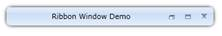{border="0"}

Figure 625: RibbonWindow Control with Minimized state

1.1.1.1.1.1.65.3  Maximized

Setting the value hosts the RibbonWindow Control in the Maximized state.

+-------------------------------------------------------------------------------------------------------------------------------------------------------------------------------------------------------------------------------------------------------------------------------------------------------------------------------------------------------------------------------------------------------------------------------------------------------------------------------------------------------------------------------------+
| [XAML[]{style="COLOR: blue"}]{style="FONT-FAMILY: 'Courier New'"}                                                                                                                                                                                                                                                                                                                                                                                                                                                                   |
|                                                                                                                                                                                                                                                                                                                                                                                                                                                                                                                                     |
| []{style="FONT-FAMILY: 'Courier New'; COLOR: blue"}                                                                                                                                                                                                                                                                                                                                                                                                                                                                                 |
|                                                                                                                                                                                                                                                                                                                                                                                                                                                                                                                                     |
| [\<]{style="FONT-FAMILY: 'Courier New'; COLOR: blue"}[sync]{style="FONT-FAMILY: 'Courier New'; COLOR: #a31515"}[:]{style="FONT-FAMILY: 'Courier New'; COLOR: blue"}[RibbonWindow]{style="FONT-FAMILY: 'Courier New'; COLOR: #a31515"}[ x]{style="FONT-FAMILY: 'Courier New'; COLOR: red"}[:]{style="FONT-FAMILY: 'Courier New'; COLOR: blue"}[Name]{style="FONT-FAMILY: 'Courier New'; COLOR: red"}[=\"RibbonWindowControl\"]{style="FONT-FAMILY: 'Courier New'; COLOR: blue"}[   ]{style="FONT-FAMILY: 'Courier New'; COLOR: red"} |
|                                                                                                                                                                                                                                                                                                                                                                                                                                                                                                                                     |
| [    x]{style="FONT-FAMILY: 'Courier New'; COLOR: red"}[:]{style="FONT-FAMILY: 'Courier New'; COLOR: blue"}[Class]{style="FONT-FAMILY: 'Courier New'; COLOR: red"}[=\"Syncfusion.RibbonWindowControl\"]{style="FONT-FAMILY: 'Courier New'; COLOR: blue"}[]{style="FONT-FAMILY: 'Courier New'"}                                                                                                                                                                                                                                      |
|                                                                                                                                                                                                                                                                                                                                                                                                                                                                                                                                     |
| [   [ xmlns]{style="COLOR: red"}[=\"http://schemas.microsoft.com/winfx/2006/xaml/presentation\"]{style="COLOR: blue"}[   ]{style="COLOR: red"}]{style="FONT-FAMILY: 'Courier New'"}                                                                                                                                                                                                                                                                                                                                                 |
|                                                                                                                                                                                                                                                                                                                                                                                                                                                                                                                                     |
| [    xmlns]{style="FONT-FAMILY: 'Courier New'; COLOR: red"}[:]{style="FONT-FAMILY: 'Courier New'; COLOR: blue"}[x]{style="FONT-FAMILY: 'Courier New'; COLOR: red"}[=\"http://schemas.microsoft.com/winfx/2006/xaml\"]{style="FONT-FAMILY: 'Courier New'; COLOR: blue"}[ ]{style="FONT-FAMILY: 'Courier New'"}                                                                                                                                                                                                                       |
|                                                                                                                                                                                                                                                                                                                                                                                                                                                                                                                                     |
| [   [ Title]{style="COLOR: red"}[=\"Ribbon Window Demo\"]{style="COLOR: blue"}]{style="FONT-FAMILY: 'Courier New'"}                                                                                                                                                                                                                                                                                                                                                                                                                 |
|                                                                                                                                                                                                                                                                                                                                                                                                                                                                                                                                     |
| [   [ WindowStartupLocation]{style="COLOR: red"}[=\"CenterScreen\"]{style="COLOR: blue"}[ ResizeMode]{style="COLOR: red"}[=\"CanMaximize\"]{style="COLOR: blue"}]{style="FONT-FAMILY: 'Courier New'"}                                                                                                                                                                                                                                                                                                                               |
|                                                                                                                                                                                                                                                                                                                                                                                                                                                                                                                                     |
| [   [ xmlns]{style="COLOR: red"}[:]{style="COLOR: blue"}[sync]{style="COLOR: red"}[=\"clr-namespace:Syncfusion.Windows.Tools.Controls;assembly=Syncfusion.Ribbon.Silverlight\"]{style="COLOR: blue"}[ ]{style="COLOR: red"}[]{style="COLOR: blue"}]{style="FONT-FAMILY: 'Courier New'"}                                                                                                                                                                                                                                             |
|                                                                                                                                                                                                                                                                                                                                                                                                                                                                                                                                     |
| [Height]{style="FONT-FAMILY: 'Courier New'; COLOR: red"}[=\"465\"]{style="FONT-FAMILY: 'Courier New'; COLOR: blue"}[ Width]{style="FONT-FAMILY: 'Courier New'; COLOR: red"}[=\"800\"]{style="FONT-FAMILY: 'Courier New'; COLOR: blue"}[ WindowState]{style="FONT-FAMILY: 'Courier New'; COLOR: red"}[=\"Maximized\"\>]{style="FONT-FAMILY: 'Courier New'; COLOR: blue"}                                                                                                                                                             |
|                                                                                                                                                                                                                                                                                                                                                                                                                                                                                                                                     |
| [\</]{style="FONT-FAMILY: 'Courier New'; COLOR: blue"}[sync]{style="FONT-FAMILY: 'Courier New'; COLOR: #a31515"}[:]{style="FONT-FAMILY: 'Courier New'; COLOR: blue"}[WindowControl]{style="FONT-FAMILY: 'Courier New'; COLOR: #a31515"}[\>]{style="FONT-FAMILY: 'Courier New'; COLOR: blue"}[]{style="FONT-FAMILY: 'Courier New'"}                                                                                                                                                                                                  |
+-------------------------------------------------------------------------------------------------------------------------------------------------------------------------------------------------------------------------------------------------------------------------------------------------------------------------------------------------------------------------------------------------------------------------------------------------------------------------------------------------------------------------------------+

[]{style="FONT-FAMILY: 'Calibri','sans-serif'"} 

+------------------------------------------------------------------------------------------------------------------------------------------------------------------------------------------------------+
| [C#[]{style="COLOR: #2b91af"}]{style="FONT-FAMILY: 'Courier New'"}                                                                                                                                   |
|                                                                                                                                                                                                      |
| []{style="FONT-FAMILY: 'Courier New'; COLOR: #2b91af"}                                                                                                                                               |
|                                                                                                                                                                                                      |
| [RibbonWindowControl]{style="FONT-FAMILY: 'Courier New'; COLOR: #2b91af"}[ window = [new]{style="COLOR: blue"} [RibbonWindowControl]{style="COLOR: #2b91af"}();]{style="FONT-FAMILY: 'Courier New'"} |
|                                                                                                                                                                                                      |
| [window.Title = [\"Ribbon Window Demo\"]{style="COLOR: #a31515"};]{style="FONT-FAMILY: 'Courier New'"}                                                                                               |
|                                                                                                                                                                                                      |
| [window.WindowStartupLocation = Syncfusion.Windows.Tools.Controls.[WindowStartupLocation]{style="COLOR: #2b91af"}.CenterScreen;]{style="FONT-FAMILY: 'Courier New'"}                                 |
|                                                                                                                                                                                                      |
| [window.ResizeMode = [ResizeMode]{style="COLOR: #2b91af"}.CanMaximize;]{style="FONT-FAMILY: 'Courier New'"}                                                                                          |
|                                                                                                                                                                                                      |
| [window.WindowState = Syncfusion.Windows.Tools.Controls.[WindowState]{style="COLOR: #2b91af"}.Maximized;]{style="FONT-FAMILY: 'Courier New'"}                                                        |
+------------------------------------------------------------------------------------------------------------------------------------------------------------------------------------------------------+

[]{style="FONT-FAMILY: 'Calibri','sans-serif'"} 

[]{style="FONT-FAMILY: 'Calibri','sans-serif'"} 

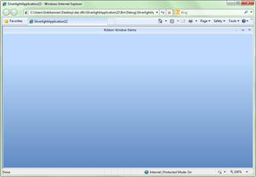{border="0"}

Figure 626: Maximized RibbonWindow Control

###### Blendability

The template of RibbonWindow Control can be easily editable in Expression Blend, to give a nice look and feel. The following steps should be followed to edit the template in Expression Blend:

[·      ]{style="FONT-FAMILY: Symbol"}Open the Sample in Expression Blend. Right-click the RibbonWindow Control and Choose the Edit Template option as shown below:

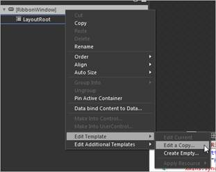{border="0"}

Figure 627: Edit Style for RibbonWIndow

[·      ]{style="FONT-FAMILY: Symbol"}A window will appear as shown below. Click OK to create a new style for the RibbonWindow Control[.]{style="FONT-FAMILY: 'Calibri','sans-serif'"}

[]{style="FONT-FAMILY: 'Calibri','sans-serif'"} 

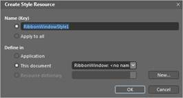{border="0"}

Figure 628: Add Style Name for RibbonWIndow

[]{style="FONT-FAMILY: 'Calibri','sans-serif'; COLOR: #4f81bd"} 

[·      ]{style="FONT-FAMILY: Symbol"}All the resources will be displayed on the resources pane on the right side of the Design area. These resources can be editable to create a new style.

 

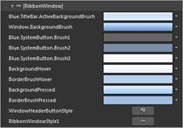{border="0"}

Figure 629: Default Resoources for RibbonWIndow

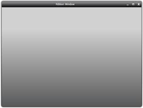{border="0"}

Figure 630: RibbonWindow Control style edited using Expression Blend.

[]{#related-topics}
::::
