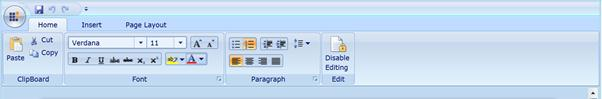

::: {style="DISPLAY: none"}
{#d2h_url_template}{#d2h_package_url style="WIDTH: 0px; DISPLAY: none; HEIGHT: 0px"}
:::

::: {.d2h_secondary_topic style="PADDING-BOTTOM: 10pt; MARGIN: 0pt; PADDING-LEFT: 0pt; PADDING-RIGHT: 0pt; PADDING-TOP: 0pt"}
#### RichTextRibbon Support

 

**RichTextBoxAdv** has RichTextRibbon support to format the text, paragraph and so on. It will give MS Word look and feel.

**Syncfusion.RichTextRibbon.Silverlight** dll will be required to add this **RichTextRibbon** in the application. RichTextRibbon has been inherited from Ribbon control. When this control is dragged and dropped over the designer, items will be automatically serialized. Setting the DataContext to **RichTextBoxAdv** will automatically bind the commands.

 

{border="0"}

[                             ]{style="COLOR: #c00000"}Figure 1182:  RichTextRibbon

[]{style="COLOR: #c00000"} 

[]{style="COLOR: #c00000"} 

[]{#related-topics}
:::
