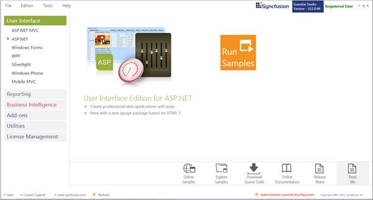
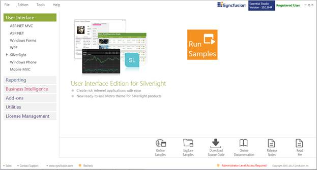
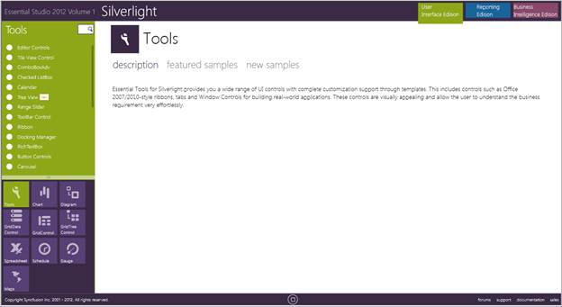

::: {style="DISPLAY: none"}
{#d2h_url_template}{#d2h_package_url style="WIDTH: 0px; DISPLAY: none; HEIGHT: 0px"}
:::

::::: {#nsbanner .d2h_main_nsbanner style="BORDER-BOTTOM: #999999 1px solid; POSITION: relative; PADDING-BOTTOM: 0px; BACKGROUND-COLOR: transparent; PADDING-LEFT: 0px; PADDING-RIGHT: 0px; DISPLAY: none; BORDER-TOP: #999999 1px solid; PADDING-TOP: 0px; LEFT: 0px"}
:::: {#TitleRow .d2h_main_titlerow style="PADDING-BOTTOM: 4px; BACKGROUND-COLOR: transparent; PADDING-LEFT: 22px; WIDTH: 100%; PADDING-RIGHT: 10px; DISPLAY: none; PADDING-TOP: 4px"}
::: {#ienav .d2h_main_ienav style="DISPLAY: none"}
{#D2HPrevious .D2HPreviousEnabled}  {#D2HNext .D2HNextEnabled}
:::
::::
:::::

:::: {#nstext .d2h_main_nstext style="PADDING-BOTTOM: 10px; BACKGROUND-COLOR: transparent; PADDING-LEFT: 22px; PADDING-RIGHT: 10px; HEIGHT: 100%; OVERFLOW: auto; PADDING-TOP: 5px" hasuserbackground="true" valign="bottom"}
## []{#_Sample_and_Location}Sample and Location

[]{#p6} 

 

This section covers the location of the installed samples and describes the procedure to run the samples through the sample browser and online. It also lists the location of utilities, assemblies and source code.

 

Sample Installation Location

 

The Essential Tools Silverlight samples are installed under the following location, locally on the disk:

 

**C:\\Program Files (x86)\\Syncfusion\\Essential Studio\\\<Version Number\>\\Samples\\Silverlight\\**

 

Viewing Samples

 

To view the samples, follow the steps below:

 

1.   Click Start\--\>All Programs\--\>Syncfusion\--\>Essential Studio \<v9.4.0.62\> \--\>Dashboard.

 

Essential Studio Enterprise Edition window is displayed.

 

{border="0"}

Figure 4: Syncfusion Essential Studio Dashboard

**** 

 

**   User Interface Edition** panel is displayed by default.

::: {style="BORDER-BOTTOM: windowtext 1pt solid; BORDER-LEFT: medium none; PADDING-BOTTOM: 1pt; MARGIN-TOP: 9pt; PADDING-LEFT: 0pt; PADDING-RIGHT: 0pt; MARGIN-BOTTOM: 9pt; BORDER-TOP: windowtext 1pt solid; BORDER-RIGHT: medium none; PADDING-TOP: 1pt"}
 {border="0"}Note: You can view the samples in any of the following three ways:
:::

 

[·      ]{style="FONT-FAMILY: Symbol"}**Run Samples** - Click to view the locally installed samples.

[·      ]{style="FONT-FAMILY: Symbol"}**Online Samples** - Click to view online samples.

[·      ]{style="FONT-FAMILY: Symbol"}**Explore Samples** - Explore Silverlight samples on disk.

 

2.   Click **Run Samples** link. Essential Studio Silverlight Edition sample browser is displayed.

 

{border="0"}

Figure 5: Silverlight Edition Sample Browser

 

3.   Tools sample browser window is displayed.

{border="0"}

Figure 6: Tools Samples

 

4.   Select any sample from the samples provided and browse through the features.

 

Source Code Location

 

The default location of the Essential Tools Silverlight source code is:

 

[[\[System Drive\]:\\Program Files\\Syncfusion\\Essential Studio\\\[Version Number\]\\Silverlight\\Tools.Silverlight\\Src]{style="COLOR: windowtext; TEXT-DECORATION: none; text-underline: none"}]{.UGHyperlink}

 

 

[]{#related-topics}
::::
